# Android 系统架构详解

## 一、整体架构概览

Android 系统采用分层架构设计，从下到上分为五个主要层次。

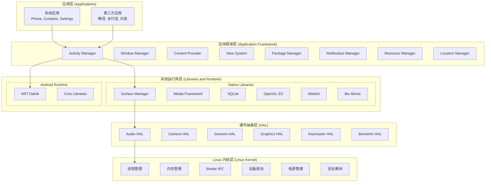
```mermaid
graph TB
    subgraph "应用层 (Applications)"
        A1["系统应用<br/>Phone, Contacts, Settings"]
        A2["第三方应用<br/>微信, 支付宝, 抖音"]
    end

    subgraph "应用框架层 (Application Framework)"
        F1[Activity Manager]
        F2[Window Manager]
        F3[Content Provider]
        F4[View System]
        F5[Package Manager]
        F6[Notification Manager]
        F7[Resource Manager]
        F8[Location Manager]
    end

    subgraph "系统运行库层 (Libraries and Runtime)"
        subgraph "Native Libraries"
            L1[Surface Manager]
            L2[Media Framework]
            L3[SQLite]
            L4[OpenGL ES]
            L5[WebKit]
            L6[libc Bionic]
        end
        subgraph "Android Runtime"
            R1[ART Dalvik]
            R2[Core Libraries]
        end
    end

    subgraph "硬件抽象层 (HAL)"
        H1[Audio HAL]
        H2[Camera HAL]
        H3[Sensors HAL]
        H4[Graphics HAL]
        H5[Keymaster HAL]
        H6[Biometric HAL]
    end

    subgraph "Linux 内核层 (Linux Kernel)"
        K1[进程管理]
        K2[内存管理]
        K3[Binder IPC]
        K4[设备驱动]
        K5[电源管理]
        K6[安全模块]
    end

    A1 --> F1
    A2 --> F1
    F1 --> L1
    F1 --> R1
    L1 --> H1
    H1 --> K1
```

## 二、各层详细架构

### 2.1 Linux 内核层

Android 基于 Linux 内核，并做了大量定制化修改。

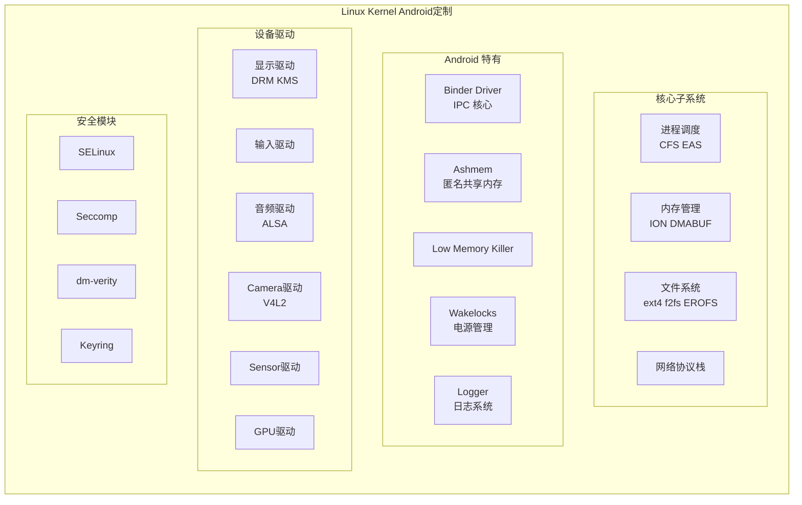
```mermaid
graph LR
    subgraph "Linux Kernel Android定制"
        subgraph "核心子系统"
            K1["进程调度<br/>CFS EAS"]
            K2["内存管理<br/>ION DMABUF"]
            K3["文件系统<br/>ext4 f2fs EROFS"]
            K4[网络协议栈]
        end

        subgraph "Android 特有"
            A1["Binder Driver<br/>IPC 核心"]
            A2["Ashmem<br/>匿名共享内存"]
            A3[Low Memory Killer]
            A4["Wakelocks<br/>电源管理"]
            A5["Logger<br/>日志系统"]
        end

        subgraph "设备驱动"
            D1["显示驱动<br/>DRM KMS"]
            D2[输入驱动]
            D3["音频驱动<br/>ALSA"]
            D4["Camera驱动<br/>V4L2"]
            D5[Sensor驱动]
            D6[GPU驱动]
        end

        subgraph "安全模块"
            S1[SELinux]
            S2[Seccomp]
            S3[dm-verity]
            S4[Keyring]
        end
    end
```

#### Binder 驱动详解

Binder 是 Android 最核心的 IPC 机制。

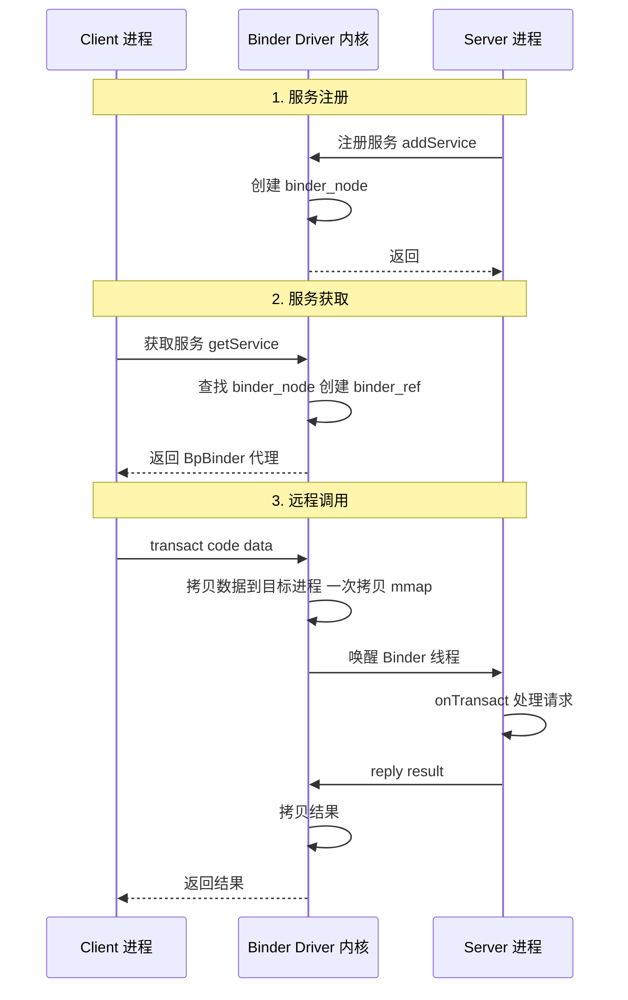
```mermaid
sequenceDiagram
    participant Client as Client 进程
    participant BD as Binder Driver 内核
    participant Server as Server 进程

    Note over Client,Server: 1. 服务注册
    Server->>BD: 注册服务 addService
    BD->>BD: 创建 binder_node
    BD-->>Server: 返回

    Note over Client,Server: 2. 服务获取
    Client->>BD: 获取服务 getService
    BD->>BD: 查找 binder_node 创建 binder_ref
    BD-->>Client: 返回 BpBinder 代理

    Note over Client,Server: 3. 远程调用
    Client->>BD: transact code data
    BD->>BD: 拷贝数据到目标进程 一次拷贝 mmap
    BD->>Server: 唤醒 Binder 线程
    Server->>Server: onTransact 处理请求
    Server->>BD: reply result
    BD->>BD: 拷贝结果
    BD-->>Client: 返回结果
```

### 2.2 硬件抽象层 (HAL)

HAL 将硬件差异封装，为上层提供统一接口。

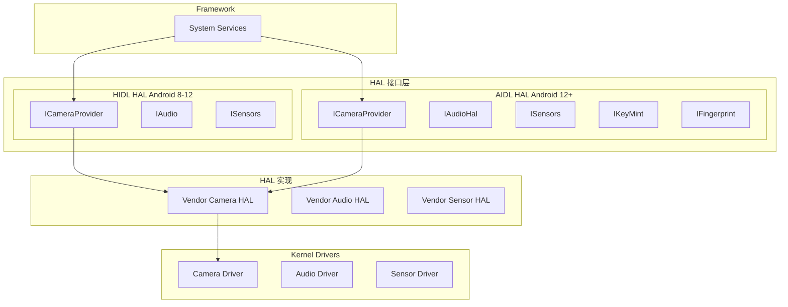
```mermaid
graph TB
    subgraph "Framework"
        FS[System Services]
    end

    subgraph "HAL 接口层"
        subgraph "HIDL HAL Android 8-12"
            H1[ICameraProvider]
            H2[IAudio]
            H3[ISensors]
        end

        subgraph "AIDL HAL Android 12+"
            A1[ICameraProvider]
            A2[IAudioHal]
            A3[ISensors]
            A4[IKeyMint]
            A5[IFingerprint]
        end
    end

    subgraph "HAL 实现"
        V1[Vendor Camera HAL]
        V2[Vendor Audio HAL]
        V3[Vendor Sensor HAL]
    end

    subgraph "Kernel Drivers"
        K1[Camera Driver]
        K2[Audio Driver]
        K3[Sensor Driver]
    end

    FS --> H1
    FS --> A1
    H1 --> V1
    A1 --> V1
    V1 --> K1
```

#### HAL 类型对比

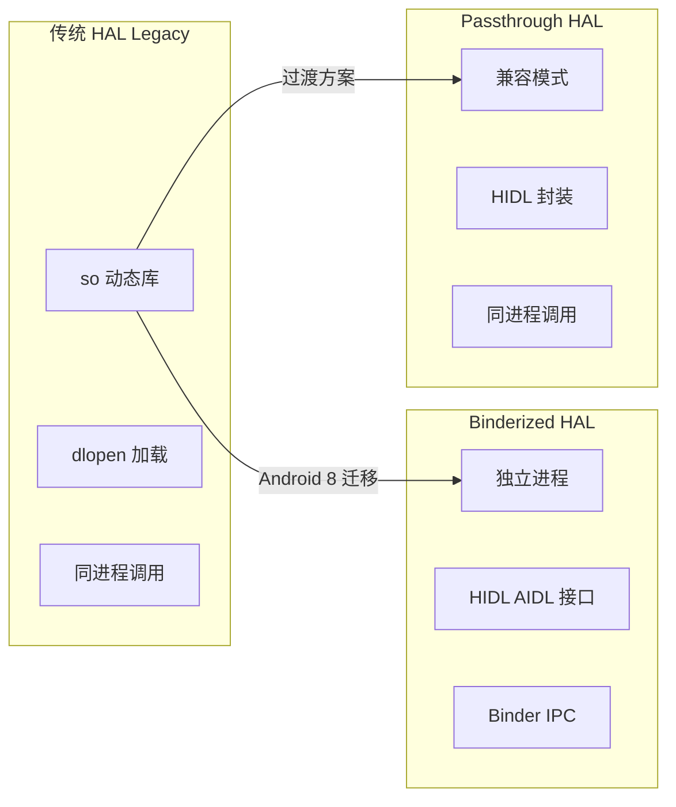
```mermaid
graph LR
    subgraph "传统 HAL Legacy"
        L1[so 动态库]
        L2[dlopen 加载]
        L3[同进程调用]
    end

    subgraph "Binderized HAL"
        B1[独立进程]
        B2["HIDL AIDL 接口"]
        B3[Binder IPC]
    end

    subgraph "Passthrough HAL"
        P1[兼容模式]
        P2[HIDL 封装]
        P3[同进程调用]
    end

    L1 -->|Android 8 迁移| B1
    L1 -->|过渡方案| P1
```

### 2.3 Native Libraries 层

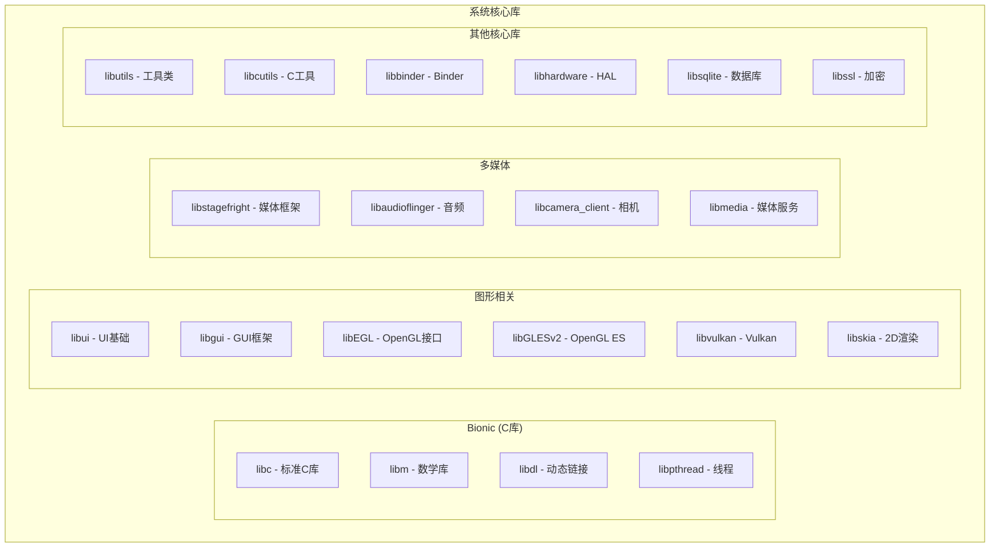
```mermaid
graph TB
    subgraph "系统核心库"
        subgraph "Bionic (C库)"
            B1[libc - 标准C库]
            B2[libm - 数学库]
            B3[libdl - 动态链接]
            B4[libpthread - 线程]
        end

        subgraph "图形相关"
            G1[libui - UI基础]
            G2[libgui - GUI框架]
            G3[libEGL - OpenGL接口]
            G4[libGLESv2 - OpenGL ES]
            G5[libvulkan - Vulkan]
            G6[libskia - 2D渲染]
        end

        subgraph "多媒体"
            M1[libstagefright - 媒体框架]
            M2[libaudioflinger - 音频]
            M3[libcamera_client - 相机]
            M4[libmedia - 媒体服务]
        end

        subgraph "其他核心库"
            O1[libutils - 工具类]
            O2[libcutils - C工具]
            O3[libbinder - Binder]
            O4[libhardware - HAL]
            O5[libsqlite - 数据库]
            O6[libssl - 加密]
        end
    end
```

### 2.4 Android Runtime (ART)

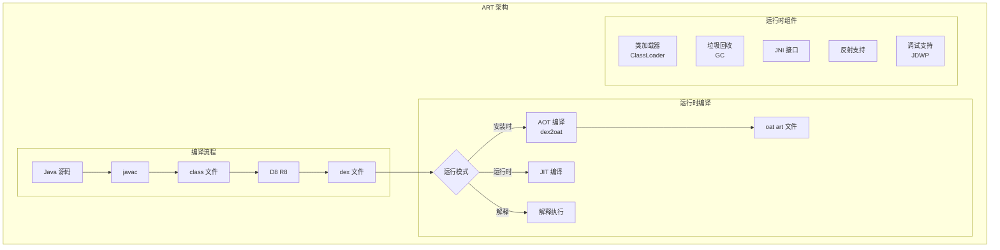
```mermaid
graph TB
    subgraph "ART 架构"
        subgraph "编译流程"
            S1[Java 源码] --> S2[javac]
            S2 --> S3[class 文件]
            S3 --> S4[D8 R8]
            S4 --> S5[dex 文件]
        end

        subgraph "运行时编译"
            S5 --> R1{运行模式}
            R1 -->|安装时| AOT["AOT 编译<br/>dex2oat"]
            R1 -->|运行时| JIT[JIT 编译]
            R1 -->|解释| INT[解释执行]
            AOT --> OAT[oat art 文件]
        end

        subgraph "运行时组件"
            C1["类加载器<br/>ClassLoader"]
            C2["垃圾回收<br/>GC"]
            C3[JNI 接口]
            C4[反射支持]
            C5["调试支持<br/>JDWP"]
        end
    end
```

#### ART 垃圾回收

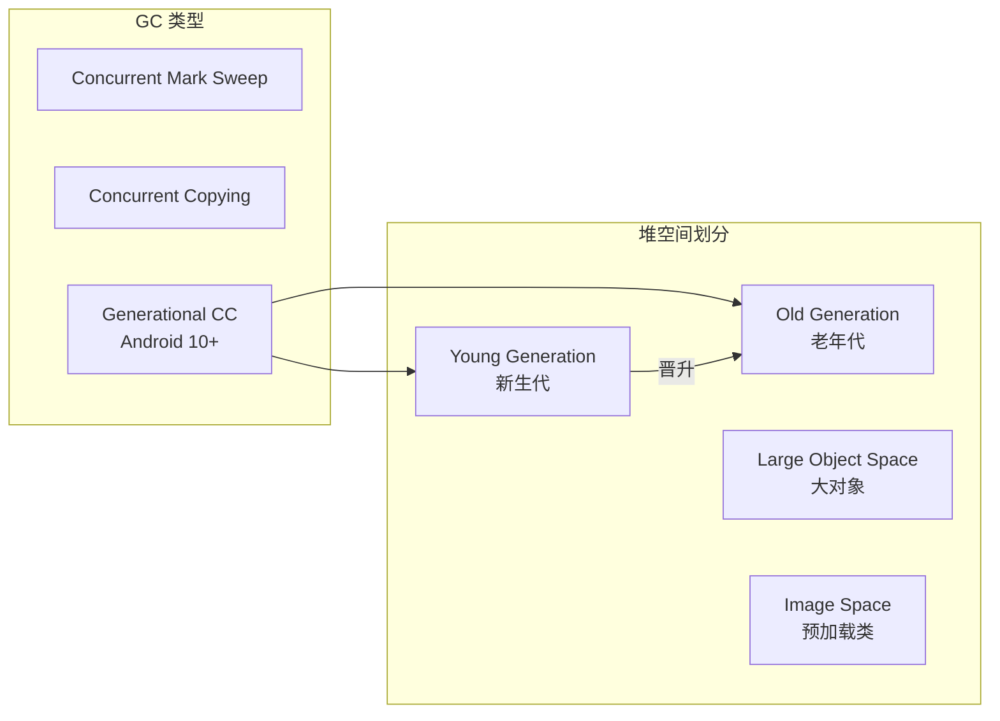
```mermaid
graph LR
    subgraph "GC 类型"
        G1[Concurrent Mark Sweep]
        G2[Concurrent Copying]
        G3["Generational CC<br/>Android 10+"]
    end

    subgraph "堆空间划分"
        H1["Young Generation<br/>新生代"]
        H2["Old Generation<br/>老年代"]
        H3["Large Object Space<br/>大对象"]
        H4["Image Space<br/>预加载类"]
    end

    G3 --> H1
    G3 --> H2
    H1 -->|晋升| H2
```

### 2.5 Application Framework 层

这是开发者最常接触的层次。

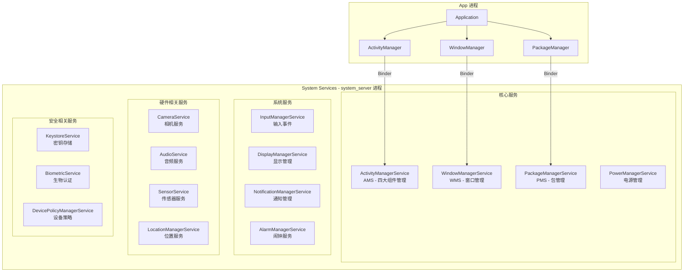
```mermaid
graph TB
    subgraph "System Services - system_server 进程"
        subgraph "核心服务"
            SS1["ActivityManagerService<br/>AMS - 四大组件管理"]
            SS2["WindowManagerService<br/>WMS - 窗口管理"]
            SS3["PackageManagerService<br/>PMS - 包管理"]
            SS4["PowerManagerService<br/>电源管理"]
        end

        subgraph "系统服务"
            SS5["InputManagerService<br/>输入事件"]
            SS6["DisplayManagerService<br/>显示管理"]
            SS7["NotificationManagerService<br/>通知管理"]
            SS8["AlarmManagerService<br/>闹钟服务"]
        end

        subgraph "硬件相关服务"
            SS9["CameraService<br/>相机服务"]
            SS10["AudioService<br/>音频服务"]
            SS11["SensorService<br/>传感器服务"]
            SS12["LocationManagerService<br/>位置服务"]
        end

        subgraph "安全相关服务"
            SS13["KeystoreService<br/>密钥存储"]
            SS14["BiometricService<br/>生物认证"]
            SS15["DevicePolicyManagerService<br/>设备策略"]
        end
    end

    subgraph "App 进程"
        APP[Application]
        APP --> AM[ActivityManager]
        APP --> WM[WindowManager]
        APP --> PM[PackageManager]
        AM -->|Binder| SS1
        WM -->|Binder| SS2
        PM -->|Binder| SS3
    end
```

#### ActivityManagerService 核心功能

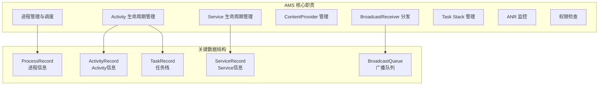
```mermaid
graph TB
    subgraph "AMS 核心职责"
        A1[Activity 生命周期管理]
        A2[Service 生命周期管理]
        A3[BroadcastReceiver 分发]
        A4[ContentProvider 管理]
        A5[进程管理与调度]
        A6["Task Stack 管理"]
        A7[ANR 监控]
        A8[权限检查]
    end

    subgraph "关键数据结构"
        D1["ProcessRecord<br/>进程信息"]
        D2["ActivityRecord<br/>Activity信息"]
        D3["TaskRecord<br/>任务栈"]
        D4["ServiceRecord<br/>Service信息"]
        D5["BroadcastQueue<br/>广播队列"]
    end

    A1 --> D2
    A1 --> D3
    A2 --> D4
    A3 --> D5
    A5 --> D1
```

### 2.6 应用层架构

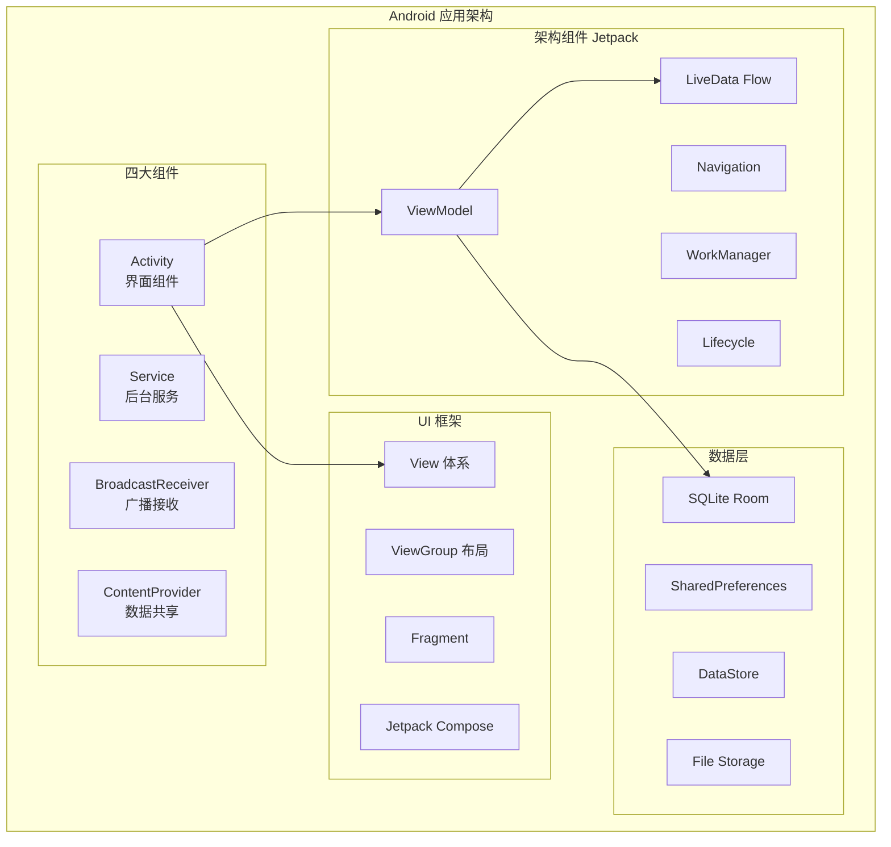
```mermaid
graph TB
    subgraph "Android 应用架构"
        subgraph "四大组件"
            C1["Activity<br/>界面组件"]
            C2["Service<br/>后台服务"]
            C3["BroadcastReceiver<br/>广播接收"]
            C4["ContentProvider<br/>数据共享"]
        end

        subgraph "UI 框架"
            U1[View 体系]
            U2[ViewGroup 布局]
            U3[Fragment]
            U4[Jetpack Compose]
        end

        subgraph "数据层"
            D1[SQLite Room]
            D2[SharedPreferences]
            D3[DataStore]
            D4[File Storage]
        end

        subgraph "架构组件 Jetpack"
            J1[ViewModel]
            J2[LiveData Flow]
            J3[Navigation]
            J4[WorkManager]
            J5[Lifecycle]
        end
    end

    C1 --> U1
    C1 --> J1
    J1 --> J2
    J1 --> D1
```

## 三、核心流程

### 3.1 Android 系统启动流程

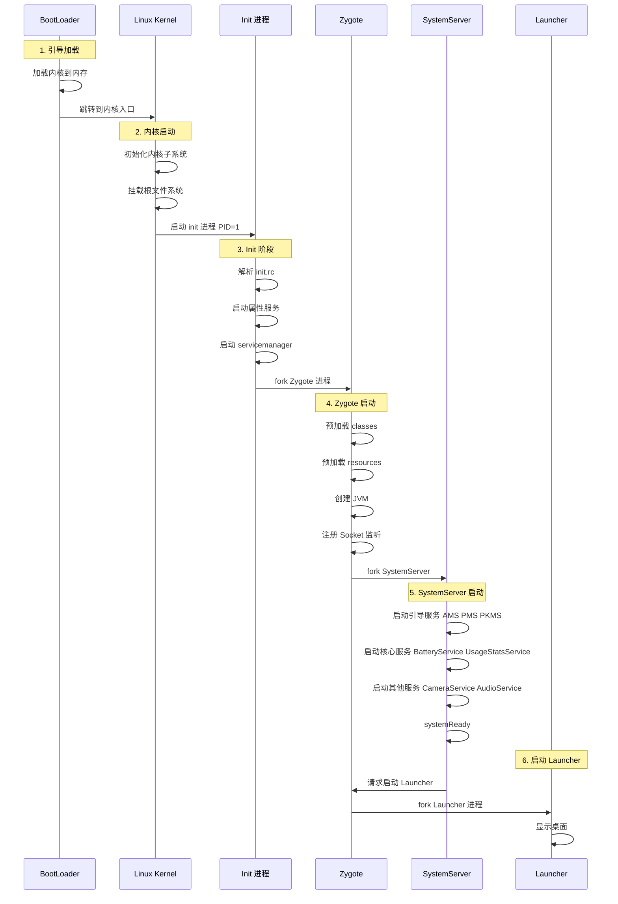
```mermaid
sequenceDiagram
    participant BL as BootLoader
    participant K as Linux Kernel
    participant I as Init 进程
    participant Z as Zygote
    participant SS as SystemServer
    participant L as Launcher

    Note over BL: 1. 引导加载
    BL->>BL: 加载内核到内存
    BL->>K: 跳转到内核入口

    Note over K: 2. 内核启动
    K->>K: 初始化内核子系统
    K->>K: 挂载根文件系统
    K->>I: 启动 init 进程 PID=1

    Note over I: 3. Init 阶段
    I->>I: 解析 init.rc
    I->>I: 启动属性服务
    I->>I: 启动 servicemanager
    I->>Z: fork Zygote 进程

    Note over Z: 4. Zygote 启动
    Z->>Z: 预加载 classes
    Z->>Z: 预加载 resources
    Z->>Z: 创建 JVM
    Z->>Z: 注册 Socket 监听
    Z->>SS: fork SystemServer

    Note over SS: 5. SystemServer 启动
    SS->>SS: 启动引导服务 AMS PMS PKMS
    SS->>SS: 启动核心服务 BatteryService UsageStatsService
    SS->>SS: 启动其他服务 CameraService AudioService
    SS->>SS: systemReady

    Note over L: 6. 启动 Launcher
    SS->>Z: 请求启动 Launcher
    Z->>L: fork Launcher 进程
    L->>L: 显示桌面
```

### 3.2 App 启动流程 (冷启动)

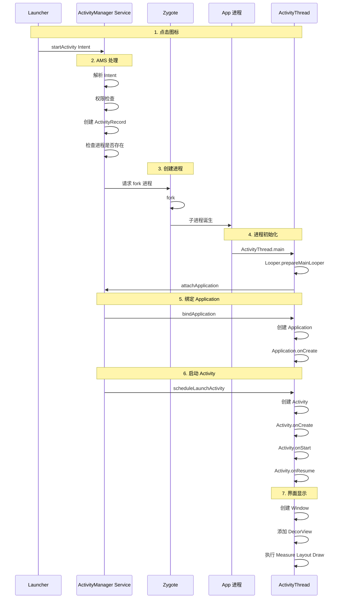
```mermaid
sequenceDiagram
    participant L as Launcher
    participant AMS as ActivityManager Service
    participant Z as Zygote
    participant APP as App 进程
    participant AT as ActivityThread

    Note over L,AT: 1. 点击图标
    L->>AMS: startActivity Intent

    Note over AMS: 2. AMS 处理
    AMS->>AMS: 解析 Intent
    AMS->>AMS: 权限检查
    AMS->>AMS: 创建 ActivityRecord
    AMS->>AMS: 检查进程是否存在

    Note over Z: 3. 创建进程
    AMS->>Z: 请求 fork 进程
    Z->>Z: fork
    Z->>APP: 子进程诞生

    Note over APP,AT: 4. 进程初始化
    APP->>AT: ActivityThread.main
    AT->>AT: Looper.prepareMainLooper
    AT->>AMS: attachApplication

    Note over AMS,AT: 5. 绑定 Application
    AMS->>AT: bindApplication
    AT->>AT: 创建 Application
    AT->>AT: Application.onCreate

    Note over AMS,AT: 6. 启动 Activity
    AMS->>AT: scheduleLaunchActivity
    AT->>AT: 创建 Activity
    AT->>AT: Activity.onCreate
    AT->>AT: Activity.onStart
    AT->>AT: Activity.onResume

    Note over AT: 7. 界面显示
    AT->>AT: 创建 Window
    AT->>AT: 添加 DecorView
    AT->>AT: 执行 Measure Layout Draw
```

### 3.3 View 绘制流程

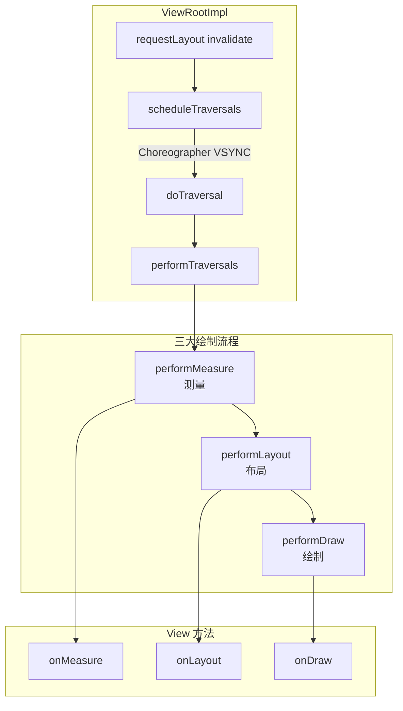
```mermaid
graph TB
    subgraph "ViewRootImpl"
        V1["requestLayout invalidate"]
        V2[scheduleTraversals]
        V3[doTraversal]
        V4[performTraversals]
    end

    subgraph "三大绘制流程"
        M["performMeasure<br/>测量"]
        L["performLayout<br/>布局"]
        D["performDraw<br/>绘制"]
    end

    subgraph "View 方法"
        VM[onMeasure]
        VL[onLayout]
        VD[onDraw]
    end

    V1 --> V2
    V2 -->|Choreographer VSYNC| V3
    V3 --> V4
    V4 --> M
    M --> L
    L --> D
    M --> VM
    L --> VL
    D --> VD
```

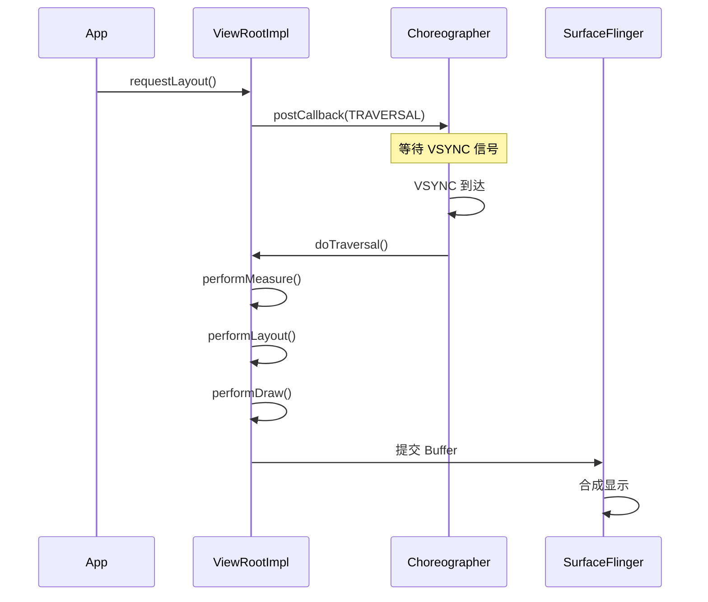
```mermaid
sequenceDiagram
    participant App as App
    participant VRI as ViewRootImpl
    participant CH as Choreographer
    participant SF as SurfaceFlinger

    App->>VRI: requestLayout()
    VRI->>CH: postCallback(TRAVERSAL)

    Note over CH: 等待 VSYNC 信号
    CH->>CH: VSYNC 到达
    CH->>VRI: doTraversal()

    VRI->>VRI: performMeasure()
    VRI->>VRI: performLayout()
    VRI->>VRI: performDraw()

    VRI->>SF: 提交 Buffer
    SF->>SF: 合成显示
```

### 3.4 事件分发流程

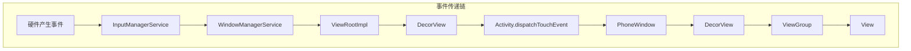
```mermaid
graph TB
    subgraph "事件传递链"
        HW[硬件产生事件] --> IMS[InputManagerService]
        IMS --> WMS[WindowManagerService]
        WMS --> VRI[ViewRootImpl]
        VRI --> DV[DecorView]
        DV --> A[Activity.dispatchTouchEvent]
        A --> PG[PhoneWindow]
        PG --> DV2[DecorView]
        DV2 --> VG[ViewGroup]
        VG --> V[View]
    end
```

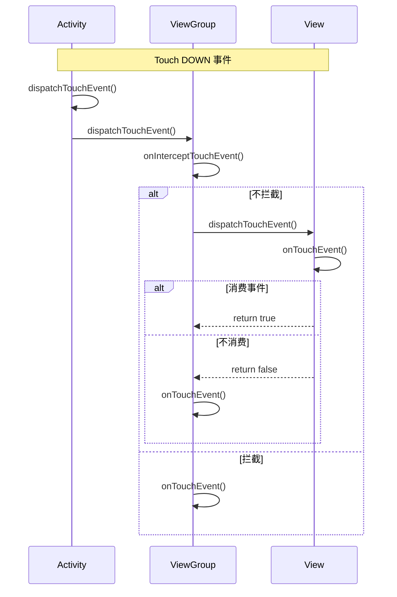
```mermaid
sequenceDiagram
    participant A as Activity
    participant VG as ViewGroup
    participant V as View

    Note over A,V: Touch DOWN 事件
    A->>A: dispatchTouchEvent()
    A->>VG: dispatchTouchEvent()
    VG->>VG: onInterceptTouchEvent()

    alt 不拦截
        VG->>V: dispatchTouchEvent()
        V->>V: onTouchEvent()
        alt 消费事件
            V-->>VG: return true
        else 不消费
            V-->>VG: return false
            VG->>VG: onTouchEvent()
        end
    else 拦截
        VG->>VG: onTouchEvent()
    end
```

### 3.5 Binder 通信流程

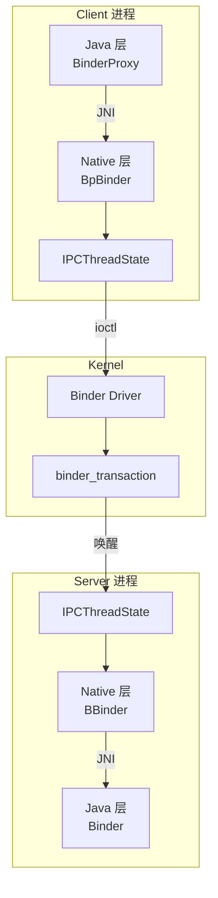
```mermaid
graph TB
    subgraph "Client 进程"
        C1["Java 层<br/>BinderProxy"]
        C2["Native 层<br/>BpBinder"]
        C3[IPCThreadState]
    end

    subgraph "Kernel"
        K1[Binder Driver]
        K2[binder_transaction]
    end

    subgraph "Server 进程"
        S1[IPCThreadState]
        S2["Native 层<br/>BBinder"]
        S3["Java 层<br/>Binder"]
    end

    C1 -->|JNI| C2
    C2 --> C3
    C3 -->|ioctl| K1
    K1 --> K2
    K2 -->|唤醒| S1
    S1 --> S2
    S2 -->|JNI| S3
```

## 四、图形系统架构

### 4.1 图形架构总览

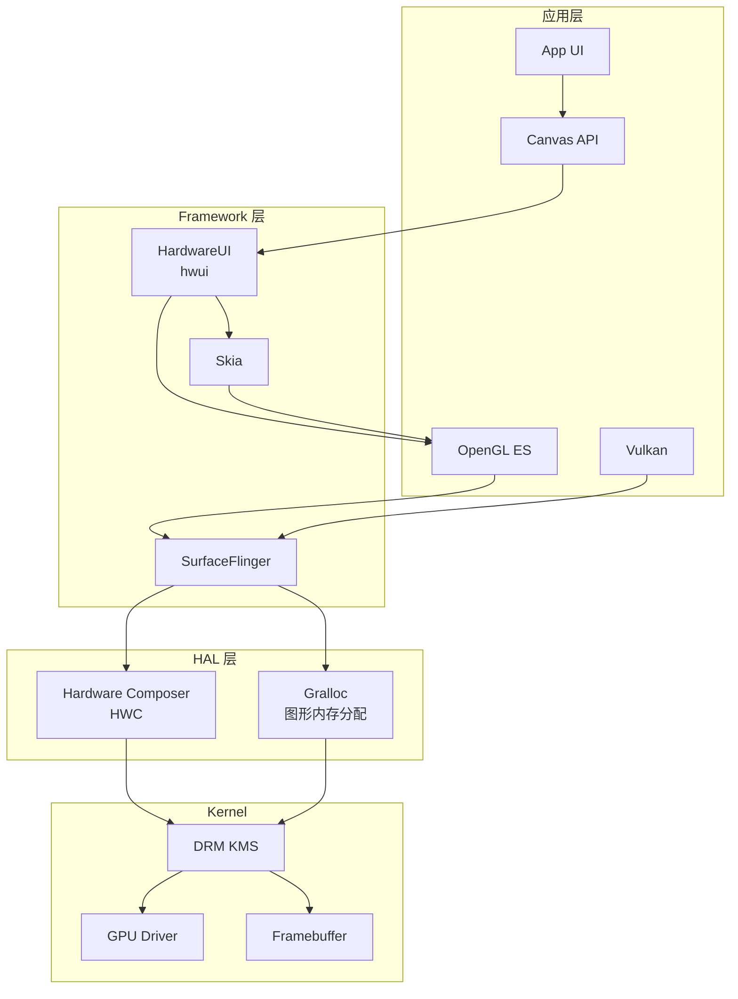
```mermaid
graph TB
    subgraph "应用层"
        APP[App UI]
        CANVAS[Canvas API]
        GL[OpenGL ES]
        VK[Vulkan]
    end

    subgraph "Framework 层"
        HWU["HardwareUI<br/>hwui"]
        SKIA[Skia]
        SF[SurfaceFlinger]
    end

    subgraph "HAL 层"
        HWC["Hardware Composer<br/>HWC"]
        GRALLOC["Gralloc<br/>图形内存分配"]
    end

    subgraph "Kernel"
        DRM[DRM KMS]
        GPU[GPU Driver]
        FB[Framebuffer]
    end

    APP --> CANVAS
    CANVAS --> HWU
    HWU --> SKIA
    HWU --> GL
    SKIA --> GL
    GL --> SF
    VK --> SF
    SF --> HWC
    SF --> GRALLOC
    HWC --> DRM
    GRALLOC --> DRM
    DRM --> GPU
    DRM --> FB
```

### 4.2 SurfaceFlinger 合成流程

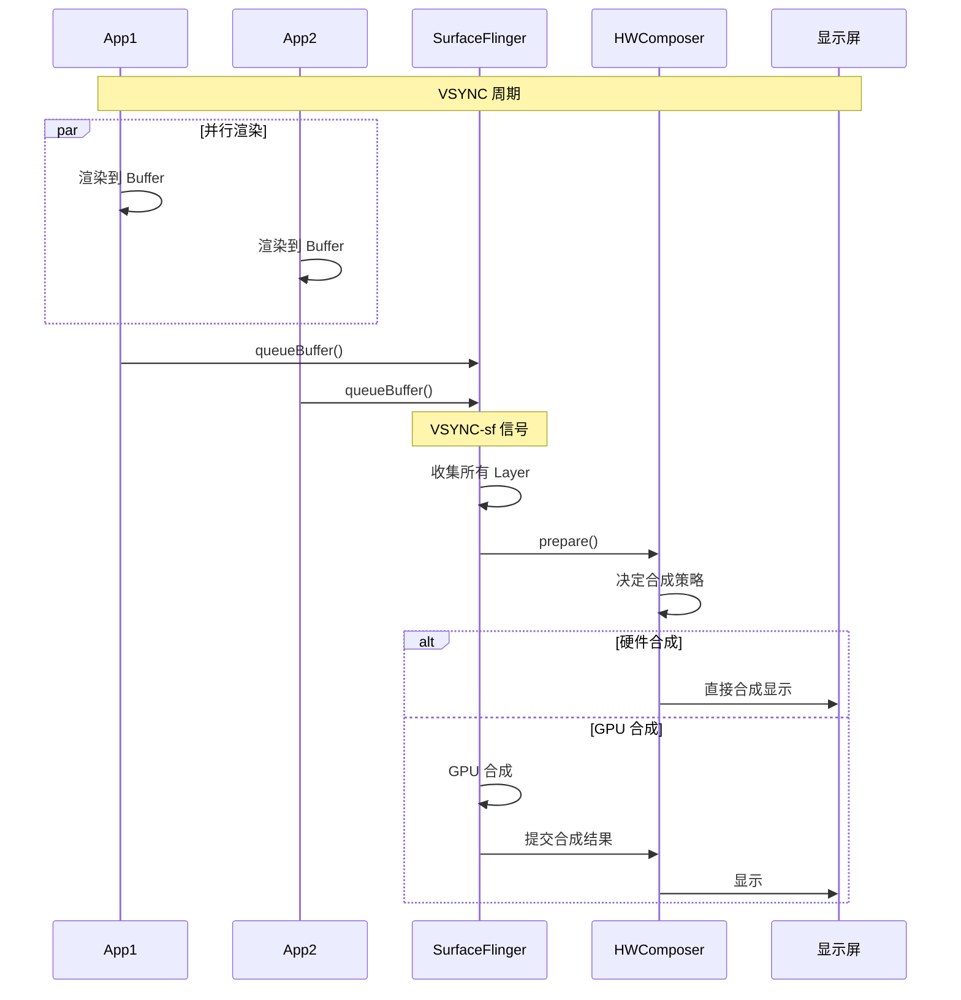
```mermaid
sequenceDiagram
    participant App1 as App1
    participant App2 as App2
    participant SF as SurfaceFlinger
    participant HWC as HWComposer
    participant Display as 显示屏

    Note over App1,Display: VSYNC 周期

    par 并行渲染
        App1->>App1: 渲染到 Buffer
        App2->>App2: 渲染到 Buffer
    end

    App1->>SF: queueBuffer()
    App2->>SF: queueBuffer()

    Note over SF: VSYNC-sf 信号
    SF->>SF: 收集所有 Layer
    SF->>HWC: prepare()
    HWC->>HWC: 决定合成策略

    alt 硬件合成
        HWC->>Display: 直接合成显示
    else GPU 合成
        SF->>SF: GPU 合成
        SF->>HWC: 提交合成结果
        HWC->>Display: 显示
    end
```

## 五、内存管理架构

### 5.1 内存分配层次

```mermaid
graph TB
    subgraph "Java 层"
        J1["Java Heap<br/>ART 管理"]
        J2[Bitmap Memory]
    end

    subgraph "Native 层"
        N1["Native Heap<br/>malloc jemalloc"]
        N2[mmap 映射]
    end

    subgraph "Kernel 层"
        K1["ION DMA-BUF<br/>图形缓冲区"]
        K2["Ashmem<br/>匿名共享内存"]
        K3[Page Cache]
        K4["Zram<br/>压缩内存"]
    end

    J1 --> N1
    J2 --> K1
    N1 --> K3
    N2 --> K3
```

### 5.2 Low Memory Killer

```mermaid
graph LR
    subgraph "进程优先级 oom_adj"
        P1["前台进程<br/>0"]
        P2["可见进程<br/>100"]
        P3["服务进程<br/>200"]
        P4["后台进程<br/>700"]
        P5["空进程<br/>900"]
    end

    subgraph "内存阈值"
        M1[高内存]
        M2[中等内存]
        M3[低内存]
        M4[极低内存]
    end

    M4 -->|Kill| P5
    M3 -->|Kill| P4
    M2 -->|Kill| P3
    M1 -->|保护| P1
    M1 -->|保护| P2
```

## 六、安全架构

### 6.1 Android 安全模型

```mermaid
graph TB
    subgraph "应用沙箱"
        A1[每个App独立UID]
        A2[独立进程空间]
        A3[独立存储空间]
        A4[权限隔离]
    end

    subgraph "权限系统"
        P1["安装时权限<br/>Android 6.0前"]
        P2["运行时权限<br/>Android 6.0+"]
        P3[特殊权限]
    end

    subgraph "系统级安全"
        S1["SELinux<br/>强制访问控制"]
        S2["Seccomp<br/>系统调用过滤"]
        S3["ASLR<br/>地址随机化"]
        S4["Verified Boot<br/>启动验证"]
    end

    subgraph "硬件级安全"
        H1["TEE<br/>可信执行环境"]
        H2["StrongBox<br/>安全芯片"]
        H3[Hardware Keystore]
    end

    A1 --> S1
    P2 --> A4
    S1 --> H1
```

### 6.2 SELinux 策略

```mermaid
graph LR
    subgraph "SELinux 域"
        D1["untrusted_app<br/>第三方App"]
        D2["platform_app<br/>平台签名App"]
        D3["system_app<br/>系统App"]
        D4[system_server]
        D5[init]
    end

    subgraph "资源类型"
        R1[app_data_file]
        R2[system_data_file]
        R3[vendor_file]
        R4[device nodes]
    end

    D1 -->|allow| R1
    D1 -.->|deny| R2
    D4 -->|allow| R2
    D5 -->|allow| R4
```

## 七、进程与线程模型

### 7.1 关键进程

```mermaid
graph TB
    subgraph "系统关键进程"
        I["init<br/>PID=1"]
        Z["zygote<br/>App进程孵化器"]
        SS["system_server<br/>系统服务"]
        SM["servicemanager<br/>Binder管理"]
        SF["surfaceflinger<br/>图形合成"]
        AD["adbd<br/>调试桥"]
        VD["vold<br/>存储管理"]
    end

    subgraph "App 进程"
        L["com.android.launcher<br/>桌面"]
        S["com.android.settings<br/>设置"]
        APP[第三方App]
    end

    I --> Z
    I --> SM
    I --> SF
    Z --> SS
    Z --> L
    Z --> S
    Z --> APP
```

### 7.2 App 进程线程模型

```mermaid
graph TB
    subgraph "App 进程内线程"
        M["Main Thread<br/>UI 线程"]
        B1[Binder Thread 1]
        B2[Binder Thread 2]
        BN[Binder Thread N]
        R["RenderThread<br/>渲染线程"]
        GC["GC Thread<br/>垃圾回收"]
        JIT["JIT Compiler<br/>Thread"]
        W["Worker Thread<br/>自定义线程"]
    end

    M -->|处理| UI["UI 事件<br/>Message"]
    B1 -->|处理| IPC[Binder 调用]
    R -->|处理| DRAW[GPU 渲染]
```

## 八、存储架构

### 8.1 存储层次

```mermaid
graph TB
    subgraph "应用数据"
        A1["Internal Storage<br/>data/data/pkg"]
        A2["External Storage<br/>sdcard/Android/data/pkg"]
        A3["Scoped Storage<br/>Android 10+"]
    end

    subgraph "系统分区"
        S1["system 分区<br/>只读系统分区"]
        S2["vendor 分区<br/>厂商分区"]
        S3["data 分区<br/>用户数据分区"]
        S4["cache 分区<br/>缓存分区"]
    end

    subgraph "虚拟文件系统"
        V1["proc<br/>进程信息"]
        V2["sys<br/>内核信息"]
        V3["dev<br/>设备节点"]
    end
```

### 8.2 Scoped Storage (分区存储)

```mermaid
graph LR
    subgraph "Android 10+ 存储访问"
        APP[App]

        subgraph "无需权限"
            P1["自有目录<br/>getExternalFilesDir"]
            P2["MediaStore<br/>媒体文件"]
        end

        subgraph "需要权限"
            P3["READ_EXTERNAL_STORAGE<br/>读取媒体"]
            P4["MANAGE_EXTERNAL_STORAGE<br/>完全访问"]
        end

        subgraph "SAF"
            P5["Storage Access<br/>Framework<br/>用户选择"]
        end
    end

    APP --> P1
    APP --> P2
    APP -->|申请| P3
    APP -->|特殊权限| P4
    APP --> P5
```

## 九、网络架构

### 9.1 网络协议栈

```mermaid
graph TB
    subgraph "应用层 API"
        A1[HttpURLConnection]
        A2[OkHttp]
        A3[Retrofit]
        A4[Socket API]
    end

    subgraph "Framework"
        F1[ConnectivityService]
        F2[NetworkPolicyManager]
        F3[VPN Service]
    end

    subgraph "Native"
        N1[Netd]
        N2[DNS Resolver]
    end

    subgraph "Kernel"
        K1[Netfilter iptables]
        K2[TCP IP Stack]
        K3[WiFi Driver]
        K4[Cellular Driver]
    end

    A1 --> F1
    A2 --> F1
    F1 --> N1
    N1 --> K1
    K1 --> K2
    K2 --> K3
    K2 --> K4
```

## 十、编译与构建

### 10.1 AOSP 编译流程

```mermaid
graph LR
    subgraph "源码"
        S1[Framework Java]
        S2[Native C C++]
        S3[HAL]
        S4[Kernel]
    end

    subgraph "构建系统"
        B1["Soong<br/>Android.bp"]
        B2["Kati<br/>Android.mk 转换"]
        B3["Ninja<br/>执行构建"]
    end

    subgraph "输出"
        O1[system.img]
        O2[vendor.img]
        O3[boot.img]
        O4[userdata.img]
    end

    S1 --> B1
    S2 --> B1
    S3 --> B1
    B1 --> B3
    B2 --> B3
    B3 --> O1
    B3 --> O2
    S4 --> O3
    B3 --> O4
```

### 10.2 App 编译流程

```mermaid
graph LR
    subgraph "源码"
        S1[Java Kotlin]
        S2[xml 资源]
        S3[assets]
        S4[native so]
    end

    subgraph "编译"
        C1["AAPT2<br/>资源编译"]
        C2["Kotlin Java<br/>Compiler"]
        C3["D8 R8<br/>Dex 转换"]
    end

    subgraph "打包"
        P1[APK 打包]
        P2[签名]
        P3[对齐 zipalign]
    end

    S1 --> C2
    S2 --> C1
    C1 --> C2
    C2 --> C3
    C3 --> P1
    S3 --> P1
    S4 --> P1
    P1 --> P2
    P2 --> P3
```

## 十一、版本演进重要特性

```mermaid
timeline
    title Android 版本重要特性
    section Android 4.x
        4.4 KitKat : ART 预览
                   : 全屏沉浸模式
    section Android 5.x
        5.0 Lollipop : ART 正式版
                     : Material Design
                     : 64位支持
    section Android 6.x
        6.0 Marshmallow : 运行时权限
                        : 指纹 API
                        : Doze 省电
    section Android 7.x
        7.0 Nougat : 多窗口
                   : JIT/AOT 混合编译
    section Android 8.x
        8.0 Oreo : Project Treble
                 : HIDL
                 : 通知渠道
    section Android 9.x
        9.0 Pie : BiometricPrompt
                : StrongBox
                : 刘海屏支持
    section Android 10
        10 Q : 分区存储
             : 深色主题
             : 5G 支持
    section Android 11
        11 R : 单次权限
             : 对话气泡
    section Android 12
        12 S : Material You
             : AIDL HAL
             : Keystore2/KeyMint
    section Android 13-14
        13-14 : 更严格权限
              : 预测性返回
              : 健康连接
```

## 十二、总结

Android 系统是一个复杂的分层架构：

| 层次 | 主要组件 | 职责 |
|------|----------|------|
| 应用层 | System Apps, Third-party Apps | 用户交互界面 |
| 框架层 | AMS, WMS, PMS 等 System Services | 提供 API 和系统服务 |
| 运行时 | ART, Core Libraries | Java/Kotlin 运行环境 |
| Native库 | Bionic, Skia, Media | 底层功能实现 |
| HAL | HIDL/AIDL 接口 | 硬件抽象 |
| 内核 | Linux Kernel + Android 定制 | 硬件驱动、进程管理、安全 |

核心设计理念：
1. **分层解耦** - 各层职责清晰，通过接口交互
2. **Binder IPC** - 高效的跨进程通信机制
3. **组件化** - 四大组件松耦合设计
4. **沙箱隔离** - 每个 App 独立运行环境
5. **权限控制** - 细粒度的权限管理系统
