# 车载系统安全性提升方案 - MTK平台

基于MTK平台车载系统架构特点，从防护类（兼容备份、仲裁）角度提出针对性安全增强方案。本文档专注于MTK平台（Trustonic TEE）架构。

---

## 目录

1. [MTK平台架构分析](#一mtk平台架构分析)
2. [现有安全能力评估](#二现有安全能力评估)
3. [产线灌装流程设计](#三产线灌装流程设计)
4. [TEE单点风险识别](#四tee单点风险识别)
5. [防护类安全增强方案](#五防护类安全增强方案)
6. [密钥备份与恢复机制](#六密钥备份与恢复机制)
7. [Keystore功能集成方案](#七keystore功能集成方案)
8. [安全仲裁架构设计](#八安全仲裁架构设计)
9. [故障检测与降级策略](#九故障检测与降级策略)
10. [安全监控与审计增强](#十安全监控与审计增强)
11. [实施建议](#十一实施建议)

---

## 一、MTK平台架构分析

### 1.1 MTK平台系统架构总览

MTK平台车载系统采用分层架构设计，以Trustonic TEE作为核心安全锚点，从应用层到安全硬件层形成完整的安全链路。

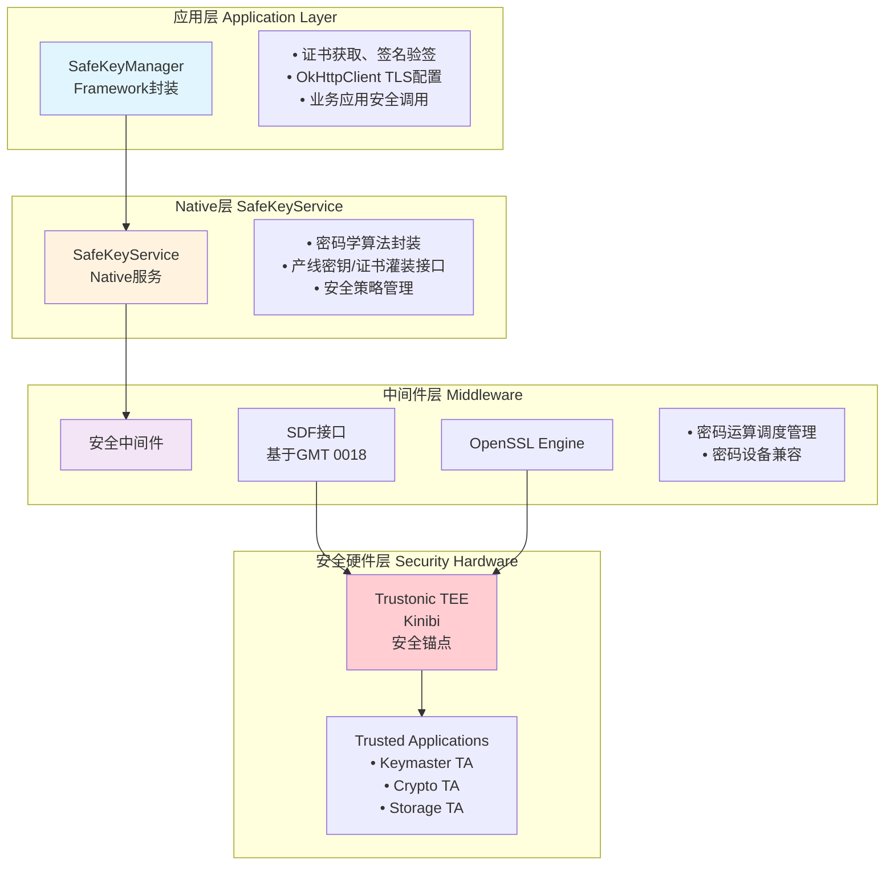
```mermaid
graph TB
    subgraph "应用层 Application Layer"
        APP["SafeKeyManager<br/>Framework封装"]
        APP_DESC["• 证书获取、签名验签<br/>• OkHttpClient TLS配置<br/>• 业务应用安全调用"]
    end

    subgraph "Native层 SafeKeyService"
        NATIVE["SafeKeyService<br/>Native服务"]
        NATIVE_DESC["• 密码学算法封装<br/>• 产线密钥/证书灌装接口<br/>• 安全策略管理"]
    end

    subgraph "中间件层 Middleware"
        MW["安全中间件"]
        SDF["SDF接口<br/>基于GMT 0018"]
        OSSL["OpenSSL Engine"]
        MW_DESC["• 密码运算调度管理<br/>• 密码设备兼容"]
    end

    subgraph "安全硬件层 Security Hardware"
        TEE["Trustonic TEE<br/>Kinibi<br/>安全锚点"]
        TA["Trusted Applications<br/>• Keymaster TA<br/>• Crypto TA<br/>• Storage TA"]
    end

    APP --> NATIVE
    NATIVE --> MW
    SDF --> TEE
    OSSL --> TEE
    TEE --> TA

    style APP fill:#e1f5fe
    style NATIVE fill:#fff3e0
    style MW fill:#f3e5f5
    style TEE fill:#ffcdd2
```

### 1.2 Trustonic TEE架构详解

MTK平台采用Trustonic Kinibi作为TEE实现，基于ARM TrustZone技术提供硬件级安全隔离。

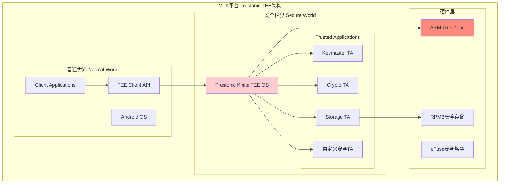
```mermaid
graph TB
    subgraph "MTK平台 Trustonic TEE架构"
        subgraph "普通世界 Normal World"
            ANDROID["Android OS"]
            CA["Client Applications"]
            TEE_CLIENT["TEE Client API"]
        end

        subgraph "安全世界 Secure World"
            KINIBI["Trustonic Kinibi TEE OS"]
            subgraph "Trusted Applications"
                KEYMASTER["Keymaster TA"]
                CRYPTO_TA["Crypto TA"]
                STORAGE_TA["Storage TA"]
                CUSTOM_TA["自定义安全TA"]
            end
        end

        subgraph "硬件层"
            TRUSTZONE["ARM TrustZone"]
            RPMB["RPMB安全存储"]
            EFUSE["eFuse安全熔丝"]
        end
    end

    CA --> TEE_CLIENT
    TEE_CLIENT --> KINIBI
    KINIBI --> KEYMASTER
    KINIBI --> CRYPTO_TA
    KINIBI --> STORAGE_TA
    KINIBI --> CUSTOM_TA
    KINIBI --> TRUSTZONE
    STORAGE_TA --> RPMB

    style KINIBI fill:#ffcdd2
    style TRUSTZONE fill:#ff8a80
```

### 1.3 TEE密码模块功能架构

TEE密码模块作为MTK平台的核心安全锚点，提供完整的密码学服务能力。

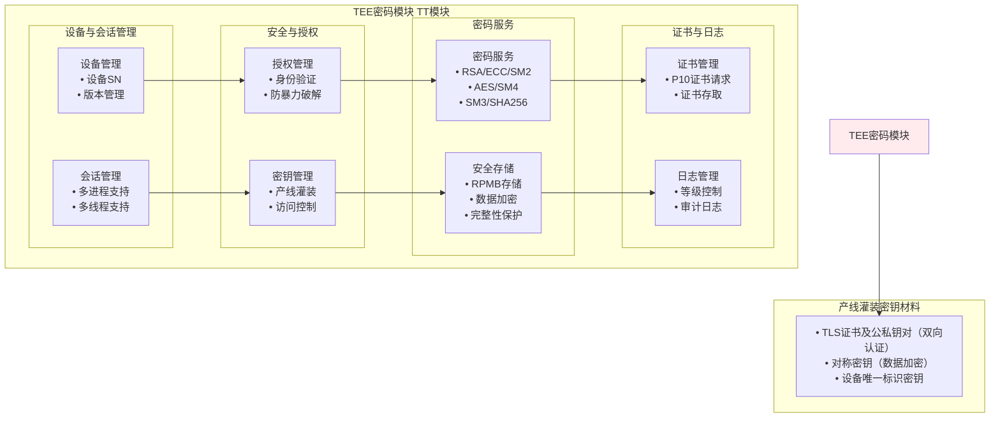
```mermaid
graph TB
    subgraph "TEE密码模块 TT模块"
        subgraph "设备与会话管理"
            DEV["设备管理<br/>• 设备SN<br/>• 版本管理"]
            SESS["会话管理<br/>• 多进程支持<br/>• 多线程支持"]
        end

        subgraph "安全与授权"
            AUTH["授权管理<br/>• 身份验证<br/>• 防暴力破解"]
            KEY["密钥管理<br/>• 产线灌装<br/>• 访问控制"]
        end

        subgraph "密码服务"
            CRYPTO["密码服务<br/>• RSA/ECC/SM2<br/>• AES/SM4<br/>• SM3/SHA256"]
            STORE["安全存储<br/>• RPMB存储<br/>• 数据加密<br/>• 完整性保护"]
        end

        subgraph "证书与日志"
            CERT["证书管理<br/>• P10证书请求<br/>• 证书存取"]
            LOG["日志管理<br/>• 等级控制<br/>• 审计日志"]
        end
    end

    subgraph "产线灌装密钥材料"
        KEYS["• TLS证书及公私钥对（双向认证）<br/>• 对称密钥（数据加密）<br/>• 设备唯一标识密钥"]
    end

    DEV --> AUTH
    SESS --> KEY
    AUTH --> CRYPTO
    KEY --> STORE
    CRYPTO --> CERT
    STORE --> LOG
    TEE密码模块 --> KEYS

    style TEE密码模块 fill:#ffebee
```

---

## 二、现有安全能力评估

### 2.1 MTK平台安全能力矩阵

| 能力维度 | 当前状态 | 安全等级 | 说明 |
|---------|---------|---------|------|
| 密钥存储 | TEE安全存储 + RPMB | 高 | 硬件隔离保护 |
| 密码运算 | TEE内执行 | 高 | 密钥不出TEE |
| 身份认证 | 授权管理 + 防暴力破解 | 中高 | 有基础防护 |
| 冗余备份 | **无** | 低 | 单点故障风险 |
| 故障转移 | **无** | 低 | 无降级机制 |
| 安全仲裁 | **无** | 低 | 无分级策略 |
| 密钥恢复 | 仅产线重灌 | 低 | 恢复代价高 |
| 物理防护 | 中等 | 中 | 依赖TrustZone |

### 2.2 MTK平台安全特性

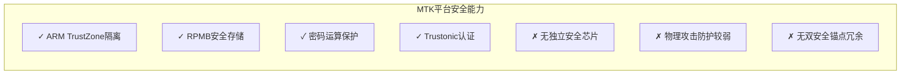
```mermaid
graph LR
    subgraph "MTK平台安全能力"
        M1["✓ ARM TrustZone隔离"]
        M2["✓ RPMB安全存储"]
        M3["✓ 密码运算保护"]
        M4["✓ Trustonic认证"]
        M5["✗ 无独立安全芯片"]
        M6["✗ 物理攻击防护较弱"]
        M7["✗ 无双安全锚点冗余"]
    end
```

### 2.3 架构约束分析

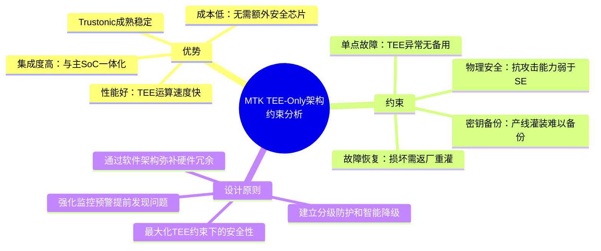
```mermaid
mindmap
  root((MTK TEE-Only架构<br/>约束分析))
    优势
      成本低：无需额外安全芯片
      性能好：TEE运算速度快
      集成度高：与主SoC一体化
      Trustonic成熟稳定
    约束
      单点故障：TEE异常无备用
      物理安全：抗攻击能力弱于SE
      密钥备份：产线灌装难以备份
      故障恢复：损坏需返厂重灌
    设计原则
      最大化TEE约束下的安全性
      通过软件架构弥补硬件冗余
      建立分级防护和智能降级
      强化监控预警提前发现问题
```

### 2.4 MTK平台密钥管理架构

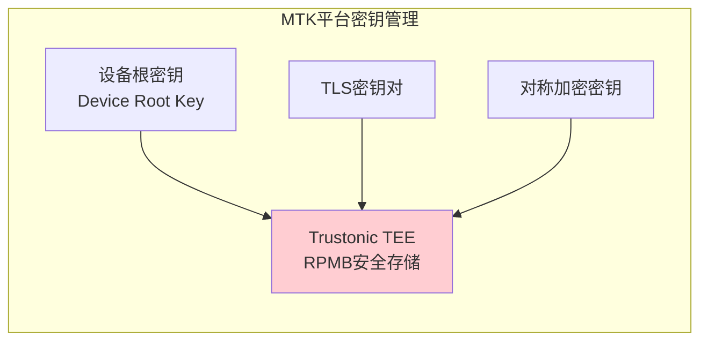
```mermaid
flowchart TB
    subgraph "MTK平台密钥管理"
        direction TB
        MTK_ROOT["设备根密钥<br/>Device Root Key"]
        MTK_TLS["TLS密钥对"]
        MTK_SYM["对称加密密钥"]
        MTK_STORE["Trustonic TEE<br/>RPMB安全存储"]
        
        MTK_ROOT --> MTK_STORE
        MTK_TLS --> MTK_STORE
        MTK_SYM --> MTK_STORE
    end

    style MTK_STORE fill:#ffcdd2
```

---

## 三、产线灌装流程设计

### 3.1 产线灌装整体架构

产线通过上位机系统完成密钥和证书的安全灌装，确保设备出厂时具备完整的安全凭证。

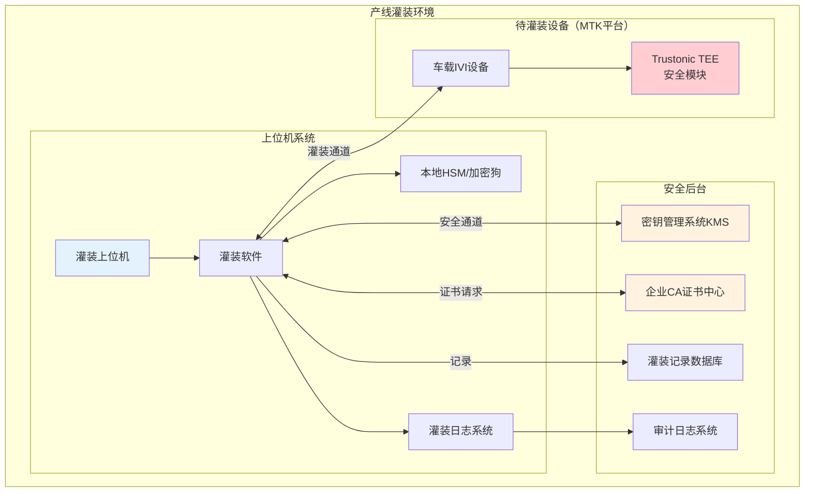
```mermaid
graph TB
    subgraph "产线灌装环境"
        subgraph "上位机系统"
            PC["灌装上位机"]
            PC_SW["灌装软件"]
            PC_HSM["本地HSM/加密狗"]
            PC_LOG["灌装日志系统"]
        end

        subgraph "安全后台"
            KMS["密钥管理系统KMS"]
            CA["企业CA证书中心"]
            DB["灌装记录数据库"]
            AUDIT["审计日志系统"]
        end

        subgraph "待灌装设备（MTK平台）"
            IVI["车载IVI设备"]
            TEE_TARGET["Trustonic TEE<br/>安全模块"]
        end
    end

    PC --> PC_SW
    PC_SW --> PC_HSM
    PC_SW --> PC_LOG
    
    PC_SW <-->|安全通道| KMS
    PC_SW <-->|证书请求| CA
    PC_SW -->|记录| DB
    PC_LOG --> AUDIT

    PC_SW <-->|灌装通道| IVI
    IVI --> TEE_TARGET

    style PC fill:#e3f2fd
    style KMS fill:#fff3e0
    style CA fill:#fff3e0
    style TEE_TARGET fill:#ffcdd2
```

### 3.2 MTK平台产线灌装详细流程

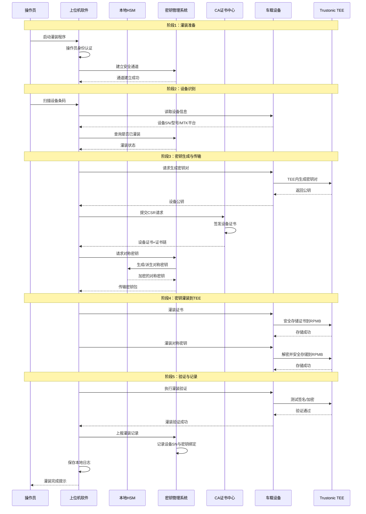
```mermaid
sequenceDiagram
    participant OP as 操作员
    participant PC as 上位机软件
    participant HSM as 本地HSM
    participant KMS as 密钥管理系统
    participant CA as CA证书中心
    participant DEV as 车载设备
    participant TEE as Trustonic TEE

    Note over OP,TEE: 阶段1：灌装准备
    OP->>PC: 启动灌装程序
    PC->>PC: 操作员身份认证
    PC->>KMS: 建立安全通道
    KMS-->>PC: 通道建立成功

    Note over OP,TEE: 阶段2：设备识别
    OP->>PC: 扫描设备条码
    PC->>DEV: 读取设备信息
    DEV-->>PC: 设备SN/型号/MTK平台
    PC->>KMS: 查询是否已灌装
    KMS-->>PC: 灌装状态

    Note over OP,TEE: 阶段3：密钥生成与传输
    PC->>DEV: 请求生成密钥对
    DEV->>TEE: TEE内生成密钥对
    TEE-->>DEV: 返回公钥
    DEV-->>PC: 设备公钥

    PC->>CA: 提交CSR请求
    CA->>CA: 签发设备证书
    CA-->>PC: 设备证书+证书链

    PC->>KMS: 请求对称密钥
    KMS->>HSM: 生成/派生对称密钥
    HSM-->>KMS: 加密的对称密钥
    KMS-->>PC: 传输密钥包

    Note over OP,TEE: 阶段4：密钥灌装到TEE
    PC->>DEV: 灌装证书
    DEV->>TEE: 安全存储证书到RPMB
    TEE-->>DEV: 存储成功

    PC->>DEV: 灌装对称密钥
    DEV->>TEE: 解密并安全存储到RPMB
    TEE-->>DEV: 存储成功

    Note over OP,TEE: 阶段5：验证与记录
    PC->>DEV: 执行灌装验证
    DEV->>TEE: 测试签名/加密
    TEE-->>DEV: 验证通过
    DEV-->>PC: 灌装验证成功

    PC->>KMS: 上报灌装记录
    KMS->>KMS: 记录设备SN与密钥绑定
    PC->>PC: 保存本地日志
    PC-->>OP: 灌装完成提示
```

### 3.3 灌装数据流向图

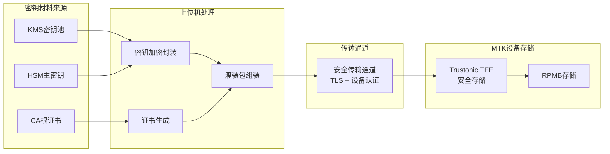
```mermaid
flowchart LR
    subgraph "密钥材料来源"
        KMS_SRC["KMS密钥池"]
        CA_SRC["CA根证书"]
        HSM_SRC["HSM主密钥"]
    end

    subgraph "上位机处理"
        ENCRYPT["密钥加密封装"]
        CERT_GEN["证书生成"]
        PACKAGE["灌装包组装"]
    end

    subgraph "传输通道"
        SEC_CH["安全传输通道<br/>TLS + 设备认证"]
    end

    subgraph "MTK设备存储"
        TEE_STORE["Trustonic TEE<br/>安全存储"]
        RPMB["RPMB存储"]
    end

    KMS_SRC --> ENCRYPT
    CA_SRC --> CERT_GEN
    HSM_SRC --> ENCRYPT
    ENCRYPT --> PACKAGE
    CERT_GEN --> PACKAGE
    PACKAGE --> SEC_CH
    SEC_CH --> TEE_STORE
    TEE_STORE --> RPMB
```

### 3.4 灌装安全措施

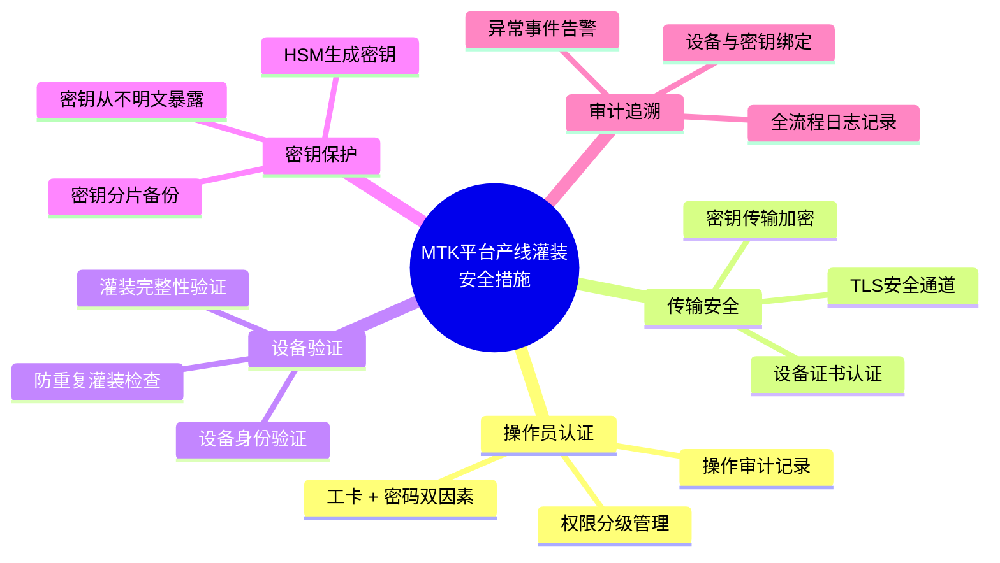
```mermaid
mindmap
  root((MTK平台产线灌装<br/>安全措施))
    操作员认证
      工卡 + 密码双因素
      权限分级管理
      操作审计记录
    传输安全
      TLS安全通道
      设备证书认证
      密钥传输加密
    设备验证
      设备身份验证
      防重复灌装检查
      灌装完整性验证
    密钥保护
      HSM生成密钥
      密钥从不明文暴露
      密钥分片备份
    审计追溯
      全流程日志记录
      设备与密钥绑定
      异常事件告警
```

---

## 四、TEE单点风险识别

### 4.1 MTK平台特有风险

由于MTK平台仅依赖Trustonic TEE作为唯一安全锚点，TEE故障将导致整个安全体系失效。

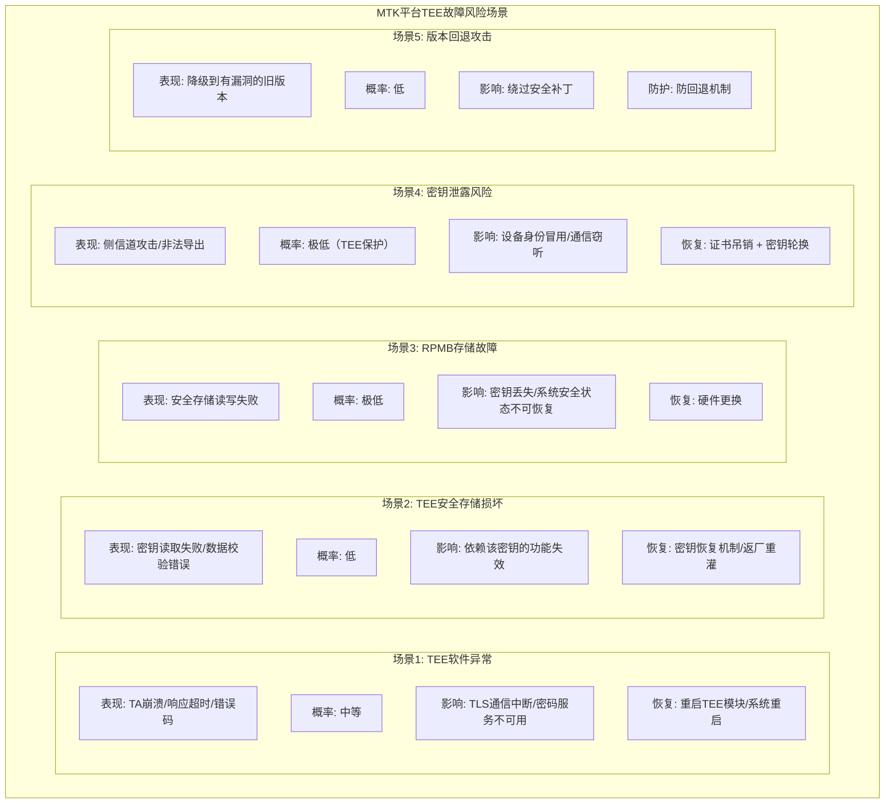
```mermaid
graph TB
    subgraph "MTK平台TEE故障风险场景"
        subgraph "场景1: TEE软件异常"
            S1_PERF["表现: TA崩溃/响应超时/错误码"]
            S1_PROB["概率: 中等"]
            S1_IMPACT["影响: TLS通信中断/密码服务不可用"]
            S1_RECOVER["恢复: 重启TEE模块/系统重启"]
        end

        subgraph "场景2: TEE安全存储损坏"
            S2_PERF["表现: 密钥读取失败/数据校验错误"]
            S2_PROB["概率: 低"]
            S2_IMPACT["影响: 依赖该密钥的功能失效"]
            S2_RECOVER["恢复: 密钥恢复机制/返厂重灌"]
        end

        subgraph "场景3: RPMB存储故障"
            S3_PERF["表现: 安全存储读写失败"]
            S3_PROB["概率: 极低"]
            S3_IMPACT["影响: 密钥丢失/系统安全状态不可恢复"]
            S3_RECOVER["恢复: 硬件更换"]
        end

        subgraph "场景4: 密钥泄露风险"
            S4_PERF["表现: 侧信道攻击/非法导出"]
            S4_PROB["概率: 极低（TEE保护）"]
            S4_IMPACT["影响: 设备身份冒用/通信窃听"]
            S4_RECOVER["恢复: 证书吊销 + 密钥轮换"]
        end

        subgraph "场景5: 版本回退攻击"
            S5_PERF["表现: 降级到有漏洞的旧版本"]
            S5_PROB["概率: 低"]
            S5_IMPACT["影响: 绕过安全补丁"]
            S5_RECOVER["防护: 防回退机制"]
        end
    end
```

### 4.2 故障影响链分析

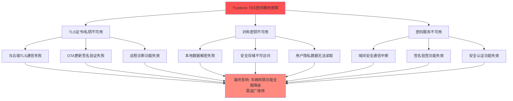
```mermaid
flowchart TD
    ROOT["Trustonic TEE密码模块故障"]
    
    ROOT --> TLS["TLS证书/私钥不可用"]
    ROOT --> SYM["对称密钥不可用"]
    ROOT --> SERVICE["密码服务不可用"]
    
    TLS --> TLS1["与云端TLS通信失败"]
    TLS --> TLS2["OTA更新签名验证失败"]
    TLS --> TLS3["远程诊断功能失效"]
    
    SYM --> SYM1["本地数据解密失败"]
    SYM --> SYM2["安全存储不可访问"]
    SYM --> SYM3["用户隐私数据无法读取"]
    
    SERVICE --> SVC1["域间安全通信中断"]
    SERVICE --> SVC2["签名验签功能失效"]
    SERVICE --> SVC3["安全认证功能失效"]
    
    TLS1 --> FINAL["最终影响: 车辆网联功能全面降级<br/>需返厂维修"]
    TLS2 --> FINAL
    TLS3 --> FINAL
    SYM1 --> FINAL
    SYM2 --> FINAL
    SYM3 --> FINAL
    SVC1 --> FINAL
    SVC2 --> FINAL
    SVC3 --> FINAL

    style ROOT fill:#ff5252
    style FINAL fill:#ff8a80
```

### 4.3 MTK平台风险缓解重点

由于缺少独立安全芯片SE作为备份，MTK平台需要更加重视：

1. **TEE健康监测**：更频繁的心跳检测和功能自检
2. **密钥备份机制**：完善的分片备份和恢复流程
3. **软件降级方案**：中低安全级别操作的软件备份
4. **预警机制**：提前发现问题，避免故障发生

---

## 五、防护类安全增强方案

### 5.1 MTK平台防护架构

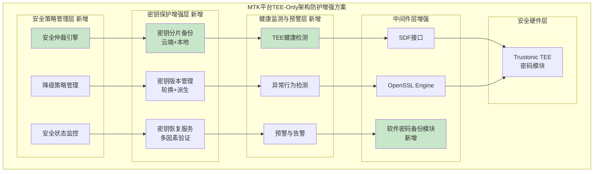
```mermaid
graph TB
    subgraph "MTK平台TEE-Only架构防护增强方案"
        subgraph "安全策略管理层 新增"
            POL1["安全仲裁引擎"]
            POL2["降级策略管理"]
            POL3["安全状态监控"]
        end

        subgraph "密钥保护增强层 新增"
            KEY1["密钥分片备份<br/>云端+本地"]
            KEY2["密钥版本管理<br/>轮换+派生"]
            KEY3["密钥恢复服务<br/>多因素验证"]
        end

        subgraph "健康监测与预警层 新增"
            MON1["TEE健康检测"]
            MON2["异常行为检测"]
            MON3["预警与告警"]
        end

        subgraph "中间件层增强"
            MW1["SDF接口"]
            MW2["OpenSSL Engine"]
            MW3["软件密码备份模块<br/>新增"]
        end

        subgraph "安全硬件层"
            TEE["Trustonic TEE<br/>密码模块"]
        end
    end

    POL1 --> KEY1
    POL2 --> KEY2
    POL3 --> KEY3
    KEY1 --> MON1
    KEY2 --> MON2
    KEY3 --> MON3
    MON1 --> MW1
    MON2 --> MW2
    MON3 --> MW3
    MW1 --> TEE
    MW2 --> TEE

    style POL1 fill:#c8e6c9
    style KEY1 fill:#c8e6c9
    style MON1 fill:#c8e6c9
    style MW3 fill:#c8e6c9
```

### 5.2 分层防护策略

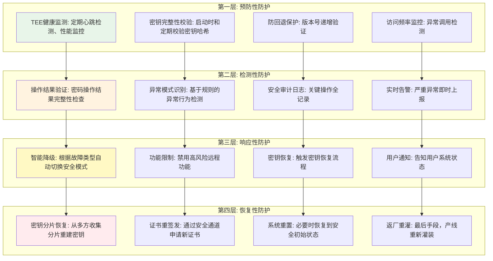
```mermaid
graph TB
    subgraph "第一层: 预防性防护"
        L1_1["TEE健康监测: 定期心跳检测、性能监控"]
        L1_2["密钥完整性校验: 启动时和定期校验密钥哈希"]
        L1_3["防回退保护: 版本号递增验证"]
        L1_4["访问频率监控: 异常调用检测"]
    end

    subgraph "第二层: 检测性防护"
        L2_1["操作结果验证: 密码操作结果完整性检查"]
        L2_2["异常模式识别: 基于规则的异常行为检测"]
        L2_3["安全审计日志: 关键操作全记录"]
        L2_4["实时告警: 严重异常即时上报"]
    end

    subgraph "第三层: 响应性防护"
        L3_1["智能降级: 根据故障类型自动切换安全模式"]
        L3_2["功能限制: 禁用高风险远程功能"]
        L3_3["密钥恢复: 触发密钥恢复流程"]
        L3_4["用户通知: 告知用户系统状态"]
    end

    subgraph "第四层: 恢复性防护"
        L4_1["密钥分片恢复: 从多方收集分片重建密钥"]
        L4_2["证书重签发: 通过安全通道申请新证书"]
        L4_3["系统重置: 必要时恢复到安全初始状态"]
        L4_4["返厂重灌: 最后手段，产线重新灌装"]
    end

    L1_1 --> L2_1
    L1_2 --> L2_2
    L1_3 --> L2_3
    L1_4 --> L2_4
    L2_1 --> L3_1
    L2_2 --> L3_2
    L2_3 --> L3_3
    L2_4 --> L3_4
    L3_1 --> L4_1
    L3_2 --> L4_2
    L3_3 --> L4_3
    L3_4 --> L4_4

    style L1_1 fill:#e8f5e9
    style L2_1 fill:#fff3e0
    style L3_1 fill:#fff9c4
    style L4_1 fill:#ffebee
```

---

## 六、密钥备份与恢复机制

### 6.1 密钥分类与备份策略

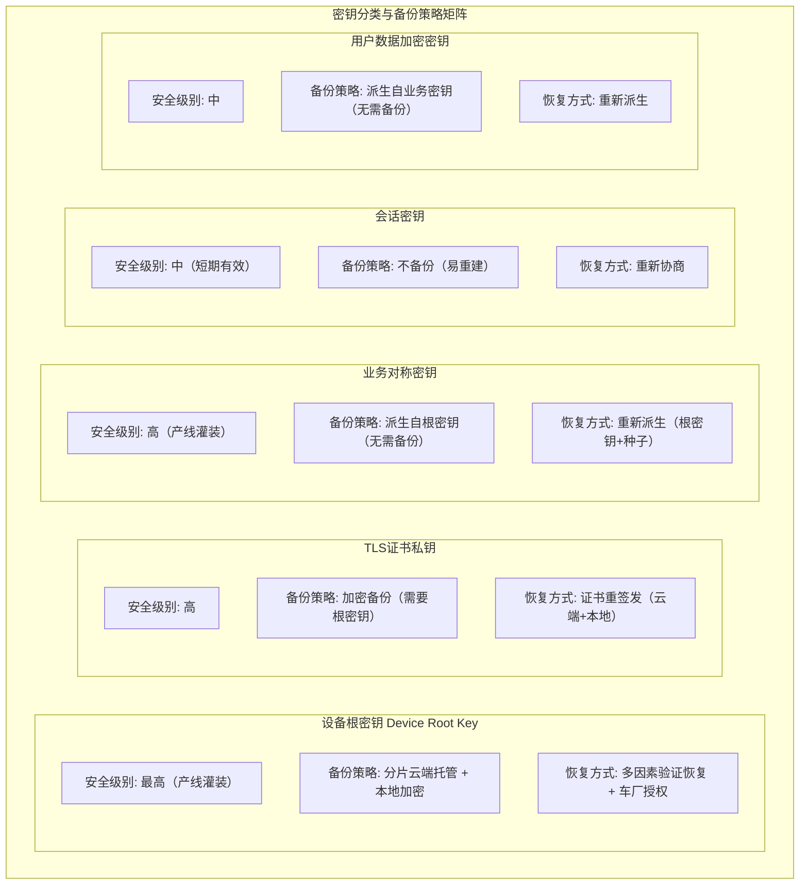
```mermaid
graph TB
    subgraph "密钥分类与备份策略矩阵"
        subgraph "设备根密钥 Device Root Key"
            DRK_LEVEL["安全级别: 最高（产线灌装）"]
            DRK_BACKUP["备份策略: 分片云端托管 + 本地加密"]
            DRK_RECOVER["恢复方式: 多因素验证恢复 + 车厂授权"]
        end

        subgraph "TLS证书私钥"
            TLS_LEVEL["安全级别: 高"]
            TLS_BACKUP["备份策略: 加密备份（需要根密钥）"]
            TLS_RECOVER["恢复方式: 证书重签发（云端+本地）"]
        end

        subgraph "业务对称密钥"
            SYM_LEVEL["安全级别: 高（产线灌装）"]
            SYM_BACKUP["备份策略: 派生自根密钥（无需备份）"]
            SYM_RECOVER["恢复方式: 重新派生（根密钥+种子）"]
        end

        subgraph "会话密钥"
            SESS_LEVEL["安全级别: 中（短期有效）"]
            SESS_BACKUP["备份策略: 不备份（易重建）"]
            SESS_RECOVER["恢复方式: 重新协商"]
        end

        subgraph "用户数据加密密钥"
            USER_LEVEL["安全级别: 中"]
            USER_BACKUP["备份策略: 派生自业务密钥（无需备份）"]
            USER_RECOVER["恢复方式: 重新派生"]
        end
    end
```

### 6.2 密钥派生架构

通过基于根密钥的派生架构，大幅减少需要备份的密钥数量。

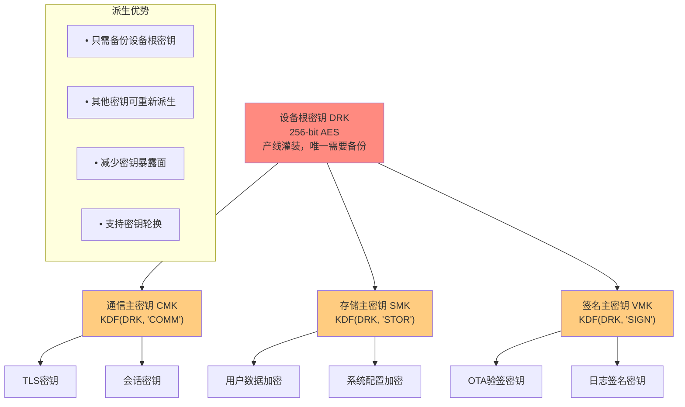
```mermaid
flowchart TD
    DRK["设备根密钥 DRK<br/>256-bit AES<br/>产线灌装，唯一需要备份"]

    DRK --> CMK["通信主密钥 CMK<br/>KDF(DRK, 'COMM')"]
    DRK --> SMK["存储主密钥 SMK<br/>KDF(DRK, 'STOR')"]
    DRK --> VMK["签名主密钥 VMK<br/>KDF(DRK, 'SIGN')"]

    CMK --> TLS_KEY["TLS密钥"]
    CMK --> SESS_KEY["会话密钥"]
    
    SMK --> USER_DATA["用户数据加密"]
    SMK --> SYS_CONFIG["系统配置加密"]
    
    VMK --> OTA_KEY["OTA验签密钥"]
    VMK --> LOG_KEY["日志签名密钥"]

    subgraph "派生优势"
        ADV1["• 只需备份设备根密钥"]
        ADV2["• 其他密钥可重新派生"]
        ADV3["• 减少密钥暴露面"]
        ADV4["• 支持密钥轮换"]
    end

    style DRK fill:#ff8a80
    style CMK fill:#ffcc80
    style SMK fill:#ffcc80
    style VMK fill:#ffcc80
```

### 6.3 设备根密钥分片备份方案

采用Shamir秘密分享方案，实现安全的密钥备份与恢复。

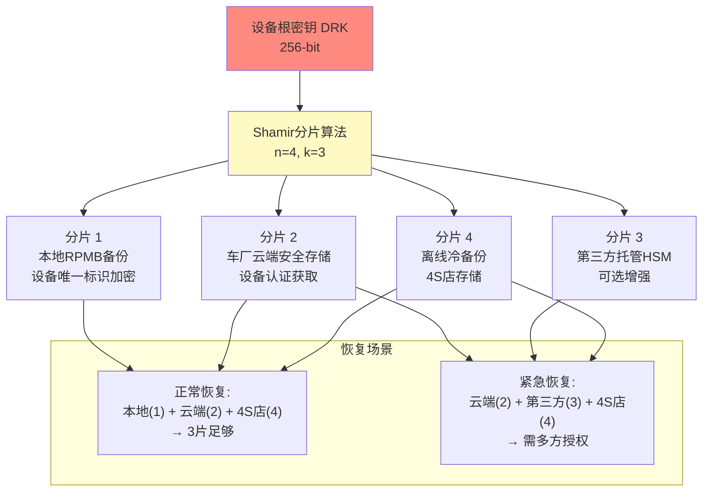
```mermaid
flowchart TD
    DRK["设备根密钥 DRK<br/>256-bit"]
    
    DRK --> SHAMIR["Shamir分片算法<br/>n=4, k=3"]
    
    SHAMIR --> S1["分片 1<br/>本地RPMB备份<br/>设备唯一标识加密"]
    SHAMIR --> S2["分片 2<br/>车厂云端安全存储<br/>设备认证获取"]
    SHAMIR --> S3["分片 3<br/>第三方托管HSM<br/>可选增强"]
    SHAMIR --> S4["分片 4<br/>离线冷备份<br/>4S店存储"]

    subgraph "恢复场景"
        R1["正常恢复:<br/>本地(1) + 云端(2) + 4S店(4)<br/>→ 3片足够"]
        R2["紧急恢复:<br/>云端(2) + 第三方(3) + 4S店(4)<br/>→ 需多方授权"]
    end

    S1 --> R1
    S2 --> R1
    S4 --> R1
    S2 --> R2
    S3 --> R2
    S4 --> R2

    style DRK fill:#ff8a80
    style SHAMIR fill:#fff9c4
```

### 6.4 TLS证书恢复流程

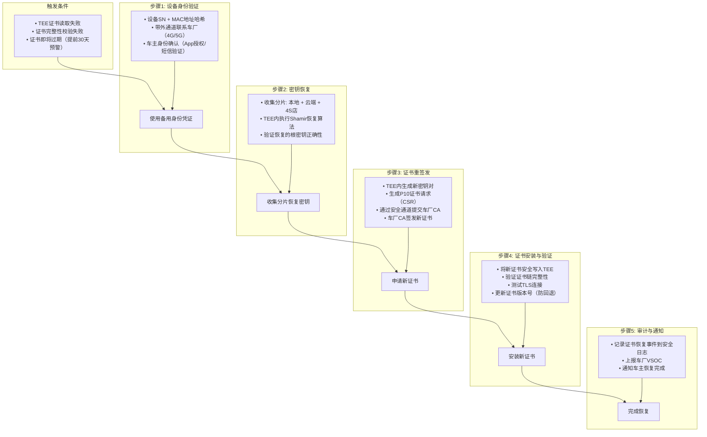
```mermaid
flowchart TD
    subgraph "触发条件"
        TRIGGER["• TEE证书读取失败<br/>• 证书完整性校验失败<br/>• 证书即将过期（提前30天预警）"]
    end

    TRIGGER --> STEP1

    subgraph "步骤1: 设备身份验证"
        STEP1["使用备用身份凭证"]
        STEP1_DETAIL["• 设备SN + MAC地址哈希<br/>• 带外通道联系车厂（4G/5G）<br/>• 车主身份确认（App授权/短信验证）"]
    end

    STEP1 --> STEP2

    subgraph "步骤2: 密钥恢复"
        STEP2["收集分片恢复密钥"]
        STEP2_DETAIL["• 收集分片: 本地 + 云端 + 4S店<br/>• TEE内执行Shamir恢复算法<br/>• 验证恢复的根密钥正确性"]
    end

    STEP2 --> STEP3

    subgraph "步骤3: 证书重签发"
        STEP3["申请新证书"]
        STEP3_DETAIL["• TEE内生成新密钥对<br/>• 生成P10证书请求（CSR）<br/>• 通过安全通道提交车厂CA<br/>• 车厂CA签发新证书"]
    end

    STEP3 --> STEP4

    subgraph "步骤4: 证书安装与验证"
        STEP4["安装新证书"]
        STEP4_DETAIL["• 将新证书安全写入TEE<br/>• 验证证书链完整性<br/>• 测试TLS连接<br/>• 更新证书版本号（防回退）"]
    end

    STEP4 --> STEP5

    subgraph "步骤5: 审计与通知"
        STEP5["完成恢复"]
        STEP5_DETAIL["• 记录证书恢复事件到安全日志<br/>• 上报车厂VSOC<br/>• 通知车主恢复完成"]
    end

    STEP1_DETAIL --> STEP1
    STEP2_DETAIL --> STEP2
    STEP3_DETAIL --> STEP3
    STEP4_DETAIL --> STEP4
    STEP5_DETAIL --> STEP5
```

---

## 七、Keystore功能集成方案

### 7.1 MTK平台Keystore集成架构

在应用层集成Android Keystore功能，利用Trustonic TEE提供的硬件安全保护。

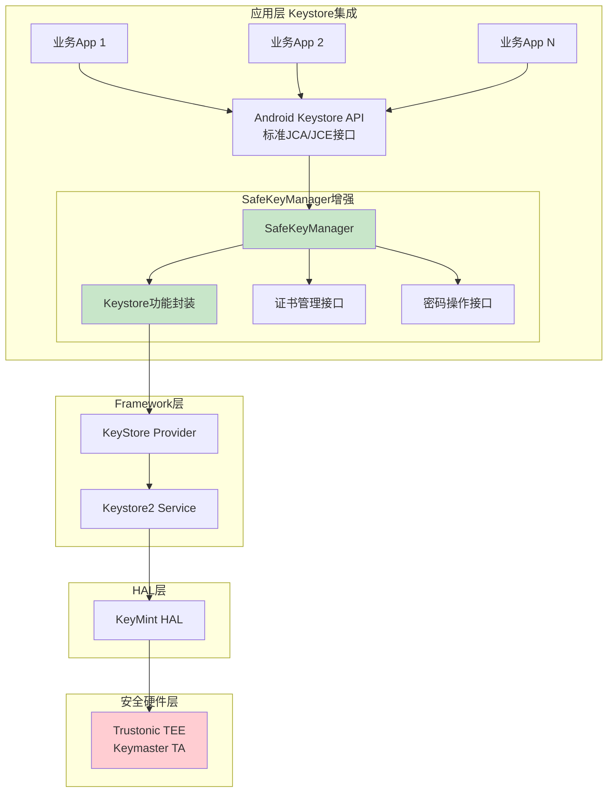
```mermaid
graph TB
    subgraph "应用层 Keystore集成"
        APP1["业务App 1"]
        APP2["业务App 2"]
        APP3["业务App N"]
        
        KS_API["Android Keystore API<br/>标准JCA/JCE接口"]
        
        subgraph "SafeKeyManager增强"
            SKM["SafeKeyManager"]
            SKM_KS["Keystore功能封装"]
            SKM_CERT["证书管理接口"]
            SKM_CRYPTO["密码操作接口"]
        end
    end

    subgraph "Framework层"
        KSP["KeyStore Provider"]
        KS2["Keystore2 Service"]
    end

    subgraph "HAL层"
        KM_HAL["KeyMint HAL"]
    end

    subgraph "安全硬件层"
        TEE["Trustonic TEE<br/>Keymaster TA"]
    end

    APP1 --> KS_API
    APP2 --> KS_API
    APP3 --> KS_API
    KS_API --> SKM
    SKM --> SKM_KS
    SKM --> SKM_CERT
    SKM --> SKM_CRYPTO
    SKM_KS --> KSP
    KSP --> KS2
    KS2 --> KM_HAL
    KM_HAL --> TEE

    style SKM fill:#c8e6c9
    style SKM_KS fill:#c8e6c9
    style TEE fill:#ffcdd2
```

### 7.2 Keystore功能能力矩阵

| 功能类别 | 功能项 | 说明 | 业务场景 |
|---------|-------|------|---------|
| **密钥生成** | 对称密钥生成 | AES-128/256 | 本地数据加密 |
| | 非对称密钥生成 | RSA/EC | 签名验签、密钥交换 |
| | 硬件密钥 | TEE内生成 | 高安全等级场景 |
| **密钥存储** | 硬件安全存储 | 密钥不可导出 | 所有场景 |
| | 用户认证绑定 | 生物识别/PIN | 支付、敏感操作 |
| | 应用绑定 | 仅授权应用可用 | 隔离保护 |
| **密码操作** | 加密解密 | AES-GCM | 数据保护 |
| | 签名验签 | RSA/ECDSA | 身份认证、数据完整性 |
| | 密钥协商 | ECDH | 安全通信 |
| **密钥证明** | 硬件证明 | Key Attestation | 远程验证密钥安全性 |

### 7.3 业务使用场景

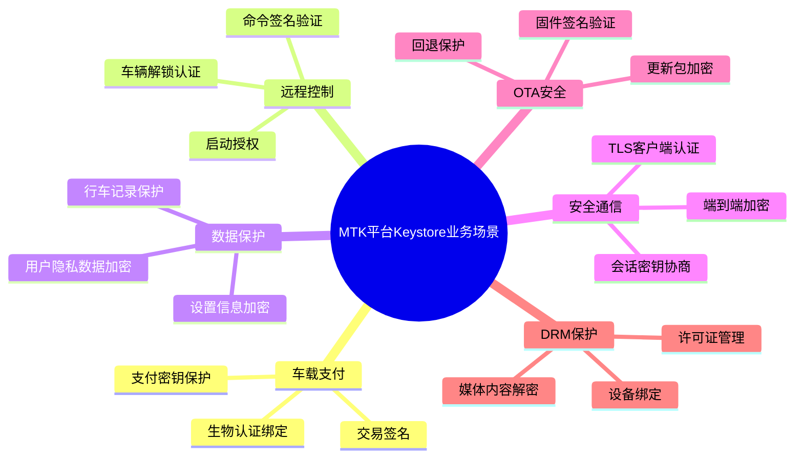
```mermaid
mindmap
  root((MTK平台Keystore业务场景))
    车载支付
      支付密钥保护
      交易签名
      生物认证绑定
    远程控制
      车辆解锁认证
      启动授权
      命令签名验证
    数据保护
      用户隐私数据加密
      行车记录保护
      设置信息加密
    安全通信
      TLS客户端认证
      端到端加密
      会话密钥协商
    OTA安全
      固件签名验证
      更新包加密
      回退保护
    DRM保护
      媒体内容解密
      许可证管理
      设备绑定
```

### 7.4 Keystore与SafeKeyManager集成架构

```mermaid
graph TB
    subgraph "MTK平台集成架构设计"
        subgraph "SafeKeyManager增强接口"
            API_KS["Keystore密钥管理"]
            API_GEN["密钥生成接口<br/>generateKeyPair/generateSecretKey"]
            API_USE["密钥使用接口<br/>sign/verify/encrypt/decrypt"]
            API_ATTEST["密钥证明接口<br/>getKeyAttestation"]
            API_IMPORT["密钥导入接口<br/>importKey"]
        end

        subgraph "密钥类型支持"
            KEY_TEE["TEE密钥<br/>产线灌装"]
            KEY_KS["Keystore密钥<br/>运行时生成"]
        end

        subgraph "路由决策"
            ROUTER["密钥路由器"]
            ROUTER_DESC["根据密钥类型和操作<br/>选择Trustonic TEE执行"]
        end

        subgraph "安全模块"
            TEE["Trustonic TEE<br/>Kinibi"]
        end
    end

    API_KS --> API_GEN
    API_KS --> API_USE
    API_KS --> API_ATTEST
    API_KS --> API_IMPORT

    API_GEN --> ROUTER
    API_USE --> ROUTER
    API_ATTEST --> ROUTER
    API_IMPORT --> ROUTER

    ROUTER --> KEY_TEE --> TEE
    ROUTER --> KEY_KS --> TEE

    style API_KS fill:#c8e6c9
    style ROUTER fill:#fff9c4
    style TEE fill:#ffcdd2
```

---

## 八、安全仲裁架构设计

### 8.1 操作安全级别分类

```mermaid
graph TB
    subgraph "安全级别分类"
        subgraph "CRITICAL 关键级别"
            C1["远程车辆控制（解锁、启动、窗户等）"]
            C2["OTA固件更新签名验证"]
            C3["设备根密钥操作"]
            C4["证书更新/恢复"]
            C_RULE["处理方式: 必须TEE执行，失败则拒绝操作"]
        end

        subgraph "HIGH 高级别"
            H1["TLS握手和通信加密"]
            H2["用户身份认证"]
            H3["支付/交易签名"]
            H4["隐私数据加密解密"]
            H_RULE["处理方式: 优先TEE，失败记录告警后可有限降级"]
        end

        subgraph "MEDIUM 中级别"
            M1["日志数据加密"]
            M2["配置数据保护"]
            M3["域间通信加密"]
            M4["缓存数据加密"]
            M_RULE["处理方式: 优先TEE，可降级到软件实现"]
        end

        subgraph "LOW 低级别"
            L1["临时会话密钥生成"]
            L2["随机数生成"]
            L3["哈希计算"]
            L4["非敏感数据加密"]
            L_RULE["处理方式: 可使用软件实现作为备选"]
        end
    end

    style C1 fill:#ff8a80
    style H1 fill:#ffcc80
    style M1 fill:#fff9c4
    style L1 fill:#c8e6c9
```

### 8.2 MTK平台安全仲裁决策流程

由于MTK平台没有SE备份，TEE故障时只能降级到软件实现或拒绝操作。

```mermaid
flowchart TD
    REQ["密码操作请求<br/>操作类型、调用者ID、上下文信息"]
    
    REQ --> STEP1["确定操作安全级别<br/>根据操作类型查询安全级别矩阵"]
    
    STEP1 --> STEP2["检查Trustonic TEE健康状态<br/>调用TEE健康检测模块"]
    
    STEP2 --> CHECK{"TEE状态?"}
    
    CHECK -->|正常| TEE_EXEC["TEE执行操作<br/>返回结果"]
    
    CHECK -->|异常/不可用| LEVEL_CHECK{"根据安全级别决策"}
    
    LEVEL_CHECK -->|CRITICAL| DENY1["拒绝操作<br/>记录告警<br/>无SE备份"]
    LEVEL_CHECK -->|HIGH| DENY2["拒绝操作<br/>启动恢复流程<br/>无SE备份"]
    LEVEL_CHECK -->|MEDIUM| DEGRADE1["降级到软件实现"]
    LEVEL_CHECK -->|LOW| DEGRADE2["使用软件实现"]
    
    DENY1 --> AUDIT["记录降级事件<br/>安全审计日志<br/>上报VSOC<br/>触发恢复流程"]
    DENY2 --> AUDIT
    DEGRADE1 --> AUDIT
    DEGRADE2 --> AUDIT

    style DENY1 fill:#ff8a80
    style DENY2 fill:#ff8a80
    style DEGRADE1 fill:#fff9c4
    style DEGRADE2 fill:#c8e6c9
```

### 8.3 软件密码备份模块

当TEE不可用时，为中低安全级别操作提供软件备选方案。

```mermaid
graph TB
    subgraph "MTK平台软件密码备份模块架构"
        subgraph "功能限制"
            ALLOW1["✓ 对称加密 AES-256-GCM"]
            ALLOW2["✓ 哈希计算 SHA-256, SM3"]
            ALLOW3["✓ 随机数生成 /dev/urandom"]
            DENY1["✗ 私钥签名（禁止 - 私钥必须在TEE）"]
            DENY2["✗ 设备认证（禁止 - 需要TEE密钥）"]
            DENY3["✗ 关键数据解密（禁止）"]
        end

        subgraph "安全措施"
            SEC1["密钥存储在内存中，进程退出即清除"]
            SEC2["使用白盒加密保护软件密钥"]
            SEC3["操作频率限制"]
            SEC4["所有操作记录审计日志"]
        end

        subgraph "使用场景"
            USE1["TEE暂时不可用时的日志加密"]
            USE2["非敏感配置数据的临时保护"]
            USE3["会话密钥的临时生成"]
        end

        subgraph "重要提醒"
            WARN["⚠ 软件实现安全性显著低于TEE<br/>仅作为临时备选方案<br/>TEE恢复后应立即切换回TEE执行<br/>MTK平台无SE备份，更需谨慎"]
        end
    end

    style DENY1 fill:#ff8a80
    style DENY2 fill:#ff8a80
    style DENY3 fill:#ff8a80
    style WARN fill:#fff9c4
```

---

## 九、故障检测与降级策略

### 9.1 TEE健康监测机制

```mermaid
graph TB
    subgraph "Trustonic TEE健康监测架构"
        subgraph "检测项目"
            CHK1["心跳检测<br/>周期: 5秒<br/>正常: 响应<100ms<br/>告警: 超时>1s"]
            CHK2["功能自检<br/>周期: 60秒<br/>正常: 成功<br/>告警: 失败"]
            CHK3["密钥完整性<br/>周期: 启动时+每小时<br/>正常: 校验通过<br/>告警: 校验失败"]
            CHK4["存储空间<br/>周期: 30分钟<br/>正常: >20%可用<br/>告警: <10%可用"]
            CHK5["操作延迟<br/>周期: 实时<br/>正常: P99<200ms<br/>告警: P99>500ms"]
            CHK6["错误率<br/>周期: 实时<br/>正常: <0.1%<br/>告警: >1%"]
        end

        subgraph "状态判定逻辑"
            HEALTHY["HEALTHY 正常<br/>所有检测项正常"]
            DEGRADED["DEGRADED 降级<br/>1-2项异常，核心功能可用"]
            FAILED["FAILED 失败<br/>心跳超时或核心功能失败"]
            RECOVERING["RECOVERING 恢复中<br/>正在执行恢复流程"]
        end
    end

    CHK1 --> HEALTHY
    CHK2 --> HEALTHY
    CHK3 --> HEALTHY
    CHK1 --> DEGRADED
    CHK2 --> DEGRADED
    CHK1 --> FAILED
    FAILED --> RECOVERING

    style HEALTHY fill:#c8e6c9
    style DEGRADED fill:#fff9c4
    style FAILED fill:#ff8a80
    style RECOVERING fill:#e3f2fd
```

### 9.2 MTK平台分级降级策略

由于MTK平台没有SE作为备份，降级策略更加保守。

```mermaid
stateDiagram-v2
    [*] --> FullSecurity: 系统启动

    FullSecurity: 正常模式 Full Security
    FullSecurity: • 所有密码操作在TEE执行
    FullSecurity: • 完整的远程控制功能
    FullSecurity: • 正常的TLS通信

    LimitedSecurity: 降级模式1 Limited Security
    LimitedSecurity: • 关键操作继续使用TEE（可能有延迟）
    LimitedSecurity: • 中低级别操作可使用软件备份
    LimitedSecurity: • 远程控制需要额外确认步骤
    LimitedSecurity: • 告警通知车厂VSOC
    LimitedSecurity: • 注意：无SE备份

    MinimalSecurity: 降级模式2 Minimal Security
    MinimalSecurity: • 关键操作全部拒绝（无SE备份）
    MinimalSecurity: • 远程控制禁用
    MinimalSecurity: • TLS通信使用缓存证书进行有限通信
    MinimalSecurity: • 本地功能部分可用（使用软件加密）
    MinimalSecurity: • 强制告警通知用户 + VSOC

    SafeMode: 安全模式 Safe Mode
    SafeMode: • 仅保留基本车辆控制（非智能功能）
    SafeMode: • 禁用所有网联功能
    SafeMode: • 强制显示警告信息
    SafeMode: • 建议用户前往4S店检修

    FullSecurity --> LimitedSecurity: TEE响应延迟升高/部分操作失败
    LimitedSecurity --> MinimalSecurity: TEE心跳超时/核心功能失败
    MinimalSecurity --> SafeMode: 持续故障>24小时/多次恢复失败

    LimitedSecurity --> FullSecurity: TEE恢复正常
    MinimalSecurity --> LimitedSecurity: TEE部分恢复
    SafeMode --> MinimalSecurity: 维修后恢复
```

---

## 十、安全监控与审计增强

### 10.1 安全日志架构

```mermaid
graph TB
    subgraph "MTK平台安全日志架构"
        subgraph "日志收集层"
            LOG1["TEE操作日志<br/>• 密码操作<br/>• 密钥访问<br/>• 认证事件"]
            LOG2["仲裁决策日志<br/>• 决策原因<br/>• 安全级别<br/>• 执行模块"]
            LOG3["降级事件日志<br/>• 模式变更<br/>• 功能状态<br/>• 恢复尝试"]
        end

        subgraph "安全日志聚合器"
            AGG["SecurityLogAggregator"]
            AGG_SEC["安全措施:<br/>• 日志签名: TEE密钥HMAC签名<br/>• 日志加密: 敏感内容加密存储<br/>• 防篡改: 日志链式哈希<br/>• 循环存储: 固定大小防耗尽<br/>• 安全时间戳: 可信时间源"]
        end

        subgraph "存储与上报"
            LOCAL["本地安全存储<br/>RPMB/加密分区<br/>• 保留最近30天日志<br/>• 支持离线审计"]
            CLOUD["云端VSOC上报<br/>加密通道<br/>• 实时上报严重事件<br/>• 定期批量上报"]
        end
    end

    LOG1 --> AGG
    LOG2 --> AGG
    LOG3 --> AGG
    AGG --> AGG_SEC
    AGG_SEC --> LOCAL
    AGG_SEC --> CLOUD
```

### 10.2 关键安全监控指标

```mermaid
graph TB
    subgraph "关键安全监控指标"
        subgraph "TEE健康指标"
            TEE1["TEE心跳延迟 >500ms → 记录日志"]
            TEE2["TEE心跳超时 >3次/分钟 → 触发降级"]
            TEE3["TEE操作失败率 >1% → 告警+检查"]
            TEE4["TEE存储使用 >90% → 告警+清理"]
        end

        subgraph "密钥安全指标"
            KEY1["密钥访问失败 任何 → 记录+检查"]
            KEY2["密钥校验失败 任何 → 告警+恢复"]
            KEY3["异常密钥操作 模式异常 → 告警+审查"]
        end

        subgraph "认证安全指标"
            AUTH1["认证失败次数 >5次/分钟 → 临时锁定"]
            AUTH2["暴力破解检测 触发阈值 → 锁定+告警"]
            AUTH3["认证来源异常 非法调用 → 拒绝+告警"]
        end

        subgraph "系统状态指标"
            SYS1["降级事件 任何 → 记录+上报"]
            SYS2["恢复失败 >3次 → 进入安全模式"]
            SYS3["模式变更 任何 → 通知+上报"]
        end

        subgraph "通信安全指标"
            COMM1["TLS握手失败 >5% → 告警+检查证书"]
            COMM2["证书即将过期 <30天 → 告警+准备更新"]
            COMM3["证书验证失败 任何 → 拒绝连接+告警"]
        end
    end
```

---

## 十一、实施建议

### 11.1 MTK平台实施优先级排序

```mermaid
gantt
    title MTK平台安全增强实施优先级
    dateFormat  YYYY-MM-DD
    section P0 立即实施
    TEE健康监测机制           :p0_1, 2025-01-01, 30d
    安全审计日志增强           :p0_2, after p0_1, 20d
    基础仲裁逻辑               :p0_3, after p0_1, 25d
    section P1 短期实施
    降级策略管理               :p1_1, after p0_3, 30d
    密钥派生架构               :p1_2, after p0_2, 35d
    VSOC对接                   :p1_3, after p1_1, 25d
    section P2 中期实施
    密钥分片备份               :p2_1, after p1_2, 40d
    密钥恢复流程               :p2_2, after p2_1, 35d
    软件密码备份模块           :p2_3, after p1_1, 30d
    Keystore功能集成           :p2_4, after p1_2, 40d
    section P3 长期优化
    证书自动更新机制           :p3_1, after p2_2, 30d
    异常行为检测增强           :p3_2, after p2_3, 35d
    安全合规审计工具           :p3_3, after p3_1, 30d
```

### 11.2 MTK平台特别注意事项

```mermaid
mindmap
  root((MTK平台<br/>风险与限制))
    架构限制
      仅TEE单安全锚点
      无SE硬件备份
      物理攻击防护能力有限
      软件备份方案安全性低
    实施风险
      TEE故障无硬件备份
      降级策略可能影响用户体验
      密钥恢复流程需要车厂支持
    缓解措施
      更频繁的TEE健康监测
      完善的密钥分片备份
      严格限制软件备份功能
      完善的监控告警机制
    未来演进建议
      后续车型考虑增加SE
      评估新一代安全架构
      持续关注TEE安全漏洞
```

### 11.3 与现有系统集成方案

```mermaid
graph TB
    subgraph "MTK平台与现有系统集成方案"
        subgraph "现有架构"
            SKM_OLD["SafeKeyManager (现有)"]
            SKS_OLD["SafeKeyService (现有)"]
            MW_OLD["中间件层 (现有)"]
            TEE_OLD["Trustonic TEE (现有)"]
        end

        subgraph "新增组件"
            ARB["SecurityArbiterWrapper<br/>安全仲裁封装层"]
            ARB_DESC["• 拦截所有密码操作请求<br/>• 执行安全级别判定<br/>• 调用仲裁引擎决策<br/>• 记录审计日志"]
            
            SW_CRYPTO["SoftwareCryptoFallback<br/>软件密码备份"]
            
            KS_INT["Keystore集成模块"]
        end

        subgraph "集成原则"
            RULE1["对上层API保持兼容"]
            RULE2["安全仲裁层对调用者透明"]
            RULE3["降级和恢复自动进行"]
            RULE4["安全事件通过统一通道上报"]
        end
    end

    SKM_OLD --> ARB
    ARB --> SKS_OLD
    ARB --> KS_INT
    SKS_OLD --> MW_OLD
    MW_OLD --> TEE_OLD
    MW_OLD --> SW_CRYPTO

    style ARB fill:#c8e6c9
    style SW_CRYPTO fill:#c8e6c9
    style KS_INT fill:#c8e6c9
```

---

## 参考资料

### 标准与法规
- ISO/SAE 21434:2021 - 道路车辆网络安全工程
- UNECE WP.29 R155 - 网络安全管理系统
- GM/T 0018 - 密码设备应用接口规范

### 技术参考
- ARM TrustZone技术白皮书
- Trustonic Kinibi TEE文档
- Android Keystore系统架构
- Shamir Secret Sharing算法
- HKDF密钥派生函数 (RFC 5869)

---

*文档版本: 2.0*  
*更新日期: 2025-01-20*  
*适用架构: MTK平台(Trustonic TEE)*
