# 车载系统安全性提升方案 - 高通平台

基于高通平台车载系统架构特点，从防护类（兼容备份、仲裁）角度提出针对性安全增强方案。本文档专注于高通平台（QTEE + 安全芯片SE）双安全锚点架构。

---

## 目录

1. [高通平台架构分析](#一高通平台架构分析)
2. [现有安全能力评估](#二现有安全能力评估)
3. [双安全模块协作机制](#三双安全模块协作机制)
4. [故障风险识别与解决方案](#四故障风险识别与解决方案)
5. [防护类安全增强方案](#五防护类安全增强方案)
6. [密钥备份与恢复机制](#六密钥备份与恢复机制)
7. [Keystore功能集成方案](#七keystore功能集成方案)
8. [安全仲裁架构设计](#八安全仲裁架构设计)
9. [故障检测与降级策略](#九故障检测与降级策略)
10. [安全监控与审计增强](#十安全监控与审计增强)
11. [实施建议](#十一实施建议)

---

## 一、高通平台架构分析

### 1.1 高通平台系统架构总览

高通平台车载系统采用QTEE + 独立安全芯片SE的双安全锚点架构，提供更强的安全冗余能力。

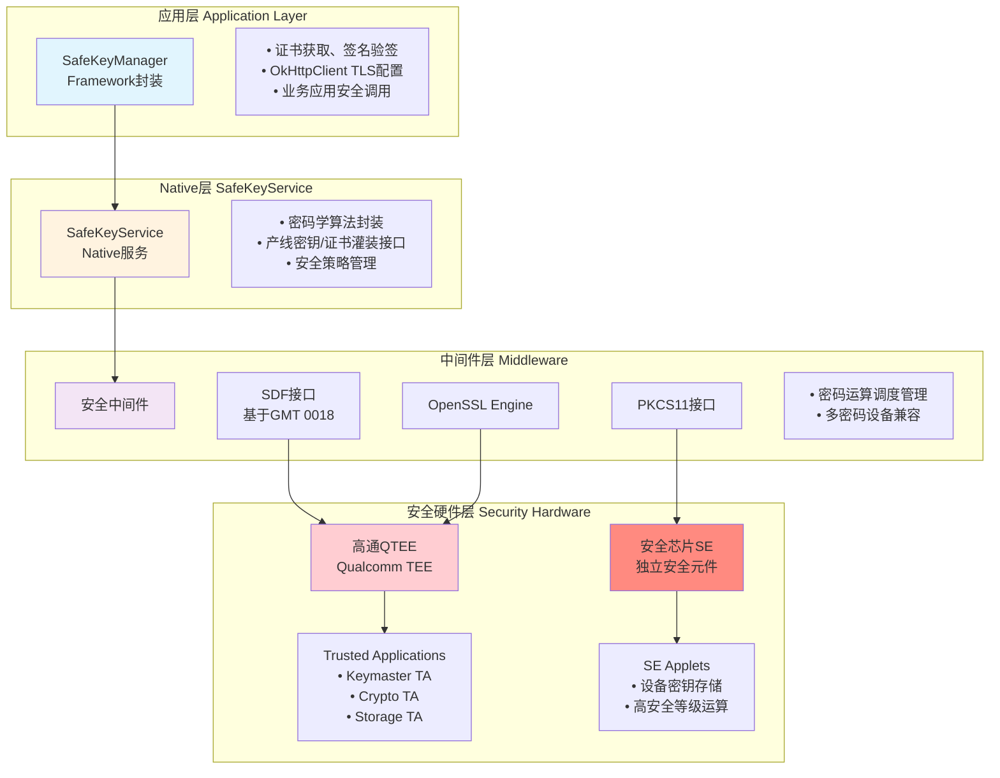
```mermaid
graph TB
    subgraph "应用层 Application Layer"
        APP["SafeKeyManager<br/>Framework封装"]
        APP_DESC["• 证书获取、签名验签<br/>• OkHttpClient TLS配置<br/>• 业务应用安全调用"]
    end

    subgraph "Native层 SafeKeyService"
        NATIVE["SafeKeyService<br/>Native服务"]
        NATIVE_DESC["• 密码学算法封装<br/>• 产线密钥/证书灌装接口<br/>• 安全策略管理"]
    end

    subgraph "中间件层 Middleware"
        MW["安全中间件"]
        SDF["SDF接口<br/>基于GMT 0018"]
        OSSL["OpenSSL Engine"]
        PKCS["PKCS11接口"]
        MW_DESC["• 密码运算调度管理<br/>• 多密码设备兼容"]
    end

    subgraph "安全硬件层 Security Hardware"
        QTEE["高通QTEE<br/>Qualcomm TEE"]
        SE["安全芯片SE<br/>独立安全元件"]
        TA["Trusted Applications<br/>• Keymaster TA<br/>• Crypto TA<br/>• Storage TA"]
        APPLET["SE Applets<br/>• 设备密钥存储<br/>• 高安全等级运算"]
    end

    APP --> NATIVE
    NATIVE --> MW
    SDF --> QTEE
    OSSL --> QTEE
    PKCS --> SE
    QTEE --> TA
    SE --> APPLET

    style APP fill:#e1f5fe
    style NATIVE fill:#fff3e0
    style MW fill:#f3e5f5
    style QTEE fill:#ffcdd2
    style SE fill:#ff8a80
```

### 1.2 QTEE架构详解

高通平台采用Qualcomm TEE（QTEE）作为主要TEE实现，基于ARM TrustZone技术。

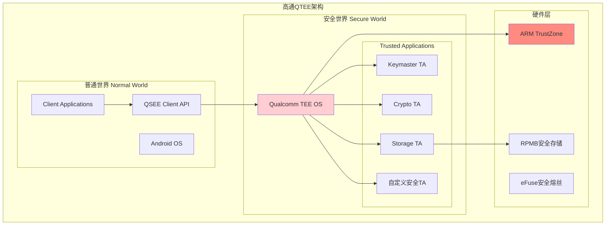
```mermaid
graph TB
    subgraph "高通QTEE架构"
        subgraph "普通世界 Normal World"
            ANDROID["Android OS"]
            CA["Client Applications"]
            QSEE_CLIENT["QSEE Client API"]
        end

        subgraph "安全世界 Secure World"
            QTEE_OS["Qualcomm TEE OS"]
            subgraph "Trusted Applications"
                KEYMASTER["Keymaster TA"]
                CRYPTO_TA["Crypto TA"]
                STORAGE_TA["Storage TA"]
                CUSTOM_TA["自定义安全TA"]
            end
        end

        subgraph "硬件层"
            TRUSTZONE["ARM TrustZone"]
            RPMB["RPMB安全存储"]
            EFUSE["eFuse安全熔丝"]
        end
    end

    CA --> QSEE_CLIENT
    QSEE_CLIENT --> QTEE_OS
    QTEE_OS --> KEYMASTER
    QTEE_OS --> CRYPTO_TA
    QTEE_OS --> STORAGE_TA
    QTEE_OS --> CUSTOM_TA
    QTEE_OS --> TRUSTZONE
    STORAGE_TA --> RPMB

    style QTEE_OS fill:#ffcdd2
    style TRUSTZONE fill:#ff8a80
```

### 1.3 安全芯片SE架构

高通平台配备独立的安全芯片SE，提供额外的硬件级安全保护和冗余能力。

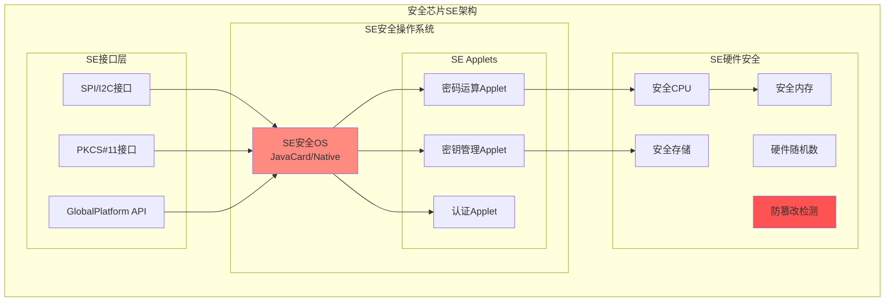
```mermaid
graph TB
    subgraph "安全芯片SE架构"
        subgraph "SE接口层"
            SPI["SPI/I2C接口"]
            PKCS11["PKCS#11接口"]
            GP_API["GlobalPlatform API"]
        end

        subgraph "SE安全操作系统"
            SE_OS["SE安全OS<br/>JavaCard/Native"]
            subgraph "SE Applets"
                KEY_APPLET["密钥管理Applet"]
                CRYPTO_APPLET["密码运算Applet"]
                AUTH_APPLET["认证Applet"]
            end
        end

        subgraph "SE硬件安全"
            SE_CPU["安全CPU"]
            SE_MEM["安全内存"]
            SE_STORAGE["安全存储"]
            SE_RNG["硬件随机数"]
            SE_TAMPER["防篡改检测"]
        end
    end

    SPI --> SE_OS
    PKCS11 --> SE_OS
    GP_API --> SE_OS
    SE_OS --> KEY_APPLET
    SE_OS --> CRYPTO_APPLET
    SE_OS --> AUTH_APPLET
    KEY_APPLET --> SE_STORAGE
    CRYPTO_APPLET --> SE_CPU
    SE_CPU --> SE_MEM

    style SE_OS fill:#ff8a80
    style SE_TAMPER fill:#ff5252
```

---

## 二、现有安全能力评估

### 2.1 高通平台安全能力矩阵

| 能力维度 | 当前状态 | 安全等级 | 说明 |
|---------|---------|---------|------|
| 密钥存储 | QTEE + SE双重存储 | 最高 | 双硬件隔离保护 |
| 密码运算 | QTEE/SE内执行 | 最高 | 密钥不出安全边界 |
| 身份认证 | 授权管理 + 防暴力破解 | 高 | 有完善防护 |
| 冗余备份 | **SE可作备份** | 高 | 双模块互备 |
| 故障转移 | **QTEE↔SE互备** | 高 | 有降级机制 |
| 安全仲裁 | 可实现分级策略 | 高 | 双锚点支持 |
| 密钥恢复 | SE备份 + 分片恢复 | 高 | 恢复能力强 |
| 物理防护 | SE独立防护 | 最高 | 抗物理攻击 |

### 2.2 高通平台安全特性

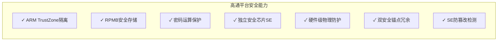
```mermaid
graph LR
    subgraph "高通平台安全能力"
        Q1["✓ ARM TrustZone隔离"]
        Q2["✓ RPMB安全存储"]
        Q3["✓ 密码运算保护"]
        Q4["✓ 独立安全芯片SE"]
        Q5["✓ 硬件级物理防护"]
        Q6["✓ 双安全锚点冗余"]
        Q7["✓ SE防篡改检测"]
    end
```

### 2.3 双平台安全能力对比

| 特性维度 | 高通平台（QTEE + SE） | 优势说明 |
|---------|----------------------|---------|
| **TEE类型** | Qualcomm QTEE (TrustZone) | 高通优化 |
| **安全芯片** | 独立SE安全芯片 | 额外安全层 |
| **安全锚点** | 双重（QTEE + SE） | 冗余备份 |
| **密钥存储** | RPMB + SE安全存储 | 双重保护 |
| **抗物理攻击** | 高（SE独立防护） | 硬件防护 |
| **密钥备份能力** | 强（SE可作为备份） | 易恢复 |
| **故障冗余** | 有（双模块互备） | 高可用 |

### 2.4 高通平台密钥管理架构

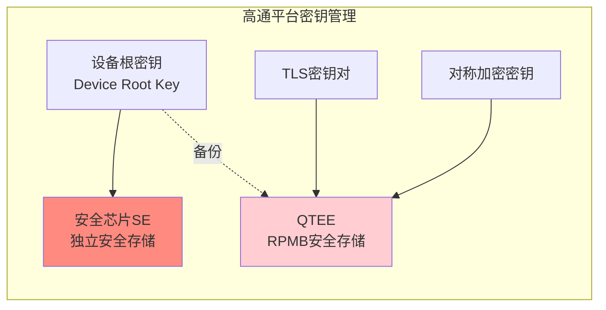
```mermaid
flowchart TB
    subgraph "高通平台密钥管理"
        direction TB
        QC_ROOT["设备根密钥<br/>Device Root Key"]
        QC_TLS["TLS密钥对"]
        QC_SYM["对称加密密钥"]
        QC_QTEE_STORE["QTEE<br/>RPMB安全存储"]
        QC_SE_STORE["安全芯片SE<br/>独立安全存储"]
        
        QC_ROOT --> QC_SE_STORE
        QC_TLS --> QC_QTEE_STORE
        QC_SYM --> QC_QTEE_STORE
        QC_ROOT -.->|备份| QC_QTEE_STORE
    end

    style QC_QTEE_STORE fill:#ffcdd2
    style QC_SE_STORE fill:#ff8a80
```

---

## 三、双安全模块协作机制

### 3.1 QTEE与SE协作架构

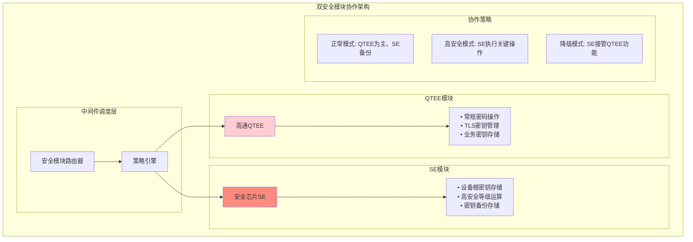
```mermaid
graph TB
    subgraph "双安全模块协作架构"
        subgraph "中间件调度层"
            ROUTER["安全模块路由器"]
            POLICY["策略引擎"]
        end

        subgraph "QTEE模块"
            QTEE["高通QTEE"]
            QTEE_FUNC["• 常规密码操作<br/>• TLS密钥管理<br/>• 业务密钥存储"]
        end

        subgraph "SE模块"
            SE["安全芯片SE"]
            SE_FUNC["• 设备根密钥存储<br/>• 高安全等级运算<br/>• 密钥备份存储"]
        end

        subgraph "协作策略"
            STRAT1["正常模式: QTEE为主，SE备份"]
            STRAT2["高安全模式: SE执行关键操作"]
            STRAT3["降级模式: SE接管QTEE功能"]
        end
    end

    ROUTER --> POLICY
    POLICY --> QTEE
    POLICY --> SE
    QTEE --> QTEE_FUNC
    SE --> SE_FUNC

    style QTEE fill:#ffcdd2
    style SE fill:#ff8a80
```

### 3.2 双安全模块协作流程

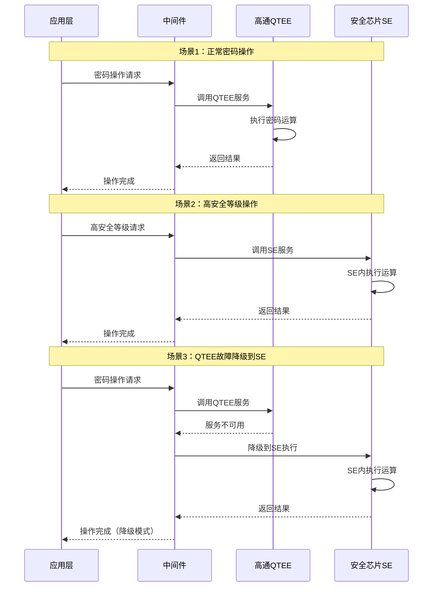
```mermaid
sequenceDiagram
    participant APP as 应用层
    participant MW as 中间件
    participant QTEE as 高通QTEE
    participant SE as 安全芯片SE

    Note over APP,SE: 场景1：正常密码操作
    APP->>MW: 密码操作请求
    MW->>QTEE: 调用QTEE服务
    QTEE->>QTEE: 执行密码运算
    QTEE-->>MW: 返回结果
    MW-->>APP: 操作完成

    Note over APP,SE: 场景2：高安全等级操作
    APP->>MW: 高安全等级请求
    MW->>SE: 调用SE服务
    SE->>SE: SE内执行运算
    SE-->>MW: 返回结果
    MW-->>APP: 操作完成

    Note over APP,SE: 场景3：QTEE故障降级到SE
    APP->>MW: 密码操作请求
    MW->>QTEE: 调用QTEE服务
    QTEE-->>MW: 服务不可用
    MW->>SE: 降级到SE执行
    SE->>SE: SE内执行运算
    SE-->>MW: 返回结果
    MW-->>APP: 操作完成（降级模式）
```

### 3.3 密钥分布策略

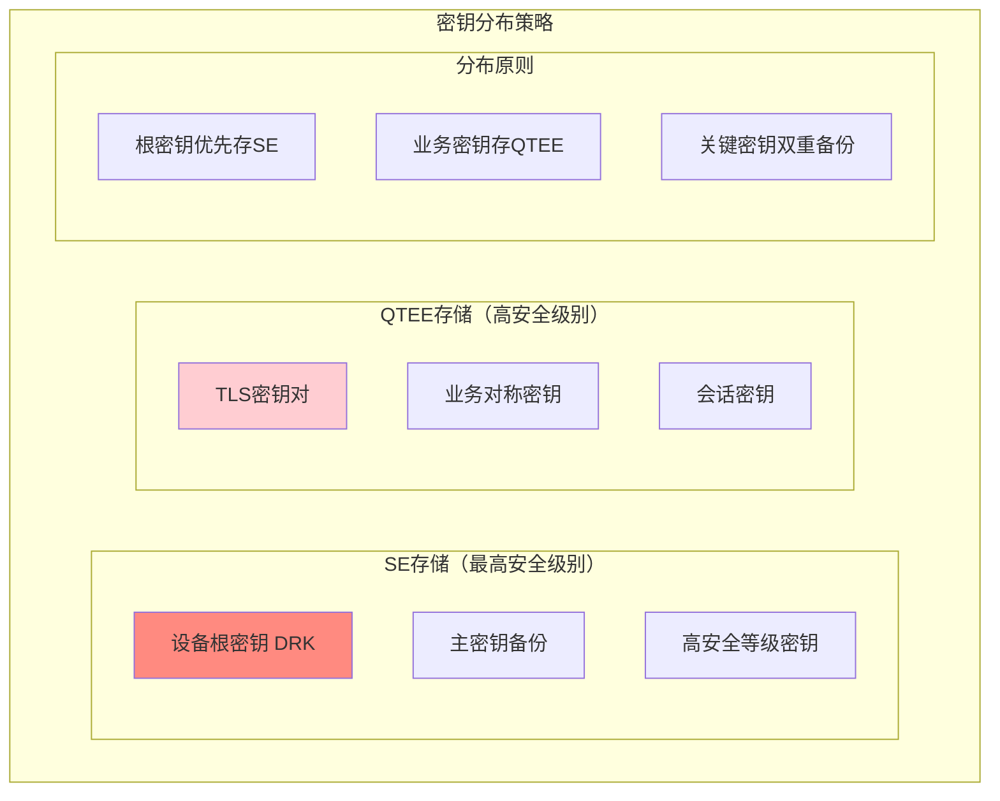
```mermaid
flowchart TB
    subgraph "密钥分布策略"
        subgraph "SE存储（最高安全级别）"
            SE_KEY1["设备根密钥 DRK"]
            SE_KEY2["主密钥备份"]
            SE_KEY3["高安全等级密钥"]
        end

        subgraph "QTEE存储（高安全级别）"
            QTEE_KEY1["TLS密钥对"]
            QTEE_KEY2["业务对称密钥"]
            QTEE_KEY3["会话密钥"]
        end

        subgraph "分布原则"
            RULE1["根密钥优先存SE"]
            RULE2["业务密钥存QTEE"]
            RULE3["关键密钥双重备份"]
        end
    end

    style SE_KEY1 fill:#ff8a80
    style QTEE_KEY1 fill:#ffcdd2
```

---

## 四、故障风险识别与解决方案

### 4.1 高通平台风险场景

由于高通平台具有QTEE和SE双安全锚点，单一模块故障不会导致系统完全失效。

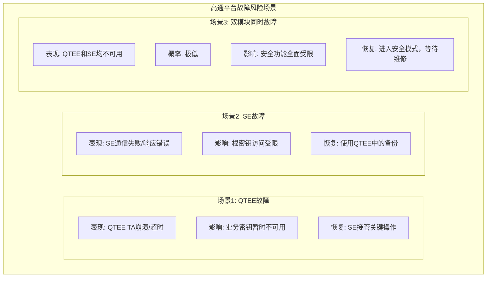
```mermaid
graph TB
    subgraph "高通平台故障风险场景"
        subgraph "场景1: QTEE故障"
            S1_PERF["表现: QTEE TA崩溃/超时"]
            S1_IMPACT["影响: 业务密钥暂时不可用"]
            S1_RECOVER["恢复: SE接管关键操作"]
        end

        subgraph "场景2: SE故障"
            S2_PERF["表现: SE通信失败/响应错误"]
            S2_IMPACT["影响: 根密钥访问受限"]
            S2_RECOVER["恢复: 使用QTEE中的备份"]
        end

        subgraph "场景3: 双模块同时故障"
            S3_PERF["表现: QTEE和SE均不可用"]
            S3_PROB["概率: 极低"]
            S3_IMPACT["影响: 安全功能全面受限"]
            S3_RECOVER["恢复: 进入安全模式，等待维修"]
        end
    end
```

### 4.2 故障风险解决方案

针对高通平台（QTEE + SE双安全锚点架构）的各类故障风险场景，提出以下针对性解决方案：

#### 4.2.1 QTEE故障解决方案

| 故障类型 | 解决方案 | 实施细节 |
|---------|---------|---------|
| **TA崩溃/超时** | SE接管执行 | 中间件自动检测QTEE响应超时，切换路由到SE执行关键密码操作 |
| **QTEE服务异常** | 热重启+SE降级 | 尝试重启QTEE服务，期间由SE承担密码运算任务 |
| **密钥读取失败** | 使用SE备份密钥 | 根密钥优先存储在SE，QTEE故障时直接使用SE中的密钥 |
| **RPMB损坏** | SE密钥恢复 | 从SE安全存储中恢复业务密钥，或触发云端分片恢复流程 |

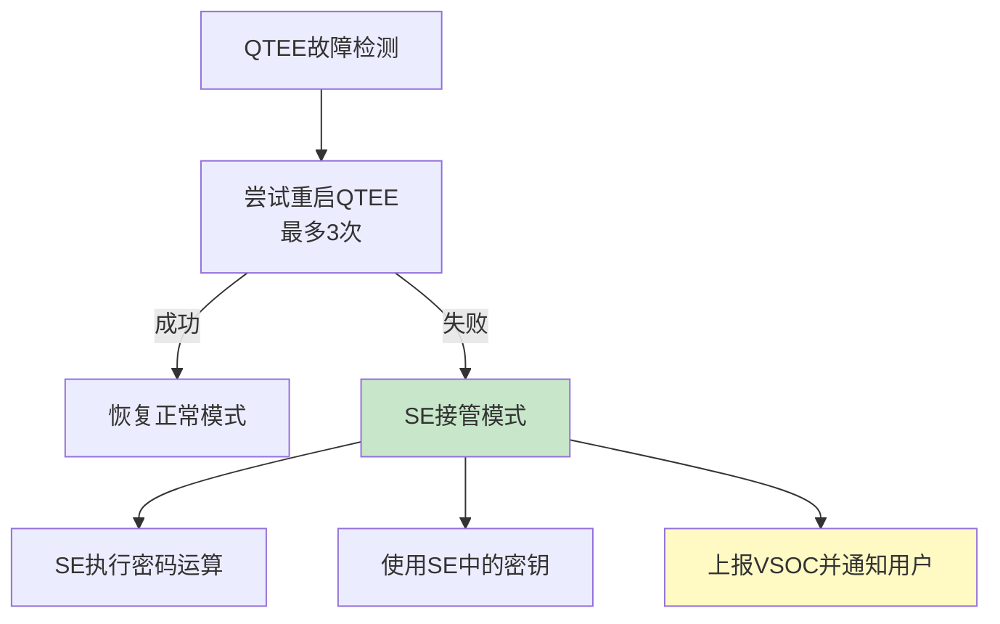
```mermaid
flowchart TD
    QTEE_FAULT["QTEE故障检测"]
    QTEE_FAULT --> RETRY["尝试重启QTEE<br/>最多3次"]
    RETRY -->|成功| NORMAL["恢复正常模式"]
    RETRY -->|失败| SE_TAKEOVER["SE接管模式"]
    SE_TAKEOVER --> SE_CRYPTO["SE执行密码运算"]
    SE_TAKEOVER --> SE_KEY["使用SE中的密钥"]
    SE_TAKEOVER --> NOTIFY["上报VSOC并通知用户"]
    
    style SE_TAKEOVER fill:#c8e6c9
    style NOTIFY fill:#fff9c4
```

#### 4.2.2 SE故障解决方案

| 故障类型 | 解决方案 | 实施细节 |
|---------|---------|---------|
| **通信失败** | QTEE继续运行 | QTEE独立运行，使用QTEE中的备份密钥继续提供服务 |
| **响应错误** | 重试+降级 | 重试SE操作，失败后降级使用QTEE备份的加密密钥 |
| **SE完全失效** | QTEE接管+维修通知 | QTEE接管所有操作，同时通知用户进行SE维修 |
| **根密钥不可访问** | 云端分片恢复 | 从云端收集密钥分片，在QTEE中重建根密钥 |

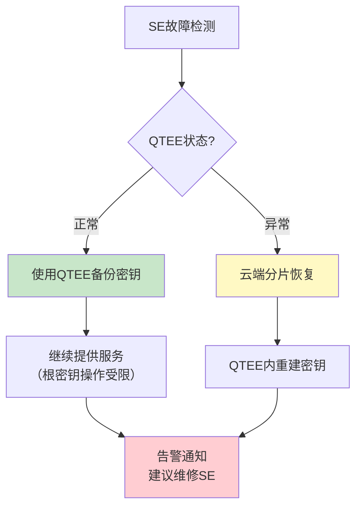
```mermaid
flowchart TD
    SE_FAULT["SE故障检测"]
    SE_FAULT --> CHECK_QTEE{"QTEE状态?"}
    CHECK_QTEE -->|正常| QTEE_BACKUP["使用QTEE备份密钥"]
    CHECK_QTEE -->|异常| CLOUD_RECOVER["云端分片恢复"]
    
    QTEE_BACKUP --> CONTINUE["继续提供服务<br/>（根密钥操作受限）"]
    CLOUD_RECOVER --> REBUILD["QTEE内重建密钥"]
    
    CONTINUE --> ALERT["告警通知<br/>建议维修SE"]
    REBUILD --> ALERT
    
    style QTEE_BACKUP fill:#c8e6c9
    style CLOUD_RECOVER fill:#fff9c4
    style ALERT fill:#ffcdd2
```

#### 4.2.3 双模块同时故障解决方案

| 场景 | 解决方案 | 实施细节 |
|-----|---------|---------|
| **极端双故障** | 安全模式+等待维修 | 进入安全模式，禁用网联功能，保留基本车辆控制 |
| **临时性双故障** | 软件备份+严格限制 | 仅允许低安全级别的软件加密操作，拒绝关键操作 |
| **持续性双故障** | 强制返厂维修 | 显示警告信息，引导用户前往4S店进行维修 |

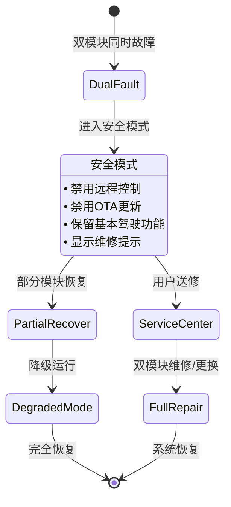
```mermaid
stateDiagram-v2
    [*] --> DualFault: 双模块同时故障
    
    DualFault --> SafeMode: 进入安全模式
    SafeMode: 安全模式
    SafeMode: • 禁用远程控制
    SafeMode: • 禁用OTA更新
    SafeMode: • 保留基本驾驶功能
    SafeMode: • 显示维修提示
    
    SafeMode --> PartialRecover: 部分模块恢复
    PartialRecover --> DegradedMode: 降级运行
    DegradedMode --> [*]: 完全恢复
    
    SafeMode --> ServiceCenter: 用户送修
    ServiceCenter --> FullRepair: 双模块维修/更换
    FullRepair --> [*]: 系统恢复
```

### 4.3 故障影响与冗余分析

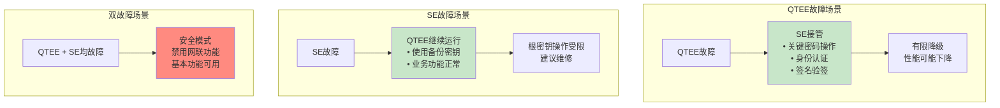
```mermaid
flowchart TD
    subgraph "QTEE故障场景"
        QTEE_FAIL["QTEE故障"]
        QTEE_FAIL --> SE_BACKUP["SE接管<br/>• 关键密码操作<br/>• 身份认证<br/>• 签名验签"]
        SE_BACKUP --> LIMITED1["有限降级<br/>性能可能下降"]
    end

    subgraph "SE故障场景"
        SE_FAIL["SE故障"]
        SE_FAIL --> QTEE_BACKUP["QTEE继续运行<br/>• 使用备份密钥<br/>• 业务功能正常"]
        QTEE_BACKUP --> LIMITED2["根密钥操作受限<br/>建议维修"]
    end

    subgraph "双故障场景"
        BOTH_FAIL["QTEE + SE均故障"]
        BOTH_FAIL --> SAFE_MODE["安全模式<br/>禁用网联功能<br/>基本功能可用"]
    end

    style SE_BACKUP fill:#c8e6c9
    style QTEE_BACKUP fill:#c8e6c9
    style SAFE_MODE fill:#ff8a80
```

---

## 五、防护类安全增强方案

### 5.1 高通平台防护架构

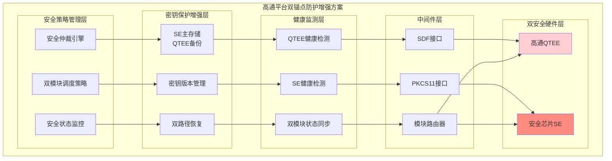
```mermaid
graph TB
    subgraph "高通平台双锚点防护增强方案"
        subgraph "安全策略管理层"
            POL1["安全仲裁引擎"]
            POL2["双模块调度策略"]
            POL3["安全状态监控"]
        end

        subgraph "密钥保护增强层"
            KEY1["SE主存储<br/>QTEE备份"]
            KEY2["密钥版本管理"]
            KEY3["双路径恢复"]
        end

        subgraph "健康监测层"
            MON1["QTEE健康检测"]
            MON2["SE健康检测"]
            MON3["双模块状态同步"]
        end

        subgraph "中间件层"
            MW1["SDF接口"]
            MW2["PKCS11接口"]
            MW3["模块路由器"]
        end

        subgraph "双安全硬件层"
            QTEE["高通QTEE"]
            SE["安全芯片SE"]
        end
    end

    POL1 --> KEY1
    POL2 --> KEY2
    POL3 --> KEY3
    KEY1 --> MON1
    KEY2 --> MON2
    KEY3 --> MON3
    MON1 --> MW1
    MON2 --> MW2
    MON3 --> MW3
    MW1 --> QTEE
    MW2 --> SE
    MW3 --> QTEE
    MW3 --> SE

    style QTEE fill:#ffcdd2
    style SE fill:#ff8a80
```

### 5.2 分层防护策略

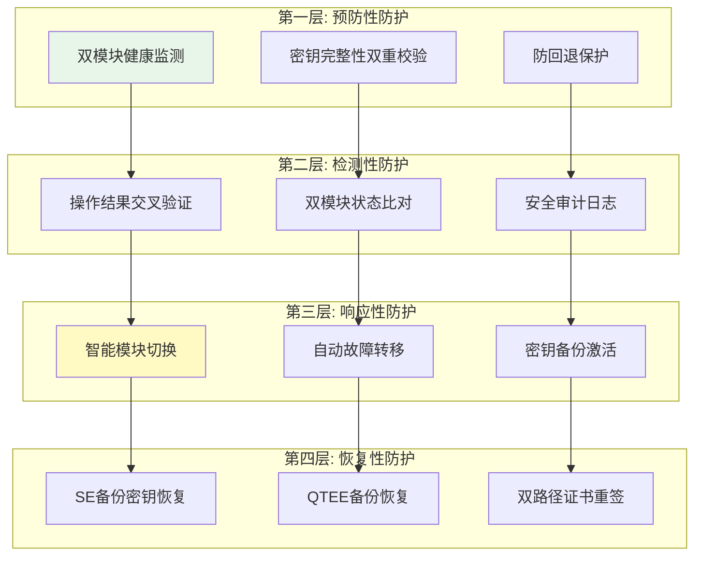
```mermaid
graph TB
    subgraph "第一层: 预防性防护"
        L1_1["双模块健康监测"]
        L1_2["密钥完整性双重校验"]
        L1_3["防回退保护"]
    end

    subgraph "第二层: 检测性防护"
        L2_1["操作结果交叉验证"]
        L2_2["双模块状态比对"]
        L2_3["安全审计日志"]
    end

    subgraph "第三层: 响应性防护"
        L3_1["智能模块切换"]
        L3_2["自动故障转移"]
        L3_3["密钥备份激活"]
    end

    subgraph "第四层: 恢复性防护"
        L4_1["SE备份密钥恢复"]
        L4_2["QTEE备份恢复"]
        L4_3["双路径证书重签"]
    end

    L1_1 --> L2_1 --> L3_1 --> L4_1
    L1_2 --> L2_2 --> L3_2 --> L4_2
    L1_3 --> L2_3 --> L3_3 --> L4_3

    style L1_1 fill:#e8f5e9
    style L3_1 fill:#fff9c4
```

---

## 六、密钥备份与恢复机制

### 6.1 高通平台密钥备份策略

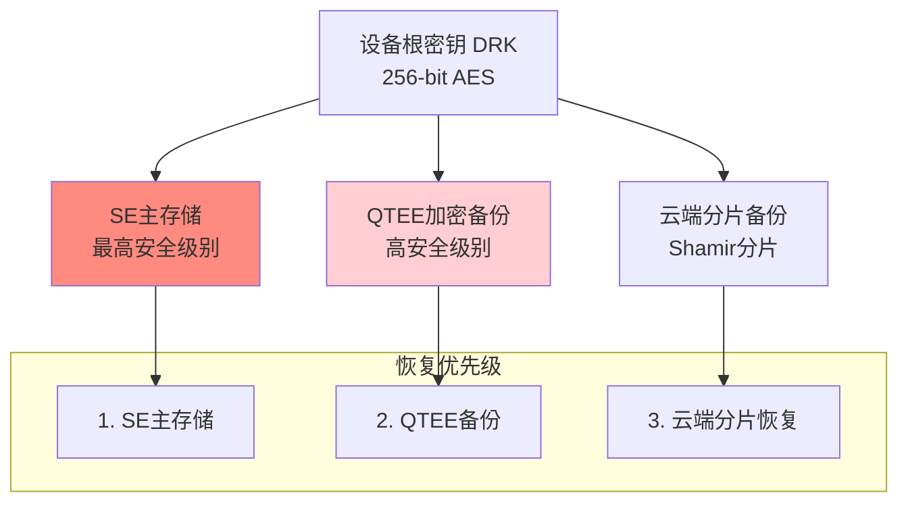
```mermaid
flowchart TD
    DRK["设备根密钥 DRK<br/>256-bit AES"]
    
    DRK --> SE_PRIMARY["SE主存储<br/>最高安全级别"]
    DRK --> QTEE_BACKUP["QTEE加密备份<br/>高安全级别"]
    DRK --> CLOUD_SHARD["云端分片备份<br/>Shamir分片"]

    subgraph "恢复优先级"
        R1["1. SE主存储"]
        R2["2. QTEE备份"]
        R3["3. 云端分片恢复"]
    end

    SE_PRIMARY --> R1
    QTEE_BACKUP --> R2
    CLOUD_SHARD --> R3

    style SE_PRIMARY fill:#ff8a80
    style QTEE_BACKUP fill:#ffcdd2
```

### 6.2 双模块密钥恢复流程

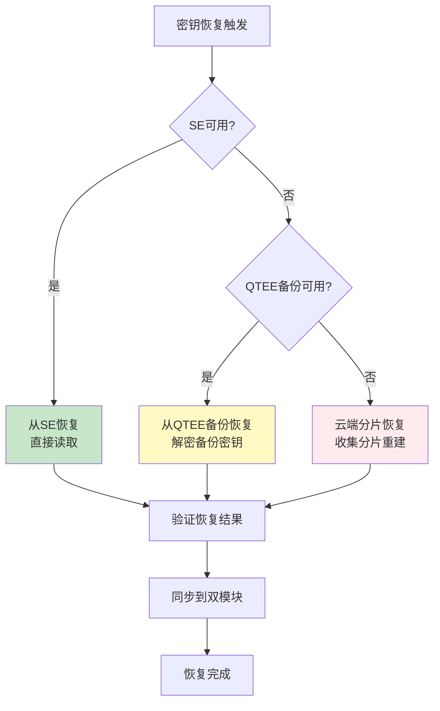
```mermaid
flowchart TD
    TRIGGER["密钥恢复触发"]
    
    TRIGGER --> CHECK_SE{"SE可用?"}
    
    CHECK_SE -->|是| SE_RECOVER["从SE恢复<br/>直接读取"]
    CHECK_SE -->|否| CHECK_QTEE{"QTEE备份可用?"}
    
    CHECK_QTEE -->|是| QTEE_RECOVER["从QTEE备份恢复<br/>解密备份密钥"]
    CHECK_QTEE -->|否| CLOUD_RECOVER["云端分片恢复<br/>收集分片重建"]
    
    SE_RECOVER --> VERIFY["验证恢复结果"]
    QTEE_RECOVER --> VERIFY
    CLOUD_RECOVER --> VERIFY
    
    VERIFY --> SYNC["同步到双模块"]
    SYNC --> COMPLETE["恢复完成"]

    style SE_RECOVER fill:#c8e6c9
    style QTEE_RECOVER fill:#fff9c4
    style CLOUD_RECOVER fill:#ffebee
```

---

## 七、Keystore功能集成方案

### 7.1 方案选择：直接使用Android Keystore

经过对比分析，**高通平台建议直接使用Android Keystore API，无需额外集成SafeKey封装层**。理由如下：

#### 7.1.1 Keystore与SafeKey方案对比

| 对比维度 | 直接使用Android Keystore | 集成SafeKey封装 |
|---------|------------------------|----------------|
| **接口标准化** | ✅ 标准JCA/JCE接口，跨平台兼容 | ⚠️ 自定义接口，需要额外学习成本 |
| **硬件支持** | ✅ 直接调用QTEE/SE的Keymaster TA | ⚠️ 通过SDF/PKCS11间接调用 |
| **密钥证明** | ✅ 原生支持Key Attestation | ❌ 需要额外开发 |
| **用户认证绑定** | ✅ 支持生物识别/PIN绑定 | ⚠️ 需要额外集成 |
| **系统维护成本** | ✅ Android系统自动更新 | ❌ 需要自行维护 |
| **开发复杂度** | ✅ 低，直接使用标准API | ⚠️ 高，需要维护中间层 |
| **安全审计** | ✅ 经过Google安全审计 | ⚠️ 需要自行审计 |
| **性能开销** | ✅ 直接调用，无额外开销 | ⚠️ 多一层封装，略有开销 |

#### 7.1.2 不集成SafeKey的理由

1. **功能重叠**：Android Keystore已提供完整的密钥管理能力，SafeKey的核心功能（密钥存储、密码运算）与Keystore高度重叠
2. **架构简化**：减少中间层可降低系统复杂度和潜在故障点
3. **标准化优势**：使用标准API便于第三方应用集成和安全审计
4. **硬件直连**：Keystore直接调用QTEE/SE的Keymaster TA，性能更优
5. **安全更新**：依赖Android系统安全更新，无需自行维护安全补丁

#### 7.1.3 推荐架构

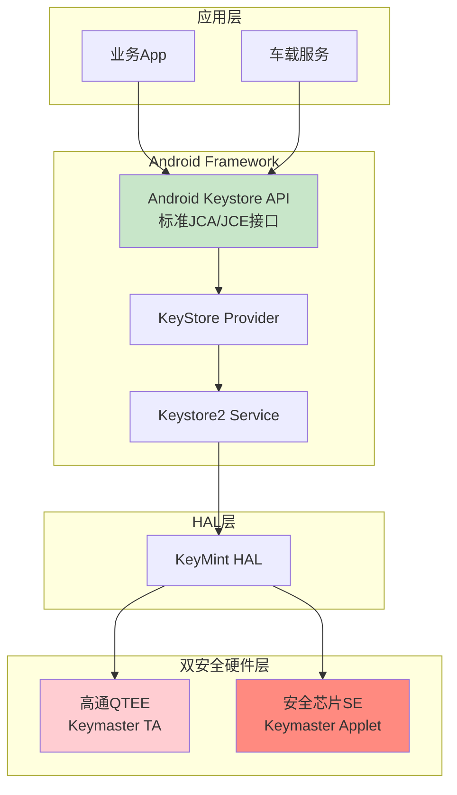
```mermaid
graph TB
    subgraph "应用层"
        APP1["业务App"]
        APP2["车载服务"]
    end

    subgraph "Android Framework"
        KS_API["Android Keystore API<br/>标准JCA/JCE接口"]
        KSP["KeyStore Provider"]
        KS2["Keystore2 Service"]
    end

    subgraph "HAL层"
        KM_HAL["KeyMint HAL"]
    end

    subgraph "双安全硬件层"
        QTEE["高通QTEE<br/>Keymaster TA"]
        SE["安全芯片SE<br/>Keymaster Applet"]
    end

    APP1 --> KS_API
    APP2 --> KS_API
    KS_API --> KSP
    KSP --> KS2
    KS2 --> KM_HAL
    KM_HAL --> QTEE
    KM_HAL --> SE

    style KS_API fill:#c8e6c9
    style QTEE fill:#ffcdd2
    style SE fill:#ff8a80
```

### 7.2 Keystore使用最佳实践

#### 7.2.1 密钥生成示例

```java
// 使用Android Keystore生成硬件保护的密钥
KeyPairGenerator keyPairGenerator = KeyPairGenerator.getInstance(
    KeyProperties.KEY_ALGORITHM_EC,
    "AndroidKeyStore"
);

KeyGenParameterSpec spec = new KeyGenParameterSpec.Builder(
    "vehicle_auth_key",
    KeyProperties.PURPOSE_SIGN | KeyProperties.PURPOSE_VERIFY
)
    .setDigests(KeyProperties.DIGEST_SHA256)
    .setUserAuthenticationRequired(true)
    .setUserAuthenticationParameters(0, KeyProperties.AUTH_BIOMETRIC_STRONG)
    // 优先使用StrongBox(SE)，不可用时降级到TEE
    .setIsStrongBoxBacked(true)
    .setAttestationChallenge(serverChallenge)  // 启用密钥证明
    .build();

keyPairGenerator.initialize(spec);
KeyPair keyPair = keyPairGenerator.generateKeyPair();

// 获取证明证书链，发送给服务器验证
Certificate[] certChain = keyStore.getCertificateChain("vehicle_auth_key");
```

#### 7.2.2 密钥安全级别选择

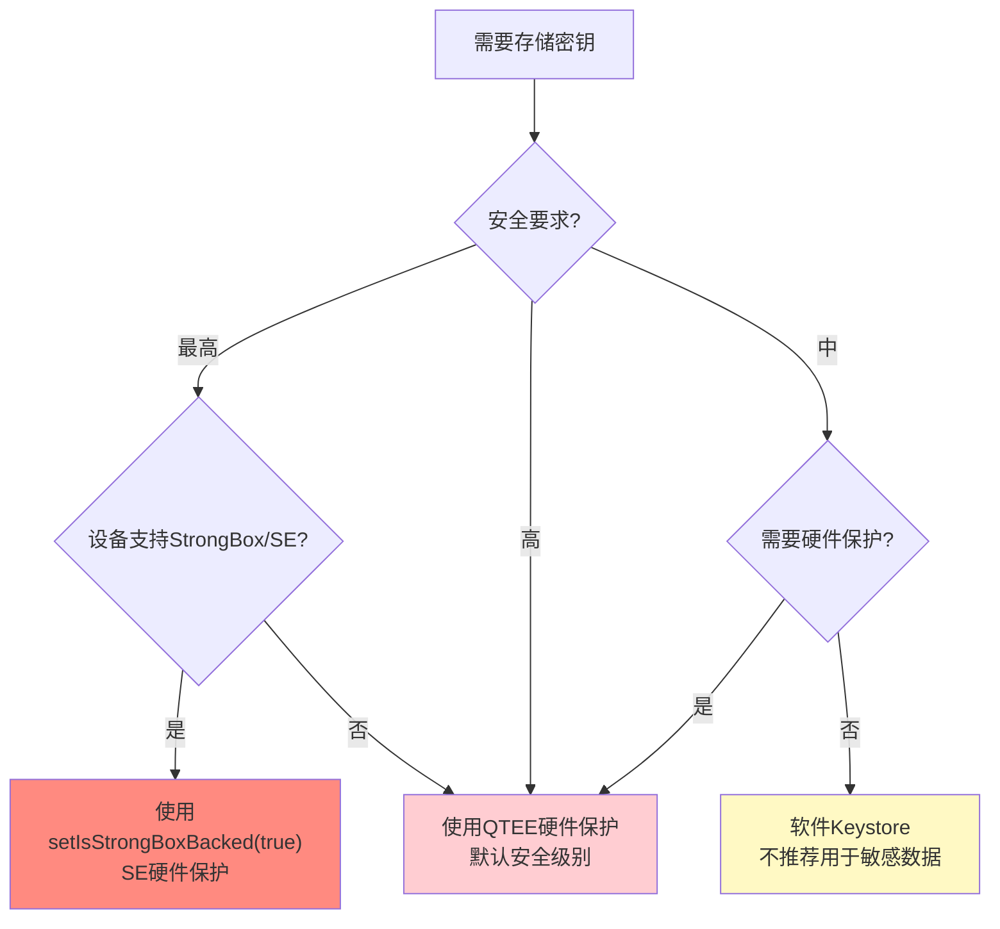
```mermaid
flowchart TD
    START["需要存储密钥"] --> Q1{"安全要求?"}
    
    Q1 -->|最高| Q2{"设备支持StrongBox/SE?"}
    Q2 -->|是| SE["使用setIsStrongBoxBacked(true)<br/>SE硬件保护"]
    Q2 -->|否| TEE["使用QTEE硬件保护<br/>默认安全级别"]
    
    Q1 -->|高| TEE
    
    Q1 -->|中| Q3{"需要硬件保护?"}
    Q3 -->|是| TEE
    Q3 -->|否| SW["软件Keystore<br/>不推荐用于敏感数据"]
    
    style SE fill:#ff8a80
    style TEE fill:#ffcdd2
    style SW fill:#fff9c4
```

### 7.3 密钥路由策略

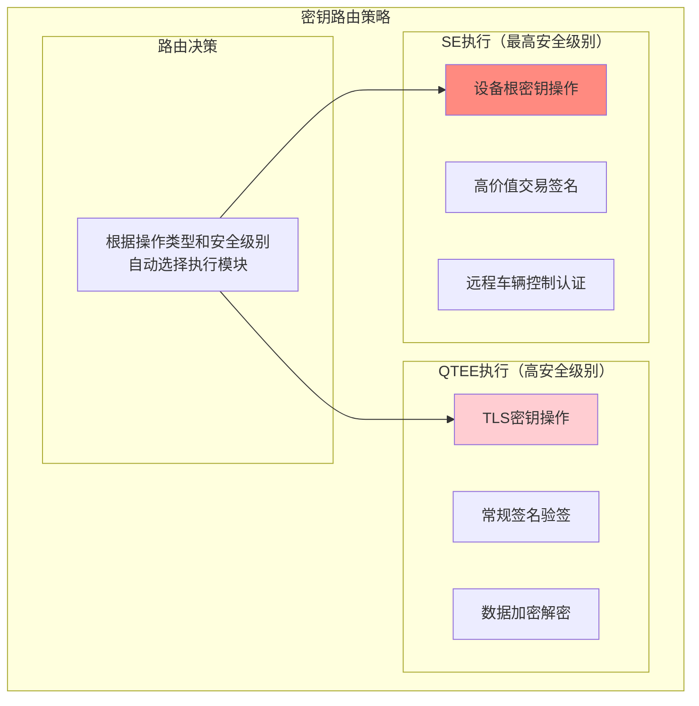
```mermaid
graph TB
    subgraph "密钥路由策略"
        subgraph "SE执行（最高安全级别）"
            SE_OP1["设备根密钥操作"]
            SE_OP2["高价值交易签名"]
            SE_OP3["远程车辆控制认证"]
        end

        subgraph "QTEE执行（高安全级别）"
            QTEE_OP1["TLS密钥操作"]
            QTEE_OP2["常规签名验签"]
            QTEE_OP3["数据加密解密"]
        end

        subgraph "路由决策"
            ROUTER["根据操作类型和安全级别<br/>自动选择执行模块"]
        end
    end

    ROUTER --> SE_OP1
    ROUTER --> QTEE_OP1

    style SE_OP1 fill:#ff8a80
    style QTEE_OP1 fill:#ffcdd2
```

---

## 八、安全仲裁架构设计

### 8.1 高通平台安全仲裁决策流程

```mermaid
flowchart TD
    REQ["密码操作请求"]
    
    REQ --> LEVEL["确定安全级别"]
    LEVEL --> CHECK_QTEE{"QTEE状态?"}
    
    CHECK_QTEE -->|正常| CHECK_LEVEL{"安全级别?"}
    CHECK_QTEE -->|异常| CHECK_SE{"SE状态?"}
    
    CHECK_LEVEL -->|CRITICAL| SE_EXEC["SE执行"]
    CHECK_LEVEL -->|HIGH/MEDIUM/LOW| QTEE_EXEC["QTEE执行"]
    
    CHECK_SE -->|正常| SE_FALLBACK["SE降级执行"]
    CHECK_SE -->|异常| DENY["拒绝操作<br/>双模块均异常"]
    
    SE_EXEC --> AUDIT["记录审计日志"]
    QTEE_EXEC --> AUDIT
    SE_FALLBACK --> AUDIT
    DENY --> AUDIT

    style SE_EXEC fill:#ff8a80
    style QTEE_EXEC fill:#ffcdd2
    style SE_FALLBACK fill:#fff9c4
    style DENY fill:#ff5252
```

### 8.2 双模块降级策略

```mermaid
stateDiagram-v2
    [*] --> FullSecurity: 系统启动

    FullSecurity: 正常模式
    FullSecurity: • QTEE处理常规操作
    FullSecurity: • SE处理关键操作
    FullSecurity: • 完整功能可用

    QTEEDegraded: QTEE降级模式
    QTEEDegraded: • SE接管所有操作
    QTEEDegraded: • 性能可能下降
    QTEEDegraded: • 功能完整

    SEDegraded: SE降级模式
    SEDegraded: • QTEE处理所有操作
    SEDegraded: • 使用备份密钥
    SEDegraded: • 根密钥操作受限

    BothDegraded: 双降级模式
    BothDegraded: • 仅软件备份可用
    BothDegraded: • 关键操作拒绝
    BothDegraded: • 建议维修

    FullSecurity --> QTEEDegraded: QTEE故障
    FullSecurity --> SEDegraded: SE故障
    QTEEDegraded --> BothDegraded: SE也故障
    SEDegraded --> BothDegraded: QTEE也故障
    
    QTEEDegraded --> FullSecurity: QTEE恢复
    SEDegraded --> FullSecurity: SE恢复
    BothDegraded --> QTEEDegraded: SE恢复
    BothDegraded --> SEDegraded: QTEE恢复
```

---

## 九、故障检测与降级策略

### 9.1 双模块健康监测

```mermaid
graph TB
    subgraph "双模块健康监测架构"
        subgraph "QTEE监测"
            QTEE_HB["心跳检测 5s"]
            QTEE_FUNC["功能自检 60s"]
            QTEE_PERF["性能监控 实时"]
        end

        subgraph "SE监测"
            SE_HB["心跳检测 10s"]
            SE_FUNC["功能自检 120s"]
            SE_COMM["通信检测 实时"]
        end

        subgraph "状态判定"
            BOTH_OK["双模块正常"]
            QTEE_FAIL["QTEE异常"]
            SE_FAIL["SE异常"]
            BOTH_FAIL["双模块异常"]
        end
    end

    QTEE_HB --> BOTH_OK
    SE_HB --> BOTH_OK
    QTEE_HB --> QTEE_FAIL
    SE_HB --> SE_FAIL
    QTEE_FAIL --> BOTH_FAIL
    SE_FAIL --> BOTH_FAIL

    style BOTH_OK fill:#c8e6c9
    style QTEE_FAIL fill:#fff9c4
    style SE_FAIL fill:#fff9c4
    style BOTH_FAIL fill:#ff8a80
```

---

## 十、安全监控与审计增强

### 10.1 双模块安全日志架构

```mermaid
graph TB
    subgraph "双模块安全日志架构"
        subgraph "日志收集"
            QTEE_LOG["QTEE操作日志"]
            SE_LOG["SE操作日志"]
            ROUTER_LOG["路由决策日志"]
        end

        subgraph "日志聚合"
            AGG["SecurityLogAggregator"]
            AGG_SIGN["双模块交叉签名"]
        end

        subgraph "存储与上报"
            LOCAL["本地安全存储"]
            CLOUD["云端VSOC上报"]
        end
    end

    QTEE_LOG --> AGG
    SE_LOG --> AGG
    ROUTER_LOG --> AGG
    AGG --> AGG_SIGN
    AGG_SIGN --> LOCAL
    AGG_SIGN --> CLOUD
```

---

## 十一、实施建议

### 11.1 高通平台实施优先级

```mermaid
gantt
    title 高通平台安全增强实施优先级
    dateFormat  YYYY-MM-DD
    section P0 立即实施
    双模块健康监测           :p0_1, 2025-01-01, 25d
    安全审计日志增强         :p0_2, after p0_1, 20d
    section P1 短期实施
    双模块调度策略           :p1_1, after p0_2, 30d
    SE备份机制               :p1_2, after p0_2, 25d
    section P2 中期实施
    自动故障转移             :p2_1, after p1_1, 35d
    Keystore双模块集成       :p2_2, after p1_2, 40d
    section P3 长期优化
    智能路由优化             :p3_1, after p2_1, 30d
    安全合规审计             :p3_2, after p2_2, 30d
```

### 11.2 高通平台优势总结

```mermaid
mindmap
  root((高通平台<br/>安全优势))
    双安全锚点
      QTEE + SE冗余
      单点故障可恢复
      故障自动转移
    密钥保护
      SE存储根密钥
      QTEE备份密钥
      双路径恢复
    物理安全
      SE独立防护
      抗物理攻击
      防篡改检测
    高可用性
      双模块互备
      智能降级
      快速恢复
```

---

## 参考资料

### 标准与法规
- ISO/SAE 21434:2021 - 道路车辆网络安全工程
- UNECE WP.29 R155 - 网络安全管理系统
- GM/T 0018 - 密码设备应用接口规范

### 技术参考
- ARM TrustZone技术白皮书
- Qualcomm QTEE技术文档
- GlobalPlatform SE规范
- Android Keystore系统架构
- PKCS#11密码接口标准

---

*文档版本: 2.0*  
*更新日期: 2025-01-20*  
*适用架构: 高通平台(QTEE + SE)*
