# 车载系统安全性提升方案

基于当前车载系统架构特点，从防护类（兼容备份、仲裁）角度提出针对性安全增强方案。本文档涵盖MTK平台（Trustonic TEE）和高通平台（安全芯片 + QTEE）两种架构。

---

## 目录

1. [现有架构深度分析](#一现有架构深度分析)
2. [平台差异化架构](#二平台差异化架构)
3. [产线灌装流程设计](#三产线灌装流程设计)
4. [TEE单点风险识别](#四tee单点风险识别)
5. [防护类安全增强方案](#五防护类安全增强方案)
6. [密钥备份与恢复机制](#六密钥备份与恢复机制)
7. [Keystore功能集成方案](#七keystore功能集成方案)
8. [安全仲裁架构设计](#八安全仲裁架构设计)
9. [故障检测与降级策略](#九故障检测与降级策略)
10. [安全监控与审计增强](#十安全监控与审计增强)
11. [实施建议](#十一实施建议)

---

## 一、现有架构深度分析

### 1.1 当前系统架构总览

当前车载系统采用分层架构设计，从应用层到安全硬件层形成完整的安全链路。

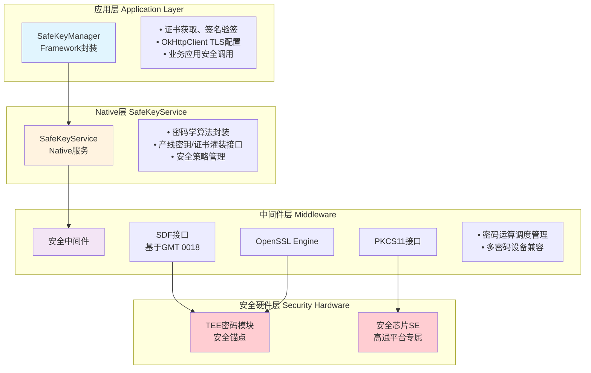
```mermaid
graph TB
    subgraph "应用层 Application Layer"
        APP["SafeKeyManager<br/>Framework封装"]
        APP_DESC["• 证书获取、签名验签<br/>• OkHttpClient TLS配置<br/>• 业务应用安全调用"]
    end

    subgraph "Native层 SafeKeyService"
        NATIVE["SafeKeyService<br/>Native服务"]
        NATIVE_DESC["• 密码学算法封装<br/>• 产线密钥/证书灌装接口<br/>• 安全策略管理"]
    end

    subgraph "中间件层 Middleware"
        MW["安全中间件"]
        SDF["SDF接口<br/>基于GMT 0018"]
        OSSL["OpenSSL Engine"]
        PKCS["PKCS11接口"]
        MW_DESC["• 密码运算调度管理<br/>• 多密码设备兼容"]
    end

    subgraph "安全硬件层 Security Hardware"
        TEE["TEE密码模块<br/>安全锚点"]
        SE["安全芯片SE<br/>高通平台专属"]
    end

    APP --> NATIVE
    NATIVE --> MW
    SDF --> TEE
    OSSL --> TEE
    PKCS --> SE

    style APP fill:#e1f5fe
    style NATIVE fill:#fff3e0
    style MW fill:#f3e5f5
    style TEE fill:#ffcdd2
    style SE fill:#ffcdd2
```

### 1.2 安全模块功能架构

TEE密码模块作为系统的核心安全锚点，提供完整的密码学服务能力。

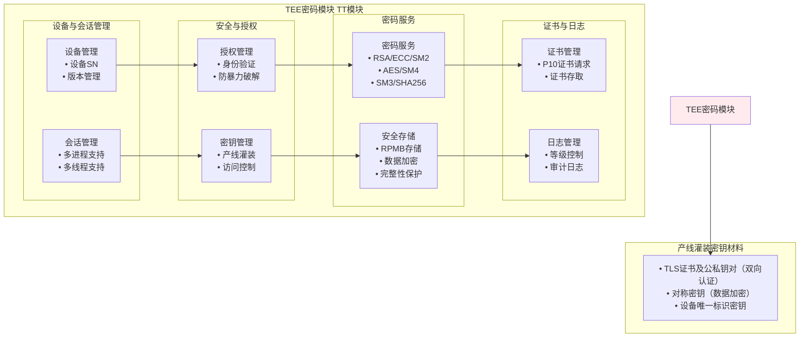
```mermaid
graph TB
    subgraph "TEE密码模块 TT模块"
        subgraph "设备与会话管理"
            DEV["设备管理<br/>• 设备SN<br/>• 版本管理"]
            SESS["会话管理<br/>• 多进程支持<br/>• 多线程支持"]
        end

        subgraph "安全与授权"
            AUTH["授权管理<br/>• 身份验证<br/>• 防暴力破解"]
            KEY["密钥管理<br/>• 产线灌装<br/>• 访问控制"]
        end

        subgraph "密码服务"
            CRYPTO["密码服务<br/>• RSA/ECC/SM2<br/>• AES/SM4<br/>• SM3/SHA256"]
            STORE["安全存储<br/>• RPMB存储<br/>• 数据加密<br/>• 完整性保护"]
        end

        subgraph "证书与日志"
            CERT["证书管理<br/>• P10证书请求<br/>• 证书存取"]
            LOG["日志管理<br/>• 等级控制<br/>• 审计日志"]
        end
    end

    subgraph "产线灌装密钥材料"
        KEYS["• TLS证书及公私钥对（双向认证）<br/>• 对称密钥（数据加密）<br/>• 设备唯一标识密钥"]
    end

    DEV --> AUTH
    SESS --> KEY
    AUTH --> CRYPTO
    KEY --> STORE
    CRYPTO --> CERT
    STORE --> LOG
    TEE密码模块 --> KEYS

    style TEE密码模块 fill:#ffebee
```

### 1.3 现有安全能力评估

| 能力维度 | 当前状态 | 安全等级 | 说明 |
|---------|---------|---------|------|
| 密钥存储 | TEE安全存储 + RPMB | 高 | 硬件隔离保护 |
| 密码运算 | TEE内执行 | 高 | 密钥不出TEE |
| 身份认证 | 授权管理 + 防暴力破解 | 中高 | 有基础防护 |
| 冗余备份 | **无** | 低 | 单点故障风险 |
| 故障转移 | **无** | 低 | 无降级机制 |
| 安全仲裁 | **无** | 低 | 无分级策略 |
| 密钥恢复 | 仅产线重灌 | 低 | 恢复代价高 |

### 1.4 架构约束分析

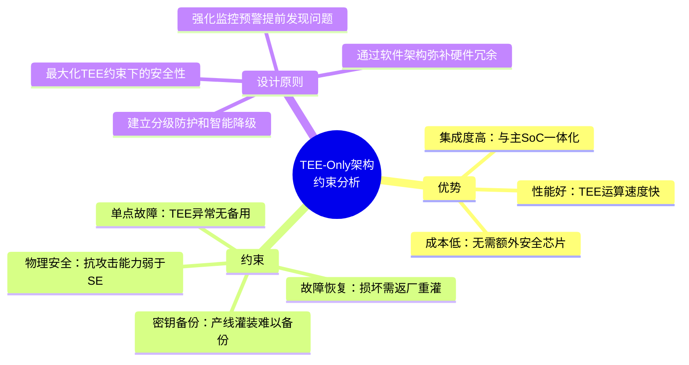
```mermaid
mindmap
  root((TEE-Only架构<br/>约束分析))
    优势
      成本低：无需额外安全芯片
      性能好：TEE运算速度快
      集成度高：与主SoC一体化
    约束
      单点故障：TEE异常无备用
      物理安全：抗攻击能力弱于SE
      密钥备份：产线灌装难以备份
      故障恢复：损坏需返厂重灌
    设计原则
      最大化TEE约束下的安全性
      通过软件架构弥补硬件冗余
      建立分级防护和智能降级
      强化监控预警提前发现问题
```

---

## 二、平台差异化架构

### 2.1 车载系统双平台架构

当前车载系统分为两大平台：MTK相关平台和高通相关平台，两者在安全架构上存在显著差异。

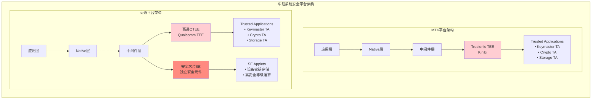
```mermaid
graph TB
    subgraph "车载系统安全平台架构"
        direction TB
        
        subgraph "MTK平台架构"
            MTK_APP["应用层"]
            MTK_NATIVE["Native层"]
            MTK_MW["中间件层"]
            MTK_TEE["Trustonic TEE<br/>Kinibi"]
            MTK_TA["Trusted Applications<br/>• Keymaster TA<br/>• Crypto TA<br/>• Storage TA"]
            
            MTK_APP --> MTK_NATIVE
            MTK_NATIVE --> MTK_MW
            MTK_MW --> MTK_TEE
            MTK_TEE --> MTK_TA
        end

        subgraph "高通平台架构"
            QC_APP["应用层"]
            QC_NATIVE["Native层"]
            QC_MW["中间件层"]
            QC_QTEE["高通QTEE<br/>Qualcomm TEE"]
            QC_SE["安全芯片SE<br/>独立安全元件"]
            QC_TA["Trusted Applications<br/>• Keymaster TA<br/>• Crypto TA<br/>• Storage TA"]
            QC_APPLET["SE Applets<br/>• 设备密钥存储<br/>• 高安全等级运算"]
            
            QC_APP --> QC_NATIVE
            QC_NATIVE --> QC_MW
            QC_MW --> QC_QTEE
            QC_MW --> QC_SE
            QC_QTEE --> QC_TA
            QC_SE --> QC_APPLET
        end
    end

    style MTK_TEE fill:#ffcdd2
    style QC_QTEE fill:#ffcdd2
    style QC_SE fill:#ff8a80
```

### 2.2 双平台安全能力对比

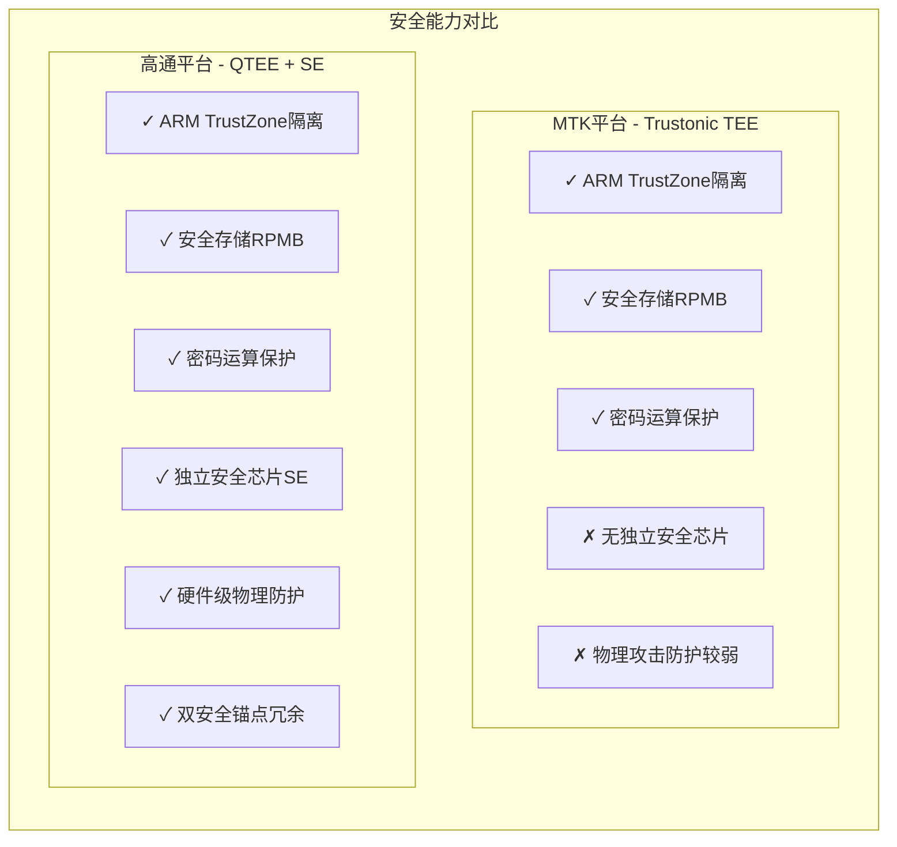
```mermaid
graph LR
    subgraph "安全能力对比"
        subgraph "MTK平台 - Trustonic TEE"
            M1["✓ ARM TrustZone隔离"]
            M2["✓ 安全存储RPMB"]
            M3["✓ 密码运算保护"]
            M4["✗ 无独立安全芯片"]
            M5["✗ 物理攻击防护较弱"]
        end

        subgraph "高通平台 - QTEE + SE"
            Q1["✓ ARM TrustZone隔离"]
            Q2["✓ 安全存储RPMB"]
            Q3["✓ 密码运算保护"]
            Q4["✓ 独立安全芯片SE"]
            Q5["✓ 硬件级物理防护"]
            Q6["✓ 双安全锚点冗余"]
        end
    end
```

### 2.3 平台特性详细对比

| 特性维度 | MTK平台（Trustonic） | 高通平台（QTEE + SE） |
|---------|---------------------|----------------------|
| **TEE类型** | Trustonic Kinibi | Qualcomm QTEE (TrustZone) |
| **安全芯片** | 无 | 独立SE安全芯片 |
| **安全锚点** | 单一（TEE） | 双重（QTEE + SE） |
| **密钥存储** | RPMB | RPMB + SE安全存储 |
| **抗物理攻击** | 中等 | 高（SE独立防护） |
| **密钥备份能力** | 弱 | 强（SE可作为备份） |
| **故障冗余** | 无 | 有（双模块互备） |
| **成本** | 较低 | 较高 |

### 2.4 双平台密钥管理架构

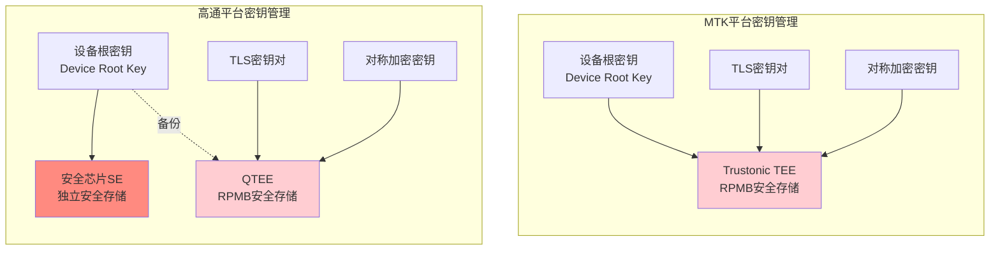
```mermaid
flowchart TB
    subgraph "MTK平台密钥管理"
        direction TB
        MTK_ROOT["设备根密钥<br/>Device Root Key"]
        MTK_TLS["TLS密钥对"]
        MTK_SYM["对称加密密钥"]
        MTK_STORE["Trustonic TEE<br/>RPMB安全存储"]
        
        MTK_ROOT --> MTK_STORE
        MTK_TLS --> MTK_STORE
        MTK_SYM --> MTK_STORE
    end

    subgraph "高通平台密钥管理"
        direction TB
        QC_ROOT["设备根密钥<br/>Device Root Key"]
        QC_TLS["TLS密钥对"]
        QC_SYM["对称加密密钥"]
        QC_QTEE_STORE["QTEE<br/>RPMB安全存储"]
        QC_SE_STORE["安全芯片SE<br/>独立安全存储"]
        
        QC_ROOT --> QC_SE_STORE
        QC_TLS --> QC_QTEE_STORE
        QC_SYM --> QC_QTEE_STORE
        QC_ROOT -.->|备份| QC_QTEE_STORE
    end

    style MTK_STORE fill:#ffcdd2
    style QC_QTEE_STORE fill:#ffcdd2
    style QC_SE_STORE fill:#ff8a80
```

### 2.5 高通平台双安全模块协作

高通平台具有QTEE和独立安全芯片SE两个安全模块，可实现互备和协作。

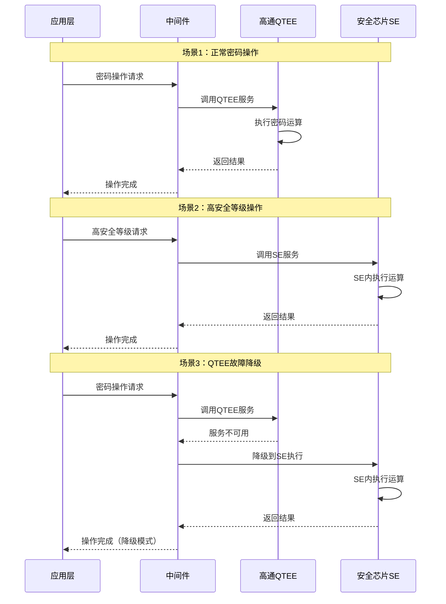
```mermaid
sequenceDiagram
    participant APP as 应用层
    participant MW as 中间件
    participant QTEE as 高通QTEE
    participant SE as 安全芯片SE

    Note over APP,SE: 场景1：正常密码操作
    APP->>MW: 密码操作请求
    MW->>QTEE: 调用QTEE服务
    QTEE->>QTEE: 执行密码运算
    QTEE-->>MW: 返回结果
    MW-->>APP: 操作完成

    Note over APP,SE: 场景2：高安全等级操作
    APP->>MW: 高安全等级请求
    MW->>SE: 调用SE服务
    SE->>SE: SE内执行运算
    SE-->>MW: 返回结果
    MW-->>APP: 操作完成

    Note over APP,SE: 场景3：QTEE故障降级
    APP->>MW: 密码操作请求
    MW->>QTEE: 调用QTEE服务
    QTEE-->>MW: 服务不可用
    MW->>SE: 降级到SE执行
    SE->>SE: SE内执行运算
    SE-->>MW: 返回结果
    MW-->>APP: 操作完成（降级模式）
```

---

## 三、产线灌装流程设计

### 3.1 产线灌装整体架构

产线通过上位机系统完成密钥和证书的安全灌装，确保设备出厂时具备完整的安全凭证。

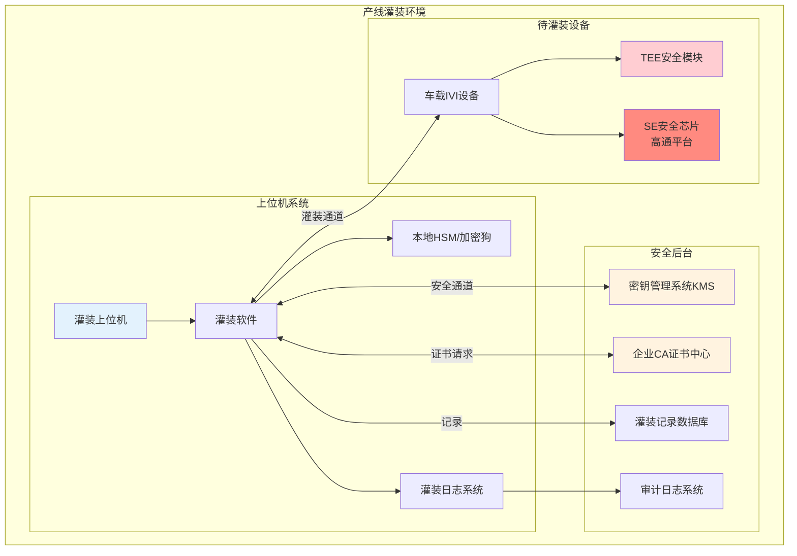
```mermaid
graph TB
    subgraph "产线灌装环境"
        subgraph "上位机系统"
            PC["灌装上位机"]
            PC_SW["灌装软件"]
            PC_HSM["本地HSM/加密狗"]
            PC_LOG["灌装日志系统"]
        end

        subgraph "安全后台"
            KMS["密钥管理系统KMS"]
            CA["企业CA证书中心"]
            DB["灌装记录数据库"]
            AUDIT["审计日志系统"]
        end

        subgraph "待灌装设备"
            IVI["车载IVI设备"]
            TEE_TARGET["TEE安全模块"]
            SE_TARGET["SE安全芯片<br/>高通平台"]
        end
    end

    PC --> PC_SW
    PC_SW --> PC_HSM
    PC_SW --> PC_LOG
    
    PC_SW <-->|安全通道| KMS
    PC_SW <-->|证书请求| CA
    PC_SW -->|记录| DB
    PC_LOG --> AUDIT

    PC_SW <-->|灌装通道| IVI
    IVI --> TEE_TARGET
    IVI --> SE_TARGET

    style PC fill:#e3f2fd
    style KMS fill:#fff3e0
    style CA fill:#fff3e0
    style TEE_TARGET fill:#ffcdd2
    style SE_TARGET fill:#ff8a80
```

### 3.2 产线灌装详细流程

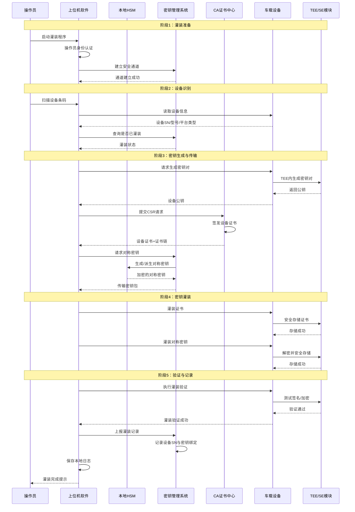
```mermaid
sequenceDiagram
    participant OP as 操作员
    participant PC as 上位机软件
    participant HSM as 本地HSM
    participant KMS as 密钥管理系统
    participant CA as CA证书中心
    participant DEV as 车载设备
    participant TEE as TEE/SE模块

    Note over OP,TEE: 阶段1：灌装准备
    OP->>PC: 启动灌装程序
    PC->>PC: 操作员身份认证
    PC->>KMS: 建立安全通道
    KMS-->>PC: 通道建立成功

    Note over OP,TEE: 阶段2：设备识别
    OP->>PC: 扫描设备条码
    PC->>DEV: 读取设备信息
    DEV-->>PC: 设备SN/型号/平台类型
    PC->>KMS: 查询是否已灌装
    KMS-->>PC: 灌装状态

    Note over OP,TEE: 阶段3：密钥生成与传输
    PC->>DEV: 请求生成密钥对
    DEV->>TEE: TEE内生成密钥对
    TEE-->>DEV: 返回公钥
    DEV-->>PC: 设备公钥

    PC->>CA: 提交CSR请求
    CA->>CA: 签发设备证书
    CA-->>PC: 设备证书+证书链

    PC->>KMS: 请求对称密钥
    KMS->>HSM: 生成/派生对称密钥
    HSM-->>KMS: 加密的对称密钥
    KMS-->>PC: 传输密钥包

    Note over OP,TEE: 阶段4：密钥灌装
    PC->>DEV: 灌装证书
    DEV->>TEE: 安全存储证书
    TEE-->>DEV: 存储成功

    PC->>DEV: 灌装对称密钥
    DEV->>TEE: 解密并安全存储
    TEE-->>DEV: 存储成功

    Note over OP,TEE: 阶段5：验证与记录
    PC->>DEV: 执行灌装验证
    DEV->>TEE: 测试签名/加密
    TEE-->>DEV: 验证通过
    DEV-->>PC: 灌装验证成功

    PC->>KMS: 上报灌装记录
    KMS->>KMS: 记录设备SN与密钥绑定
    PC->>PC: 保存本地日志
    PC-->>OP: 灌装完成提示
```

### 3.3 灌装数据流向图

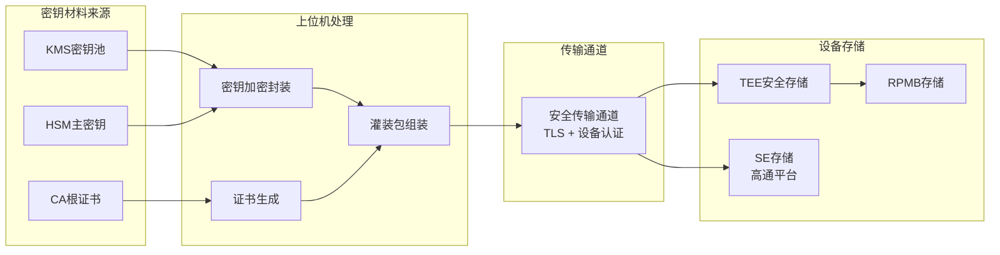
```mermaid
flowchart LR
    subgraph "密钥材料来源"
        KMS_SRC["KMS密钥池"]
        CA_SRC["CA根证书"]
        HSM_SRC["HSM主密钥"]
    end

    subgraph "上位机处理"
        ENCRYPT["密钥加密封装"]
        CERT_GEN["证书生成"]
        PACKAGE["灌装包组装"]
    end

    subgraph "传输通道"
        SEC_CH["安全传输通道<br/>TLS + 设备认证"]
    end

    subgraph "设备存储"
        TEE_STORE["TEE安全存储"]
        SE_STORE["SE存储<br/>高通平台"]
        RPMB["RPMB存储"]
    end

    KMS_SRC --> ENCRYPT
    CA_SRC --> CERT_GEN
    HSM_SRC --> ENCRYPT
    ENCRYPT --> PACKAGE
    CERT_GEN --> PACKAGE
    PACKAGE --> SEC_CH
    SEC_CH --> TEE_STORE
    SEC_CH --> SE_STORE
    TEE_STORE --> RPMB
```

### 3.4 灌装安全措施

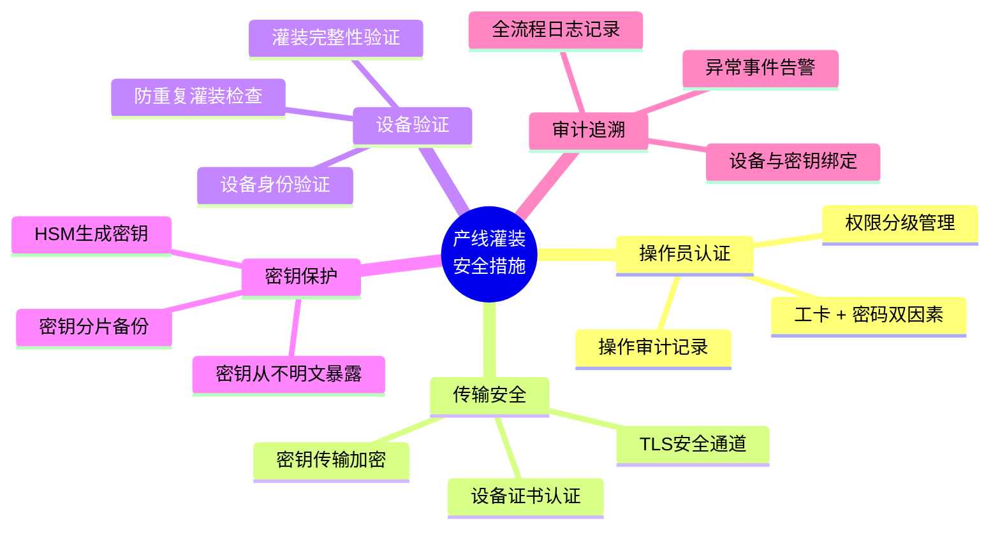
```mermaid
mindmap
  root((产线灌装<br/>安全措施))
    操作员认证
      工卡 + 密码双因素
      权限分级管理
      操作审计记录
    传输安全
      TLS安全通道
      设备证书认证
      密钥传输加密
    设备验证
      设备身份验证
      防重复灌装检查
      灌装完整性验证
    密钥保护
      HSM生成密钥
      密钥从不明文暴露
      密钥分片备份
    审计追溯
      全流程日志记录
      设备与密钥绑定
      异常事件告警
```

### 3.5 MTK与高通平台灌装差异

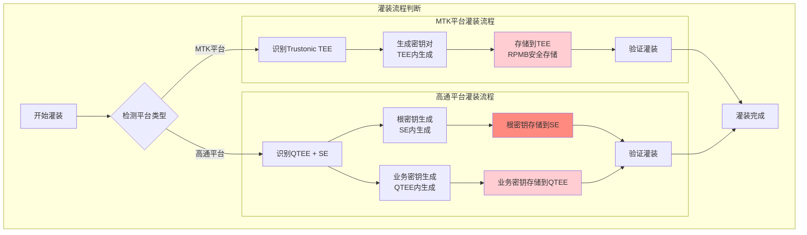
```mermaid
flowchart TB
    subgraph "灌装流程判断"
        START["开始灌装"] --> CHECK{"检测平台类型"}
        
        CHECK -->|MTK平台| MTK_FLOW
        CHECK -->|高通平台| QC_FLOW
        
        subgraph "MTK平台灌装流程"
            MTK_FLOW["识别Trustonic TEE"]
            MTK_KEY["生成密钥对<br/>TEE内生成"]
            MTK_STORE["存储到TEE<br/>RPMB安全存储"]
            MTK_VERIFY["验证灌装"]
            
            MTK_FLOW --> MTK_KEY --> MTK_STORE --> MTK_VERIFY
        end

        subgraph "高通平台灌装流程"
            QC_FLOW["识别QTEE + SE"]
            QC_SE_KEY["根密钥生成<br/>SE内生成"]
            QC_TEE_KEY["业务密钥生成<br/>QTEE内生成"]
            QC_SE_STORE["根密钥存储到SE"]
            QC_TEE_STORE["业务密钥存储到QTEE"]
            QC_VERIFY["验证灌装"]
            
            QC_FLOW --> QC_SE_KEY --> QC_SE_STORE
            QC_FLOW --> QC_TEE_KEY --> QC_TEE_STORE
            QC_SE_STORE --> QC_VERIFY
            QC_TEE_STORE --> QC_VERIFY
        end

        MTK_VERIFY --> COMPLETE["灌装完成"]
        QC_VERIFY --> COMPLETE
    end

    style MTK_STORE fill:#ffcdd2
    style QC_SE_STORE fill:#ff8a80
    style QC_TEE_STORE fill:#ffcdd2
```

---

## 四、TEE单点风险识别

### 4.1 风险场景分析

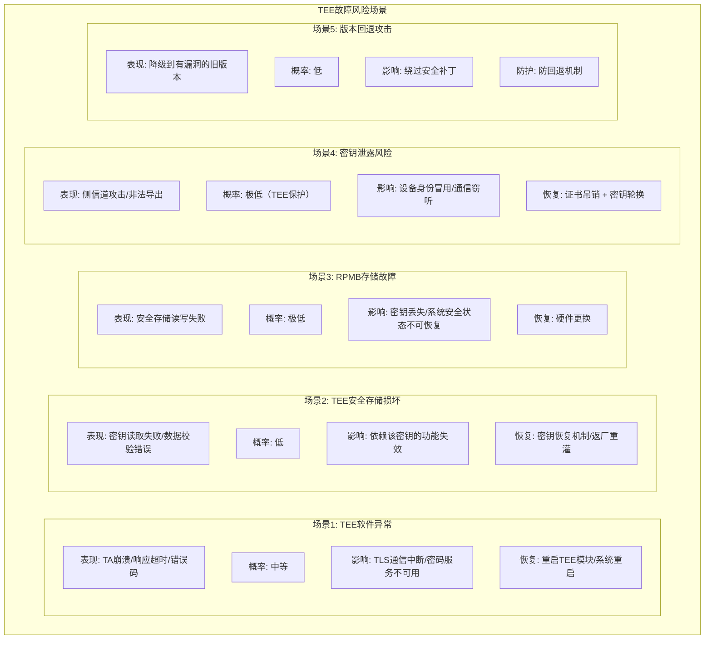
```mermaid
graph TB
    subgraph "TEE故障风险场景"
        subgraph "场景1: TEE软件异常"
            S1_PERF["表现: TA崩溃/响应超时/错误码"]
            S1_PROB["概率: 中等"]
            S1_IMPACT["影响: TLS通信中断/密码服务不可用"]
            S1_RECOVER["恢复: 重启TEE模块/系统重启"]
        end

        subgraph "场景2: TEE安全存储损坏"
            S2_PERF["表现: 密钥读取失败/数据校验错误"]
            S2_PROB["概率: 低"]
            S2_IMPACT["影响: 依赖该密钥的功能失效"]
            S2_RECOVER["恢复: 密钥恢复机制/返厂重灌"]
        end

        subgraph "场景3: RPMB存储故障"
            S3_PERF["表现: 安全存储读写失败"]
            S3_PROB["概率: 极低"]
            S3_IMPACT["影响: 密钥丢失/系统安全状态不可恢复"]
            S3_RECOVER["恢复: 硬件更换"]
        end

        subgraph "场景4: 密钥泄露风险"
            S4_PERF["表现: 侧信道攻击/非法导出"]
            S4_PROB["概率: 极低（TEE保护）"]
            S4_IMPACT["影响: 设备身份冒用/通信窃听"]
            S4_RECOVER["恢复: 证书吊销 + 密钥轮换"]
        end

        subgraph "场景5: 版本回退攻击"
            S5_PERF["表现: 降级到有漏洞的旧版本"]
            S5_PROB["概率: 低"]
            S5_IMPACT["影响: 绕过安全补丁"]
            S5_RECOVER["防护: 防回退机制"]
        end
    end
```

### 4.2 故障影响链分析

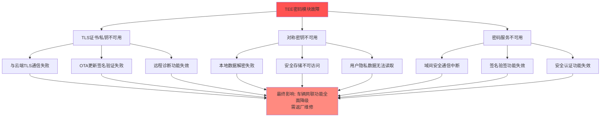
```mermaid
flowchart TD
    ROOT["TEE密码模块故障"]
    
    ROOT --> TLS["TLS证书/私钥不可用"]
    ROOT --> SYM["对称密钥不可用"]
    ROOT --> SERVICE["密码服务不可用"]
    
    TLS --> TLS1["与云端TLS通信失败"]
    TLS --> TLS2["OTA更新签名验证失败"]
    TLS --> TLS3["远程诊断功能失效"]
    
    SYM --> SYM1["本地数据解密失败"]
    SYM --> SYM2["安全存储不可访问"]
    SYM --> SYM3["用户隐私数据无法读取"]
    
    SERVICE --> SVC1["域间安全通信中断"]
    SERVICE --> SVC2["签名验签功能失效"]
    SERVICE --> SVC3["安全认证功能失效"]
    
    TLS1 --> FINAL["最终影响: 车辆网联功能全面降级<br/>需返厂维修"]
    TLS2 --> FINAL
    TLS3 --> FINAL
    SYM1 --> FINAL
    SYM2 --> FINAL
    SYM3 --> FINAL
    SVC1 --> FINAL
    SVC2 --> FINAL
    SVC3 --> FINAL

    style ROOT fill:#ff5252
    style FINAL fill:#ff8a80
```

---

## 五、防护类安全增强方案

### 5.1 整体防护架构

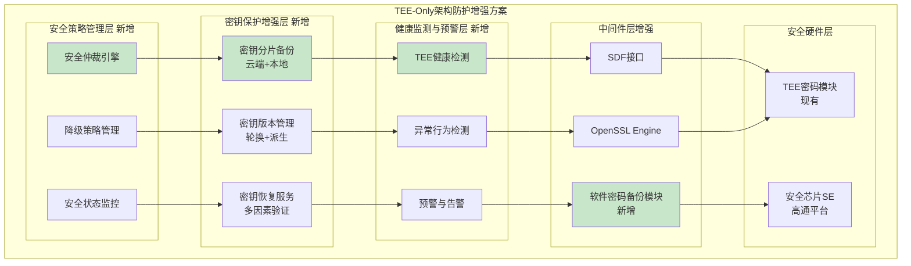
```mermaid
graph TB
    subgraph "TEE-Only架构防护增强方案"
        subgraph "安全策略管理层 新增"
            POL1["安全仲裁引擎"]
            POL2["降级策略管理"]
            POL3["安全状态监控"]
        end

        subgraph "密钥保护增强层 新增"
            KEY1["密钥分片备份<br/>云端+本地"]
            KEY2["密钥版本管理<br/>轮换+派生"]
            KEY3["密钥恢复服务<br/>多因素验证"]
        end

        subgraph "健康监测与预警层 新增"
            MON1["TEE健康检测"]
            MON2["异常行为检测"]
            MON3["预警与告警"]
        end

        subgraph "中间件层增强"
            MW1["SDF接口"]
            MW2["OpenSSL Engine"]
            MW3["软件密码备份模块<br/>新增"]
        end

        subgraph "安全硬件层"
            TEE["TEE密码模块<br/>现有"]
            SE["安全芯片SE<br/>高通平台"]
        end
    end

    POL1 --> KEY1
    POL2 --> KEY2
    POL3 --> KEY3
    KEY1 --> MON1
    KEY2 --> MON2
    KEY3 --> MON3
    MON1 --> MW1
    MON2 --> MW2
    MON3 --> MW3
    MW1 --> TEE
    MW2 --> TEE
    MW3 --> SE

    style POL1 fill:#c8e6c9
    style KEY1 fill:#c8e6c9
    style MON1 fill:#c8e6c9
    style MW3 fill:#c8e6c9
```

### 5.2 分层防护策略

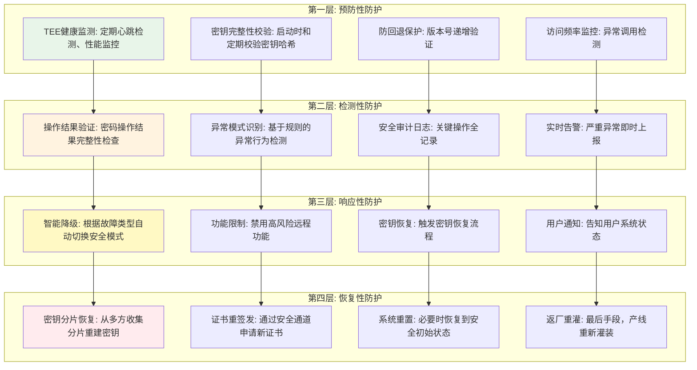
```mermaid
graph TB
    subgraph "第一层: 预防性防护"
        L1_1["TEE健康监测: 定期心跳检测、性能监控"]
        L1_2["密钥完整性校验: 启动时和定期校验密钥哈希"]
        L1_3["防回退保护: 版本号递增验证"]
        L1_4["访问频率监控: 异常调用检测"]
    end

    subgraph "第二层: 检测性防护"
        L2_1["操作结果验证: 密码操作结果完整性检查"]
        L2_2["异常模式识别: 基于规则的异常行为检测"]
        L2_3["安全审计日志: 关键操作全记录"]
        L2_4["实时告警: 严重异常即时上报"]
    end

    subgraph "第三层: 响应性防护"
        L3_1["智能降级: 根据故障类型自动切换安全模式"]
        L3_2["功能限制: 禁用高风险远程功能"]
        L3_3["密钥恢复: 触发密钥恢复流程"]
        L3_4["用户通知: 告知用户系统状态"]
    end

    subgraph "第四层: 恢复性防护"
        L4_1["密钥分片恢复: 从多方收集分片重建密钥"]
        L4_2["证书重签发: 通过安全通道申请新证书"]
        L4_3["系统重置: 必要时恢复到安全初始状态"]
        L4_4["返厂重灌: 最后手段，产线重新灌装"]
    end

    L1_1 --> L2_1
    L1_2 --> L2_2
    L1_3 --> L2_3
    L1_4 --> L2_4
    L2_1 --> L3_1
    L2_2 --> L3_2
    L2_3 --> L3_3
    L2_4 --> L3_4
    L3_1 --> L4_1
    L3_2 --> L4_2
    L3_3 --> L4_3
    L3_4 --> L4_4

    style L1_1 fill:#e8f5e9
    style L2_1 fill:#fff3e0
    style L3_1 fill:#fff9c4
    style L4_1 fill:#ffebee
```

---

## 六、密钥备份与恢复机制

### 6.1 密钥分类与备份策略

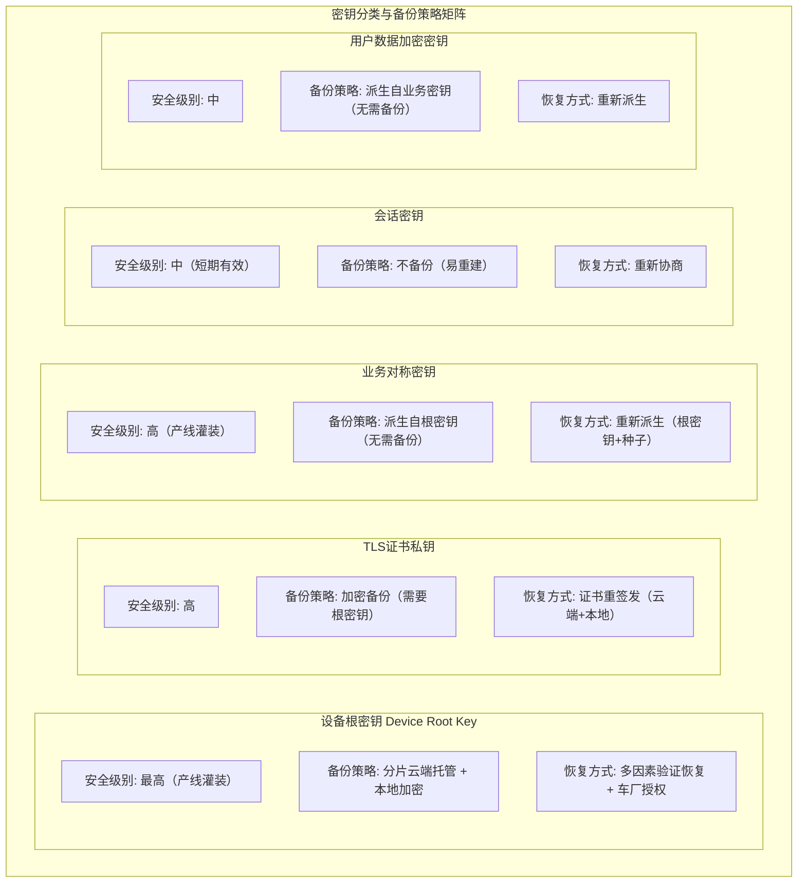
```mermaid
graph TB
    subgraph "密钥分类与备份策略矩阵"
        subgraph "设备根密钥 Device Root Key"
            DRK_LEVEL["安全级别: 最高（产线灌装）"]
            DRK_BACKUP["备份策略: 分片云端托管 + 本地加密"]
            DRK_RECOVER["恢复方式: 多因素验证恢复 + 车厂授权"]
        end

        subgraph "TLS证书私钥"
            TLS_LEVEL["安全级别: 高"]
            TLS_BACKUP["备份策略: 加密备份（需要根密钥）"]
            TLS_RECOVER["恢复方式: 证书重签发（云端+本地）"]
        end

        subgraph "业务对称密钥"
            SYM_LEVEL["安全级别: 高（产线灌装）"]
            SYM_BACKUP["备份策略: 派生自根密钥（无需备份）"]
            SYM_RECOVER["恢复方式: 重新派生（根密钥+种子）"]
        end

        subgraph "会话密钥"
            SESS_LEVEL["安全级别: 中（短期有效）"]
            SESS_BACKUP["备份策略: 不备份（易重建）"]
            SESS_RECOVER["恢复方式: 重新协商"]
        end

        subgraph "用户数据加密密钥"
            USER_LEVEL["安全级别: 中"]
            USER_BACKUP["备份策略: 派生自业务密钥（无需备份）"]
            USER_RECOVER["恢复方式: 重新派生"]
        end
    end
```

### 6.2 密钥派生架构

通过基于根密钥的派生架构，大幅减少需要备份的密钥数量。

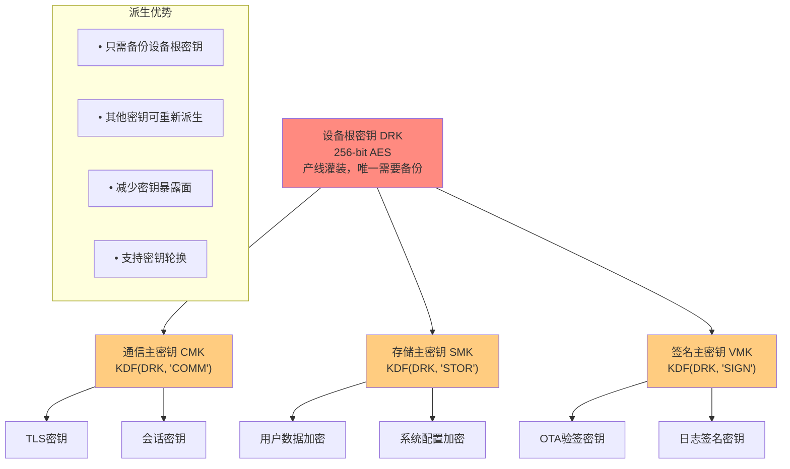
```mermaid
flowchart TD
    DRK["设备根密钥 DRK<br/>256-bit AES<br/>产线灌装，唯一需要备份"]

    DRK --> CMK["通信主密钥 CMK<br/>KDF(DRK, 'COMM')"]
    DRK --> SMK["存储主密钥 SMK<br/>KDF(DRK, 'STOR')"]
    DRK --> VMK["签名主密钥 VMK<br/>KDF(DRK, 'SIGN')"]

    CMK --> TLS_KEY["TLS密钥"]
    CMK --> SESS_KEY["会话密钥"]
    
    SMK --> USER_DATA["用户数据加密"]
    SMK --> SYS_CONFIG["系统配置加密"]
    
    VMK --> OTA_KEY["OTA验签密钥"]
    VMK --> LOG_KEY["日志签名密钥"]

    subgraph "派生优势"
        ADV1["• 只需备份设备根密钥"]
        ADV2["• 其他密钥可重新派生"]
        ADV3["• 减少密钥暴露面"]
        ADV4["• 支持密钥轮换"]
    end

    style DRK fill:#ff8a80
    style CMK fill:#ffcc80
    style SMK fill:#ffcc80
    style VMK fill:#ffcc80
```

### 6.3 设备根密钥分片备份方案

采用Shamir秘密分享方案，实现安全的密钥备份与恢复。

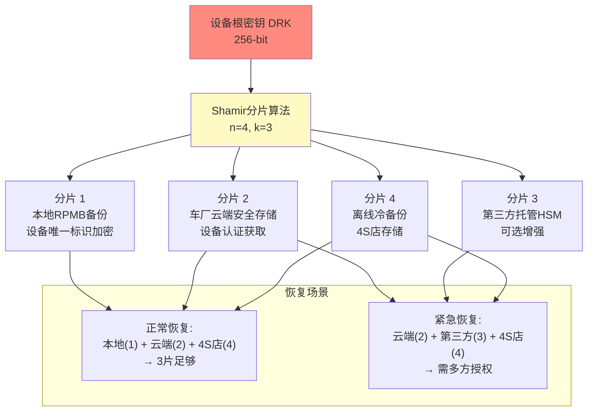
```mermaid
flowchart TD
    DRK["设备根密钥 DRK<br/>256-bit"]
    
    DRK --> SHAMIR["Shamir分片算法<br/>n=4, k=3"]
    
    SHAMIR --> S1["分片 1<br/>本地RPMB备份<br/>设备唯一标识加密"]
    SHAMIR --> S2["分片 2<br/>车厂云端安全存储<br/>设备认证获取"]
    SHAMIR --> S3["分片 3<br/>第三方托管HSM<br/>可选增强"]
    SHAMIR --> S4["分片 4<br/>离线冷备份<br/>4S店存储"]

    subgraph "恢复场景"
        R1["正常恢复:<br/>本地(1) + 云端(2) + 4S店(4)<br/>→ 3片足够"]
        R2["紧急恢复:<br/>云端(2) + 第三方(3) + 4S店(4)<br/>→ 需多方授权"]
    end

    S1 --> R1
    S2 --> R1
    S4 --> R1
    S2 --> R2
    S3 --> R2
    S4 --> R2

    style DRK fill:#ff8a80
    style SHAMIR fill:#fff9c4
```

### 6.4 TLS证书恢复流程

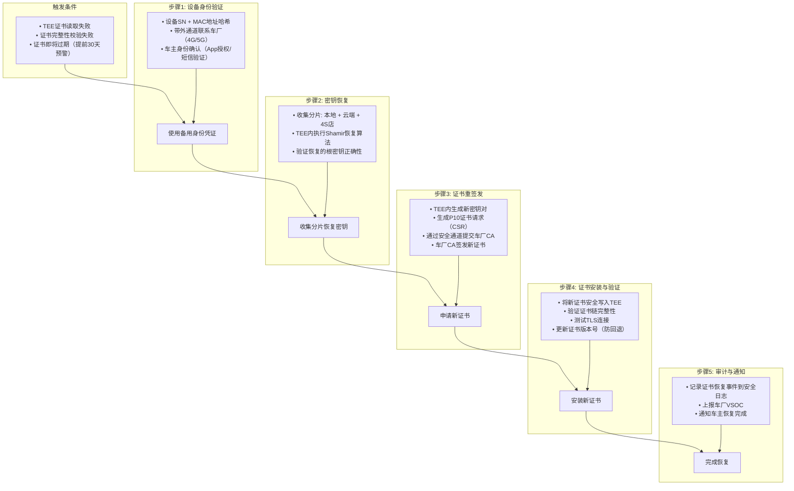
```mermaid
flowchart TD
    subgraph "触发条件"
        TRIGGER["• TEE证书读取失败<br/>• 证书完整性校验失败<br/>• 证书即将过期（提前30天预警）"]
    end

    TRIGGER --> STEP1

    subgraph "步骤1: 设备身份验证"
        STEP1["使用备用身份凭证"]
        STEP1_DETAIL["• 设备SN + MAC地址哈希<br/>• 带外通道联系车厂（4G/5G）<br/>• 车主身份确认（App授权/短信验证）"]
    end

    STEP1 --> STEP2

    subgraph "步骤2: 密钥恢复"
        STEP2["收集分片恢复密钥"]
        STEP2_DETAIL["• 收集分片: 本地 + 云端 + 4S店<br/>• TEE内执行Shamir恢复算法<br/>• 验证恢复的根密钥正确性"]
    end

    STEP2 --> STEP3

    subgraph "步骤3: 证书重签发"
        STEP3["申请新证书"]
        STEP3_DETAIL["• TEE内生成新密钥对<br/>• 生成P10证书请求（CSR）<br/>• 通过安全通道提交车厂CA<br/>• 车厂CA签发新证书"]
    end

    STEP3 --> STEP4

    subgraph "步骤4: 证书安装与验证"
        STEP4["安装新证书"]
        STEP4_DETAIL["• 将新证书安全写入TEE<br/>• 验证证书链完整性<br/>• 测试TLS连接<br/>• 更新证书版本号（防回退）"]
    end

    STEP4 --> STEP5

    subgraph "步骤5: 审计与通知"
        STEP5["完成恢复"]
        STEP5_DETAIL["• 记录证书恢复事件到安全日志<br/>• 上报车厂VSOC<br/>• 通知车主恢复完成"]
    end

    STEP1_DETAIL --> STEP1
    STEP2_DETAIL --> STEP2
    STEP3_DETAIL --> STEP3
    STEP4_DETAIL --> STEP4
    STEP5_DETAIL --> STEP5
```

---

## 七、Keystore功能集成方案

### 7.1 Keystore集成架构

在应用层集成Android Keystore功能，可以为业务应用提供标准化的密钥管理能力，同时利用底层TEE/SE提供的硬件安全保护。

```mermaid
graph TB
    subgraph "应用层 Keystore集成"
        APP1["业务App 1"]
        APP2["业务App 2"]
        APP3["业务App N"]
        
        KS_API["Android Keystore API<br/>标准JCA/JCE接口"]
        
        subgraph "SafeKeyManager增强"
            SKM["SafeKeyManager"]
            SKM_KS["Keystore功能封装"]
            SKM_CERT["证书管理接口"]
            SKM_CRYPTO["密码操作接口"]
        end
    end

    subgraph "Framework层"
        KSP["KeyStore Provider"]
        KS2["Keystore2 Service"]
    end

    subgraph "HAL层"
        KM_HAL["KeyMint HAL"]
    end

    subgraph "安全硬件层"
        TEE["TEE Keymaster TA"]
        SE["SE Keymaster<br/>高通平台"]
    end

    APP1 --> KS_API
    APP2 --> KS_API
    APP3 --> KS_API
    KS_API --> SKM
    SKM --> SKM_KS
    SKM --> SKM_CERT
    SKM --> SKM_CRYPTO
    SKM_KS --> KSP
    KSP --> KS2
    KS2 --> KM_HAL
    KM_HAL --> TEE
    KM_HAL --> SE

    style SKM fill:#c8e6c9
    style SKM_KS fill:#c8e6c9
    style TEE fill:#ffcdd2
    style SE fill:#ff8a80
```

### 7.2 Keystore功能能力矩阵

| 功能类别 | 功能项 | 说明 | 业务场景 |
|---------|-------|------|---------|
| **密钥生成** | 对称密钥生成 | AES-128/256 | 本地数据加密 |
| | 非对称密钥生成 | RSA/EC | 签名验签、密钥交换 |
| | 硬件密钥 | TEE/SE内生成 | 高安全等级场景 |
| **密钥存储** | 硬件安全存储 | 密钥不可导出 | 所有场景 |
| | 用户认证绑定 | 生物识别/PIN | 支付、敏感操作 |
| | 应用绑定 | 仅授权应用可用 | 隔离保护 |
| **密码操作** | 加密解密 | AES-GCM | 数据保护 |
| | 签名验签 | RSA/ECDSA | 身份认证、数据完整性 |
| | 密钥协商 | ECDH | 安全通信 |
| **密钥证明** | 硬件证明 | Key Attestation | 远程验证密钥安全性 |

### 7.3 业务使用场景

```mermaid
mindmap
  root((Keystore业务场景))
    车载支付
      支付密钥保护
      交易签名
      生物认证绑定
    远程控制
      车辆解锁认证
      启动授权
      命令签名验证
    数据保护
      用户隐私数据加密
      行车记录保护
      设置信息加密
    安全通信
      TLS客户端认证
      端到端加密
      会话密钥协商
    OTA安全
      固件签名验证
      更新包加密
      回退保护
    DRM保护
      媒体内容解密
      许可证管理
      设备绑定
```

### 7.4 场景1：车载支付安全

```mermaid
sequenceDiagram
    participant User as 用户
    participant App as 支付App
    participant SKM as SafeKeyManager
    participant KS as Keystore
    participant BIO as 生物识别
    participant TEE as TEE/SE
    participant Server as 支付服务器

    User->>App: 发起支付请求
    App->>SKM: 获取支付密钥

    SKM->>KS: 请求使用支付密钥
    KS->>KS: 检查密钥属性

    alt 需要生物认证
        KS->>BIO: 请求生物认证
        BIO->>User: 指纹/面部识别
        User->>BIO: 认证通过
        BIO->>KS: 返回认证Token
    end

    KS->>TEE: 使用密钥签名交易
    TEE->>TEE: 安全签名操作
    TEE-->>KS: 返回签名结果
    KS-->>SKM: 签名数据
    SKM-->>App: 已签名交易

    App->>Server: 提交签名交易
    Server->>Server: 验证签名
    Server-->>App: 支付成功
    App-->>User: 支付完成通知
```

### 7.5 场景2：远程车辆控制

```mermaid
sequenceDiagram
    participant User as 车主App
    participant Cloud as 车厂云端
    participant IVI as 车载IVI
    participant SKM as SafeKeyManager
    participant TEE as TEE/SE

    Note over User,TEE: 远程解锁流程

    User->>Cloud: 发送解锁命令
    Cloud->>Cloud: 验证用户身份
    Cloud->>Cloud: 生成带签名的控制命令
    Cloud->>IVI: 下发控制命令

    IVI->>SKM: 验证命令签名
    SKM->>TEE: 使用云端公钥验签
    TEE->>TEE: 执行签名验证
    TEE-->>SKM: 验证通过

    SKM->>TEE: 使用设备私钥签名响应
    TEE->>TEE: 生成签名
    TEE-->>SKM: 签名响应

    IVI->>IVI: 执行解锁操作
    IVI->>Cloud: 返回执行结果（已签名）
    Cloud->>Cloud: 验证响应签名
    Cloud-->>User: 解锁成功通知
```

### 7.6 场景3：用户数据保护

```mermaid
flowchart TD
    subgraph "数据加密保护流程"
        DATA["用户隐私数据<br/>位置、通讯录、偏好设置"]
        
        DATA --> ENCRYPT_FLOW
        
        subgraph "加密流程"
            ENCRYPT_FLOW["数据加密请求"]
            GET_KEY["获取数据加密密钥<br/>Keystore"]
            TEE_ENC["TEE内执行加密<br/>AES-GCM"]
            STORE["安全存储密文"]
        end
        
        ENCRYPT_FLOW --> GET_KEY --> TEE_ENC --> STORE
        
        subgraph "解密流程"
            READ["读取密文"]
            GET_KEY2["获取解密密钥"]
            AUTH_CHECK{"需要认证?"}
            BIO_AUTH["生物认证"]
            TEE_DEC["TEE内执行解密"]
            PLAIN["返回明文"]
        end
        
        READ --> GET_KEY2 --> AUTH_CHECK
        AUTH_CHECK -->|是| BIO_AUTH --> TEE_DEC
        AUTH_CHECK -->|否| TEE_DEC
        TEE_DEC --> PLAIN
    end

    style TEE_ENC fill:#ffcdd2
    style TEE_DEC fill:#ffcdd2
```

### 7.7 场景4：OTA安全更新

```mermaid
flowchart TD
    subgraph "OTA安全更新流程"
        SERVER["OTA服务器"]
        
        subgraph "更新包准备"
            PACK["更新包打包"]
            SIGN["使用车厂私钥签名"]
            ENCRYPT["可选：加密更新包"]
            UPLOAD["发布更新"]
        end
        
        subgraph "车端验证"
            DOWN["下载更新包"]
            SKM_VERIFY["SafeKeyManager验证"]
            TEE_VERIFY["TEE验签<br/>使用车厂公钥"]
            DECRYPT["可选：解密更新包"]
            HASH_CHECK["完整性校验"]
        end
        
        subgraph "安全安装"
            ROLLBACK["版本回退检查<br/>Keystore记录版本"]
            INSTALL["安装更新"]
            UPDATE_VER["更新版本号"]
            REBOOT["重启生效"]
        end
        
        SERVER --> PACK --> SIGN --> ENCRYPT --> UPLOAD
        UPLOAD --> DOWN --> SKM_VERIFY --> TEE_VERIFY
        TEE_VERIFY --> DECRYPT --> HASH_CHECK
        HASH_CHECK --> ROLLBACK --> INSTALL --> UPDATE_VER --> REBOOT
    end

    style TEE_VERIFY fill:#ffcdd2
```

### 7.8 Keystore与SafeKeyManager集成架构

```mermaid
graph TB
    subgraph "集成架构设计"
        subgraph "SafeKeyManager增强接口"
            API_KS["Keystore密钥管理"]
            API_GEN["密钥生成接口<br/>generateKeyPair/generateSecretKey"]
            API_USE["密钥使用接口<br/>sign/verify/encrypt/decrypt"]
            API_ATTEST["密钥证明接口<br/>getKeyAttestation"]
            API_IMPORT["密钥导入接口<br/>importKey"]
        end

        subgraph "密钥类型支持"
            KEY_TEE["TEE密钥<br/>产线灌装"]
            KEY_KS["Keystore密钥<br/>运行时生成"]
            KEY_SE["SE密钥<br/>高通平台"]
        end

        subgraph "路由决策"
            ROUTER["密钥路由器"]
            ROUTER_DESC["根据密钥类型和操作<br/>选择合适的安全模块"]
        end

        subgraph "安全模块"
            TEE["Trustonic TEE<br/>MTK平台"]
            QTEE["Qualcomm QTEE<br/>高通平台"]
            SE["安全芯片SE<br/>高通平台"]
        end
    end

    API_KS --> API_GEN
    API_KS --> API_USE
    API_KS --> API_ATTEST
    API_KS --> API_IMPORT

    API_GEN --> ROUTER
    API_USE --> ROUTER
    API_ATTEST --> ROUTER
    API_IMPORT --> ROUTER

    ROUTER --> KEY_TEE --> TEE
    ROUTER --> KEY_KS --> QTEE
    ROUTER --> KEY_SE --> SE

    style API_KS fill:#c8e6c9
    style ROUTER fill:#fff9c4
    style TEE fill:#ffcdd2
    style QTEE fill:#ffcdd2
    style SE fill:#ff8a80
```

---

## 八、安全仲裁架构设计

### 8.1 操作安全级别分类

```mermaid
graph TB
    subgraph "安全级别分类"
        subgraph "CRITICAL 关键级别"
            C1["远程车辆控制（解锁、启动、窗户等）"]
            C2["OTA固件更新签名验证"]
            C3["设备根密钥操作"]
            C4["证书更新/恢复"]
            C_RULE["处理方式: 必须TEE执行，失败则拒绝操作"]
        end

        subgraph "HIGH 高级别"
            H1["TLS握手和通信加密"]
            H2["用户身份认证"]
            H3["支付/交易签名"]
            H4["隐私数据加密解密"]
            H_RULE["处理方式: 优先TEE，失败记录告警后可有限降级"]
        end

        subgraph "MEDIUM 中级别"
            M1["日志数据加密"]
            M2["配置数据保护"]
            M3["域间通信加密"]
            M4["缓存数据加密"]
            M_RULE["处理方式: 优先TEE，可降级到软件实现"]
        end

        subgraph "LOW 低级别"
            L1["临时会话密钥生成"]
            L2["随机数生成"]
            L3["哈希计算"]
            L4["非敏感数据加密"]
            L_RULE["处理方式: 可使用软件实现作为备选"]
        end
    end

    style C1 fill:#ff8a80
    style H1 fill:#ffcc80
    style M1 fill:#fff9c4
    style L1 fill:#c8e6c9
```

### 8.2 安全仲裁决策流程

```mermaid
flowchart TD
    REQ["密码操作请求<br/>操作类型、调用者ID、上下文信息"]
    
    REQ --> STEP1["确定操作安全级别<br/>根据操作类型查询安全级别矩阵"]
    
    STEP1 --> STEP2["检查TEE健康状态<br/>调用TEE健康检测模块"]
    
    STEP2 --> CHECK{"TEE状态?"}
    
    CHECK -->|正常| TEE_EXEC["TEE执行操作<br/>返回结果"]
    
    CHECK -->|异常/不可用| LEVEL_CHECK{"根据安全级别决策"}
    
    LEVEL_CHECK -->|CRITICAL| DENY1["拒绝操作<br/>记录告警"]
    LEVEL_CHECK -->|HIGH| DENY2["拒绝操作<br/>启动恢复流程"]
    LEVEL_CHECK -->|MEDIUM| DEGRADE1["降级到软件实现"]
    LEVEL_CHECK -->|LOW| DEGRADE2["使用软件实现"]
    
    DENY1 --> AUDIT["记录降级事件<br/>安全审计日志<br/>上报VSOC<br/>触发恢复流程"]
    DENY2 --> AUDIT
    DEGRADE1 --> AUDIT
    DEGRADE2 --> AUDIT

    style DENY1 fill:#ff8a80
    style DENY2 fill:#ff8a80
    style DEGRADE1 fill:#fff9c4
    style DEGRADE2 fill:#c8e6c9
```

### 8.3 软件密码备份模块

当TEE不可用时，为中低安全级别操作提供软件备选方案。

```mermaid
graph TB
    subgraph "软件密码备份模块架构"
        subgraph "功能限制"
            ALLOW1["✓ 对称加密 AES-256-GCM"]
            ALLOW2["✓ 哈希计算 SHA-256, SM3"]
            ALLOW3["✓ 随机数生成 /dev/urandom"]
            DENY1["✗ 私钥签名（禁止 - 私钥必须在TEE）"]
            DENY2["✗ 设备认证（禁止 - 需要TEE密钥）"]
            DENY3["✗ 关键数据解密（禁止）"]
        end

        subgraph "安全措施"
            SEC1["密钥存储在内存中，进程退出即清除"]
            SEC2["使用白盒加密保护软件密钥"]
            SEC3["操作频率限制"]
            SEC4["所有操作记录审计日志"]
        end

        subgraph "使用场景"
            USE1["TEE暂时不可用时的日志加密"]
            USE2["非敏感配置数据的临时保护"]
            USE3["会话密钥的临时生成"]
        end

        subgraph "重要提醒"
            WARN["⚠ 软件实现安全性显著低于TEE<br/>仅作为临时备选方案<br/>TEE恢复后应立即切换回TEE执行"]
        end
    end

    style DENY1 fill:#ff8a80
    style DENY2 fill:#ff8a80
    style DENY3 fill:#ff8a80
    style WARN fill:#fff9c4
```

---

## 九、故障检测与降级策略

### 9.1 TEE健康监测机制

```mermaid
graph TB
    subgraph "TEE健康监测架构"
        subgraph "检测项目"
            CHK1["心跳检测<br/>周期: 5秒<br/>正常: 响应<100ms<br/>告警: 超时>1s"]
            CHK2["功能自检<br/>周期: 60秒<br/>正常: 成功<br/>告警: 失败"]
            CHK3["密钥完整性<br/>周期: 启动时+每小时<br/>正常: 校验通过<br/>告警: 校验失败"]
            CHK4["存储空间<br/>周期: 30分钟<br/>正常: >20%可用<br/>告警: <10%可用"]
            CHK5["操作延迟<br/>周期: 实时<br/>正常: P99<200ms<br/>告警: P99>500ms"]
            CHK6["错误率<br/>周期: 实时<br/>正常: <0.1%<br/>告警: >1%"]
        end

        subgraph "状态判定逻辑"
            HEALTHY["HEALTHY 正常<br/>所有检测项正常"]
            DEGRADED["DEGRADED 降级<br/>1-2项异常，核心功能可用"]
            FAILED["FAILED 失败<br/>心跳超时或核心功能失败"]
            RECOVERING["RECOVERING 恢复中<br/>正在执行恢复流程"]
        end
    end

    CHK1 --> HEALTHY
    CHK2 --> HEALTHY
    CHK3 --> HEALTHY
    CHK1 --> DEGRADED
    CHK2 --> DEGRADED
    CHK1 --> FAILED
    FAILED --> RECOVERING

    style HEALTHY fill:#c8e6c9
    style DEGRADED fill:#fff9c4
    style FAILED fill:#ff8a80
    style RECOVERING fill:#e3f2fd
```

### 9.2 分级降级策略

```mermaid
stateDiagram-v2
    [*] --> FullSecurity: 系统启动

    FullSecurity: 正常模式 Full Security
    FullSecurity: • 所有密码操作在TEE执行
    FullSecurity: • 完整的远程控制功能
    FullSecurity: • 正常的TLS通信

    LimitedSecurity: 降级模式1 Limited Security
    LimitedSecurity: • 关键操作继续使用TEE（可能有延迟）
    LimitedSecurity: • 中低级别操作可使用软件备份
    LimitedSecurity: • 远程控制需要额外确认步骤
    LimitedSecurity: • 告警通知车厂VSOC

    MinimalSecurity: 降级模式2 Minimal Security
    MinimalSecurity: • 关键操作全部拒绝
    MinimalSecurity: • 远程控制禁用
    MinimalSecurity: • TLS通信使用缓存证书进行有限通信
    MinimalSecurity: • 本地功能部分可用（使用软件加密）
    MinimalSecurity: • 强制告警通知用户 + VSOC

    SafeMode: 安全模式 Safe Mode
    SafeMode: • 仅保留基本车辆控制（非智能功能）
    SafeMode: • 禁用所有网联功能
    SafeMode: • 强制显示警告信息
    SafeMode: • 建议用户前往4S店检修

    FullSecurity --> LimitedSecurity: TEE响应延迟升高/部分操作失败
    LimitedSecurity --> MinimalSecurity: TEE心跳超时/核心功能失败
    MinimalSecurity --> SafeMode: 持续故障>24小时/多次恢复失败

    LimitedSecurity --> FullSecurity: TEE恢复正常
    MinimalSecurity --> LimitedSecurity: TEE部分恢复
    SafeMode --> MinimalSecurity: 维修后恢复
```

---

## 十、安全监控与审计增强

### 10.1 安全日志架构

```mermaid
graph TB
    subgraph "安全日志架构"
        subgraph "日志收集层"
            LOG1["TEE操作日志<br/>• 密码操作<br/>• 密钥访问<br/>• 认证事件"]
            LOG2["仲裁决策日志<br/>• 决策原因<br/>• 安全级别<br/>• 执行模块"]
            LOG3["降级事件日志<br/>• 模式变更<br/>• 功能状态<br/>• 恢复尝试"]
        end

        subgraph "安全日志聚合器"
            AGG["SecurityLogAggregator"]
            AGG_SEC["安全措施:<br/>• 日志签名: TEE密钥HMAC签名<br/>• 日志加密: 敏感内容加密存储<br/>• 防篡改: 日志链式哈希<br/>• 循环存储: 固定大小防耗尽<br/>• 安全时间戳: 可信时间源"]
        end

        subgraph "存储与上报"
            LOCAL["本地安全存储<br/>RPMB/加密分区<br/>• 保留最近30天日志<br/>• 支持离线审计"]
            CLOUD["云端VSOC上报<br/>加密通道<br/>• 实时上报严重事件<br/>• 定期批量上报"]
        end
    end

    LOG1 --> AGG
    LOG2 --> AGG
    LOG3 --> AGG
    AGG --> AGG_SEC
    AGG_SEC --> LOCAL
    AGG_SEC --> CLOUD
```

### 10.2 关键安全监控指标

```mermaid
graph TB
    subgraph "关键安全监控指标"
        subgraph "TEE健康指标"
            TEE1["TEE心跳延迟 >500ms → 记录日志"]
            TEE2["TEE心跳超时 >3次/分钟 → 触发降级"]
            TEE3["TEE操作失败率 >1% → 告警+检查"]
            TEE4["TEE存储使用 >90% → 告警+清理"]
        end

        subgraph "密钥安全指标"
            KEY1["密钥访问失败 任何 → 记录+检查"]
            KEY2["密钥校验失败 任何 → 告警+恢复"]
            KEY3["异常密钥操作 模式异常 → 告警+审查"]
        end

        subgraph "认证安全指标"
            AUTH1["认证失败次数 >5次/分钟 → 临时锁定"]
            AUTH2["暴力破解检测 触发阈值 → 锁定+告警"]
            AUTH3["认证来源异常 非法调用 → 拒绝+告警"]
        end

        subgraph "系统状态指标"
            SYS1["降级事件 任何 → 记录+上报"]
            SYS2["恢复失败 >3次 → 进入安全模式"]
            SYS3["模式变更 任何 → 通知+上报"]
        end

        subgraph "通信安全指标"
            COMM1["TLS握手失败 >5% → 告警+检查证书"]
            COMM2["证书即将过期 <30天 → 告警+准备更新"]
            COMM3["证书验证失败 任何 → 拒绝连接+告警"]
        end
    end
```

### 10.3 安全事件上报结构

```mermaid
graph TB
    subgraph "安全事件上报结构"
        subgraph "基础信息"
            BASE1["report_id: 唯一事件标识"]
            BASE2["vehicle_id: 车辆VIN"]
            BASE3["timestamp: 事件时间戳"]
            BASE4["report_type: 事件类型"]
        end

        subgraph "事件详情"
            EVT1["category: 事件类别（TEE_HEALTH等）"]
            EVT2["type: 事件类型（TEE_DEGRADATION等）"]
            EVT3["severity: 严重程度"]
            EVT4["source: 事件来源模块"]
            EVT5["details: 详细信息"]
        end

        subgraph "系统状态"
            STATE1["current_mode: 当前系统模式"]
            STATE2["tee_status: TEE状态"]
            STATE3["critical_ops_available: 关键操作可用性"]
            STATE4["remote_control_available: 远程控制可用性"]
        end

        subgraph "响应措施"
            RESP["response_taken: 已采取的响应措施列表"]
        end

        subgraph "上下文信息"
            CTX1["vehicle_state: 车辆状态"]
            CTX2["ignition_status: 点火状态"]
            CTX3["network_type: 网络类型"]
            CTX4["system_version: 系统版本"]
            CTX5["tee_version: TEE版本"]
        end

        subgraph "建议"
            REC["recommendation: 处理建议"]
        end
    end

    BASE1 --> EVT1
    EVT1 --> STATE1
    STATE1 --> RESP
    RESP --> CTX1
    CTX1 --> REC
```

---

## 十一、实施建议

### 11.1 实施优先级排序

```mermaid
gantt
    title 安全增强实施优先级
    dateFormat  YYYY-MM-DD
    section P0 立即实施
    TEE健康监测机制           :p0_1, 2025-01-01, 30d
    安全审计日志增强           :p0_2, after p0_1, 20d
    基础仲裁逻辑               :p0_3, after p0_1, 25d
    section P1 短期实施
    降级策略管理               :p1_1, after p0_3, 30d
    密钥派生架构               :p1_2, after p0_2, 35d
    VSOC对接                   :p1_3, after p1_1, 25d
    section P2 中期实施
    密钥分片备份               :p2_1, after p1_2, 40d
    密钥恢复流程               :p2_2, after p2_1, 35d
    软件密码备份模块           :p2_3, after p1_1, 30d
    Keystore功能集成           :p2_4, after p1_2, 40d
    section P3 长期优化
    证书自动更新机制           :p3_1, after p2_2, 30d
    异常行为检测增强           :p3_2, after p2_3, 35d
    安全合规审计工具           :p3_3, after p3_1, 30d
```

### 11.2 实施内容详解

```mermaid
graph TB
    subgraph "P0 立即实施 - 基础安全保障"
        P0_1["TEE健康监测机制<br/>• 心跳检测<br/>• 功能自检<br/>• 状态上报"]
        P0_2["安全审计日志增强<br/>• 关键操作日志签名<br/>• 异常事件记录"]
        P0_3["基础仲裁逻辑<br/>• 操作安全级别分类<br/>• 关键操作保护"]
    end

    subgraph "P1 短期实施 - 安全增强"
        P1_1["降级策略管理<br/>• 分级降级逻辑<br/>• 功能限制机制"]
        P1_2["密钥派生架构<br/>• 基于根密钥的派生树<br/>• 减少备份复杂度"]
        P1_3["VSOC对接<br/>• 安全事件实时上报<br/>• 远程监控能力"]
    end

    subgraph "P2 中期实施 - 完整防护"
        P2_1["密钥分片备份<br/>• Shamir分片实现<br/>• 多方存储对接"]
        P2_2["密钥恢复流程<br/>• 多因素验证<br/>• 自动恢复流程"]
        P2_3["软件密码备份模块<br/>• 有限功能实现<br/>• 安全边界控制"]
        P2_4["Keystore功能集成<br/>• 业务场景支持<br/>• 标准API封装"]
    end

    subgraph "P3 长期优化"
        P3_1["证书自动更新机制"]
        P3_2["异常行为检测增强"]
        P3_3["安全合规审计工具"]
    end

    P0_1 --> P1_1
    P0_2 --> P1_2
    P0_3 --> P1_3
    P1_1 --> P2_1
    P1_2 --> P2_2
    P1_1 --> P2_3
    P1_2 --> P2_4
    P2_2 --> P3_1
    P2_3 --> P3_2
    P3_1 --> P3_3
```

### 11.3 与现有系统集成方案

```mermaid
graph TB
    subgraph "与现有系统集成方案"
        subgraph "现有架构"
            SKM_OLD["SafeKeyManager (现有)"]
            SKS_OLD["SafeKeyService (现有)"]
            MW_OLD["中间件层 (现有)"]
            TEE_OLD["TEE密码模块 (现有)"]
        end

        subgraph "新增组件"
            ARB["SecurityArbiterWrapper<br/>安全仲裁封装层"]
            ARB_DESC["• 拦截所有密码操作请求<br/>• 执行安全级别判定<br/>• 调用仲裁引擎决策<br/>• 记录审计日志"]
            
            SW_CRYPTO["SoftwareCryptoFallback<br/>软件密码备份"]
            
            KS_INT["Keystore集成模块"]
        end

        subgraph "集成原则"
            RULE1["对上层API保持兼容"]
            RULE2["安全仲裁层对调用者透明"]
            RULE3["降级和恢复自动进行"]
            RULE4["安全事件通过统一通道上报"]
        end
    end

    SKM_OLD --> ARB
    ARB --> SKS_OLD
    ARB --> KS_INT
    SKS_OLD --> MW_OLD
    MW_OLD --> TEE_OLD
    MW_OLD --> SW_CRYPTO

    style ARB fill:#c8e6c9
    style SW_CRYPTO fill:#c8e6c9
    style KS_INT fill:#c8e6c9
```

### 11.4 风险与限制说明

```mermaid
mindmap
  root((风险与限制))
    架构限制
      TEE-Only无法提供与SE同等的物理安全性
      软件备份方案安全性低于硬件方案
      密钥分片备份增加了恢复复杂度
    实施风险
      降级策略可能影响用户体验
      密钥恢复流程需要车厂基础设施支持
      软件实现增加了攻击面
    缓解措施
      严格限制软件备份模块的功能范围
      完善的监控告警确保问题早发现
      定期安全审计和渗透测试
      用户教育和明确的服务流程
    未来演进建议
      后续车型增加独立安全芯片SE
      评估Arm CCA等新一代安全架构
      持续关注TEE安全漏洞并及时更新
```

---

## 参考资料

### 标准与法规
- ISO/SAE 21434:2021 - 道路车辆网络安全工程
- UNECE WP.29 R155 - 网络安全管理系统
- GM/T 0018 - 密码设备应用接口规范

### 技术参考
- ARM TrustZone技术白皮书
- Qualcomm QTEE技术文档
- Trustonic Kinibi TEE文档
- Android Keystore系统架构
- Shamir Secret Sharing算法
- HKDF密钥派生函数 (RFC 5869)

---

*文档版本: 2.0*  
*更新日期: 2025-01-20*  
*适用架构: MTK平台(Trustonic TEE) / 高通平台(QTEE + SE)*
