# Android Keystore 系统详解

## 目录

1. [概述](#1-概述)
2. [整体架构](#2-整体架构)
3. [核心组件详解](#3-核心组件详解)
4. [安全硬件支持](#4-安全硬件支持)
5. [密钥类型与算法](#5-密钥类型与算法)
6. [密钥生命周期](#6-密钥生命周期)
7. [密钥使用约束](#7-密钥使用约束)
8. [API 使用详解](#8-api-使用详解)
9. [安全特性深入](#9-安全特性深入)
10. [相关概念发散](#10-相关概念发散)
11. [攻击面分析](#11-攻击面分析)
12. [最佳实践](#12-最佳实践)

---

## 1. 概述

### 1.1 什么是 Android Keystore

Android Keystore 系统是 Android 提供的安全密钥存储和密码学操作框架。它允许应用程序安全地生成、存储和使用加密密钥，同时确保密钥材料不会被导出或泄露到应用程序进程之外。

### 1.2 设计目标

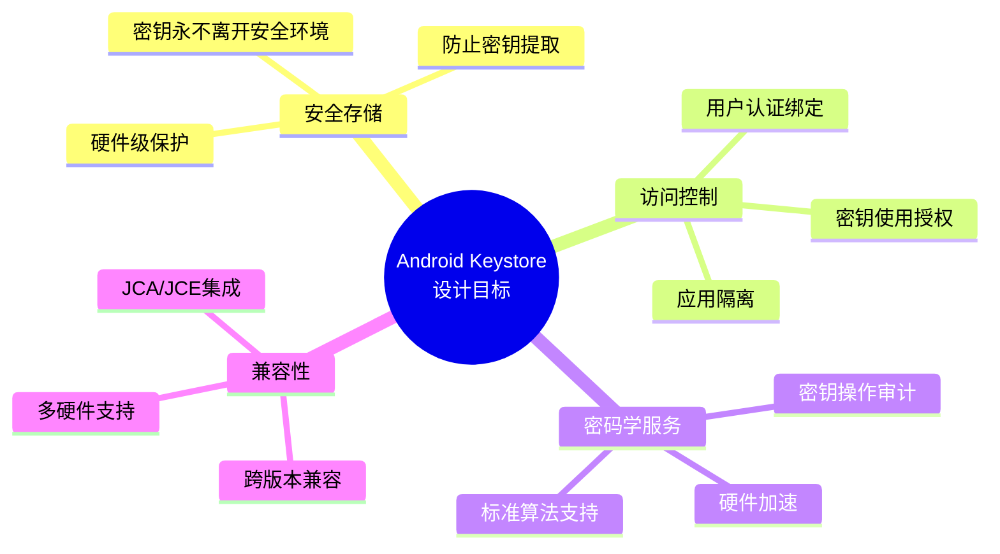
```mermaid
mindmap
  root((Android Keystore<br/>设计目标))
    安全存储
      密钥永不离开安全环境
      防止密钥提取
      硬件级保护
    访问控制
      应用隔离
      用户认证绑定
      密钥使用授权
    密码学服务
      标准算法支持
      硬件加速
      密钥操作审计
    兼容性
      JCA/JCE集成
      跨版本兼容
      多硬件支持
```

### 1.3 发展历史

| Android 版本 | 重要特性 |
|-------------|---------|
| 4.0 (API 14) | 引入基础 Keystore API |
| 4.3 (API 18) | 引入 Android Keystore Provider |
| 6.0 (API 23) | 硬件支持的密钥、指纹认证绑定 |
| 7.0 (API 24) | 密钥证明 (Key Attestation) |
| 8.0 (API 26) | ID 证明、密钥导入 |
| 9.0 (API 28) | StrongBox Keymaster 支持 |
| 10 (API 29) | 增强生物识别支持 |
| 12 (API 31) | 远程密钥配置 |

---

## 2. 整体架构

### 2.1 系统架构图

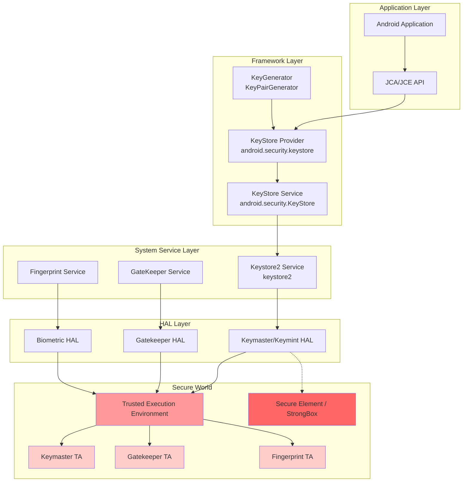
```mermaid
graph TB
    subgraph "Application Layer"
        APP[Android Application]
        JCA[JCA/JCE API]
    end

    subgraph "Framework Layer"
        KSP[KeyStore Provider<br/>android.security.keystore]
        KS[KeyStore Service<br/>android.security.KeyStore]
        KG[KeyGenerator<br/>KeyPairGenerator]
    end

    subgraph "System Service Layer"
        KSS[Keystore2 Service<br/>keystore2]
        GKBS[GateKeeper Service]
        FPS[Fingerprint Service]
    end

    subgraph "HAL Layer"
        KM_HAL[Keymaster/Keymint HAL]
        GK_HAL[Gatekeeper HAL]
        BP_HAL[Biometric HAL]
    end

    subgraph "Secure World"
        TEE[Trusted Execution Environment]
        TA_KM[Keymaster TA]
        TA_GK[Gatekeeper TA]
        TA_FP[Fingerprint TA]
        SE[Secure Element / StrongBox]
    end

    APP --> JCA
    JCA --> KSP
    KSP --> KS
    KS --> KSS
    KG --> KSP

    KSS --> KM_HAL
    GKBS --> GK_HAL
    FPS --> BP_HAL

    KM_HAL --> TEE
    GK_HAL --> TEE
    BP_HAL --> TEE

    TEE --> TA_KM
    TEE --> TA_GK
    TEE --> TA_FP

    KM_HAL -.-> SE

    style TEE fill:#ff9999
    style SE fill:#ff6666
    style TA_KM fill:#ffcccc
    style TA_GK fill:#ffcccc
    style TA_FP fill:#ffcccc
```

### 2.2 分层详解

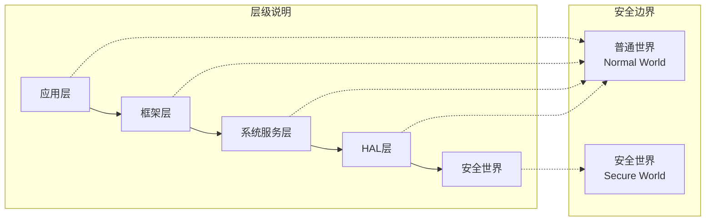
```mermaid
graph LR
    subgraph "层级说明"
        L1[应用层] --> L2[框架层]
        L2 --> L3[系统服务层]
        L3 --> L4[HAL层]
        L4 --> L5[安全世界]
    end

    subgraph "安全边界"
        B1[普通世界<br/>Normal World]
        B2[安全世界<br/>Secure World]
    end

    L1 -.-> B1
    L2 -.-> B1
    L3 -.-> B1
    L4 -.-> B1
    L5 -.-> B2
```

---

## 3. 核心组件详解

### 3.1 Keystore2 服务

Keystore2 是 Android 12 引入的新一代密钥存储服务，取代了原有的 keystored。

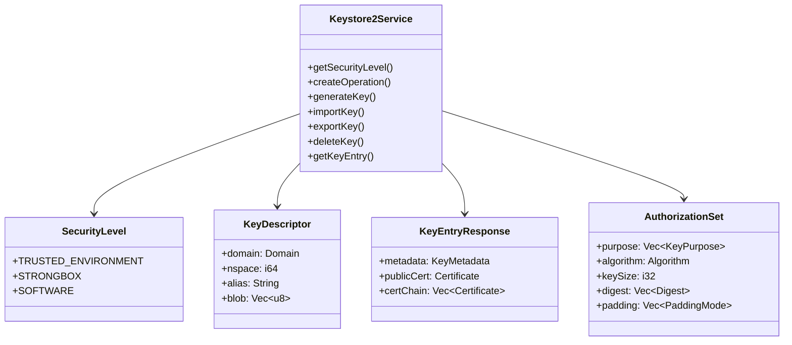
```mermaid
classDiagram
    class Keystore2Service {
        +getSecurityLevel()
        +createOperation()
        +generateKey()
        +importKey()
        +exportKey()
        +deleteKey()
        +getKeyEntry()
    }

    class SecurityLevel {
        +TRUSTED_ENVIRONMENT
        +STRONGBOX
        +SOFTWARE
    }

    class KeyDescriptor {
        +domain: Domain
        +nspace: i64
        +alias: String
        +blob: Vec~u8~
    }

    class KeyEntryResponse {
        +metadata: KeyMetadata
        +publicCert: Certificate
        +certChain: Vec~Certificate~
    }

    class AuthorizationSet {
        +purpose: Vec~KeyPurpose~
        +algorithm: Algorithm
        +keySize: i32
        +digest: Vec~Digest~
        +padding: Vec~PaddingMode~
    }

    Keystore2Service --> SecurityLevel
    Keystore2Service --> KeyDescriptor
    Keystore2Service --> KeyEntryResponse
    Keystore2Service --> AuthorizationSet
```

### 3.2 KeyMaster/KeyMint HAL

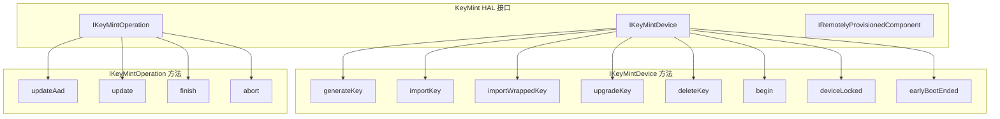
```mermaid
graph TB
    subgraph "KeyMint HAL 接口"
        direction LR
        IF1[IKeyMintDevice]
        IF2[IKeyMintOperation]
        IF3[IRemotelyProvisionedComponent]
    end

    subgraph "IKeyMintDevice 方法"
        M1[generateKey]
        M2[importKey]
        M3[importWrappedKey]
        M4[upgradeKey]
        M5[deleteKey]
        M6[begin]
        M7[deviceLocked]
        M8[earlyBootEnded]
    end

    subgraph "IKeyMintOperation 方法"
        O1[updateAad]
        O2[update]
        O3[finish]
        O4[abort]
    end

    IF1 --> M1
    IF1 --> M2
    IF1 --> M3
    IF1 --> M4
    IF1 --> M5
    IF1 --> M6
    IF1 --> M7
    IF1 --> M8

    IF2 --> O1
    IF2 --> O2
    IF2 --> O3
    IF2 --> O4
```

### 3.3 密钥存储结构

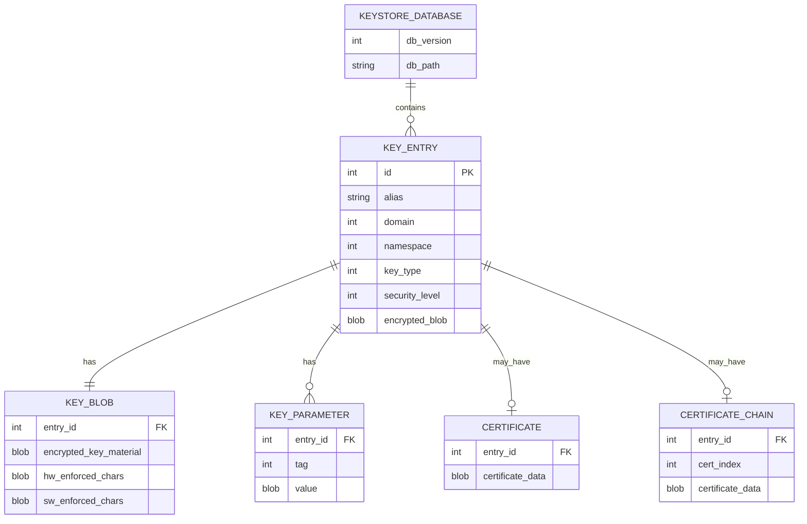
```mermaid
erDiagram
    KEYSTORE_DATABASE ||--o{ KEY_ENTRY : contains
    KEY_ENTRY ||--|| KEY_BLOB : has
    KEY_ENTRY ||--o{ KEY_PARAMETER : has
    KEY_ENTRY ||--o| CERTIFICATE : may_have
    KEY_ENTRY ||--o| CERTIFICATE_CHAIN : may_have

    KEYSTORE_DATABASE {
        int db_version
        string db_path
    }

    KEY_ENTRY {
        int id PK
        string alias
        int domain
        int namespace
        int key_type
        int security_level
        blob encrypted_blob
    }

    KEY_BLOB {
        int entry_id FK
        blob encrypted_key_material
        blob hw_enforced_chars
        blob sw_enforced_chars
    }

    KEY_PARAMETER {
        int entry_id FK
        int tag
        blob value
    }

    CERTIFICATE {
        int entry_id FK
        blob certificate_data
    }

    CERTIFICATE_CHAIN {
        int entry_id FK
        int cert_index
        blob certificate_data
    }
```

---

## 4. 安全硬件支持

### 4.1 TEE (可信执行环境)

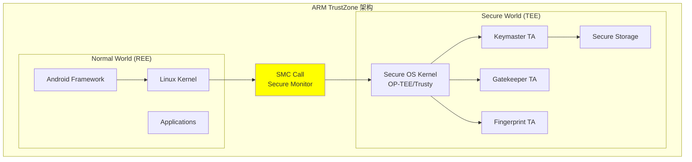
```mermaid
graph TB
    subgraph "ARM TrustZone 架构"
        subgraph "Normal World (REE)"
            NW_K[Linux Kernel]
            NW_A[Android Framework]
            NW_APP[Applications]
        end

        subgraph "Secure World (TEE)"
            SW_K[Secure OS Kernel<br/>OP-TEE/Trusty]
            SW_TA1[Keymaster TA]
            SW_TA2[Gatekeeper TA]
            SW_TA3[Fingerprint TA]
            SW_SS[Secure Storage]
        end

        SMC[SMC Call<br/>Secure Monitor]
    end

    NW_A --> NW_K
    NW_K --> SMC
    SMC --> SW_K
    SW_K --> SW_TA1
    SW_K --> SW_TA2
    SW_K --> SW_TA3
    SW_TA1 --> SW_SS

    style SMC fill:#ffff00
```

### 4.2 StrongBox 安全模块

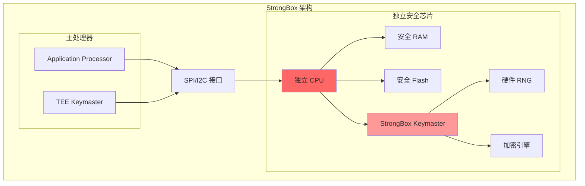
```mermaid
graph TB
    subgraph "StrongBox 架构"
        subgraph "主处理器"
            AP[Application Processor]
            TEE_KM[TEE Keymaster]
        end

        subgraph "独立安全芯片"
            SE_CPU[独立 CPU]
            SE_RAM[安全 RAM]
            SE_FLASH[安全 Flash]
            SE_RNG[硬件 RNG]
            SE_CRYPTO[加密引擎]
            SE_KM[StrongBox Keymaster]
        end

        SPI[SPI/I2C 接口]
    end

    AP --> SPI
    SPI --> SE_CPU
    TEE_KM --> SPI
    SE_CPU --> SE_RAM
    SE_CPU --> SE_FLASH
    SE_CPU --> SE_KM
    SE_KM --> SE_RNG
    SE_KM --> SE_CRYPTO

    style SE_CPU fill:#ff6666
    style SE_KM fill:#ff9999
```

### 4.3 安全级别对比

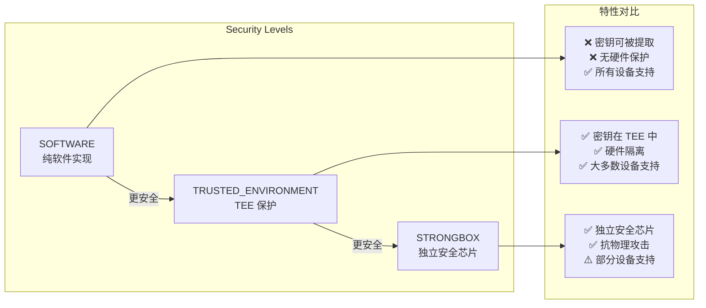
```mermaid
graph LR
    subgraph "Security Levels"
        SW[SOFTWARE<br/>纯软件实现]
        TEE_L[TRUSTED_ENVIRONMENT<br/>TEE 保护]
        SB[STRONGBOX<br/>独立安全芯片]
    end

    SW -->|更安全| TEE_L
    TEE_L -->|更安全| SB

    subgraph "特性对比"
        SW_F[❌ 密钥可被提取<br/>❌ 无硬件保护<br/>✅ 所有设备支持]
        TEE_F[✅ 密钥在 TEE 中<br/>✅ 硬件隔离<br/>✅ 大多数设备支持]
        SB_F[✅ 独立安全芯片<br/>✅ 抗物理攻击<br/>⚠️ 部分设备支持]
    end

    SW --> SW_F
    TEE_L --> TEE_F
    SB --> SB_F
```

---

## 5. 密钥类型与算法

### 5.1 支持的算法

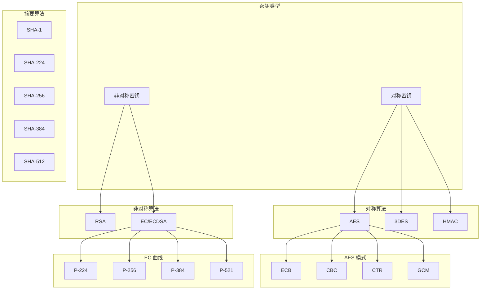
```mermaid
graph TB
    subgraph "密钥类型"
        SYM[对称密钥]
        ASYM[非对称密钥]
    end

    subgraph "对称算法"
        AES[AES]
        TRIPLE_DES[3DES]
        HMAC[HMAC]
    end

    subgraph "非对称算法"
        RSA[RSA]
        EC[EC/ECDSA]
    end

    subgraph "AES 模式"
        ECB[ECB]
        CBC[CBC]
        CTR[CTR]
        GCM[GCM]
    end

    subgraph "EC 曲线"
        P224[P-224]
        P256[P-256]
        P384[P-384]
        P521[P-521]
    end

    subgraph "摘要算法"
        SHA1[SHA-1]
        SHA224[SHA-224]
        SHA256[SHA-256]
        SHA384[SHA-384]
        SHA512[SHA-512]
    end

    SYM --> AES
    SYM --> TRIPLE_DES
    SYM --> HMAC

    ASYM --> RSA
    ASYM --> EC

    AES --> ECB
    AES --> CBC
    AES --> CTR
    AES --> GCM

    EC --> P224
    EC --> P256
    EC --> P384
    EC --> P521
```

### 5.2 算法参数配置

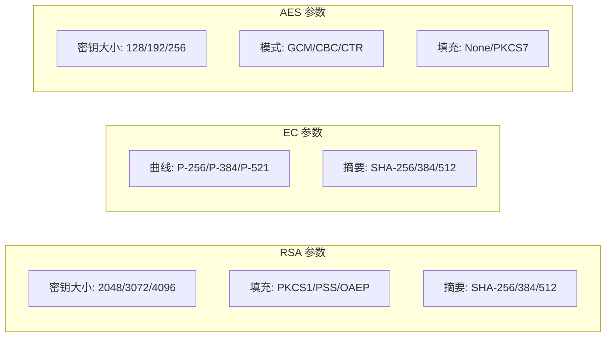
```mermaid
flowchart LR
    subgraph "RSA 参数"
        RSA_KS[密钥大小: 2048/3072/4096]
        RSA_PAD[填充: PKCS1/PSS/OAEP]
        RSA_DIG[摘要: SHA-256/384/512]
    end

    subgraph "EC 参数"
        EC_CURVE[曲线: P-256/P-384/P-521]
        EC_DIG[摘要: SHA-256/384/512]
    end

    subgraph "AES 参数"
        AES_KS[密钥大小: 128/192/256]
        AES_MODE[模式: GCM/CBC/CTR]
        AES_PAD[填充: None/PKCS7]
    end
```

---

## 6. 密钥生命周期

### 6.1 生命周期状态图

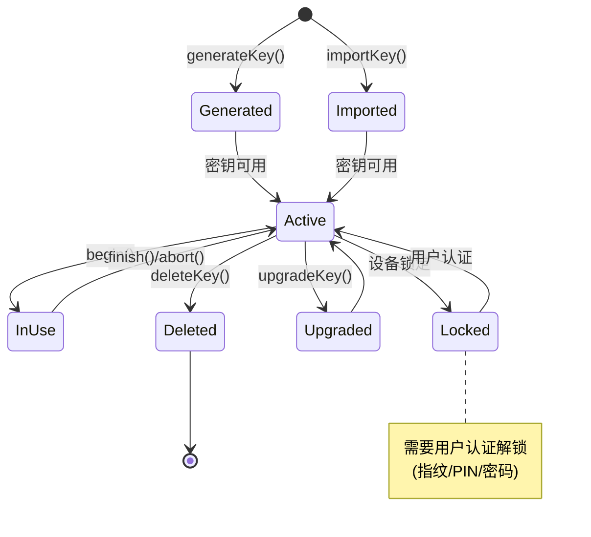
```mermaid
stateDiagram-v2
    [*] --> Generated: generateKey()
    [*] --> Imported: importKey()

    Generated --> Active: 密钥可用
    Imported --> Active: 密钥可用

    Active --> InUse: begin()
    InUse --> Active: finish()/abort()

    Active --> Locked: 设备锁定
    Locked --> Active: 用户认证

    Active --> Upgraded: upgradeKey()
    Upgraded --> Active

    Active --> Deleted: deleteKey()
    Deleted --> [*]

    note right of Locked
        需要用户认证解锁
        (指纹/PIN/密码)
    end note
```

### 6.2 密钥生成流程

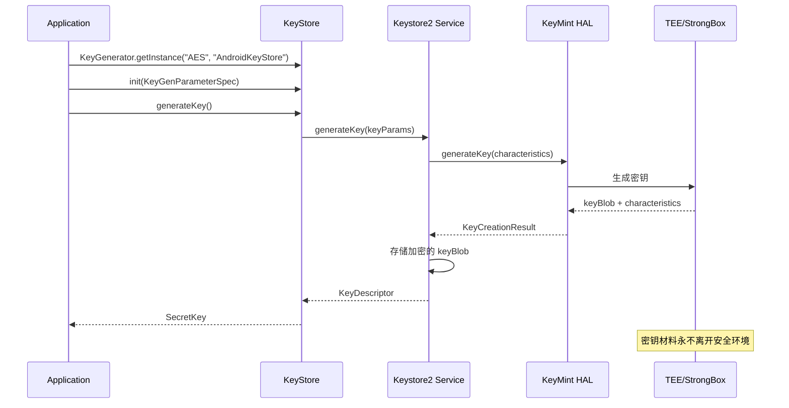
```mermaid
sequenceDiagram
    participant App as Application
    participant KS as KeyStore
    participant KS2 as Keystore2 Service
    participant KM as KeyMint HAL
    participant TEE as TEE/StrongBox

    App->>KS: KeyGenerator.getInstance("AES", "AndroidKeyStore")
    App->>KS: init(KeyGenParameterSpec)
    App->>KS: generateKey()

    KS->>KS2: generateKey(keyParams)
    KS2->>KM: generateKey(characteristics)
    KM->>TEE: 生成密钥
    TEE-->>KM: keyBlob + characteristics
    KM-->>KS2: KeyCreationResult
    KS2->>KS2: 存储加密的 keyBlob
    KS2-->>KS: KeyDescriptor
    KS-->>App: SecretKey

    Note over TEE: 密钥材料永不离开安全环境
```

### 6.3 密钥使用流程

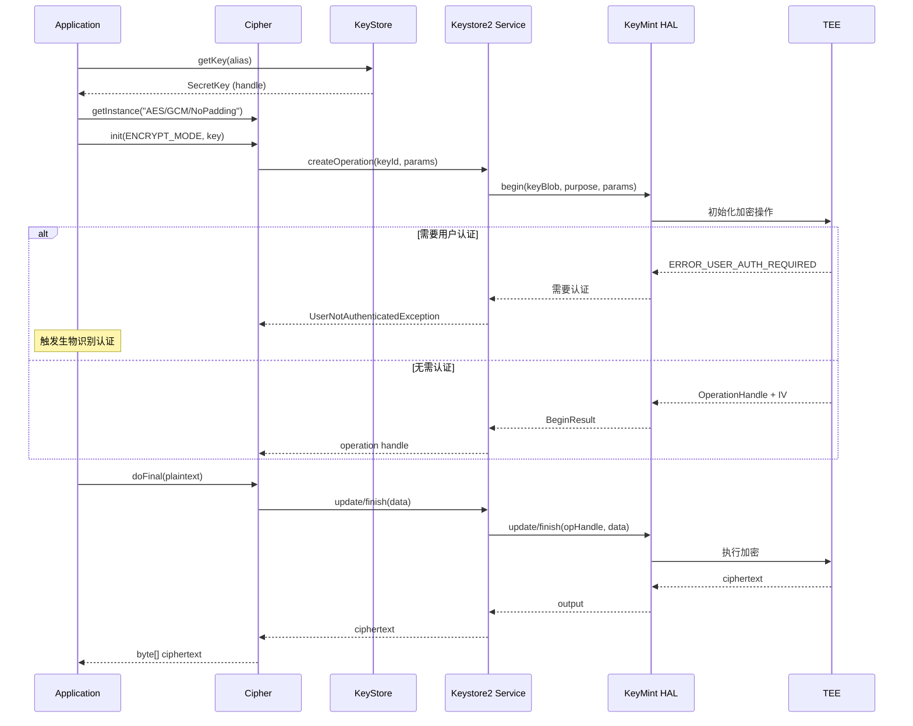
```mermaid
sequenceDiagram
    participant App as Application
    participant Cipher as Cipher
    participant KS as KeyStore
    participant KS2 as Keystore2 Service
    participant KM as KeyMint HAL
    participant TEE as TEE

    App->>KS: getKey(alias)
    KS-->>App: SecretKey (handle)

    App->>Cipher: getInstance("AES/GCM/NoPadding")
    App->>Cipher: init(ENCRYPT_MODE, key)

    Cipher->>KS2: createOperation(keyId, params)
    KS2->>KM: begin(keyBlob, purpose, params)
    KM->>TEE: 初始化加密操作

    alt 需要用户认证
        TEE-->>KM: ERROR_USER_AUTH_REQUIRED
        KM-->>KS2: 需要认证
        KS2-->>Cipher: UserNotAuthenticatedException
        Note over App: 触发生物识别认证
    else 无需认证
        TEE-->>KM: OperationHandle + IV
        KM-->>KS2: BeginResult
        KS2-->>Cipher: operation handle
    end

    App->>Cipher: doFinal(plaintext)
    Cipher->>KS2: update/finish(data)
    KS2->>KM: update/finish(opHandle, data)
    KM->>TEE: 执行加密
    TEE-->>KM: ciphertext
    KM-->>KS2: output
    KS2-->>Cipher: ciphertext
    Cipher-->>App: byte[] ciphertext
```

---

## 7. 密钥使用约束

### 7.1 约束类型

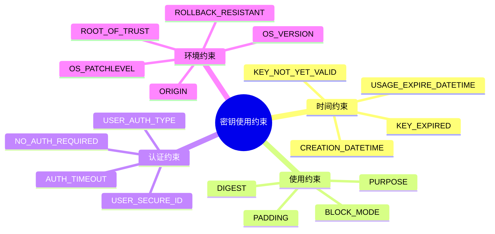
```mermaid
mindmap
  root((密钥使用约束))
    时间约束
      KEY_NOT_YET_VALID
      KEY_EXPIRED
      USAGE_EXPIRE_DATETIME
      CREATION_DATETIME
    使用约束
      PURPOSE
      PADDING
      DIGEST
      BLOCK_MODE
    认证约束
      USER_AUTH_TYPE
      AUTH_TIMEOUT
      USER_SECURE_ID
      NO_AUTH_REQUIRED
    环境约束
      ORIGIN
      ROLLBACK_RESISTANT
      ROOT_OF_TRUST
      OS_VERSION
      OS_PATCHLEVEL
```

### 7.2 用户认证绑定

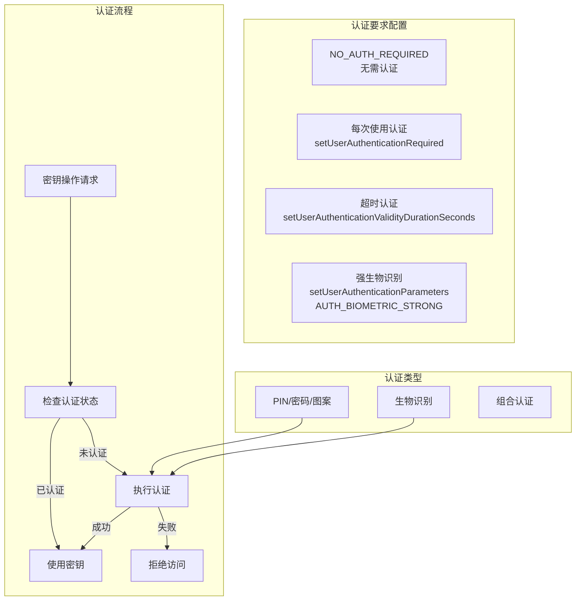
```mermaid
flowchart TB
    subgraph "认证类型"
        PIN[PIN/密码/图案]
        BIO[生物识别]
        COMBO[组合认证]
    end

    subgraph "认证要求配置"
        NONE[NO_AUTH_REQUIRED<br/>无需认证]
        EVERY[每次使用认证<br/>setUserAuthenticationRequired]
        TIMEOUT[超时认证<br/>setUserAuthenticationValidityDurationSeconds]
        STRONG[强生物识别<br/>setUserAuthenticationParameters<br/>AUTH_BIOMETRIC_STRONG]
    end

    subgraph "认证流程"
        REQ[密钥操作请求]
        CHECK[检查认证状态]
        AUTH[执行认证]
        USE[使用密钥]
        DENY[拒绝访问]
    end

    REQ --> CHECK
    CHECK -->|已认证| USE
    CHECK -->|未认证| AUTH
    AUTH -->|成功| USE
    AUTH -->|失败| DENY

    PIN --> AUTH
    BIO --> AUTH
```

### 7.3 密钥证明 (Key Attestation)

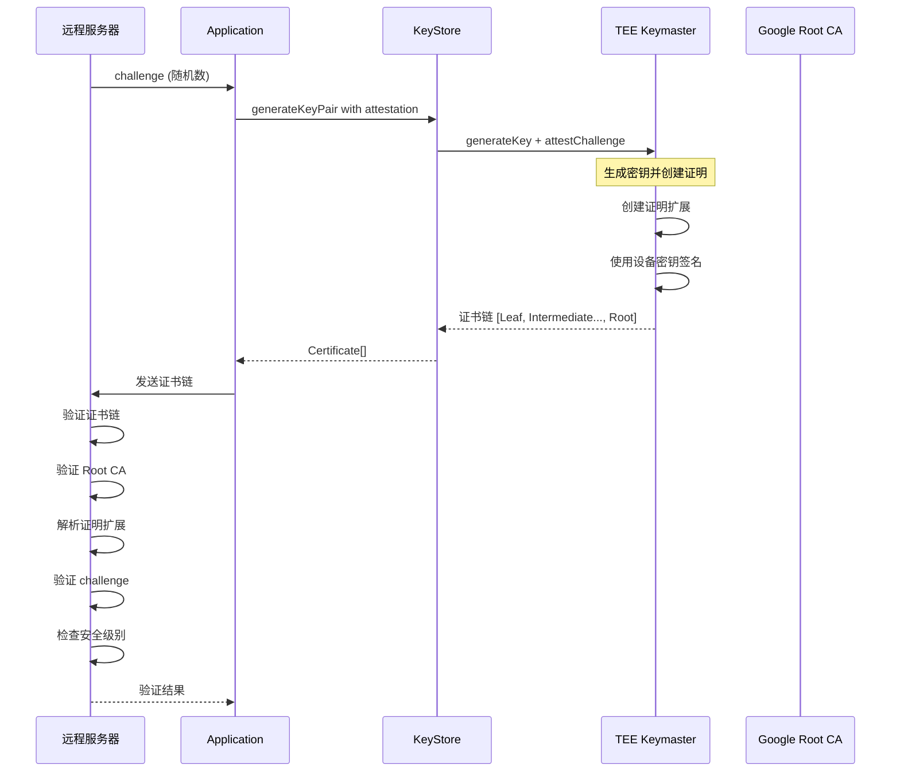
```mermaid
sequenceDiagram
    participant Server as 远程服务器
    participant App as Application
    participant KS as KeyStore
    participant TEE as TEE Keymaster
    participant Root as Google Root CA

    Server->>App: challenge (随机数)

    App->>KS: generateKeyPair with attestation
    KS->>TEE: generateKey + attestChallenge

    Note over TEE: 生成密钥并创建证明
    TEE->>TEE: 创建证明扩展
    TEE->>TEE: 使用设备密钥签名

    TEE-->>KS: 证书链 [Leaf, Intermediate..., Root]
    KS-->>App: Certificate[]

    App->>Server: 发送证书链

    Server->>Server: 验证证书链
    Server->>Server: 验证 Root CA
    Server->>Server: 解析证明扩展
    Server->>Server: 验证 challenge
    Server->>Server: 检查安全级别

    Server-->>App: 验证结果
```

### 7.4 证明扩展结构

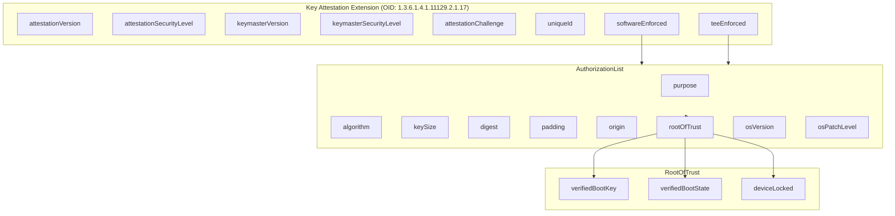
```mermaid
graph TB
    subgraph "Key Attestation Extension (OID: 1.3.6.1.4.1.11129.2.1.17)"
        V[attestationVersion]
        SC[attestationSecurityLevel]
        KV[keymasterVersion]
        KS[keymasterSecurityLevel]
        CH[attestationChallenge]
        UID[uniqueId]
        SW[softwareEnforced]
        TEE_E[teeEnforced]
    end

    subgraph "AuthorizationList"
        PUR[purpose]
        ALG[algorithm]
        KSZ[keySize]
        DIG[digest]
        PAD[padding]
        ORIG[origin]
        ROT[rootOfTrust]
        OS[osVersion]
        PATCH[osPatchLevel]
    end

    subgraph "RootOfTrust"
        VBK[verifiedBootKey]
        VBS[verifiedBootState]
        DL[deviceLocked]
    end

    SW --> AuthorizationList
    TEE_E --> AuthorizationList
    AuthorizationList --> ROT
    ROT --> VBK
    ROT --> VBS
    ROT --> DL
```

---

## 8. API 使用详解

### 8.1 密钥生成示例

```java
// 生成 AES 密钥
KeyGenerator keyGenerator = KeyGenerator.getInstance(
    KeyProperties.KEY_ALGORITHM_AES,
    "AndroidKeyStore"
);

KeyGenParameterSpec spec = new KeyGenParameterSpec.Builder(
    "my_aes_key",
    KeyProperties.PURPOSE_ENCRYPT | KeyProperties.PURPOSE_DECRYPT
)
    .setBlockModes(KeyProperties.BLOCK_MODE_GCM)
    .setEncryptionPaddings(KeyProperties.ENCRYPTION_PADDING_NONE)
    .setKeySize(256)
    .setUserAuthenticationRequired(true)
    .setUserAuthenticationParameters(
        0, // 每次使用都需要认证
        KeyProperties.AUTH_BIOMETRIC_STRONG
    )
    .setIsStrongBoxBacked(true)  // 使用 StrongBox
    .build();

keyGenerator.init(spec);
SecretKey secretKey = keyGenerator.generateKey();
```

### 8.2 API 类图

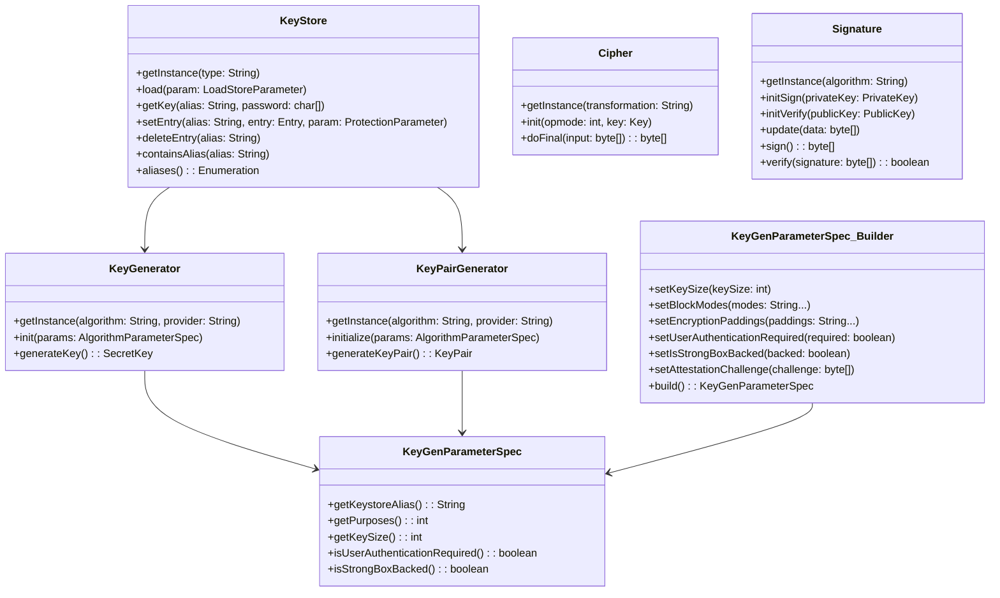
```mermaid
classDiagram
    class KeyStore {
        +getInstance(type: String)
        +load(param: LoadStoreParameter)
        +getKey(alias: String, password: char[])
        +setEntry(alias: String, entry: Entry, param: ProtectionParameter)
        +deleteEntry(alias: String)
        +containsAlias(alias: String)
        +aliases(): Enumeration
    }

    class KeyGenerator {
        +getInstance(algorithm: String, provider: String)
        +init(params: AlgorithmParameterSpec)
        +generateKey(): SecretKey
    }

    class KeyPairGenerator {
        +getInstance(algorithm: String, provider: String)
        +initialize(params: AlgorithmParameterSpec)
        +generateKeyPair(): KeyPair
    }

    class KeyGenParameterSpec {
        +getKeystoreAlias(): String
        +getPurposes(): int
        +getKeySize(): int
        +isUserAuthenticationRequired(): boolean
        +isStrongBoxBacked(): boolean
    }

    class KeyGenParameterSpec_Builder {
        +setKeySize(keySize: int)
        +setBlockModes(modes: String...)
        +setEncryptionPaddings(paddings: String...)
        +setUserAuthenticationRequired(required: boolean)
        +setIsStrongBoxBacked(backed: boolean)
        +setAttestationChallenge(challenge: byte[])
        +build(): KeyGenParameterSpec
    }

    class Cipher {
        +getInstance(transformation: String)
        +init(opmode: int, key: Key)
        +doFinal(input: byte[]): byte[]
    }

    class Signature {
        +getInstance(algorithm: String)
        +initSign(privateKey: PrivateKey)
        +initVerify(publicKey: PublicKey)
        +update(data: byte[])
        +sign(): byte[]
        +verify(signature: byte[]): boolean
    }

    KeyGenerator --> KeyGenParameterSpec
    KeyPairGenerator --> KeyGenParameterSpec
    KeyGenParameterSpec_Builder --> KeyGenParameterSpec
    KeyStore --> KeyGenerator
    KeyStore --> KeyPairGenerator
```

### 8.3 加密解密流程

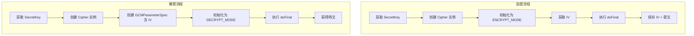
```mermaid
flowchart TB
    subgraph "加密流程"
        E1[获取 SecretKey]
        E2[创建 Cipher 实例]
        E3[初始化为 ENCRYPT_MODE]
        E4[获取 IV]
        E5[执行 doFinal]
        E6[保存 IV + 密文]
    end

    E1 --> E2 --> E3 --> E4 --> E5 --> E6

    subgraph "解密流程"
        D1[获取 SecretKey]
        D2[创建 Cipher 实例]
        D3[创建 GCMParameterSpec 含 IV]
        D4[初始化为 DECRYPT_MODE]
        D5[执行 doFinal]
        D6[获得明文]
    end

    D1 --> D2 --> D3 --> D4 --> D5 --> D6
```

---

## 9. 安全特性深入

### 9.1 密钥绑定机制

```mermaid
graph TB
    subgraph "密钥绑定层次"
        HW[硬件绑定<br/>Hardware Root Key]
        DEV[设备绑定<br/>Device Unique Key]
        USER[用户绑定<br/>User Password/Biometric]
        APP[应用绑定<br/>App Signature/UID]
    end

    HW --> DEV
    DEV --> USER
    USER --> APP

    subgraph "绑定效果"
        E1[密钥无法迁移到其他设备]
        E2[密钥无法在其他用户间共享]
        E3[密钥无法被其他应用访问]
        E4[恢复出厂设置密钥失效]
    end

    HW --> E1
    USER --> E2
    USER --> E4
    APP --> E3
```

### 9.2 密钥加密存储

```mermaid
graph TB
    subgraph "密钥存储加密"
        UK[用户密钥 Key]
        MEK[Master Encryption Key]
        DEK[Data Encryption Key]
        KB[Key Blob 存储]
    end

    subgraph "加密层次"
        L1[TEE 硬件密钥加密]
        L2[用户凭证派生密钥加密]
        L3[文件系统加密]
    end

    UK -->|AES-GCM| MEK
    MEK -->|AES-GCM| DEK
    DEK -->|加密| KB

    L1 --> L2 --> L3
```

### 9.3 Verified Boot 集成

```mermaid
stateDiagram-v2
    [*] --> BootROM
    BootROM --> Bootloader: 验证签名
    Bootloader --> Kernel: 验证签名
    Kernel --> System: dm-verity
    System --> TEE_Init: 启动 TEE
    TEE_Init --> Keymaster_Init: 传递 Root of Trust

    state "Root of Trust 数据" as ROT {
        vbKey: Verified Boot Key
        vbState: VERIFIED/SELF_SIGNED/UNVERIFIED
        deviceLocked: true/false
    }

    Keymaster_Init --> ROT

    Note right of ROT
        用于密钥证明
        防止在未验证系统上使用密钥
    end note
```

---

## 10. 相关概念发散

### 10.1 硬件安全模块 (HSM) 对比

```mermaid
graph TB
    subgraph "HSM 类型对比"
        subgraph "Android Keystore"
            AK1[软件 Keystore]
            AK2[TEE Keystore]
            AK3[StrongBox Keystore]
        end

        subgraph "传统 HSM"
            HSM1[网络 HSM]
            HSM2[PCIe HSM]
            HSM3[USB Token]
        end

        subgraph "云 HSM"
            CHSM1[AWS CloudHSM]
            CHSM2[Azure Key Vault HSM]
            CHSM3[GCP Cloud HSM]
        end
    end

    subgraph "安全级别"
        FIPS1[FIPS 140-2 Level 1]
        FIPS2[FIPS 140-2 Level 2]
        FIPS3[FIPS 140-2 Level 3]
        CC[Common Criteria]
    end

    AK1 -.-> FIPS1
    AK2 -.-> FIPS2
    AK3 -.-> FIPS3
    HSM2 -.-> FIPS3
    CHSM1 -.-> FIPS3
```

### 10.2 密钥管理生态系统

```mermaid
mindmap
  root((密钥管理<br/>生态系统))
    PKI 体系
      CA 证书颁发
      证书链验证
      CRL/OCSP
      证书透明度
    密钥派生
      PBKDF2
      HKDF
      Argon2
      scrypt
    密钥协商
      Diffie-Hellman
      ECDH
      X25519
      Key Encapsulation
    密钥存储
      Keystore
      Keychain iOS
      TPM
      HSM
      Vault
    密钥使用场景
      数据加密
      数字签名
      身份认证
      密钥交换
      消息认证
```

### 10.3 可信执行环境 (TEE) 技术

```mermaid
graph TB
    subgraph "TEE 技术实现"
        subgraph "ARM TrustZone"
            TZ1[Secure World]
            TZ2[Normal World]
            TZ3[SMC 调用]
        end

        subgraph "Intel SGX"
            SGX1[Enclave]
            SGX2[Sealed Storage]
            SGX3[Remote Attestation]
        end

        subgraph "AMD SEV"
            SEV1[Secure Encrypted VM]
            SEV2[Memory Encryption]
        end

        subgraph "RISC-V Keystone"
            KS1[Enclave]
            KS2[Security Monitor]
        end
    end

    subgraph "Android TEE OS"
        OP_TEE[OP-TEE<br/>开源]
        Trusty[Trusty OS<br/>Google]
        QSEE[QSEE<br/>Qualcomm]
        iTrustee[iTrustee<br/>Huawei]
        Kinibi[Kinibi<br/>Trustonic]
    end
```

### 10.4 生物识别集成

```mermaid
sequenceDiagram
    participant App
    participant BiometricPrompt
    participant BiometricService
    participant FingerprintHAL
    participant TEE
    participant Keystore

    App->>BiometricPrompt: authenticate(cryptoObject)
    BiometricPrompt->>BiometricService: 请求认证
    BiometricService->>FingerprintHAL: 采集指纹
    FingerprintHAL->>TEE: 验证指纹

    alt 认证成功
        TEE-->>FingerprintHAL: HardwareAuthToken
        FingerprintHAL-->>BiometricService: 成功 + HAT
        BiometricService->>Keystore: 提供 HAT
        Keystore->>TEE: 验证 HAT 并解锁密钥
        TEE-->>Keystore: 密钥可用
        BiometricService-->>BiometricPrompt: 成功
        BiometricPrompt-->>App: onAuthenticationSucceeded(cryptoObject)
        Note over App: 现在可以使用密钥
    else 认证失败
        TEE-->>FingerprintHAL: 失败
        FingerprintHAL-->>BiometricService: 失败
        BiometricService-->>BiometricPrompt: 失败
        BiometricPrompt-->>App: onAuthenticationFailed()
    end
```

### 10.5 密码学基础概念

```mermaid
graph TB
    subgraph "对称加密"
        SE[对称加密]
        SE --> AES_A[AES]
        SE --> DES[DES/3DES]
        SE --> ChaCha[ChaCha20]

        subgraph "模式"
            ECB_M[ECB - 不安全]
            CBC_M[CBC]
            CTR_M[CTR]
            GCM_M[GCM - AEAD]
        end
        AES_A --> ECB_M
        AES_A --> CBC_M
        AES_A --> CTR_M
        AES_A --> GCM_M
    end

    subgraph "非对称加密"
        ASE[非对称加密]
        ASE --> RSA_A[RSA]
        ASE --> ECC[ECC]
        ASE --> ED[EdDSA]

        subgraph "用途"
            ENC[加密]
            SIG[签名]
            KEX[密钥交换]
        end
        RSA_A --> ENC
        RSA_A --> SIG
        ECC --> SIG
        ECC --> KEX
    end

    subgraph "哈希函数"
        HASH[哈希函数]
        HASH --> SHA2[SHA-2]
        HASH --> SHA3[SHA-3]
        HASH --> BLAKE[BLAKE2/3]
    end
```

---

## 11. 攻击面分析

### 11.1 潜在攻击向量

```mermaid
graph TB
    subgraph "攻击面"
        subgraph "软件层攻击"
            A1[API 滥用]
            A2[权限绕过]
            A3[时序攻击]
            A4[侧信道攻击]
        end

        subgraph "系统层攻击"
            B1[Root/Unlock 攻击]
            B2[Bootloader 解锁]
            B3[降级攻击]
            B4[内核漏洞利用]
        end

        subgraph "硬件层攻击"
            C1[物理提取]
            C2[故障注入]
            C3[电磁分析]
            C4[功耗分析]
        end
    end

    subgraph "防护措施"
        D1[密钥证明验证]
        D2[Verified Boot 检查]
        D3[用户认证绑定]
        D4[StrongBox 使用]
    end

    A1 --> D1
    B1 --> D2
    B2 --> D2
    A2 --> D3
    C1 --> D4
    C2 --> D4
```

### 11.2 安全评估检查点

```mermaid
flowchart LR
    subgraph "安全检查清单"
        CK1[✓ 使用硬件支持的密钥]
        CK2[✓ 启用用户认证]
        CK3[✓ 验证密钥证明]
        CK4[✓ 检查安全级别]
        CK5[✓ 使用强加密算法]
        CK6[✓ 正确处理异常]
        CK7[✓ 实施密钥轮换]
    end
```

---

## 12. 最佳实践

### 12.1 密钥管理最佳实践

```mermaid
graph TB
    subgraph "密钥生成"
        G1[优先使用 StrongBox]
        G2[设置适当的密钥大小]
        G3[配置使用约束]
        G4[启用密钥证明]
    end

    subgraph "密钥使用"
        U1[绑定用户认证]
        U2[使用 AEAD 模式]
        U3[正确管理 IV/Nonce]
        U4[处理认证超时]
    end

    subgraph "密钥存储"
        S1[不要导出私钥]
        S2[使用唯一别名]
        S3[实施密钥轮换]
        S4[安全删除旧密钥]
    end

    subgraph "错误处理"
        E1[处理 KeyPermanentlyInvalidatedException]
        E2[处理 UserNotAuthenticatedException]
        E3[实现优雅降级]
    end
```

### 12.2 代码示例 - 完整加密解密

```java
public class SecureKeyManager {
    private static final String KEY_ALIAS = "secure_key";
    private static final String TRANSFORMATION = "AES/GCM/NoPadding";

    // 生成密钥
    public void generateKey() throws GeneralSecurityException {
        KeyGenerator keyGenerator = KeyGenerator.getInstance(
            KeyProperties.KEY_ALGORITHM_AES,
            "AndroidKeyStore"
        );

        KeyGenParameterSpec.Builder builder = new KeyGenParameterSpec.Builder(
            KEY_ALIAS,
            KeyProperties.PURPOSE_ENCRYPT | KeyProperties.PURPOSE_DECRYPT
        )
        .setBlockModes(KeyProperties.BLOCK_MODE_GCM)
        .setEncryptionPaddings(KeyProperties.ENCRYPTION_PADDING_NONE)
        .setKeySize(256)
        .setUserAuthenticationRequired(true)
        .setUserAuthenticationParameters(0, AUTH_BIOMETRIC_STRONG);

        // 尝试使用 StrongBox
        if (Build.VERSION.SDK_INT >= Build.VERSION_CODES.P) {
            try {
                builder.setIsStrongBoxBacked(true);
            } catch (StrongBoxUnavailableException e) {
                // 降级到 TEE
            }
        }

        keyGenerator.init(builder.build());
        keyGenerator.generateKey();
    }

    // 加密
    public EncryptedData encrypt(byte[] plaintext) throws GeneralSecurityException {
        KeyStore keyStore = KeyStore.getInstance("AndroidKeyStore");
        keyStore.load(null);
        SecretKey key = (SecretKey) keyStore.getKey(KEY_ALIAS, null);

        Cipher cipher = Cipher.getInstance(TRANSFORMATION);
        cipher.init(Cipher.ENCRYPT_MODE, key);

        byte[] iv = cipher.getIV();
        byte[] ciphertext = cipher.doFinal(plaintext);

        return new EncryptedData(iv, ciphertext);
    }

    // 解密
    public byte[] decrypt(EncryptedData data) throws GeneralSecurityException {
        KeyStore keyStore = KeyStore.getInstance("AndroidKeyStore");
        keyStore.load(null);
        SecretKey key = (SecretKey) keyStore.getKey(KEY_ALIAS, null);

        Cipher cipher = Cipher.getInstance(TRANSFORMATION);
        GCMParameterSpec spec = new GCMParameterSpec(128, data.iv);
        cipher.init(Cipher.DECRYPT_MODE, key, spec);

        return cipher.doFinal(data.ciphertext);
    }
}
```

### 12.3 决策树 - 选择合适的安全级别

```mermaid
flowchart TD
    START[需要存储敏感密钥] --> Q1{对安全性要求?}

    Q1 -->|最高| Q2{设备支持 StrongBox?}
    Q2 -->|是| SB[使用 StrongBox]
    Q2 -->|否| TEE[使用 TEE Keymaster]

    Q1 -->|中等| Q3{需要硬件保护?}
    Q3 -->|是| TEE
    Q3 -->|否| SW[使用软件 Keystore]

    Q1 -->|基本| SW

    SB --> Q4{需要用户认证?}
    TEE --> Q4
    SW --> Q4

    Q4 -->|每次使用| AUTH_EVERY[setUserAuthenticationRequired + timeout=0]
    Q4 -->|定期| AUTH_TIMEOUT[setUserAuthenticationValidityDurationSeconds]
    Q4 -->|不需要| NO_AUTH[默认配置]

    AUTH_EVERY --> Q5{认证类型?}
    Q5 -->|生物识别| BIO[AUTH_BIOMETRIC_STRONG]
    Q5 -->|任意| ANY[AUTH_DEVICE_CREDENTIAL | AUTH_BIOMETRIC_STRONG]
```

---

## 总结

Android Keystore 系统是一个多层次的安全框架，从应用层 API 到硬件安全模块提供了完整的密钥管理解决方案。核心要点：

1. **分层架构**: 应用层 → 框架层 → 系统服务 → HAL → TEE/StrongBox
2. **安全级别**: SOFTWARE < TEE < StrongBox，根据需求选择
3. **密钥绑定**: 支持设备、用户、应用多级绑定
4. **密钥证明**: 允许远程验证密钥的安全属性
5. **生物识别集成**: 与指纹、面部识别等无缝集成

正确使用 Android Keystore 可以有效保护应用中的敏感数据和密钥材料。
