# RPMB安全存储单点问题与优化设计方案

## 1. 执行摘要

本文档针对车载系统中RPMB（Replay Protected Memory Block）安全存储的单点故障问题，提出一套完整的优化设计方案。该方案基于高通和MediaTek平台的实际情况，通过混合存储镜像机制、软件缓存优化、异步驱动改造以及云端仲裁策略，在不牺牲安全性的前提下，解决RPMB作为单点存储带来的可靠性风险。

方案遵循GB 44495-2024、GB/T 32960.2-2025及UN R155等法规要求，确保技术演进与合规性同步。

---

## 2. RPMB技术原理与现状分析

### 2.1 RPMB工作原理

RPMB是eMMC/UFS存储规范中定义的特殊安全分区，通过HMAC-SHA256认证机制提供防重放保护。

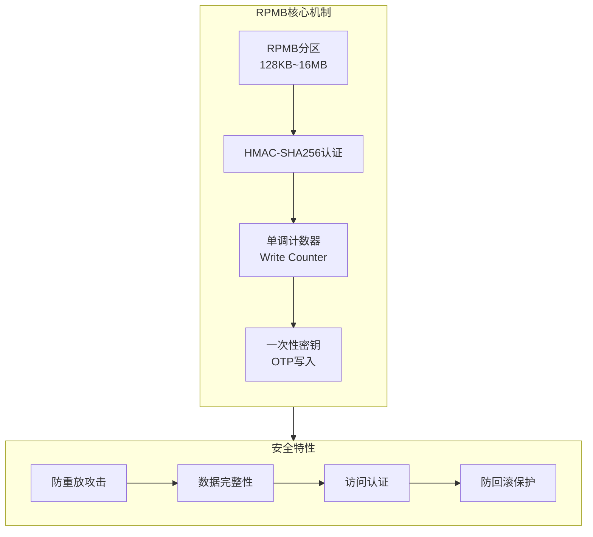
```mermaid
flowchart TB
    subgraph RPMB核心机制
        direction TB
        A[RPMB分区<br/>128KB~16MB] --> B[HMAC-SHA256认证]
        B --> C[单调计数器<br/>Write Counter]
        C --> D[一次性密钥<br/>OTP写入]
    end

    subgraph 安全特性
        E[防重放攻击] --> F[数据完整性]
        F --> G[访问认证]
        G --> H[防回滚保护]
    end

    RPMB核心机制 --> 安全特性
```

**RPMB关键特性：**

| 特性 | 说明 |
|------|------|
| 认证机制 | HMAC-SHA256，密钥由TEE派生并写入存储控制器 |
| 写入保护 | 每次写入必须携带递增的Write Counter |
| 密钥存储 | 一次性可编程（OTP），烧录后不可更改 |
| 分区大小 | 固定大小（128KB~16MB），出厂后不可调整 |
| 原子性 | 单块写入操作保证原子性 |

### 2.2 车载系统RPMB应用场景

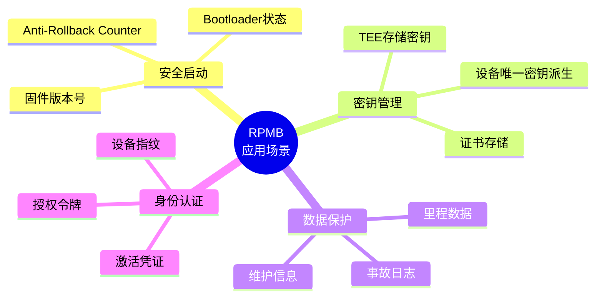
```mermaid
mindmap
  root((RPMB<br/>应用场景))
    安全启动
      Anti-Rollback Counter
      Bootloader状态
      固件版本号
    密钥管理
      TEE存储密钥
      设备唯一密钥派生
      证书存储
    数据保护
      里程数据
      事故日志
      维护信息
    身份认证
      设备指纹
      激活凭证
      授权令牌
```

### 2.3 当前架构与平台差异

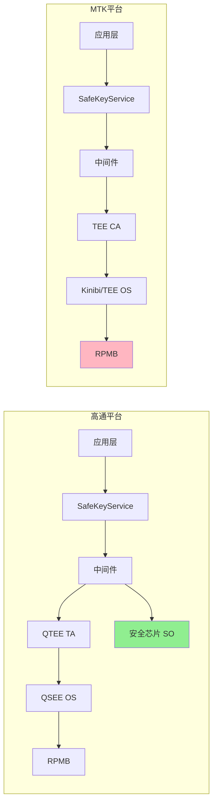
```mermaid
flowchart LR
    subgraph 高通平台
        QA[应用层] --> QB[SafeKeyService]
        QB --> QC[中间件]
        QC --> QD[QTEE TA]
        QD --> QE[QSEE OS]
        QE --> QF[RPMB]
        QC --> QG[安全芯片 SO]
    end

    subgraph MTK平台
        MA[应用层] --> MB[SafeKeyService]
        MB --> MC[中间件]
        MC --> MD[TEE CA]
        MD --> ME[Kinibi/TEE OS]
        ME --> MF[RPMB]
    end

    style QG fill:#90EE90
    style MF fill:#FFB6C1
```

**平台对比分析：**

| 维度 | 高通平台 | MTK平台 |
|------|----------|---------|
| TEE实现 | QTEE/QSEE | Kinibi/OP-TEE |
| 安全芯片 | 支持外挂SE | 通常仅TEE |
| RPMB稳定性 | 相对稳定 | 历史上有稳定性挑战 |
| 备份路径 | SE可作为备份 | 缺乏硬件备份 |

---

## 3. 单点故障问题深度分析

### 3.1 故障场景分类

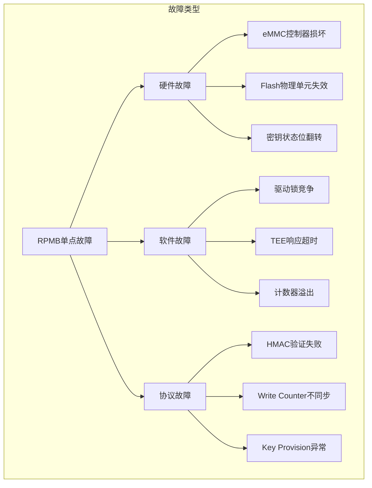
```mermaid
flowchart TB
    subgraph 故障类型
        A[RPMB单点故障] --> B[硬件故障]
        A --> C[软件故障]
        A --> D[协议故障]

        B --> B1[eMMC控制器损坏]
        B --> B2[Flash物理单元失效]
        B --> B3[密钥状态位翻转]

        C --> C1[驱动锁竞争]
        C --> C2[TEE响应超时]
        C --> C3[计数器溢出]

        D --> D1[HMAC验证失败]
        D --> D2[Write Counter不同步]
        D --> D3[Key Provision异常]
    end
```

### 3.2 MTK平台特有问题分析

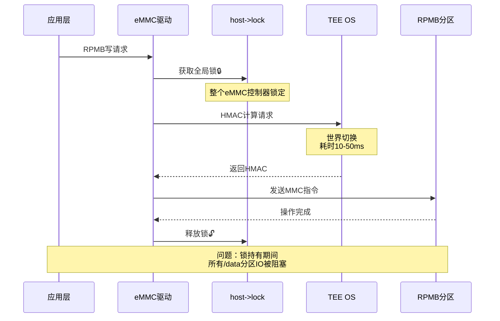
```mermaid
sequenceDiagram
    participant APP as 应用层
    participant Driver as eMMC驱动
    participant Lock as host->lock
    participant TEE as TEE OS
    participant RPMB as RPMB分区

    APP->>Driver: RPMB写请求
    Driver->>Lock: 获取全局锁🔒
    Note over Lock: 整个eMMC控制器锁定
    Driver->>TEE: HMAC计算请求
    Note over TEE: 世界切换<br/>耗时10-50ms
    TEE-->>Driver: 返回HMAC
    Driver->>RPMB: 发送MMC指令
    RPMB-->>Driver: 操作完成
    Driver->>Lock: 释放锁🔓

    Note over APP,RPMB: 问题：锁持有期间<br/>所有/data分区IO被阻塞
```

**根因分析：**

1. **全局大锁问题**：MTK BSP内核中，RPMB操作复用eMMC主控制器的互斥锁
2. **单线程队列**：标准mmc_blk驱动为单线程处理，RPMB多次往返导致延迟累积
3. **TEE等待阻塞**：HMAC计算期间控制器锁未释放，导致系统IO挂起

### 3.3 故障影响评估

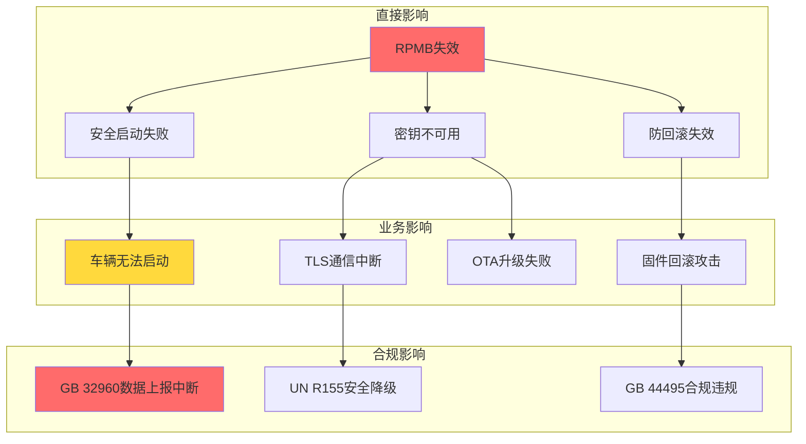
```mermaid
flowchart TB
    subgraph 直接影响
        A[RPMB失效] --> B[安全启动失败]
        A --> C[密钥不可用]
        A --> D[防回滚失效]
    end

    subgraph 业务影响
        B --> E[车辆无法启动]
        C --> F[TLS通信中断]
        C --> G[OTA升级失败]
        D --> H[固件回滚攻击]
    end

    subgraph 合规影响
        E --> I[GB 32960数据上报中断]
        F --> J[UN R155安全降级]
        H --> K[GB 44495合规违规]
    end

    style A fill:#FF6B6B
    style E fill:#FFD93D
    style I fill:#FF6B6B
```

---

## 4. 优化架构设计

### 4.1 整体架构

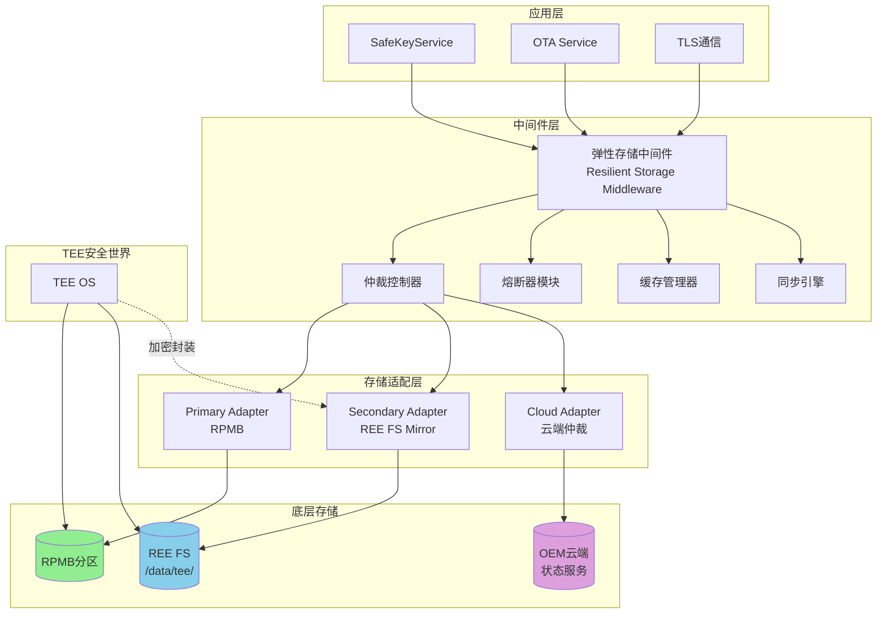
```mermaid
flowchart TB
    subgraph 应用层
        APP1[SafeKeyService]
        APP2[OTA Service]
        APP3[TLS通信]
    end

    subgraph 中间件层
        MW[弹性存储中间件<br/>Resilient Storage Middleware]
        MW --> ARB[仲裁控制器]
        MW --> CB[熔断器模块]
        MW --> CACHE[缓存管理器]
        MW --> SYNC[同步引擎]
    end

    subgraph 存储适配层
        ARB --> PA[Primary Adapter<br/>RPMB]
        ARB --> SA[Secondary Adapter<br/>REE FS Mirror]
        ARB --> CA[Cloud Adapter<br/>云端仲裁]
    end

    subgraph 底层存储
        PA --> RPMB[(RPMB分区)]
        SA --> REEFS[(REE FS<br/>/data/tee/)]
        CA --> CLOUD[(OEM云端<br/>状态服务)]
    end

    subgraph TEE安全世界
        TEE[TEE OS] --> RPMB
        TEE --> REEFS
        TEE -.-> |加密封装| SA
    end

    APP1 --> MW
    APP2 --> MW
    APP3 --> MW

    style RPMB fill:#90EE90
    style REEFS fill:#87CEEB
    style CLOUD fill:#DDA0DD
```

### 4.2 组件详细设计

#### 4.2.1 弹性存储中间件（RSM）组件架构

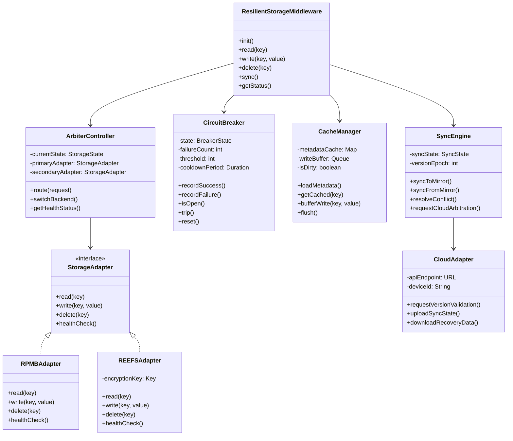
```mermaid
classDiagram
    class ResilientStorageMiddleware {
        +init()
        +read(key)
        +write(key, value)
        +delete(key)
        +sync()
        +getStatus()
    }

    class ArbiterController {
        -currentState: StorageState
        -primaryAdapter: StorageAdapter
        -secondaryAdapter: StorageAdapter
        +route(request)
        +switchBackend()
        +getHealthStatus()
    }

    class CircuitBreaker {
        -state: BreakerState
        -failureCount: int
        -threshold: int
        -cooldownPeriod: Duration
        +recordSuccess()
        +recordFailure()
        +isOpen()
        +trip()
        +reset()
    }

    class CacheManager {
        -metadataCache: Map
        -writeBuffer: Queue
        -isDirty: boolean
        +loadMetadata()
        +getCached(key)
        +bufferWrite(key, value)
        +flush()
    }

    class SyncEngine {
        -syncState: SyncState
        -versionEpoch: int
        +syncToMirror()
        +syncFromMirror()
        +resolveConflict()
        +requestCloudArbitration()
    }

    class StorageAdapter {
        <<interface>>
        +read(key)
        +write(key, value)
        +delete(key)
        +healthCheck()
    }

    class RPMBAdapter {
        +read(key)
        +write(key, value)
        +delete(key)
        +healthCheck()
    }

    class REEFSAdapter {
        -encryptionKey: Key
        +read(key)
        +write(key, value)
        +delete(key)
        +healthCheck()
    }

    class CloudAdapter {
        -apiEndpoint: URL
        -deviceId: String
        +requestVersionValidation()
        +uploadSyncState()
        +downloadRecoveryData()
    }

    ResilientStorageMiddleware --> ArbiterController
    ResilientStorageMiddleware --> CircuitBreaker
    ResilientStorageMiddleware --> CacheManager
    ResilientStorageMiddleware --> SyncEngine

    ArbiterController --> StorageAdapter
    StorageAdapter <|.. RPMBAdapter
    StorageAdapter <|.. REEFSAdapter

    SyncEngine --> CloudAdapter
```

#### 4.2.2 存储状态机设计

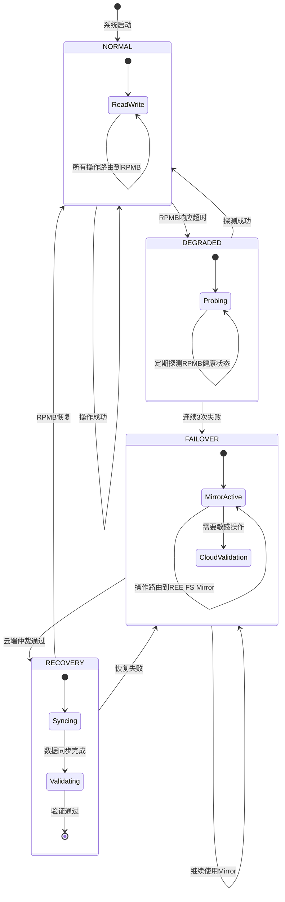
```mermaid
stateDiagram-v2
    [*] --> NORMAL: 系统启动

    NORMAL --> DEGRADED: RPMB响应超时
    NORMAL --> NORMAL: 操作成功

    DEGRADED --> FAILOVER: 连续3次失败
    DEGRADED --> NORMAL: 探测成功

    FAILOVER --> RECOVERY: 云端仲裁通过
    FAILOVER --> FAILOVER: 继续使用Mirror

    RECOVERY --> NORMAL: RPMB恢复
    RECOVERY --> FAILOVER: 恢复失败

    state NORMAL {
        [*] --> ReadWrite
        ReadWrite --> ReadWrite: 所有操作路由到RPMB
    }

    state DEGRADED {
        [*] --> Probing
        Probing --> Probing: 定期探测RPMB健康状态
    }

    state FAILOVER {
        [*] --> MirrorActive
        MirrorActive --> MirrorActive: 操作路由到REE FS Mirror
        MirrorActive --> CloudValidation: 需要敏感操作
    }

    state RECOVERY {
        [*] --> Syncing
        Syncing --> Validating: 数据同步完成
        Validating --> [*]: 验证通过
    }
```

### 4.3 熔断器模式详细设计

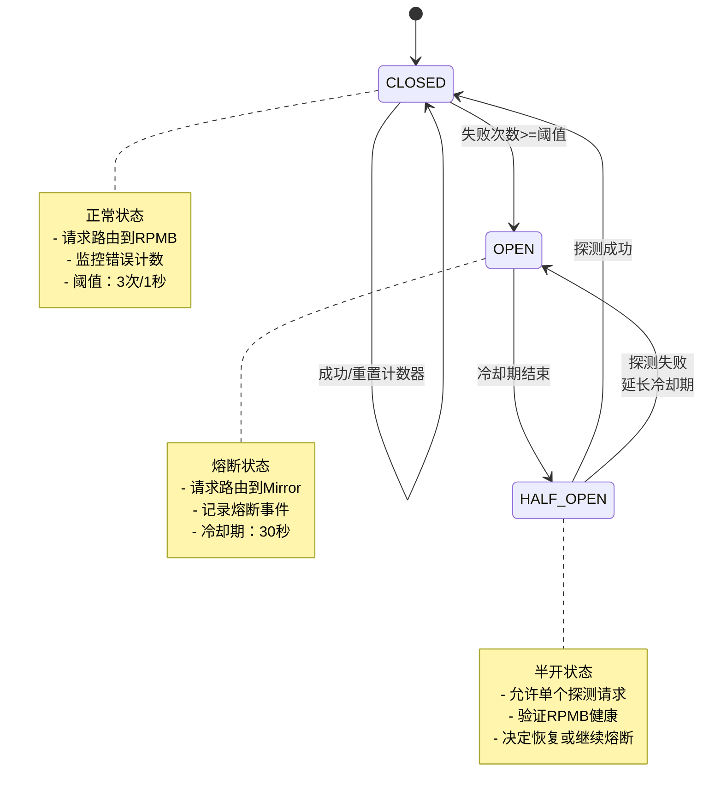
```mermaid
stateDiagram-v2
    [*] --> CLOSED

    CLOSED --> CLOSED: 成功/重置计数器
    CLOSED --> OPEN: 失败次数>=阈值

    OPEN --> HALF_OPEN: 冷却期结束

    HALF_OPEN --> CLOSED: 探测成功
    HALF_OPEN --> OPEN: 探测失败<br/>延长冷却期

    note right of CLOSED
        正常状态
        - 请求路由到RPMB
        - 监控错误计数
        - 阈值：3次/1秒
    end note

    note right of OPEN
        熔断状态
        - 请求路由到Mirror
        - 记录熔断事件
        - 冷却期：30秒
    end note

    note right of HALF_OPEN
        半开状态
        - 允许单个探测请求
        - 验证RPMB健康
        - 决定恢复或继续熔断
    end note
```

---

## 5. 混合存储镜像机制

### 5.1 镜像架构设计

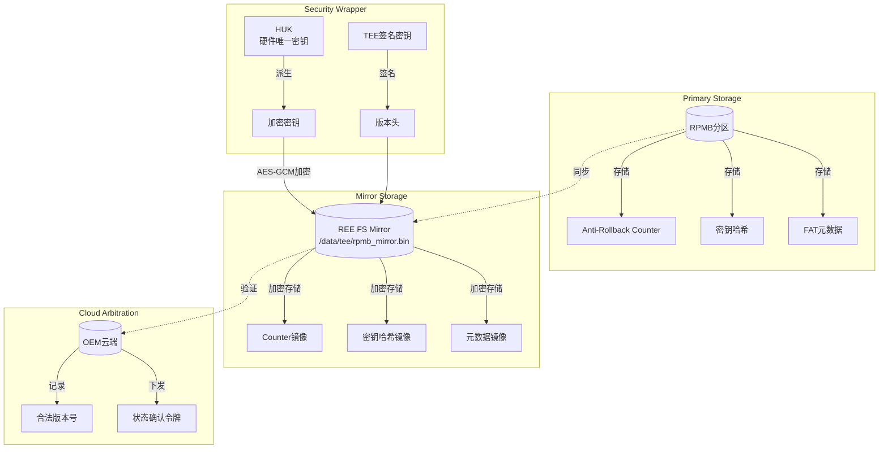
```mermaid
flowchart TB
    subgraph Primary Storage
        RPMB[(RPMB分区)]
        RPMB --> |存储| D1[Anti-Rollback Counter]
        RPMB --> |存储| D2[密钥哈希]
        RPMB --> |存储| D3[FAT元数据]
    end

    subgraph Mirror Storage
        MIRROR[(REE FS Mirror<br/>/data/tee/rpmb_mirror.bin)]
        MIRROR --> |加密存储| M1[Counter镜像]
        MIRROR --> |加密存储| M2[密钥哈希镜像]
        MIRROR --> |加密存储| M3[元数据镜像]
    end

    subgraph Security Wrapper
        HUK[HUK<br/>硬件唯一密钥] --> |派生| EK[加密密钥]
        EK --> |AES-GCM加密| MIRROR
        TEE_SK[TEE签名密钥] --> |签名| VH[版本头]
        VH --> MIRROR
    end

    subgraph Cloud Arbitration
        CLOUD[(OEM云端)]
        CLOUD --> |记录| CV[合法版本号]
        CLOUD --> |下发| TOKEN[状态确认令牌]
    end

    RPMB -.-> |同步| MIRROR
    MIRROR -.-> |验证| CLOUD
```

### 5.2 镜像文件结构

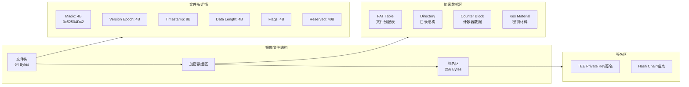
```mermaid
flowchart LR
    subgraph MirrorFile[镜像文件结构]
        direction TB
        H[文件头<br/>64 Bytes] --> D[加密数据区]
        D --> S[签名区<br/>256 Bytes]
    end

    subgraph Header[文件头详情]
        H1[Magic: 4B<br/>0x52504D42]
        H2[Version Epoch: 4B]
        H3[Timestamp: 8B]
        H4[Data Length: 4B]
        H5[Flags: 4B]
        H6[Reserved: 40B]
    end

    subgraph DataSection[加密数据区]
        D1[FAT Table<br/>文件分配表]
        D2[Directory<br/>目录结构]
        D3[Counter Block<br/>计数器数据]
        D4[Key Material<br/>密钥材料]
    end

    subgraph Signature[签名区]
        S1[TEE Private Key签名]
        S2[Hash Chain锚点]
    end

    H --> Header
    D --> DataSection
    S --> Signature
```

### 5.3 读写操作流程

#### 5.3.1 写操作流程

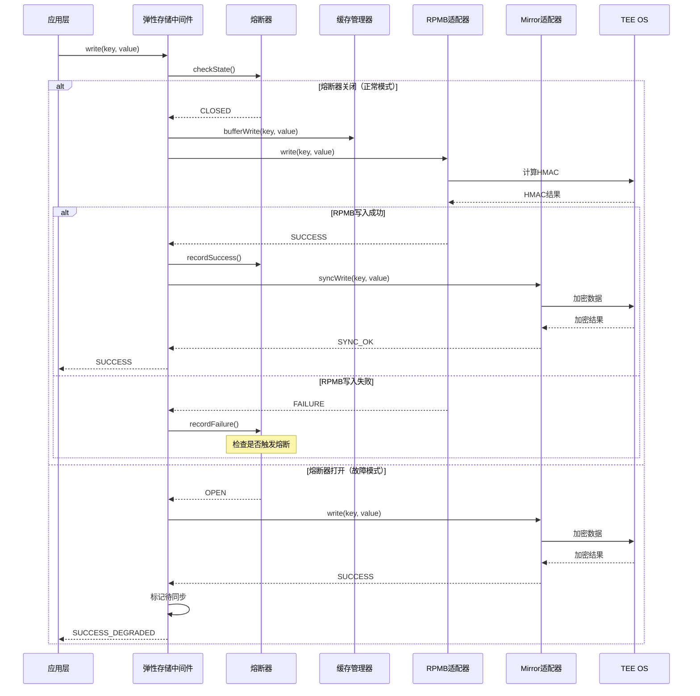
```mermaid
sequenceDiagram
    participant App as 应用层
    participant RSM as 弹性存储中间件
    participant CB as 熔断器
    participant Cache as 缓存管理器
    participant RPMB as RPMB适配器
    participant Mirror as Mirror适配器
    participant TEE as TEE OS

    App->>RSM: write(key, value)
    RSM->>CB: checkState()

    alt 熔断器关闭（正常模式）
        CB-->>RSM: CLOSED
        RSM->>Cache: bufferWrite(key, value)
        RSM->>RPMB: write(key, value)
        RPMB->>TEE: 计算HMAC
        TEE-->>RPMB: HMAC结果

        alt RPMB写入成功
            RPMB-->>RSM: SUCCESS
            RSM->>CB: recordSuccess()
            RSM->>Mirror: syncWrite(key, value)
            Mirror->>TEE: 加密数据
            TEE-->>Mirror: 加密结果
            Mirror-->>RSM: SYNC_OK
            RSM-->>App: SUCCESS
        else RPMB写入失败
            RPMB-->>RSM: FAILURE
            RSM->>CB: recordFailure()
            Note over CB: 检查是否触发熔断
        end

    else 熔断器打开（故障模式）
        CB-->>RSM: OPEN
        RSM->>Mirror: write(key, value)
        Mirror->>TEE: 加密数据
        TEE-->>Mirror: 加密结果
        Mirror-->>RSM: SUCCESS
        RSM->>RSM: 标记待同步
        RSM-->>App: SUCCESS_DEGRADED
    end
```

#### 5.3.2 读操作流程

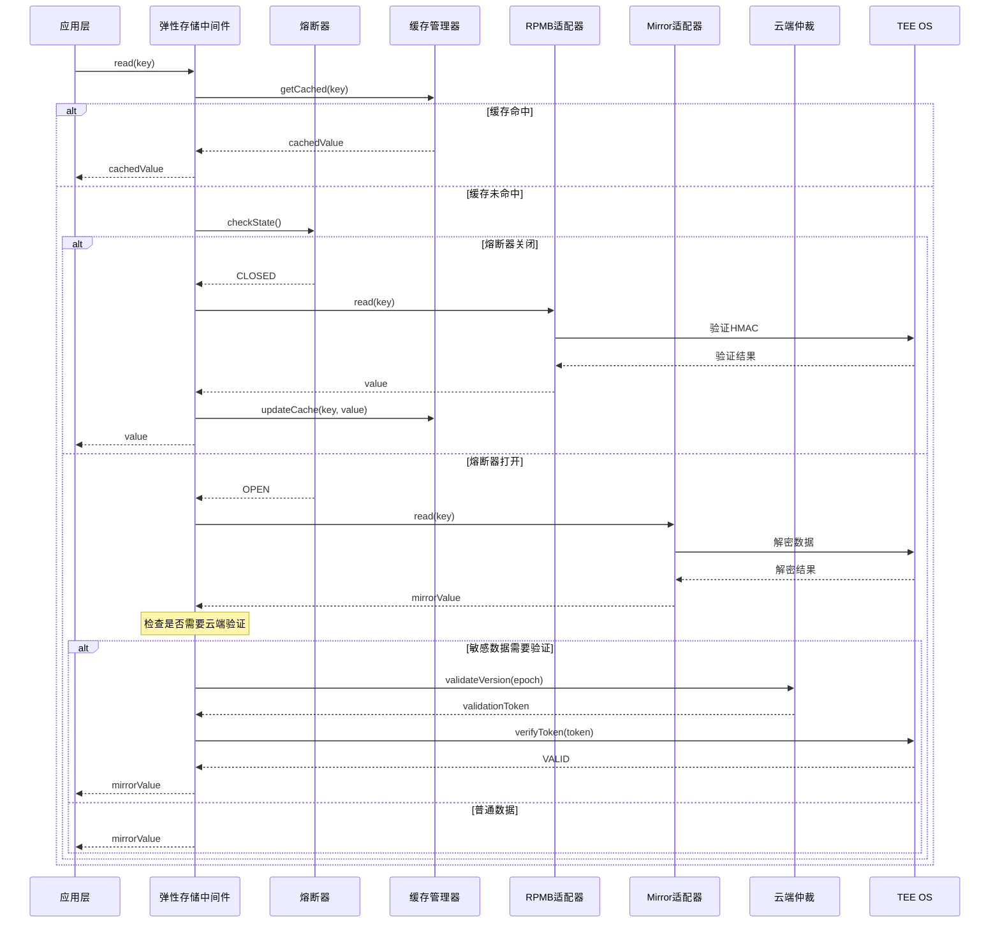
```mermaid
sequenceDiagram
    participant App as 应用层
    participant RSM as 弹性存储中间件
    participant CB as 熔断器
    participant Cache as 缓存管理器
    participant RPMB as RPMB适配器
    participant Mirror as Mirror适配器
    participant Cloud as 云端仲裁
    participant TEE as TEE OS

    App->>RSM: read(key)
    RSM->>Cache: getCached(key)

    alt 缓存命中
        Cache-->>RSM: cachedValue
        RSM-->>App: cachedValue
    else 缓存未命中
        RSM->>CB: checkState()

        alt 熔断器关闭
            CB-->>RSM: CLOSED
            RSM->>RPMB: read(key)
            RPMB->>TEE: 验证HMAC
            TEE-->>RPMB: 验证结果
            RPMB-->>RSM: value
            RSM->>Cache: updateCache(key, value)
            RSM-->>App: value

        else 熔断器打开
            CB-->>RSM: OPEN
            RSM->>Mirror: read(key)
            Mirror->>TEE: 解密数据
            TEE-->>Mirror: 解密结果
            Mirror-->>RSM: mirrorValue

            Note over RSM: 检查是否需要云端验证

            alt 敏感数据需要验证
                RSM->>Cloud: validateVersion(epoch)
                Cloud-->>RSM: validationToken
                RSM->>TEE: verifyToken(token)
                TEE-->>RSM: VALID
                RSM-->>App: mirrorValue
            else 普通数据
                RSM-->>App: mirrorValue
            end
        end
    end
```

### 5.4 云端仲裁机制

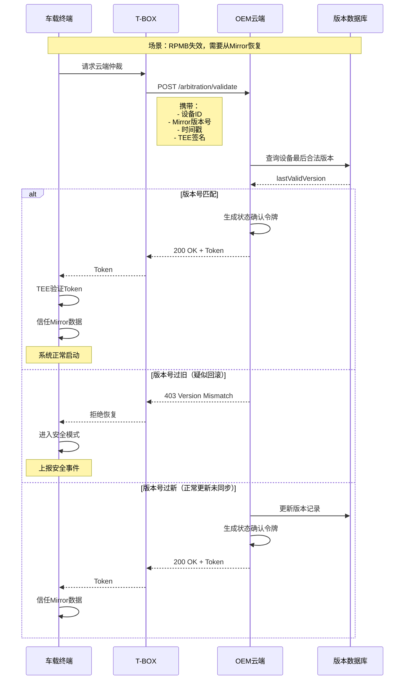
```mermaid
sequenceDiagram
    participant Vehicle as 车载终端
    participant TBOX as T-BOX
    participant Cloud as OEM云端
    participant DB as 版本数据库

    Note over Vehicle,DB: 场景：RPMB失效，需要从Mirror恢复

    Vehicle->>TBOX: 请求云端仲裁
    TBOX->>Cloud: POST /arbitration/validate
    Note right of TBOX: 携带：<br/>- 设备ID<br/>- Mirror版本号<br/>- 时间戳<br/>- TEE签名

    Cloud->>DB: 查询设备最后合法版本
    DB-->>Cloud: lastValidVersion

    alt 版本号匹配
        Cloud->>Cloud: 生成状态确认令牌
        Cloud-->>TBOX: 200 OK + Token
        TBOX-->>Vehicle: Token
        Vehicle->>Vehicle: TEE验证Token
        Vehicle->>Vehicle: 信任Mirror数据
        Note over Vehicle: 系统正常启动

    else 版本号过旧（疑似回滚）
        Cloud-->>TBOX: 403 Version Mismatch
        TBOX-->>Vehicle: 拒绝恢复
        Vehicle->>Vehicle: 进入安全模式
        Note over Vehicle: 上报安全事件

    else 版本号过新（正常更新未同步）
        Cloud->>DB: 更新版本记录
        Cloud->>Cloud: 生成状态确认令牌
        Cloud-->>TBOX: 200 OK + Token
        TBOX-->>Vehicle: Token
        Vehicle->>Vehicle: 信任Mirror数据
    end
```

---

## 6. 软件缓存优化策略

### 6.1 缓存架构设计

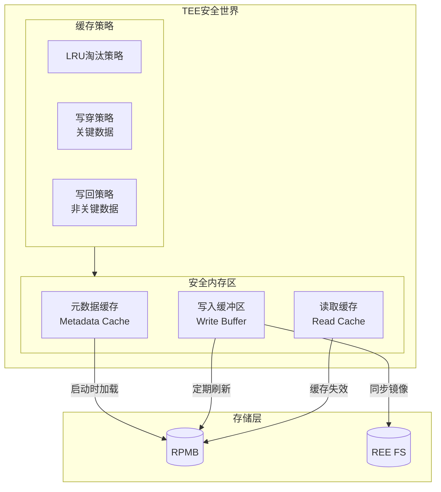
```mermaid
flowchart TB
    subgraph TEE安全世界
        subgraph SecureRAM[安全内存区]
            MC[元数据缓存<br/>Metadata Cache]
            WB[写入缓冲区<br/>Write Buffer]
            RC[读取缓存<br/>Read Cache]
        end

        subgraph CachePolicy[缓存策略]
            LRU[LRU淘汰策略]
            WT[写穿策略<br/>关键数据]
            WB_P[写回策略<br/>非关键数据]
        end
    end

    subgraph StorageLayer[存储层]
        RPMB[(RPMB)]
        REEFS[(REE FS)]
    end

    MC --> |启动时加载| RPMB
    WB --> |定期刷新| RPMB
    WB --> |同步镜像| REEFS
    RC --> |缓存失效| RPMB

    CachePolicy --> SecureRAM
```

### 6.2 缓存策略详情

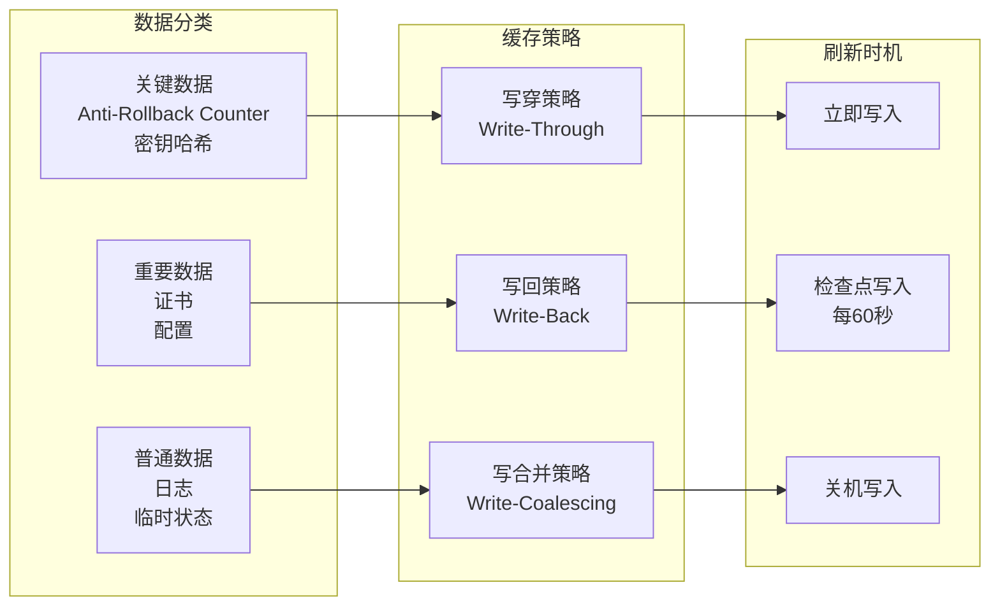
```mermaid
flowchart LR
    subgraph 数据分类
        D1[关键数据<br/>Anti-Rollback Counter<br/>密钥哈希]
        D2[重要数据<br/>证书<br/>配置]
        D3[普通数据<br/>日志<br/>临时状态]
    end

    subgraph 缓存策略
        S1[写穿策略<br/>Write-Through]
        S2[写回策略<br/>Write-Back]
        S3[写合并策略<br/>Write-Coalescing]
    end

    subgraph 刷新时机
        T1[立即写入]
        T2[检查点写入<br/>每60秒]
        T3[关机写入]
    end

    D1 --> S1 --> T1
    D2 --> S2 --> T2
    D3 --> S3 --> T3
```

### 6.3 元数据缓存流程

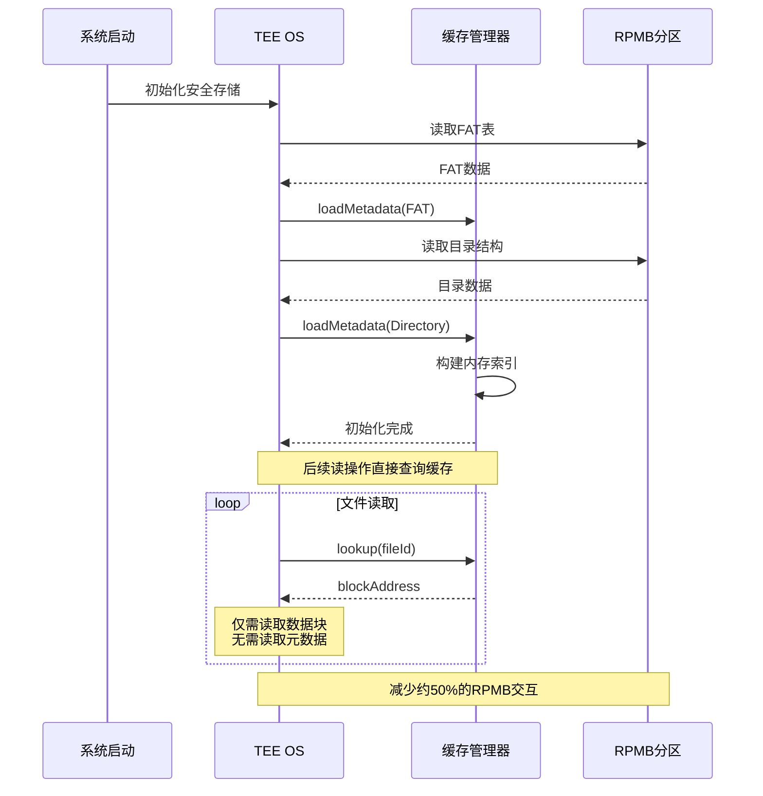
```mermaid
sequenceDiagram
    participant Boot as 系统启动
    participant TEE as TEE OS
    participant Cache as 缓存管理器
    participant RPMB as RPMB分区

    Boot->>TEE: 初始化安全存储
    TEE->>RPMB: 读取FAT表
    RPMB-->>TEE: FAT数据
    TEE->>Cache: loadMetadata(FAT)

    TEE->>RPMB: 读取目录结构
    RPMB-->>TEE: 目录数据
    TEE->>Cache: loadMetadata(Directory)

    Cache->>Cache: 构建内存索引
    Cache-->>TEE: 初始化完成

    Note over TEE,Cache: 后续读操作直接查询缓存

    loop 文件读取
        TEE->>Cache: lookup(fileId)
        Cache-->>TEE: blockAddress
        Note over TEE: 仅需读取数据块<br/>无需读取元数据
    end

    Note over TEE,RPMB: 减少约50%的RPMB交互
```

---

## 7. 驱动异步化改造

### 7.1 当前驱动问题

```mermaid
flowchart TB
    subgraph 当前架构问题
        direction TB
        A[RPMB请求] --> B[获取host->lock]
        B --> C[发送TEE请求<br/>等待10-50ms]
        C --> D[发送MMC指令]
        D --> E[等待完成]
        E --> F[释放host->lock]

        G[用户分区IO] --> B
        Note over B,F: 整个过程锁定<br/>用户IO被阻塞
    end

    style C fill:#FFB6C1
    style G fill:#FFB6C1
```

### 7.2 优化后的异步架构

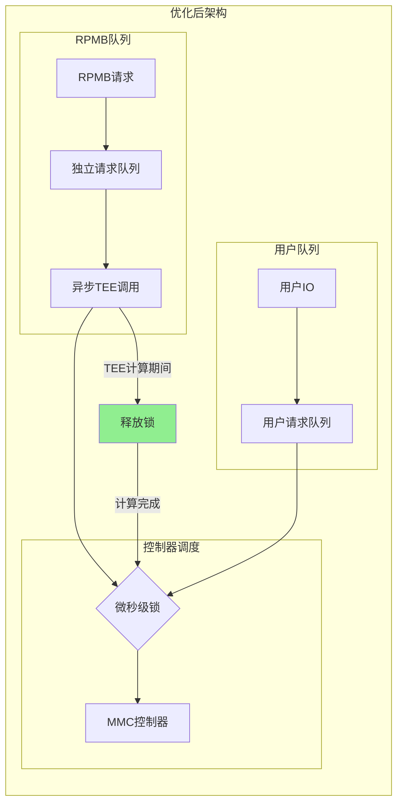
```mermaid
flowchart TB
    subgraph 优化后架构
        direction TB

        subgraph RPMB队列
            A[RPMB请求] --> B[独立请求队列]
            B --> C[异步TEE调用]
        end

        subgraph 用户队列
            G[用户IO] --> H[用户请求队列]
        end

        subgraph 控制器调度
            C --> D{微秒级锁}
            H --> D
            D --> E[MMC控制器]
        end

        C --> |TEE计算期间| F[释放锁]
        F --> |计算完成| D
    end

    style F fill:#90EE90
```

### 7.3 异步驱动时序

```mermaid
sequenceDiagram
    participant App as 应用
    participant RQ as RPMB队列
    participant UQ as 用户队列
    participant TEE as TEE OS
    participant Lock as 控制器锁
    participant MMC as MMC控制器

    App->>RQ: RPMB写请求
    RQ->>TEE: 异步HMAC计算
    Note over RQ,TEE: TEE计算期间<br/>锁已释放

    App->>UQ: 用户分区读取
    UQ->>Lock: 获取锁（成功）
    Lock->>MMC: 读取用户数据
    MMC-->>UQ: 数据返回
    UQ->>Lock: 释放锁
    UQ-->>App: 数据返回

    TEE-->>RQ: HMAC完成
    RQ->>Lock: 获取锁
    Lock->>MMC: RPMB写入
    MMC-->>RQ: 写入完成
    RQ->>Lock: 释放锁
    RQ-->>App: 写入成功

    Note over App,MMC: 用户IO不再被RPMB阻塞
```

### 7.4 多队列映射设计

```mermaid
flowchart TB
    subgraph Linux块设备层
        BLK[blk-mq<br/>多队列块层]
    end

    subgraph 逻辑设备
        UD[/dev/mmcblk0<br/>用户分区]
        RD[/dev/mmcblk0rpmb<br/>RPMB设备]
    end

    subgraph 软件队列
        UHQ[用户硬件队列<br/>hw_queue_0]
        RHQ[RPMB硬件队列<br/>hw_queue_1]
    end

    subgraph 硬件
        MMC[eMMC/UFS控制器]
    end

    BLK --> UD
    BLK --> RD
    UD --> UHQ
    RD --> RHQ
    UHQ --> MMC
    RHQ --> MMC

    Note over UHQ,RHQ: 独立队列<br/>不竞争同一软件队列
```

---

## 8. 异常检测与恢复机制

### 8.1 健康检测架构

```mermaid
flowchart TB
    subgraph 健康检测层
        HM[健康监控器<br/>Health Monitor]
        HM --> HB[心跳检测<br/>10ms周期]
        HM --> EC[错误计数器]
        HM --> TM[超时监控]
    end

    subgraph 检测指标
        HB --> M1[响应时间]
        HB --> M2[错误码分析]
        EC --> M3[累计错误数]
        TM --> M4[操作超时]
    end

    subgraph 状态判定
        M1 --> J{健康判定}
        M2 --> J
        M3 --> J
        M4 --> J

        J --> |健康| S1[HEALTHY]
        J --> |降级| S2[DEGRADED]
        J --> |故障| S3[FAILED]
    end

    subgraph 响应动作
        S1 --> A1[正常运行]
        S2 --> A2[触发告警<br/>准备切换]
        S3 --> A3[熔断切换<br/>上报事件]
    end
```

### 8.2 错误分类与处理

```mermaid
flowchart TB
    subgraph 错误分类
        E[RPMB错误] --> E1[暂时性错误]
        E --> E2[永久性错误]
        E --> E3[安全性错误]

        E1 --> E1A[I2C/SPI超时]
        E1 --> E1B[总线忙]
        E1 --> E1C[CRC错误]

        E2 --> E2A[设备无响应]
        E2 --> E2B[密钥损坏]
        E2 --> E2C[计数器溢出]

        E3 --> E3A[HMAC验证失败]
        E3 --> E3B[计数器回滚检测]
        E3 --> E3C[未授权访问]
    end

    subgraph 处理策略
        E1 --> P1[重试<br/>最多3次]
        E2 --> P2[熔断切换<br/>上报故障]
        E3 --> P3[安全告警<br/>锁定系统]
    end
```

### 8.3 恢复流程

```mermaid
stateDiagram-v2
    [*] --> Detecting: RPMB异常检测

    Detecting --> Classifying: 错误发生

    Classifying --> Retrying: 暂时性错误
    Classifying --> Failover: 永久性错误
    Classifying --> SecurityLock: 安全性错误

    Retrying --> Detecting: 重试成功
    Retrying --> Failover: 重试失败

    Failover --> MirrorActive: 激活Mirror
    MirrorActive --> CloudValidation: 需要验证
    CloudValidation --> MirrorActive: 验证通过

    MirrorActive --> ProbeRPMB: 定期探测
    ProbeRPMB --> Recovering: RPMB恢复
    ProbeRPMB --> MirrorActive: 仍然故障

    Recovering --> Syncing: 开始同步
    Syncing --> Validating: 同步完成
    Validating --> [*]: 恢复正常
    Validating --> MirrorActive: 验证失败

    SecurityLock --> [*]: 需要人工干预
```

---

## 9. 安全性设计

### 9.1 安全威胁模型

```mermaid
flowchart TB
    subgraph 威胁场景
        T1[降级攻击<br/>诱导切换到Mirror]
        T2[回滚攻击<br/>替换旧Mirror文件]
        T3[中间人攻击<br/>篡改云端通信]
        T4[侧信道攻击<br/>提取加密密钥]
    end

    subgraph 防护措施
        T1 --> D1[多因子故障判定<br/>防止误触发]
        T2 --> D2[版本号+云端仲裁<br/>检测回滚]
        T3 --> D3[mTLS双向认证<br/>Token签名验证]
        T4 --> D4[HUK派生密钥<br/>TEE隔离运算]
    end
```

### 9.2 密钥层次结构

```mermaid
flowchart TB
    subgraph 硬件层
        HUK[HUK<br/>硬件唯一密钥<br/>芯片固化]
    end

    subgraph TEE派生层
        HUK --> RPMB_KEY[RPMB认证密钥<br/>HMAC-SHA256]
        HUK --> SSK[安全存储密钥<br/>AES-256]
        HUK --> TSK[TEE签名密钥<br/>ECDSA P-256]
    end

    subgraph 应用层密钥
        SSK --> MEK[Mirror加密密钥<br/>AES-GCM]
        TSK --> MVK[Mirror验证密钥<br/>签名]
    end

    subgraph 数据保护
        MEK --> |加密| MIRROR[(Mirror文件)]
        MVK --> |签名| MIRROR
        RPMB_KEY --> |认证| RPMB[(RPMB分区)]
    end
```

### 9.3 数据完整性保护

```mermaid
flowchart LR
    subgraph Mirror文件保护
        D[原始数据] --> E[AES-GCM加密]
        E --> H[计算HMAC]
        H --> S[TEE签名]
        S --> F[最终文件]
    end

    subgraph 验证流程
        F --> V1[签名验证]
        V1 --> V2[HMAC验证]
        V2 --> V3[解密数据]
        V3 --> V4[完整性确认]
    end
```

---

## 10. 合规性分析

### 10.1 法规映射

```mermaid
flowchart TB
    subgraph 法规要求
        GB32960[GB/T 32960<br/>车载终端数据安全]
        GB44495[GB 44495<br/>整车信息安全]
        UNR155[UN R155<br/>网络安全管理]
    end

    subgraph 技术措施
        M1[硬件安全存储]
        M2[数据加密传输]
        M3[防回滚保护]
        M4[故障检测上报]
        M5[安全审计日志]
    end

    subgraph 方案满足
        GB32960 --> M1
        GB32960 --> M2
        GB44495 --> M1
        GB44495 --> M3
        GB44495 --> M5
        UNR155 --> M3
        UNR155 --> M4
    end

    subgraph 本方案实现
        M1 --> I1[RPMB + TEE加密Mirror]
        M2 --> I2[mTLS云端通信]
        M3 --> I3[版本号 + 云端仲裁]
        M4 --> I4[熔断事件上报VSOC]
        M5 --> I5[操作日志哈希链]
    end
```

### 10.2 合规性对照表

| 法规条款 | 要求 | 本方案实现 | 合规状态 |
|----------|------|------------|----------|
| GB 44495 6.8 | 密钥存储于安全芯片 | RPMB主存储 + HUK加密Mirror | ✅ 合规 |
| GB 44495 6.9 | 防回滚保护 | 版本号 + 云端仲裁 | ✅ 合规 |
| GB/T 32960.2 4.2.1 | 硬件安全保护的私钥 | TEE派生密钥，不暴露明文 | ✅ 合规 |
| GB/T 32960.2 4.2.5 | 断电数据保存 | 缓存优化 + 异步写入 | ✅ 合规 |
| UN R155 | 现有技术水平 | 硬件冗余优于软件降级 | ✅ 合规 |
| UN R155 | 风险处置 | 熔断机制 + 云端仲裁 | ✅ 合规 |

---

## 11. 实施方案

### 11.1 分阶段实施计划

```mermaid
gantt
    title RPMB优化实施计划
    dateFormat  YYYY-MM
    section 第一阶段
    需求分析与设计评审    :a1, 2026-02, 1M
    软件缓存模块开发      :a2, after a1, 2M
    熔断器模块开发        :a3, after a1, 2M

    section 第二阶段
    Mirror存储开发        :b1, after a2, 2M
    云端仲裁接口开发      :b2, after a2, 2M
    驱动异步化改造        :b3, after a3, 3M

    section 第三阶段
    系统集成测试          :c1, after b1, 2M
    故障注入测试          :c2, after c1, 1M
    性能压力测试          :c3, after c1, 1M

    section 第四阶段
    合规性认证            :d1, after c2, 2M
    量产部署              :d2, after d1, 1M
```

### 11.2 测试验证矩阵

```mermaid
flowchart TB
    subgraph 功能测试
        F1[正常读写测试]
        F2[缓存命中测试]
        F3[Mirror同步测试]
        F4[云端仲裁测试]
    end

    subgraph 故障测试
        E1[RPMB I/O超时模拟]
        E2[eMMC物理断开]
        E3[TEE响应延迟注入]
        E4[网络中断测试]
    end

    subgraph 安全测试
        S1[回滚攻击模拟]
        S2[降级攻击模拟]
        S3[Mirror篡改检测]
        S4[密钥提取尝试]
    end

    subgraph 性能测试
        P1[IO吞吐量测试]
        P2[延迟基准测试]
        P3[并发压力测试]
        P4[断电数据保存测试]
    end
```

---

## 12. 总结与建议

### 12.1 方案优势

```mermaid
mindmap
  root((RPMB优化方案))
    高可用性
      熔断器快速切换
      Mirror热备份
      云端仲裁恢复
    安全性
      HUK加密保护
      TEE签名验证
      防回滚检测
    性能优化
      元数据缓存
      异步驱动
      写入合并
    合规性
      满足GB 44495
      满足GB/T 32960
      满足UN R155
```

### 12.2 关键建议

1. **硬件层面**：长期应考虑迁移到UFS存储，UFS原生支持多LUN并行访问，可彻底解决RPMB阻塞问题

2. **软件层面**：
   - 优先实施软件缓存优化，可减少约50%的RPMB物理IO
   - 熔断器阈值需根据实际平台调优
   - Mirror同步策略需平衡安全性与性能

3. **运维层面**：
   - 建立RPMB健康监控Dashboard
   - 定义明确的故障响应SOP
   - 云端版本数据库需高可用部署

4. **合规层面**：
   - 保留完整的设计文档用于型式认证
   - 准备TARA分析报告说明风险处置
   - 与认证机构提前沟通技术方案

---

## 参考资料

1. [OP-TEE Secure Storage Documentation](https://optee.readthedocs.io/en/latest/architecture/secure_storage.html)
2. [RPMB Wikipedia](https://en.wikipedia.org/wiki/Replay_Protected_Memory_Block)
3. [Kioxia RPMB Technical Brief](https://americas.kioxia.com/content/dam/kioxia/shared/business/memory/mlc-nand/asset/productbrief/KIOXIA_e-MMC_RPMB_Technical_Brief.pdf)
4. [Linux RPMB Subsystem](https://lwn.net/Articles/985292/)
5. [MediaTek Secure Boot Documentation](https://baylibre.pages.baylibre.com/mediatek/rita/device/mediatek/mtk-android-14/docs/bootloader/secure-boot.html)
6. [Western Digital RPMB Protocol Vulnerabilities White Paper](https://documents.westerndigital.com/content/dam/doc-library/en_us/assets/public/western-digital/collateral/white-paper/white-paper-replay-protected-memory-block-protocol-vulernabilities.pdf)
7. [OP-TEE RPMB Issue Discussion](https://github.com/OP-TEE/optee_os/issues/2887)
8. [芯驰半导体安全存储方案](https://www.auto-testing.net/news/show-117404.html)
9. [深入理解eMMC RPMB与OP-TEE](https://blog.csdn.net/qq_30883899/article/details/149614037)

---

*文档版本: v1.0*
*创建日期: 2026-01-28*
*适用平台: 高通/MediaTek车载平台*
