# TEE与安全芯片的日志审计与异常关联分析设计方案

## 1. 概述

### 1.1 文档目的

本文档定义了车载系统中TEE（可信执行环境）与安全芯片的统一日志审计与异常关联分析架构设计方案。该方案旨在打通REE（Rich Execution Environment）与TEE的审计壁垒，实现跨域安全事件的采集、关联分析与响应，满足GB 44495-2024、GB/T 32960.2-2025及UN R155等法规对网络安全监控的合规要求。

### 1.2 适用范围

- **高通平台**：QTEE + 安全芯片（双安全模块架构）
- **MTK平台**：TEE（Yocto/Android/Hypervisor多系统架构）
- **支持系统**：Android Automotive、Linux（Yocto）、QNX

### 1.3 设计目标

| 目标维度 | 具体要求 |
|---------|---------|
| **完整性** | 日志数据不可篡改，支持哈希链验证 |
| **机密性** | 敏感日志加密存储，防止REE侧泄露 |
| **可追溯性** | 全链路Trace ID追踪，支持审计回溯 |
| **实时性** | 异常检测响应时间 < 100ms |
| **合规性** | 满足GB 44495安全事件记录要求 |

---

## 2. 系统架构设计

### 2.1 整体架构

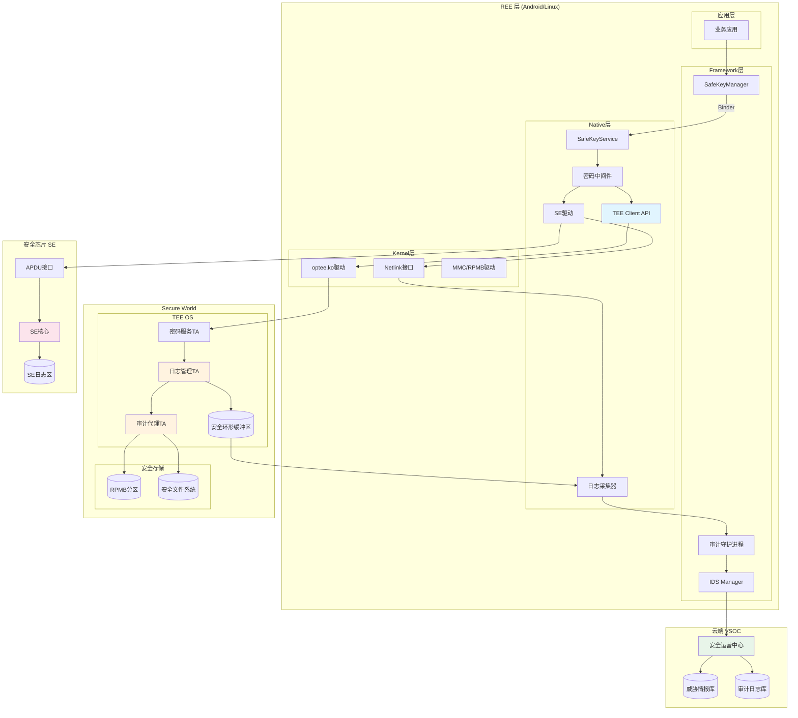

### 2.2 分层架构说明

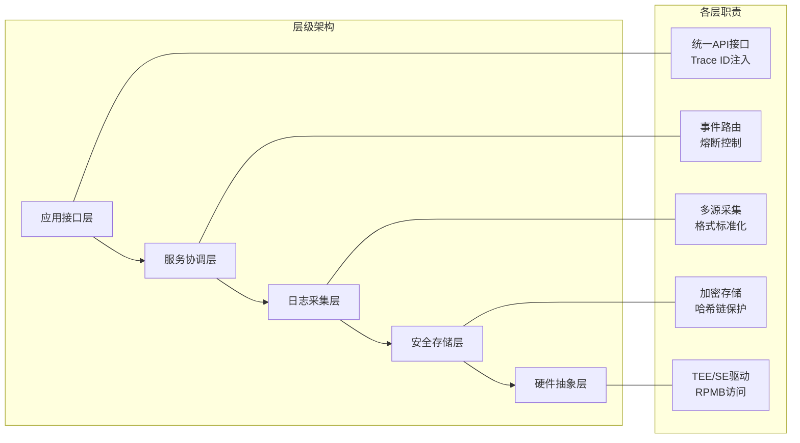

---

## 3. 日志采集架构

### 3.1 多源日志采集通道

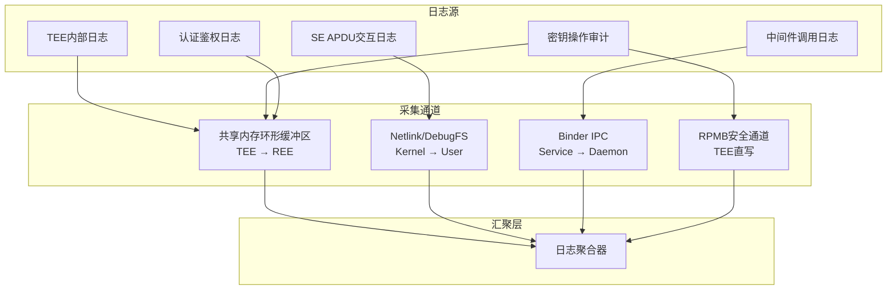

### 3.2 TEE日志导出路径

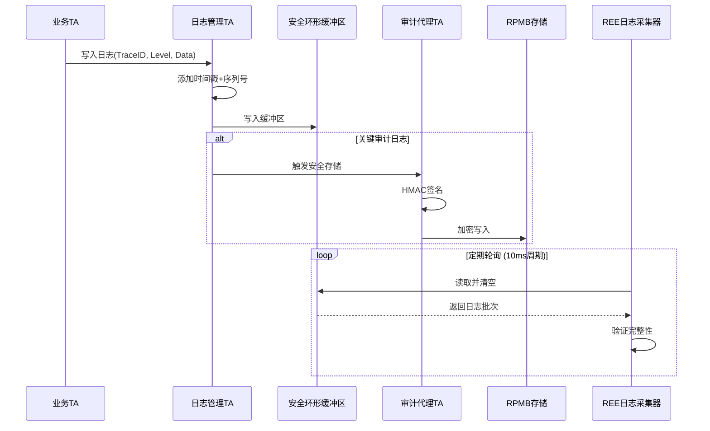

### 3.3 SE日志采集流程

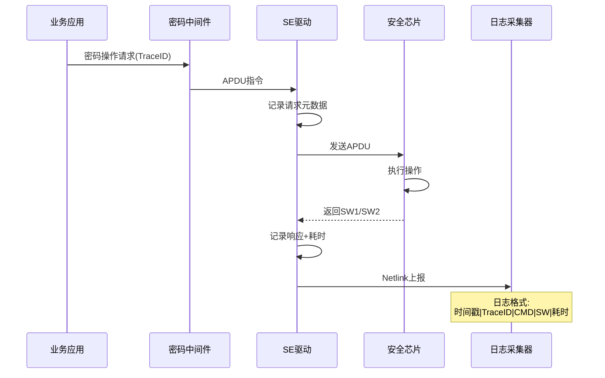

### 3.4 TZDiag日志监控（高通平台）

高通平台提供TZDiag机制用于TEE内核调试与错误日志输出，通过 `/sys/kernel/debug/tzdbg/` 接口访问。

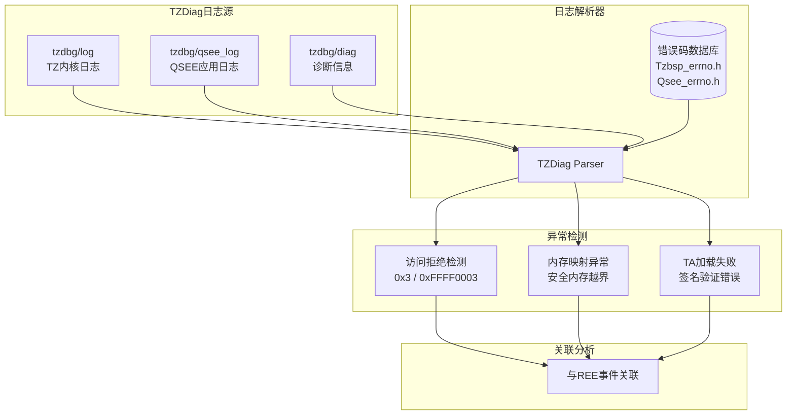

#### 3.4.1 TZDiag采集配置

| 配置项 | 路径/参数 | 说明 |
|-------|----------|------|
| **TZ内核日志** | `/sys/kernel/debug/tzdbg/log` | TEE内核级错误与警告 |
| **QSEE应用日志** | `/sys/kernel/debug/tzdbg/qsee_log` | TA运行时日志 |
| **轮询周期** | 50ms | 实时性与性能平衡 |
| **缓冲区大小** | 128KB | 防止日志丢失 |

#### 3.4.2 关键错误码映射

| 错误码 | 含义 | 安全等级 | 可能的攻击场景 |
|-------|------|---------|--------------|
| `0x3` | Access Denied | HIGH | REE恶意模块尝试访问安全内存 |
| `0xFFFF0003` | TZ_ACCESS_DENIED | CRITICAL | 提权攻击前兆 |
| `0xFFFFFFD4` | RPMB_KEY_PROVISION_FAIL | ERROR | RPMB密钥注入异常 |
| `0xFFFFFFE5` | SIGNATURE_VERIFY_FAILED | HIGH | 固件/TA签名验证失败 |
| `0xFFFFFFE8` | SECURE_CHANNEL_ERROR | WARNING | 安全通道建立失败 |

---

## 4. 日志数据模型

### 4.1 统一日志格式

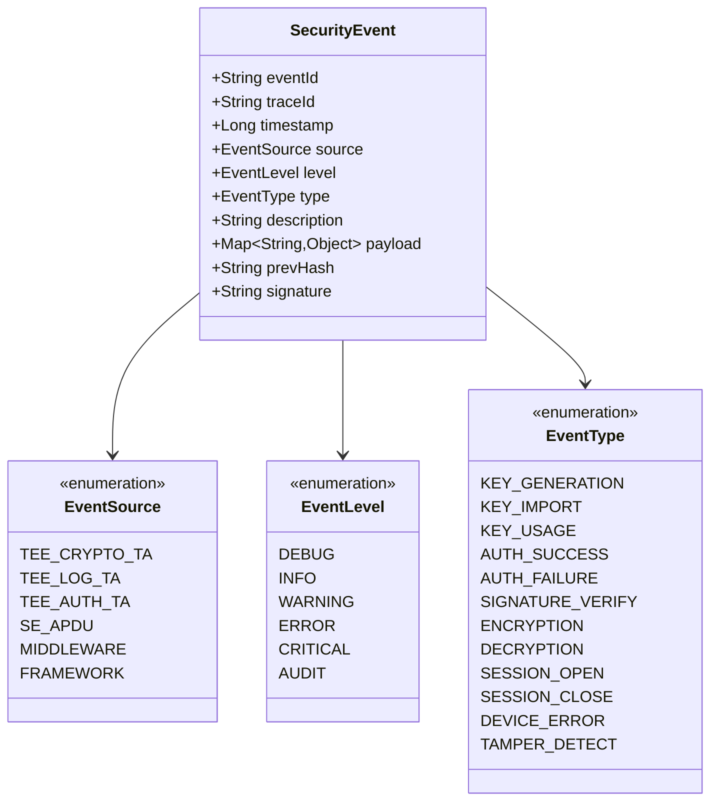

### 4.2 日志存储分级策略

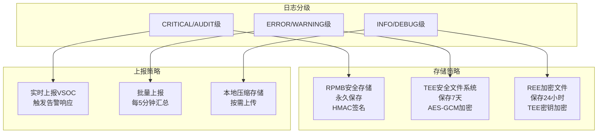

---

## 5. 日志防篡改机制

### 5.1 哈希链架构

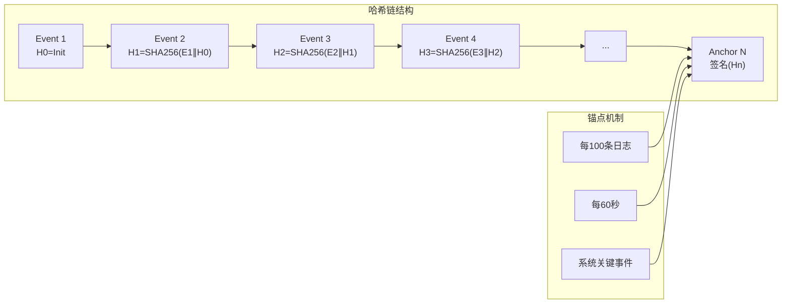

### 5.2 防篡改验证流程

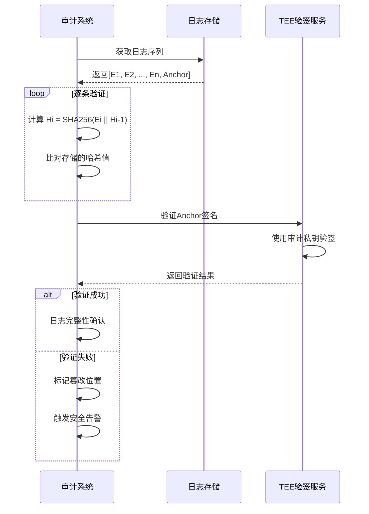

---

## 6. Trace ID全链路追踪

### 6.1 Trace ID生成与传递

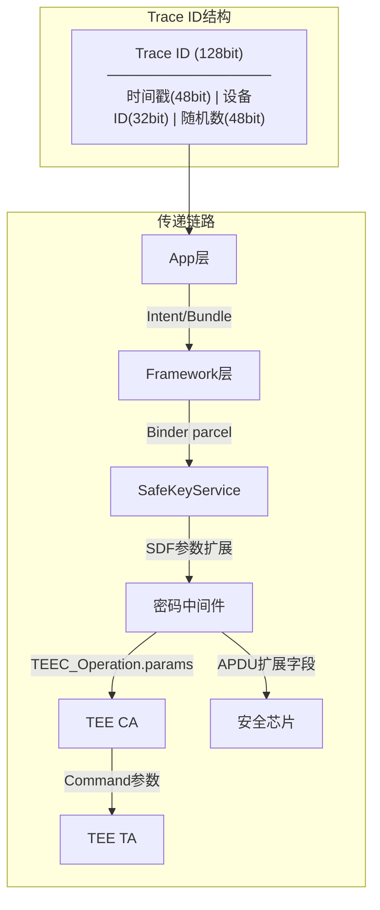

### 6.2 跨域关联模型

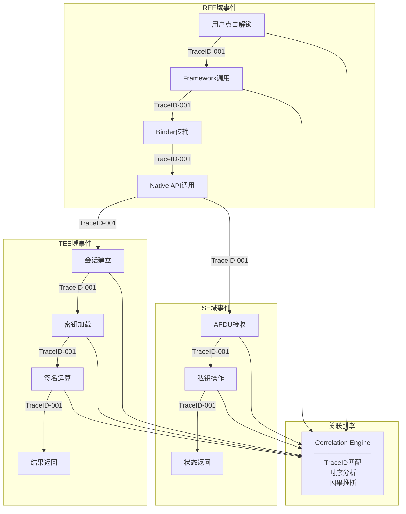

---

## 7. 异常检测规则引擎

### 7.1 检测规则分类

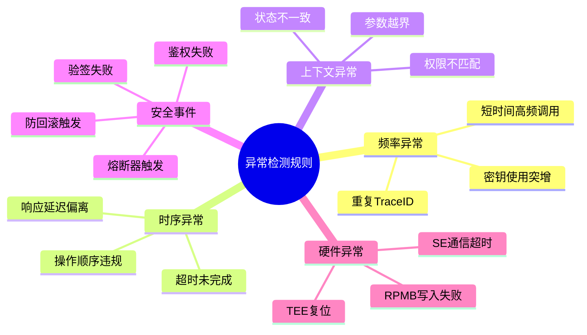

### 7.2 规则引擎架构

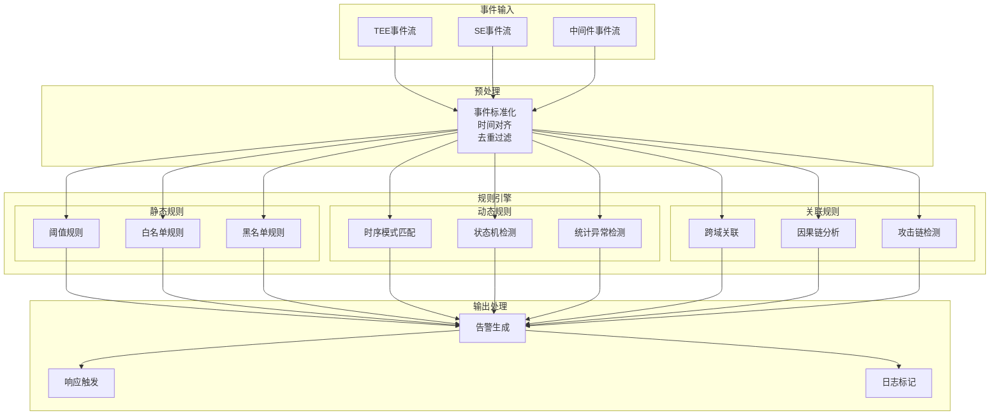

### 7.3 典型攻击场景检测

```mermaid
flowchart TB
    subgraph "攻击场景1: SE总线干扰攻击"
        A1[SE Driver连续超时] --> A2[熔断器触发]
        A2 --> A3[TEE接管加密服务]
        A1 --> D1{关联检测}
        A2 --> D1
        A3 --> D1
        D1 --> R1[判定: 硬件拒绝服务攻击<br/>响应: 上报VSOC + 标记硬件异常]
    end

    subgraph "攻击场景2: 重放攻击"
        B1[相同TraceID多次出现] --> B2[TEE检测nonce重复]
        B2 --> D2{关联检测}
        D2 --> R2[判定: 重放攻击<br/>响应: 拒绝操作 + 锁定会话]
    end

    subgraph "攻击场景3: 降级攻击"
        C1[异常复位信号] --> C2[RPMB计数器不匹配]
        C2 --> C3[版本号回退尝试]
        C1 --> D3{关联检测}
        C2 --> D3
        C3 --> D3
        D3 --> R3[判定: 固件回滚攻击<br/>响应: 锁定密钥 + 禁止启动]
    end

    subgraph "攻击场景4: 侧信道探测"
        E1[高频密码操作] --> E2[响应时间方差异常]
        E2 --> E3[操作模式规律性]
        E1 --> D4{关联检测}
        E2 --> D4
        E3 --> D4
        D4 --> R4[判定: 侧信道探测<br/>响应: 启用随机延迟 + 限流]
    end
```

### 7.4 TZDiag异常特征检测

基于TZDiag日志的实时解析，检测TEE层面的攻击特征。

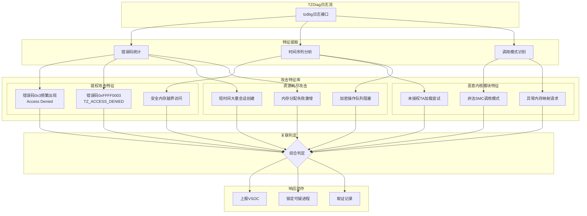

#### 7.4.1 提权攻击检测规则

| 规则ID | 检测条件 | 威胁等级 | 响应措施 |
|-------|---------|---------|---------|
| TZ-001 | 错误码0x3在60秒内出现 > 10次 | HIGH | 标记调用进程，上报VSOC |
| TZ-002 | 错误码0xFFFF0003连续出现 > 3次 | CRITICAL | 锁定相关TA会话，触发取证 |
| TZ-003 | 安全内存地址范围外访问尝试 | CRITICAL | 立即终止调用进程，内核告警 |

### 7.5 TLS通信异常与底层错误关联分析

应用层TLS通信异常通常与SafeKeyService/中间件/TEE CA/TA的错误存在因果关系。

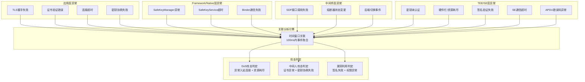

#### 7.5.1 DoS攻击关联检测

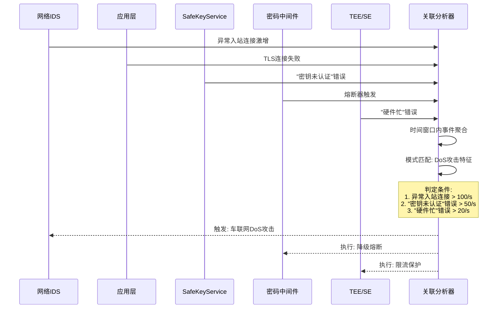

### 7.6 Bleichenbacher Oracle与侧信道攻击检测

针对TLS RSA密钥交换的Bleichenbacher Oracle攻击及时间侧信道分析的检测。

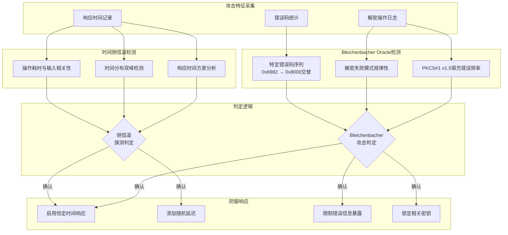

#### 7.6.1 检测阈值配置

| 检测项 | 阈值 | 时间窗口 | 威胁等级 |
|-------|-----|---------|---------|
| 解密失败率 | > 80% | 60秒 | HIGH |
| 响应时间标准差 | > 基准值200% | 120秒 | MEDIUM |
| PKCS填充错误连续次数 | > 100次 | 30秒 | CRITICAL |
| 时间分布双峰系数 | > 0.7 | 300秒 | HIGH |

---

## 8. 平台适配设计

### 8.1 高通平台架构

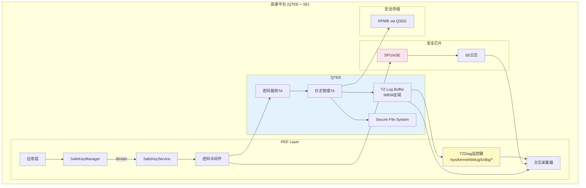

### 8.2 MTK平台架构

```mermaid
graph TB
    subgraph "MTK平台 (TEE Only + Hypervisor)"
        subgraph "Android VM"
            MApp[应用层]
            MSKM[SafeKeyManager]
            MSKS[SafeKeyService]
            MMW[密码中间件]
        end

        subgraph "Linux/Yocto VM"
            LApp[Native应用]
            LMW[密码中间件]
        end

        subgraph "Hypervisor"
            HV[虚拟机管理]
            vTEE[vTEE Mediator]
        end

        subgraph "TEE (Kinibi/OP-TEE)"
            MLogTA[日志管理TA]
            MCryptoTA[密码服务TA]
            MSFS[安全文件系统]
            MSecBuf[安全环形缓冲区]
        end

        subgraph "安全存储"
            MRPMB[RPMB]
            MirrorFS[镜像文件系统<br/>云端仲裁]
        end
    end

    MApp --> MSKM
    MSKM -->|Binder| MSKS
    MSKS --> MMW
    MMW --> vTEE
    LApp --> LMW
    LMW --> vTEE
    vTEE --> HV
    HV --> MCryptoTA
    MCryptoTA --> MLogTA
    MLogTA --> MSecBuf
    MLogTA --> MSFS
    MLogTA --> MRPMB
    MRPMB -.-> MirrorFS

    style HV fill:#fff3e0
    style TEE fill:#e3f2fd
```

### 8.3 平台差异处理

| 特性 | 高通平台 | MTK平台 |
|-----|---------|---------|
| **TEE类型** | QTEE (专有) | Kinibi/OP-TEE |
| **安全芯片** | 有 (SPU/eSE) | 无 |
| **日志缓冲区** | IMEM区域 | 共享内存 |
| **RPMB访问** | QSEE直接访问 | TEE Supplicant代理 |
| **多系统支持** | 单系统为主 | Hypervisor多VM |
| **备份策略** | SE ↔ TEE互备 | TEE + 云端仲裁 |

---

## 9. IDS集成架构

### 9.1 与AUTOSAR IdsM集成

```mermaid
flowchart TB
    subgraph "车端"
        subgraph "安全日志源"
            TEELog[TEE日志]
            SELog[SE日志]
            MWLog[中间件日志]
        end

        subgraph "日志处理"
            Collector[日志采集器]
            Normalizer[格式标准化]
            Filter[事件过滤器]
        end

        subgraph "IDS Manager"
            IdsM[AUTOSAR IdsM]
            QSEv[安全事件队列]
            Reporter[上报模块]
        end

        subgraph "本地存储"
            LocalDB[(本地事件库)]
        end
    end

    subgraph "云端 VSOC"
        Receiver[事件接收器]
        Correlator[关联分析引擎]
        ThreatIntel[威胁情报]
        AlertMgr[告警管理]
        Dashboard[监控仪表盘]
    end

    TEELog --> Collector
    SELog --> Collector
    MWLog --> Collector
    Collector --> Normalizer
    Normalizer --> Filter
    Filter --> IdsM
    IdsM --> QSEv
    QSEv --> Reporter
    QSEv --> LocalDB
    Reporter --> Receiver
    Receiver --> Correlator
    ThreatIntel --> Correlator
    Correlator --> AlertMgr
    AlertMgr --> Dashboard
```

### 9.2 安全事件格式 (SEv)

```mermaid
classDiagram
    class QualifiedSecurityEvent {
        +uint32 eventId
        +uint64 timestamp
        +uint16 sensorId
        +uint8 contextData[]
        +uint8 severity
        +uint32 eventTypeId
    }

    class SensorInstanceId {
        +uint16 sensorClassId
        +uint16 sensorInstanceIndex
    }

    class ContextData {
        +uint8 traceId[16]
        +uint8 sourceModule
        +uint8 targetModule
        +uint32 errorCode
        +uint8 additionalInfo[]
    }

    QualifiedSecurityEvent --> SensorInstanceId
    QualifiedSecurityEvent --> ContextData

    note for QualifiedSecurityEvent "符合AUTOSAR IDS规范"
```

---

## 10. 安全响应机制

### 10.1 响应策略矩阵

```mermaid
flowchart TB
    subgraph "威胁等级"
        TL1[低危 - INFO]
        TL2[中危 - WARNING]
        TL3[高危 - ERROR]
        TL4[严重 - CRITICAL]
    end

    subgraph "响应动作"
        A1[仅记录日志]
        A2[上报VSOC]
        A3[限流/降级]
        A4[锁定密钥]
        A5[触发Panic Mode]
        A6[通知车主]
    end

    TL1 --> A1
    TL2 --> A1
    TL2 --> A2
    TL3 --> A2
    TL3 --> A3
    TL3 --> A4
    TL4 --> A2
    TL4 --> A4
    TL4 --> A5
    TL4 --> A6
```

### 10.2 响应处理流程

```mermaid
stateDiagram-v2
    [*] --> 正常监控

    正常监控 --> 事件检测: 接收安全事件

    事件检测 --> 评估威胁: 规则匹配
    事件检测 --> 正常监控: 无异常

    评估威胁 --> 低危响应: 威胁等级=LOW
    评估威胁 --> 中危响应: 威胁等级=MEDIUM
    评估威胁 --> 高危响应: 威胁等级=HIGH
    评估威胁 --> 严重响应: 威胁等级=CRITICAL

    低危响应 --> 记录归档
    中危响应 --> 上报VSOC
    高危响应 --> 主动防御
    严重响应 --> 紧急处置

    记录归档 --> 正常监控
    上报VSOC --> 等待指令
    主动防御 --> 等待指令
    紧急处置 --> 安全锁定

    等待指令 --> 执行响应: 收到VSOC指令
    等待指令 --> 自动恢复: 超时未响应

    执行响应 --> 正常监控
    自动恢复 --> 正常监控
    安全锁定 --> [*]
```

### 10.3 降级熔断机制

当检测到攻击时，触发降级熔断以保护系统核心功能。

```mermaid
flowchart TB
    subgraph "攻击检测"
        D1[DoS攻击确认]
        D2[侧信道探测确认]
        D3[提权攻击确认]
    end

    subgraph "降级熔断动作"
        subgraph "SE熔断"
            SE1[暂停SE高级功能]
            SE2[限制密钥生成频率]
            SE3[切换至TEE备份模式]
        end

        subgraph "TEE保护"
            TE1[启用请求限流]
            TE2[增加操作延迟]
            TE3[禁用非必要TA]
        end

        subgraph "中间件控制"
            MW1[熔断器状态切换]
            MW2[队列优先级调整]
            MW3[拒绝低优先级请求]
        end
    end

    subgraph "恢复机制"
        R1[冷却期计时]
        R2[健康检查探测]
        R3[渐进式恢复]
    end

    D1 --> SE1
    D1 --> TE1
    D1 --> MW3
    D2 --> TE2
    D2 --> SE2
    D3 --> SE3
    D3 --> TE3
    D3 --> MW1

    SE1 --> R1
    SE2 --> R1
    SE3 --> R1
    TE1 --> R1
    TE2 --> R1
    TE3 --> R1
    MW1 --> R1
    MW2 --> R1
    MW3 --> R1

    R1 --> R2
    R2 --> R3
```

#### 10.3.1 熔断参数配置

| 参数 | 默认值 | 说明 |
|-----|-------|------|
| **错误阈值** | 3次/秒 | 触发熔断的错误频率 |
| **冷却时间** | 30秒 | 熔断后的等待时间 |
| **半开探测** | 1次/周期 | 恢复探测的请求数 |
| **最大冷却时间** | 300秒 | 指数退避上限 |
| **限流阈值** | 10请求/秒 | TEE请求限流 |

### 10.4 取证记录机制

满足UN R155对取证能力的要求，在攻击发生时自动保存证据。

```mermaid
flowchart TB
    subgraph "取证触发条件"
        T1[CRITICAL级别告警]
        T2[信任根受攻击]
        T3[密钥泄露风险]
    end

    subgraph "取证数据采集"
        C1[TZDiag日志片段]
        C2[内核堆栈信息]
        C3[进程上下文]
        C4[内存快照]
        C5[网络连接状态]
        C6[RPMB访问记录]
    end

    subgraph "取证数据处理"
        P1[数据聚合打包]
        P2[时间戳签名]
        P3[TEE密钥加密]
        P4[哈希完整性校验]
    end

    subgraph "安全存储"
        S1[SFS防篡改区域]
        S2[RPMB专用分区]
        S3[云端备份]
    end

    T1 --> C1
    T1 --> C2
    T2 --> C3
    T2 --> C4
    T3 --> C5
    T3 --> C6

    C1 --> P1
    C2 --> P1
    C3 --> P1
    C4 --> P1
    C5 --> P1
    C6 --> P1

    P1 --> P2
    P2 --> P3
    P3 --> P4

    P4 --> S1
    P4 --> S2
    P4 --> S3
```

#### 10.4.1 取证数据格式

```mermaid
classDiagram
    class ForensicPackage {
        +String packageId
        +Long timestamp
        +String deviceId
        +String vehicleVin
        +ThreatLevel triggerLevel
        +String triggerReason
        +List~ForensicItem~ items
        +String signature
        +String encryptionKeyId
    }

    class ForensicItem {
        +String itemType
        +Long captureTime
        +byte[] rawData
        +String dataHash
        +Map~String,String~ metadata
    }

    class ThreatLevel {
        <<enumeration>>
        HIGH
        CRITICAL
        EMERGENCY
    }

    ForensicPackage --> ThreatLevel
    ForensicPackage --> ForensicItem
```

### 10.5 合规上报机制

根据GB 32960.2和GB 44495的要求，将严重安全事件上报至VSOC。

```mermaid
sequenceDiagram
    participant IDS as 车端IDS
    participant Queue as 上报队列
    participant TBox as T-BOX
    participant VSOC as 车企VSOC
    participant Platform as 国家平台

    IDS->>IDS: 检测到严重安全事件
    IDS->>Queue: 生成安全事件报文

    alt 正常网络状态
        Queue->>TBox: 推送报文
        TBox->>VSOC: HTTPS上报
        VSOC->>VSOC: 事件分析处理
        VSOC-->>TBox: 确认接收
        VSOC->>Platform: 符合GB 32960的事件同步

        alt 需要远程响应
            VSOC->>TBox: 下发响应指令
            TBox->>IDS: 执行远程指令
        end
    else 网络中断
        Queue->>Queue: 本地缓存
        Note over Queue: 缓存至SFS<br/>等待网络恢复
    end
```

#### 10.5.1 上报事件分类

| 事件类别 | 上报优先级 | 上报时限 | 目标平台 |
|---------|-----------|---------|---------|
| 信任根攻击 | P0 | 实时 | VSOC + 国家平台 |
| 密钥泄露风险 | P0 | 实时 | VSOC |
| DoS攻击 | P1 | 5分钟内 | VSOC |
| 异常固件活动 | P1 | 5分钟内 | VSOC |
| 认证失败超限 | P2 | 30分钟内 | VSOC |
| 硬件异常 | P2 | 30分钟内 | VSOC |

#### 10.5.2 上报报文结构

| 字段 | 类型 | 说明 | GB 32960映射 |
|-----|------|------|-------------|
| VIN | String(17) | 车辆识别码 | 车辆标识 |
| timestamp | Long | 事件时间戳 | 数据采集时间 |
| eventType | Enum | 安全事件类型 | 报警标志扩展 |
| severity | Enum | 严重等级 | - |
| description | String | 事件描述 | - |
| forensicRef | String | 取证包引用ID | - |
| traceId | String | 关联追踪ID | - |

---

## 11. 合规性映射

### 11.1 GB 44495-2024 合规对照

```mermaid
graph LR
    subgraph "GB 44495要求"
        G1[安全事件记录]
        G2[日志完整性保护]
        G3[入侵检测能力]
        G4[持续监控机制]
    end

    subgraph "技术实现"
        T1[统一日志采集架构]
        T2[哈希链+TEE签名]
        T3[规则引擎+关联分析]
        T4[IdsM+VSOC集成]
    end

    G1 --> T1
    G2 --> T2
    G3 --> T3
    G4 --> T4
```

### 11.2 合规检查清单

| 法规条款 | 要求描述 | 实现方案 | 验证方法 |
|---------|---------|---------|---------|
| GB 44495 6.3 | 安全事件检测与记录 | 多源日志采集+标准化 | 日志完整性测试 |
| GB 44495 6.4 | 入侵检测与响应 | IdsM集成+响应策略 | 攻击模拟测试 |
| GB/T 32960 4.2.5 | 数据存储完整性 | RPMB+哈希链 | 断电测试 |
| UN R155 7.2.2.2 | 网络安全监控 | VSOC实时上报 | 渗透测试 |

---

## 12. 组件交互详细设计

### 12.1 日志管理TA设计

```mermaid
flowchart TB
    subgraph "日志管理TA"
        subgraph "入口处理"
            CMD[命令解析器]
            AUTH[权限校验]
        end

        subgraph "日志处理"
            FMT[格式化引擎]
            HASH[哈希链计算]
            ENC[加密模块]
        end

        subgraph "存储管理"
            BUF[环形缓冲区管理]
            RPMB_W[RPMB写入器]
            SFS_W[SFS写入器]
        end

        subgraph "状态管理"
            SEQ[序列号生成器]
            ANCHOR[锚点管理器]
            STAT[统计计数器]
        end
    end

    CMD --> AUTH
    AUTH --> FMT
    FMT --> HASH
    HASH --> ENC
    ENC --> BUF
    ENC --> RPMB_W
    ENC --> SFS_W

    SEQ --> FMT
    ANCHOR --> HASH
    STAT --> CMD
```

### 12.2 审计守护进程设计

```mermaid
flowchart TB
    subgraph "审计守护进程 (auditd)"
        subgraph "采集模块"
            TEE_R[TEE缓冲区读取器]
            SE_R[SE日志接收器]
            MW_R[中间件日志接收器]
        end

        subgraph "处理模块"
            MERGE[日志合并器]
            VALID[完整性验证]
            PARSE[日志解析器]
        end

        subgraph "分析模块"
            RULE[规则引擎]
            CORR[关联分析器]
            ALERT[告警生成器]
        end

        subgraph "输出模块"
            LOCAL[本地存储]
            IDSM[IdsM接口]
            UPLOAD[云端上报]
        end
    end

    TEE_R --> MERGE
    SE_R --> MERGE
    MW_R --> MERGE
    MERGE --> VALID
    VALID --> PARSE
    PARSE --> RULE
    PARSE --> CORR
    RULE --> ALERT
    CORR --> ALERT
    ALERT --> LOCAL
    ALERT --> IDSM
    ALERT --> UPLOAD
```

---

## 13. 性能与可靠性设计

### 13.1 性能指标

```mermaid
graph TB
    subgraph "性能要求"
        P1[日志写入延迟 < 1ms]
        P2[异常检测延迟 < 100ms]
        P3[日志吞吐量 > 10000条/秒]
        P4[内存占用 < 10MB]
    end

    subgraph "优化措施"
        O1[环形缓冲区批量写入]
        O2[异步处理+事件队列]
        O3[日志压缩+分级存储]
        O4[内存池预分配]
    end

    P1 --> O1
    P2 --> O2
    P3 --> O3
    P4 --> O4
```

### 13.2 可靠性设计

```mermaid
flowchart TB
    subgraph "故障场景"
        F1[TEE缓冲区溢出]
        F2[RPMB写入失败]
        F3[守护进程崩溃]
        F4[网络中断]
    end

    subgraph "容错机制"
        R1[溢出丢弃策略+告警]
        R2[本地镜像+重试机制]
        R3[Watchdog自动重启]
        R4[本地缓存+延迟上报]
    end

    F1 --> R1
    F2 --> R2
    F3 --> R3
    F4 --> R4
```

---

## 14. 部署架构

### 14.1 组件部署视图

```mermaid
graph TB
    subgraph "车载硬件"
        subgraph "主机 SOC"
            CPU[应用处理器]
            TEE_HW[TrustZone]
        end

        subgraph "存储"
            EMMC[eMMC/UFS]
            RPMB_HW[RPMB分区]
        end

        subgraph "安全芯片"
            SE_HW[SE/HSM]
        end
    end

    subgraph "软件部署"
        subgraph "REE软件"
            OS[Android/Linux]
            SKS_SW[SafeKeyService]
            AUDIT_SW[审计守护进程]
        end

        subgraph "TEE软件"
            TEE_OS[TEE OS]
            LOG_TA[日志管理TA]
            CRYPTO_TA[密码服务TA]
        end
    end

    CPU --> OS
    OS --> SKS_SW
    OS --> AUDIT_SW
    TEE_HW --> TEE_OS
    TEE_OS --> LOG_TA
    TEE_OS --> CRYPTO_TA
    EMMC --> OS
    RPMB_HW --> LOG_TA
    SE_HW --> SKS_SW
```

### 14.2 部署配置参数

| 参数名 | 默认值 | 说明 |
|-------|-------|------|
| LOG_BUFFER_SIZE | 64KB | TEE环形缓冲区大小 |
| LOG_POLL_INTERVAL | 10ms | REE轮询间隔 |
| HASH_ANCHOR_INTERVAL | 100 | 哈希锚点间隔(条数) |
| RPMB_WRITE_THRESHOLD | CRITICAL | RPMB写入等级阈值 |
| LOCAL_RETENTION_DAYS | 7 | 本地日志保留天数 |
| UPLOAD_BATCH_SIZE | 100 | 批量上传大小 |
| ANOMALY_DETECT_WINDOW | 1000ms | 异常检测时间窗口 |

---

## 15. 接口规范

### 15.1 日志写入接口

```mermaid
sequenceDiagram
    participant Caller as 调用者
    participant LogTA as 日志管理TA
    participant Storage as 存储层

    Note over Caller,Storage: 接口: TEE_LogWrite
    Caller->>LogTA: TEE_LogWrite(traceId, level, type, data)
    LogTA->>LogTA: 参数校验
    LogTA->>LogTA: 添加时间戳+序列号
    LogTA->>LogTA: 计算哈希链

    alt level >= CRITICAL
        LogTA->>Storage: 写入RPMB
    else level >= WARNING
        LogTA->>Storage: 写入SFS
    else
        LogTA->>Storage: 写入环形缓冲区
    end

    Storage-->>LogTA: 返回结果
    LogTA-->>Caller: 返回状态码
```

### 15.2 日志查询接口

```mermaid
sequenceDiagram
    participant Client as REE客户端
    participant Daemon as 审计守护进程
    participant TEE as TEE日志服务

    Note over Client,TEE: 接口: QuerySecurityLogs
    Client->>Daemon: QuerySecurityLogs(filter, timeRange)
    Daemon->>Daemon: 查询本地缓存

    alt 需要TEE日志
        Daemon->>TEE: TEEC_InvokeCommand(CMD_QUERY_LOGS)
        TEE->>TEE: 验证调用者权限
        TEE->>TEE: 查询安全存储
        TEE-->>Daemon: 返回加密日志
        Daemon->>Daemon: 解密合并
    end

    Daemon->>Daemon: 应用过滤条件
    Daemon-->>Client: 返回日志列表
```

---

## 16. 附录

### 16.1 术语表

| 术语 | 全称 | 说明 |
|-----|------|------|
| TEE | Trusted Execution Environment | 可信执行环境 |
| SE | Secure Element | 安全单元/安全芯片 |
| REE | Rich Execution Environment | 富执行环境 |
| RPMB | Replay Protected Memory Block | 重放保护内存块 |
| IdsM | Intrusion Detection System Manager | 入侵检测系统管理器 |
| VSOC | Vehicle Security Operations Center | 车辆安全运营中心 |
| SEv | Security Event | 安全事件 |
| TA | Trusted Application | 可信应用 |

### 16.2 参考文档

- GB 44495-2024 汽车整车信息安全技术要求
- GB/T 32960.2-2025 电动汽车远程服务与管理系统技术规范
- UN R155 网络安全法规
- AUTOSAR Specification of Intrusion Detection System Protocol
- GlobalPlatform TEE Internal Core API Specification
- GlobalPlatform TEE Client API Specification

### 16.3 版本历史

| 版本 | 日期 | 修改说明 |
|-----|------|---------|
| 1.0 | 2026-01-28 | 初始版本 |

---

*本文档由安全架构团队编制，用于指导TEE与安全芯片日志审计系统的设计与实现。*
