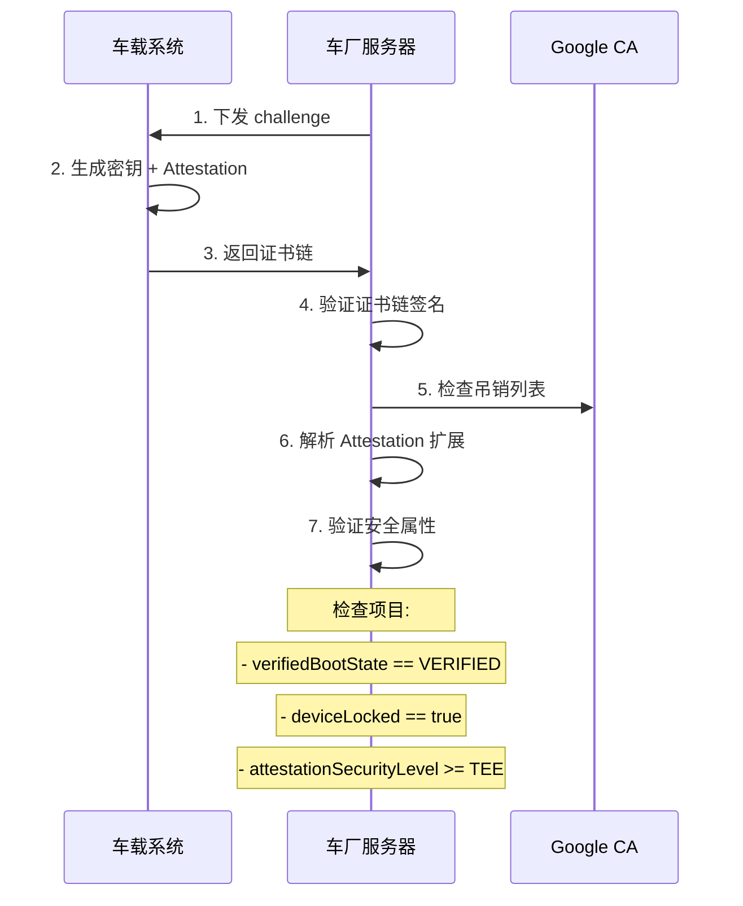
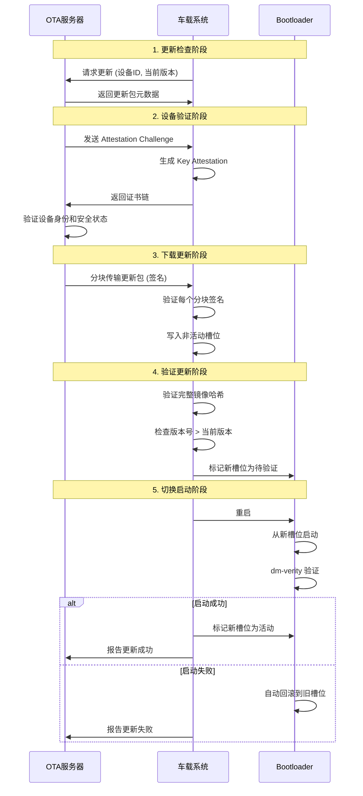

# 车载Android系统安全性提升方案

基于Keystore、TEE、StrongBox、GateKeeper等安全组件，结合车载系统特点，从备份与仲裁角度提升安全性的方法。

---

## 一、密钥管理的多级备份与仲裁

```
┌─────────────────────────────────────────────────────────────────┐
│                    车载密钥管理分层架构                           │
├─────────────────────────────────────────────────────────────────┤
│  Level 3: StrongBox (独立安全芯片)                               │
│  ├── 车辆核心密钥 (车辆身份、ECU认证)                            │
│  └── 最高安全级别，抗物理攻击                                    │
├─────────────────────────────────────────────────────────────────┤
│  Level 2: TEE Keymaster                                         │
│  ├── 用户身份密钥 (账户认证)                                     │
│  ├── 应用数据加密密钥                                            │
│  └── 硬件隔离，较高安全性                                        │
├─────────────────────────────────────────────────────────────────┤
│  Level 1: Software Keystore (备选/降级)                          │
│  ├── 非敏感密钥                                                  │
│  └── 兼容性保证                                                  │
└─────────────────────────────────────────────────────────────────┘
```

### 仲裁策略

1. **优先级仲裁**：StrongBox > TEE > Software，自动降级但记录日志
2. **双密钥签名**：关键操作需要TEE和StrongBox双重签名验证
3. **密钥轮换机制**：定期轮换，旧密钥在安全窗口期内并行有效

### 代码示例

```java
// 尝试使用最高安全级别的密钥存储
public SecretKey generateSecureKey(String alias) {
    KeyGenParameterSpec.Builder builder = new KeyGenParameterSpec.Builder(
        alias,
        KeyProperties.PURPOSE_ENCRYPT | KeyProperties.PURPOSE_DECRYPT
    )
    .setBlockModes(KeyProperties.BLOCK_MODE_GCM)
    .setEncryptionPaddings(KeyProperties.ENCRYPTION_PADDING_NONE)
    .setKeySize(256)
    .setUserAuthenticationRequired(true);

    // 优先尝试 StrongBox
    if (Build.VERSION.SDK_INT >= Build.VERSION_CODES.P) {
        try {
            builder.setIsStrongBoxBacked(true);
            Log.i(TAG, "Using StrongBox for key: " + alias);
        } catch (StrongBoxUnavailableException e) {
            Log.w(TAG, "StrongBox unavailable, falling back to TEE");
            // 记录安全降级事件
            SecurityAuditLog.logDegradation("StrongBox", "TEE", alias);
        }
    }

    KeyGenerator keyGenerator = KeyGenerator.getInstance(
        KeyProperties.KEY_ALGORITHM_AES, "AndroidKeyStore"
    );
    keyGenerator.init(builder.build());
    return keyGenerator.generateKey();
}
```

---

## 二、认证系统的多因素冗余

```
┌──────────────────────────────────────────────────────────────┐
│                   车载多因素认证仲裁                          │
│                                                              │
│   ┌─────────────┐   ┌─────────────┐   ┌─────────────┐       │
│   │   面部识别   │   │   指纹识别   │   │   PIN/密码   │       │
│   │  (Class 3)  │   │  (Class 3)  │   │ (GateKeeper) │       │
│   └──────┬──────┘   └──────┬──────┘   └──────┬──────┘       │
│          │                 │                 │               │
│          ▼                 ▼                 ▼               │
│   ┌─────────────────────────────────────────────────┐       │
│   │          认证仲裁器 (Authentication Arbiter)      │       │
│   │  ┌──────────────────────────────────────────┐   │       │
│   │  │ 策略: 安全敏感操作需 ≥2 种认证方式通过     │   │       │
│   │  │ 降级: 单因素认证仅限非敏感操作             │   │       │
│   │  └──────────────────────────────────────────┘   │       │
│   └──────────────────────────────────────────────────┘       │
│                            │                                 │
│                            ▼                                 │
│   ┌──────────────────────────────────────────────────┐      │
│   │              AuthToken (TEE签名)                  │      │
│   │  包含: userId, authenticatorType, timestamp       │      │
│   └──────────────────────────────────────────────────┘      │
└──────────────────────────────────────────────────────────────┘
```

### 关键方法

- **多因素组合**：敏感操作（如远程解锁、OTA更新确认）需要多因素认证
- **认证超时分级**：根据操作敏感度设置不同的AuthToken有效期
- **失败锁定策略**：指数退避防暴力破解，同时保留紧急访问通道

### 认证分级策略

| 操作类型 | 认证要求 | 超时设置 |
|---------|---------|---------|
| 车辆解锁 | 单因素(生物/PIN) | 认证后5分钟有效 |
| 娱乐系统访问 | 单因素 | 认证后30分钟有效 |
| 远程控制授权 | 双因素 | 每次都需认证 |
| OTA更新确认 | 双因素 + 网络验证 | 每次都需认证 |
| ECU配置修改 | 双因素 + 物理按键 | 每次都需认证 |

### 代码示例

```kotlin
// 多因素认证仲裁器
class AuthenticationArbiter(private val context: Context) {

    enum class SecurityLevel {
        LOW,      // 单因素即可
        MEDIUM,   // 单因素 + 超时限制
        HIGH,     // 双因素必需
        CRITICAL  // 双因素 + 额外验证
    }

    fun authenticate(
        level: SecurityLevel,
        onSuccess: (AuthenticationResult) -> Unit,
        onFailure: (Exception) -> Unit
    ) {
        val promptInfo = when (level) {
            SecurityLevel.LOW -> buildBasicPrompt()
            SecurityLevel.MEDIUM -> buildMediumPrompt()
            SecurityLevel.HIGH, SecurityLevel.CRITICAL -> buildStrongPrompt()
        }

        val biometricPrompt = BiometricPrompt(
            activity, executor,
            object : BiometricPrompt.AuthenticationCallback() {
                override fun onAuthenticationSucceeded(result: AuthenticationResult) {
                    if (level == SecurityLevel.CRITICAL) {
                        // 关键操作需要二次确认
                        requestSecondaryConfirmation(onSuccess, onFailure)
                    } else {
                        onSuccess(result)
                    }
                }

                override fun onAuthenticationFailed() {
                    SecurityAuditLog.logAuthFailure(level)
                    onFailure(AuthenticationException("Authentication failed"))
                }
            }
        )

        biometricPrompt.authenticate(promptInfo)
    }

    private fun buildStrongPrompt(): BiometricPrompt.PromptInfo {
        return BiometricPrompt.PromptInfo.Builder()
            .setTitle("安全验证")
            .setSubtitle("此操作需要强认证")
            .setAllowedAuthenticators(
                BiometricManager.Authenticators.BIOMETRIC_STRONG or
                BiometricManager.Authenticators.DEVICE_CREDENTIAL
            )
            .build()
    }
}
```

---

## 三、系统完整性的双重验证

```
┌────────────────────────────────────────────────────────────────┐
│                    Verified Boot 链式验证                       │
│                                                                │
│  BootROM ──► Bootloader ──► Kernel ──► System ──► Vendor       │
│    │            │            │           │          │          │
│    └────────────┴────────────┴───────────┴──────────┘          │
│                        签名链验证                               │
│                            │                                   │
│                            ▼                                   │
│  ┌─────────────────────────────────────────────────────────┐  │
│  │               Root of Trust 信息传递                     │  │
│  │  ┌─────────────────────────────────────────────────┐    │  │
│  │  │  传递给 TEE Keymaster:                          │    │  │
│  │  │  - verifiedBootKey (启动验证密钥)               │    │  │
│  │  │  - verifiedBootState (VERIFIED/SELF_SIGNED)    │    │  │
│  │  │  - deviceLocked (设备是否锁定)                  │    │  │
│  │  └─────────────────────────────────────────────────┘    │  │
│  └─────────────────────────────────────────────────────────┘  │
│                            │                                   │
│                            ▼                                   │
│  ┌─────────────────────────────────────────────────────────┐  │
│  │                  Key Attestation 远程验证                │  │
│  │  车厂服务器可验证:                                       │  │
│  │  - 密钥确实由安全硬件生成                                │  │
│  │  - 设备处于安全启动状态                                  │  │
│  │  - 系统未被篡改                                          │  │
│  └─────────────────────────────────────────────────────────┘  │
└────────────────────────────────────────────────────────────────┘
```

### Key Attestation 验证流程



### 服务端验证代码示例

```java
public class AttestationVerifier {

    public VerificationResult verifyAttestation(
        byte[] challenge,
        X509Certificate[] certChain
    ) throws Exception {

        VerificationResult result = new VerificationResult();

        // 1. 验证证书链
        verifyCertificateChain(certChain);

        // 2. 检查根证书是否为 Google Root
        verifyGoogleRoot(certChain[certChain.length - 1]);

        // 3. 解析 Attestation 扩展
        ParsedAttestationRecord attestation =
            Asn1Utils.getAttestationRecord(certChain[0]);

        // 4. 验证 challenge
        if (!Arrays.equals(challenge, attestation.attestationChallenge)) {
            throw new SecurityException("Challenge mismatch");
        }

        // 5. 检查安全级别
        if (attestation.attestationSecurityLevel < SecurityLevel.TEE) {
            result.addWarning("Security level below TEE");
        }

        // 6. 检查启动状态
        RootOfTrust rot = attestation.teeEnforced.rootOfTrust;
        if (rot.verifiedBootState != VerifiedBootState.VERIFIED) {
            throw new SecurityException("Device not in verified boot state");
        }

        if (!rot.deviceLocked) {
            throw new SecurityException("Device bootloader is unlocked");
        }

        // 7. 检查系统版本
        if (attestation.teeEnforced.osVersion < MIN_REQUIRED_OS_VERSION) {
            result.addWarning("OS version too old");
        }

        if (attestation.teeEnforced.osPatchLevel < MIN_REQUIRED_PATCH_LEVEL) {
            result.addWarning("Security patch level too old");
        }

        result.setVerified(true);
        return result;
    }
}
```

---

## 四、车载特有的域隔离与仲裁

```
┌───────────────────────────────────────────────────────────────────┐
│                      车载多域安全架构                              │
│                                                                   │
│  ┌─────────────┐  ┌─────────────┐  ┌─────────────┐  ┌──────────┐ │
│  │  娱乐域 IVI  │  │  仪表域      │  │  ADAS 域    │  │  网关域   │ │
│  │  (Android)  │  │  (RTOS)     │  │  (Safety)   │  │          │ │
│  └──────┬──────┘  └──────┬──────┘  └──────┬──────┘  └────┬─────┘ │
│         │                │                │               │       │
│         └────────────────┼────────────────┼───────────────┘       │
│                          │                │                       │
│                          ▼                ▼                       │
│  ┌────────────────────────────────────────────────────────────┐  │
│  │                    安全仲裁层 (Hypervisor/TEE)              │  │
│  │                                                            │  │
│  │  • 域间通信认证: 所有跨域消息需签名验证                     │  │
│  │  • 权限仲裁: 娱乐域不可直接访问车辆控制                    │  │
│  │  • 故障隔离: 娱乐域崩溃不影响安全关键域                    │  │
│  │  • 数据隔离: 各域数据加密存储，密钥相互独立                │  │
│  └────────────────────────────────────────────────────────────┘  │
└───────────────────────────────────────────────────────────────────┘
```

### 域间通信安全模型

```
┌─────────────────────────────────────────────────────────────────┐
│                     域间安全通信流程                             │
│                                                                 │
│  娱乐域 (Android)                     车辆控制域 (RTOS)         │
│  ┌───────────────┐                   ┌───────────────┐         │
│  │ 请求: 开启空调 │                   │               │         │
│  └───────┬───────┘                   │               │         │
│          │                           │               │         │
│          ▼                           │               │         │
│  ┌───────────────┐                   │               │         │
│  │ 1. 签名请求   │                   │               │         │
│  │    (TEE密钥)  │                   │               │         │
│  └───────┬───────┘                   │               │         │
│          │                           │               │         │
│          ▼                           │               │         │
│  ┌─────────────────────────────────────────────────────────┐   │
│  │              安全网关 (Hypervisor)                       │   │
│  │  ┌─────────────────────────────────────────────────┐    │   │
│  │  │ 2. 验证签名                                     │    │   │
│  │  │ 3. 检查权限 (娱乐域是否可控制空调)              │    │   │
│  │  │ 4. 速率限制 (防DoS)                             │    │   │
│  │  │ 5. 日志记录                                     │    │   │
│  │  └─────────────────────────────────────────────────┘    │   │
│  └───────────────────────────────────────────────────────────┘   │
│          │                           │               │         │
│          └───────────────────────────┘               │         │
│                                      ▼               │         │
│                              ┌───────────────┐       │         │
│                              │ 6. 验证通过   │       │         │
│                              │    执行操作   │       │         │
│                              └───────────────┘       │         │
└─────────────────────────────────────────────────────────────────┘
```

### 域权限矩阵

| 源域 \ 目标域 | 娱乐域 | 仪表域 | ADAS域 | 动力域 | 网关域 |
|-------------|--------|--------|--------|--------|--------|
| **娱乐域**   | ✓ Full | Read   | ✗      | ✗      | Limited |
| **仪表域**   | Read   | ✓ Full | Read   | Read   | Limited |
| **ADAS域**   | ✗      | Write  | ✓ Full | Write  | ✓ Full |
| **动力域**   | ✗      | Write  | Read   | ✓ Full | ✓ Full |
| **网关域**   | ✓ Full | ✓ Full | ✓ Full | ✓ Full | ✓ Full |

---

## 五、OTA安全更新的备份与回滚

```
┌───────────────────────────────────────────────────────────────┐
│                    OTA 安全更新架构                            │
│                                                               │
│  ┌─────────────────────────────────────────────────────────┐ │
│  │                    双分区 A/B 系统                       │ │
│  │                                                         │ │
│  │   Slot A (当前)          Slot B (更新目标)              │ │
│  │   ┌──────────────┐      ┌──────────────┐               │ │
│  │   │ boot_a      │      │ boot_b      │               │ │
│  │   │ system_a    │  ──► │ system_b    │ ← 新镜像写入   │ │
│  │   │ vendor_a    │      │ vendor_b    │               │ │
│  │   └──────────────┘      └──────────────┘               │ │
│  │         ▲                      │                        │ │
│  │         │                      │                        │ │
│  │    [验证失败回滚]         [验证成功切换]                │ │
│  └─────────────────────────────────────────────────────────┘ │
│                                                               │
│  安全验证链:                                                  │
│  ┌─────────────────────────────────────────────────────────┐ │
│  │ 1. 更新包签名验证 (车厂私钥签名)                        │ │
│  │ 2. Key Attestation 验证设备身份                        │ │
│  │ 3. 版本号递增检查 (防降级攻击)                         │ │
│  │ 4. 启动时 dm-verity 验证完整性                         │ │
│  │ 5. 启动失败自动回滚到前一槽位                          │ │
│  └─────────────────────────────────────────────────────────┘ │
└───────────────────────────────────────────────────────────────┘
```

### OTA 安全更新流程



### 防降级保护

```java
public class AntiRollbackProtection {

    // Rollback Protection Index 存储在安全存储中
    private static final String RPI_KEY = "rollback_protection_index";

    public boolean verifyVersionNotRolledBack(
        int newOsVersion,
        int newPatchLevel,
        int newVendorVersion
    ) throws SecurityException {

        // 从 TEE 安全存储读取当前 RPI
        int[] currentRPI = readRPIFromSecureStorage();

        // 版本必须严格递增或相等
        if (newOsVersion < currentRPI[0]) {
            throw new SecurityException("OS version rollback detected");
        }

        if (newOsVersion == currentRPI[0] && newPatchLevel < currentRPI[1]) {
            throw new SecurityException("Patch level rollback detected");
        }

        if (newVendorVersion < currentRPI[2]) {
            throw new SecurityException("Vendor version rollback detected");
        }

        return true;
    }

    public void updateRPIAfterSuccessfulBoot(
        int osVersion,
        int patchLevel,
        int vendorVersion
    ) {
        // 更新成功后，更新 RPI（此操作不可逆）
        writeRPIToSecureStorage(new int[]{osVersion, patchLevel, vendorVersion});
    }
}
```

---

## 六、具体安全增强建议

| 方面 | 备份/冗余策略 | 仲裁机制 |
|------|--------------|---------|
| **密钥存储** | StrongBox + TEE 双重存储关键密钥 | 优先使用StrongBox，不可用时降级到TEE并告警 |
| **用户认证** | 生物识别 + PIN 双因素 | 敏感操作需多因素，普通操作单因素即可 |
| **系统完整性** | A/B双分区 + dm-verity | Verified Boot失败时自动回滚 |
| **数据加密** | 用户数据FBE + 元数据加密 | 密钥绑定用户认证，未认证时数据不可访问 |
| **通信安全** | TLS + 双向证书认证 | 证书过期/吊销时降级到离线模式 |
| **域间通信** | 消息签名 + 加密 | Hypervisor/TEE级别的访问控制仲裁 |

---

## 七、安全监控与审计

### 安全事件日志架构

```
┌───────────────────────────────────────────────────────────────┐
│                    安全审计日志系统                            │
│                                                               │
│  ┌─────────────────────────────────────────────────────────┐ │
│  │                    日志收集层                            │ │
│  │  ┌──────────┐ ┌──────────┐ ┌──────────┐ ┌──────────┐   │ │
│  │  │认证事件  │ │密钥操作  │ │系统完整性│ │域间通信  │   │ │
│  │  └────┬─────┘ └────┬─────┘ └────┬─────┘ └────┬─────┘   │ │
│  └───────┼────────────┼────────────┼────────────┼──────────┘ │
│          └────────────┴────────────┴────────────┘            │
│                            │                                 │
│                            ▼                                 │
│  ┌─────────────────────────────────────────────────────────┐ │
│  │              安全日志聚合器 (TEE保护)                    │ │
│  │  • 日志签名 (防篡改)                                    │ │
│  │  • 加密存储                                             │ │
│  │  • 循环缓冲 (防存储耗尽)                                │ │
│  └─────────────────────────────────────────────────────────┘ │
│                            │                                 │
│                            ▼                                 │
│  ┌─────────────────────────────────────────────────────────┐ │
│  │              安全分析引擎                                │ │
│  │  • 异常检测 (认证失败频率)                              │ │
│  │  • 行为分析 (异常操作模式)                              │ │
│  │  • 实时告警                                             │ │
│  └─────────────────────────────────────────────────────────┘ │
│                            │                                 │
│                            ▼                                 │
│  ┌─────────────────────────────────────────────────────────┐ │
│  │              上报车厂安全运营中心 (SOC)                  │ │
│  └─────────────────────────────────────────────────────────┘ │
└───────────────────────────────────────────────────────────────┘
```

### 关键监控指标

| 指标 | 阈值 | 响应措施 |
|-----|------|---------|
| 认证失败次数 | >5次/分钟 | 临时锁定 + 告警 |
| 密钥操作频率 | >100次/秒 | 限流 + 日志 |
| TEE异常 | 任何错误 | 立即告警 |
| 启动状态变化 | 非VERIFIED | 功能降级 + 告警 |
| 域间通信拒绝 | >10次/分钟 | 源域隔离 + 告警 |

---

## 八、实施要点总结

### 8.1 密钥管理最佳实践

1. **密钥绑定硬件**：使用`setIsStrongBoxBacked(true)`将关键密钥绑定到StrongBox
2. **启用密钥证明**：通过`setAttestationChallenge()`让后端验证设备安全状态
3. **认证超时策略**：安全操作设置`setUserAuthenticationParameters(0, AUTH_BIOMETRIC_STRONG)`每次认证
4. **监控降级事件**：TEE/StrongBox不可用时记录安全日志，及时告警
5. **防回滚保护**：通过Rollback Protection Index (RPI)防止固件降级攻击

### 8.2 车载特有考量

1. **功能安全优先**：安全机制不能影响车辆基本安全功能
2. **离线可用性**：认证和密钥操作在无网络时仍需可用
3. **快速启动**：安全验证不能显著延长车辆启动时间
4. **长生命周期**：考虑10-15年的车辆使用周期，密钥需支持远程更新
5. **多用户支持**：家庭共享场景下的用户隔离和权限管理

### 8.3 安全降级策略

```
正常模式 (Full Security)
    │
    │ StrongBox 不可用
    ▼
降级模式1 (TEE Only)
    │
    │ TEE 异常
    ▼
降级模式2 (Software + 功能限制)
    │
    │ 关键安全组件失效
    ▼
安全模式 (Minimal Function)
    │
    └── 仅保留基本车辆控制
        禁用所有远程功能
        强制用户到4S店检修
```

---

## 九、参考资料

- Android Keystore System: https://developer.android.com/training/articles/keystore
- Key Attestation: https://developer.android.com/training/articles/security-key-attestation
- Android Verified Boot: https://source.android.com/security/verifiedboot
- StrongBox Keymaster: https://developer.android.com/training/articles/keystore#HardwareSecurityModule
- ISO 21434: Road vehicles - Cybersecurity engineering
- UNECE WP.29 R155: Cybersecurity and Cybersecurity Management System
