# 车载系统 Secure Boot 安全启动深度解析

车载系统作为关键安全域（Safety-Critical Domain），其启动过程的完整性和可信性是整个系统安全的基石。Secure Boot（安全启动）通过建立从硬件信任根到上层应用的完整信任链（Chain of Trust），确保每一级启动组件的真实性和完整性，从而防止恶意代码在系统启动阶段注入。本文档从车载场景出发，全面解析 Secure Boot 的架构设计、实现机制、相关概念及行业标准。

---

## 目录

1. [Secure Boot 核心概念](#一secure-boot-核心概念)
2. [信任链架构设计](#二信任链架构设计)
3. [车载 Secure Boot 完整流程](#三车载-secure-boot-完整流程)
4. [各启动阶段详解](#四各启动阶段详解)
5. [Android Verified Boot (AVB)](#五android-verified-boot-avb)
6. [dm-verity 运行时完整性验证](#六dm-verity-运行时完整性验证)
7. [车载平台 Secure Boot 实现](#七车载平台-secure-boot-实现)
8. [Secure Boot 密钥体系](#八secure-boot-密钥体系)
9. [回滚保护机制](#九回滚保护机制)
10. [Secure Boot 与 TEE 的协同](#十secure-boot-与-tee-的协同)
11. [OTA 更新与 Secure Boot](#十一ota-更新与-secure-boot)
12. [攻击面分析与防御](#十二攻击面分析与防御)
13. [车载安全标准与合规](#十三车载安全标准与合规)
14. [概念发散与关联技术](#十四概念发散与关联技术)
15. [最佳实践与实施建议](#十五最佳实践与实施建议)

---

## 一、Secure Boot 核心概念

### 1.1 什么是 Secure Boot

Secure Boot 是一种安全机制，确保设备在启动过程中只执行经过验证的、可信的软件。其核心思想是：**每一级启动组件在将控制权交给下一级之前，必须验证下一级组件的数字签名和完整性**。

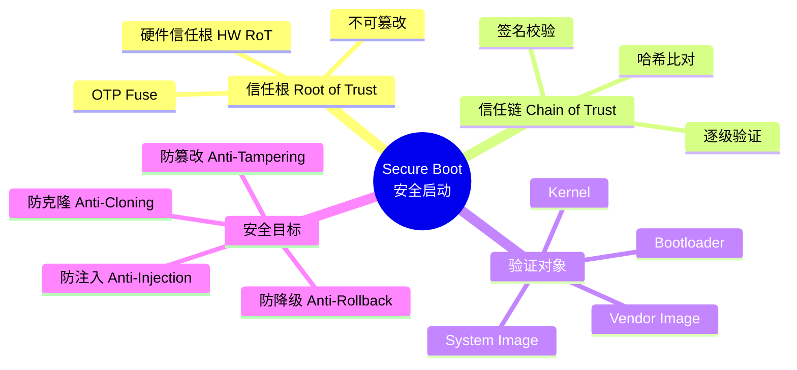

### 1.2 核心安全原则

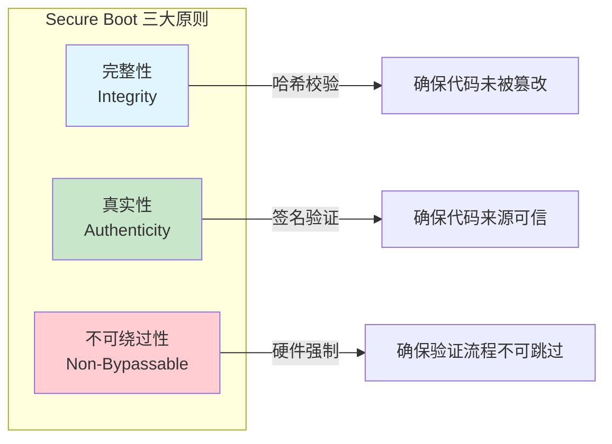

| 原则 | 实现机制 | 说明 |
|------|---------|------|
| **完整性 (Integrity)** | SHA-256/SHA-384 哈希校验 | 确保启动镜像未被修改 |
| **真实性 (Authenticity)** | RSA/ECDSA 数字签名 | 确保镜像由合法发布者签署 |
| **不可绕过性 (Non-Bypassable)** | 硬件信任根 + Fuse 锁定 | 验证逻辑烧录在 ROM 中，不可修改 |
| **最小信任 (Minimal Trust)** | 逐级验证，最小权限 | 每级仅信任已验证的下一级 |
| **防回滚 (Anti-Rollback)** | 版本计数器 (Fuse/RPMB) | 防止降级到已知漏洞版本 |

### 1.3 Secure Boot vs Verified Boot vs Trusted Boot

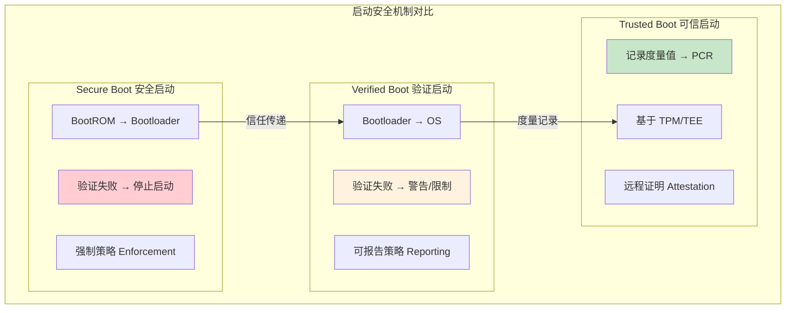

| 特性 | Secure Boot | Verified Boot | Trusted Boot |
|------|------------|---------------|--------------|
| **验证时机** | 硬件层启动 | OS 加载阶段 | 全程度量 |
| **失败行为** | 停止启动 | 警告/降级 | 记录度量值 |
| **验证方** | BootROM (硬件) | Bootloader | TPM/TEE |
| **典型实现** | ARM Secure Boot | Android AVB | TCG Trusted Boot |
| **车载应用** | SoC 启动 | Android 镜像验证 | HSM 远程证明 |

---

## 二、信任链架构设计

### 2.1 完整信任链架构

信任链（Chain of Trust）是 Secure Boot 的核心架构思想。从不可篡改的硬件信任根（Hardware Root of Trust）出发，每一级组件验证下一级，形成完整的信任传递链路。

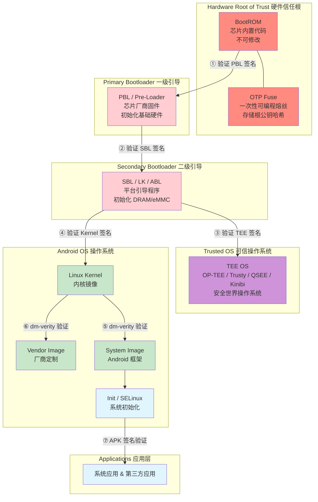

### 2.2 信任传递模型

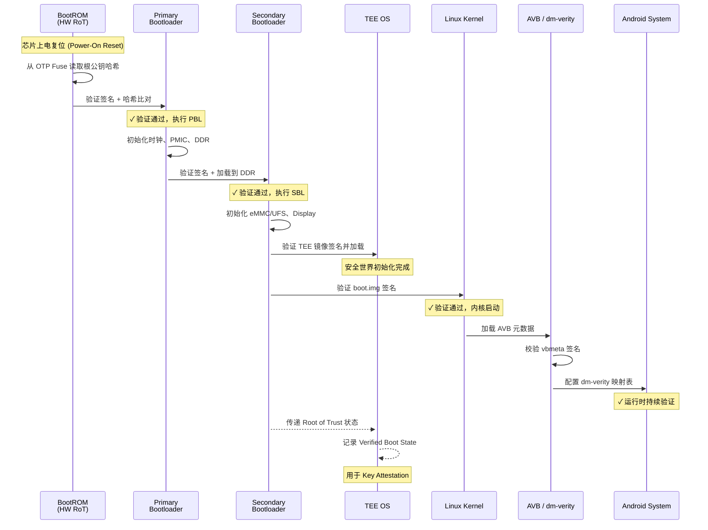

### 2.3 信任根 (Root of Trust) 详解

硬件信任根是整个信任链的起点，其安全性直接决定了整个系统的安全性。

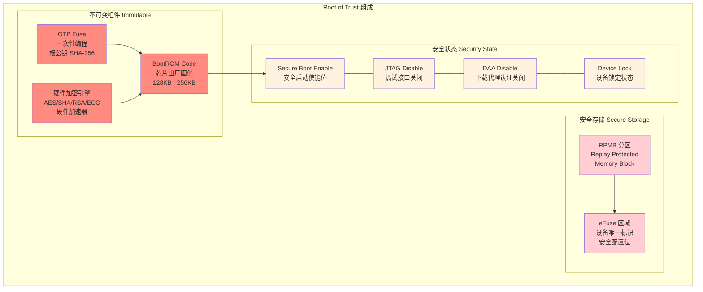

**OTP Fuse 关键字段：**

| Fuse 字段 | 位宽 | 说明 |
|-----------|------|------|
| `ROOT_KEY_HASH` | 256 bit | 根公钥 SHA-256 哈希值 |
| `SECURE_BOOT_EN` | 1 bit | 安全启动使能标志 |
| `JTAG_DISABLE` | 1 bit | JTAG 调试接口禁用 |
| `DAA_DISABLE` | 1 bit | Download Agent Authentication 禁用 |
| `SBC_EN` | 1 bit | Secure Boot Certificate 使能 |
| `ANTI_ROLLBACK_VER` | 32 bit | 防回滚版本计数器 |
| `DEVICE_ID` | 128 bit | 设备唯一标识 |

---

## 三、车载 Secure Boot 完整流程

### 3.1 上电启动完整时序

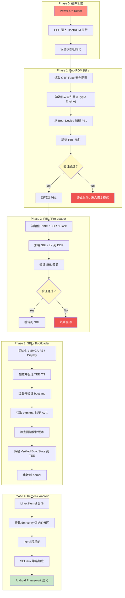

### 3.2 签名验证核心算法流程

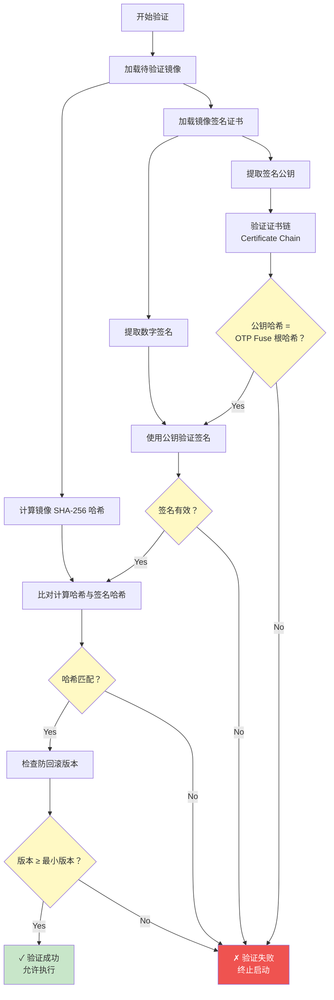

---

## 四、各启动阶段详解

### 4.1 BootROM 阶段

BootROM 是芯片出厂时固化在 SoC 内部 ROM 中的代码，是整个信任链中唯一不可修改的起点。

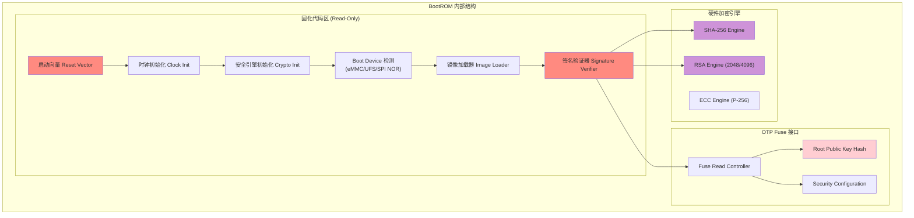

**BootROM 关键特性：**

- **不可修改**：代码在芯片制造时写入 Mask ROM，无法通过任何软件手段修改
- **最小化**：代码量极小（通常 64KB-256KB），减少攻击面
- **确定性执行**：无外部输入干扰，每次执行路径完全一致
- **硬件加速**：内置的密码学引擎提供高效签名验证能力

### 4.2 Bootloader 阶段

Bootloader 通常分为两级：PBL（Primary Bootloader）和 SBL（Secondary Bootloader）/ LK（Little Kernel）。

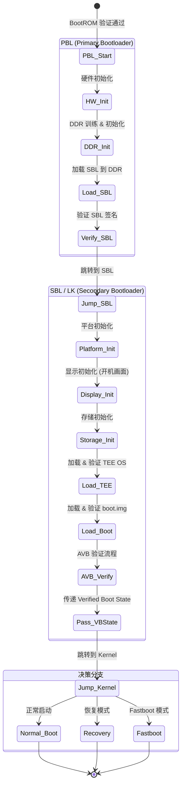

**SBL/LK 关键职责：**

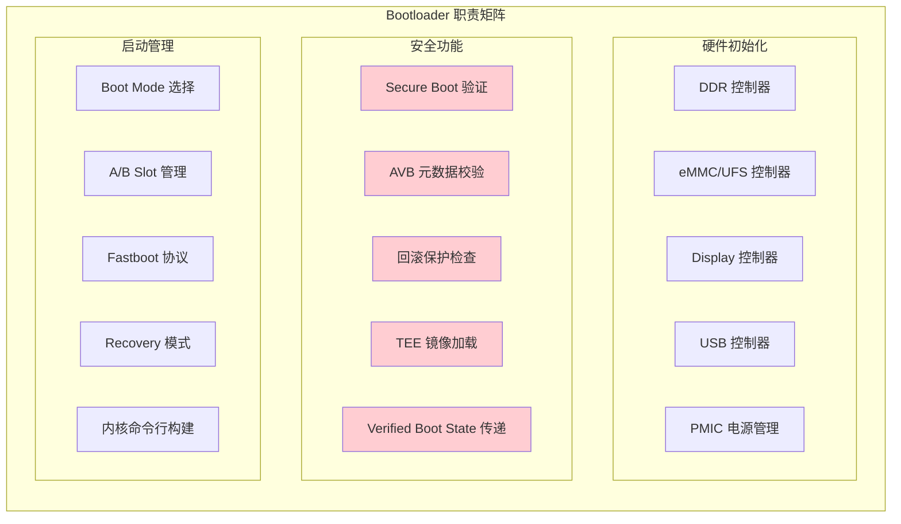

### 4.3 Kernel 加载与验证

boot.img 包含 Linux Kernel、DTB（Device Tree Blob）和可选的 ramdisk，作为一个整体进行签名验证。

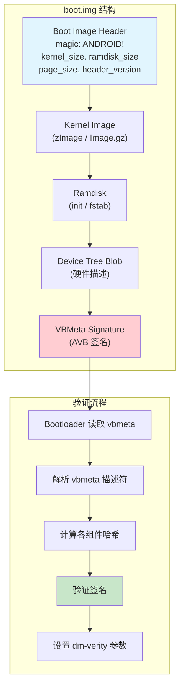

---

## 五、Android Verified Boot (AVB)

### 5.1 AVB 2.0 架构总览

Android Verified Boot 2.0（也称 AVB）是 Google 在 Android 8.0 引入的统一验证启动框架，是车载 Android 系统使用的标准验证机制。

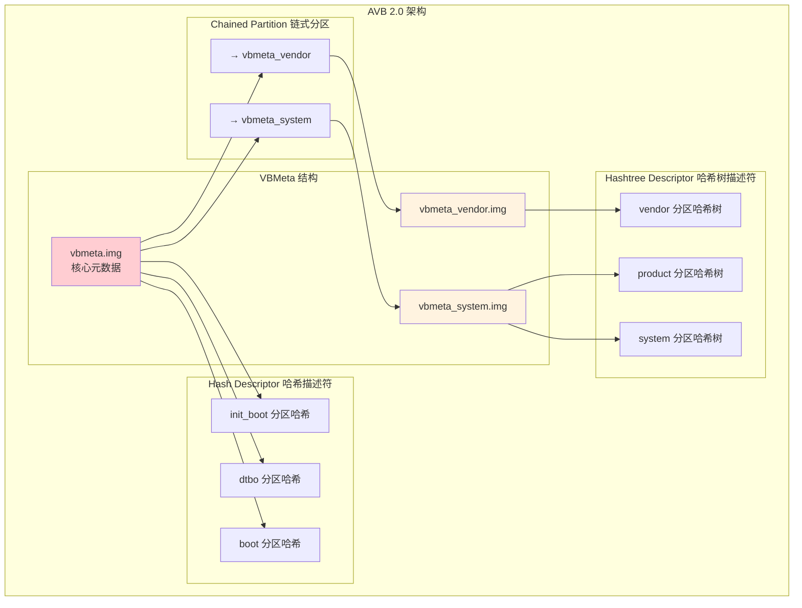

### 5.2 VBMeta 数据结构

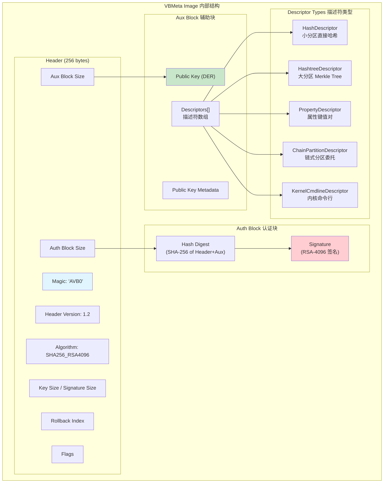

### 5.3 AVB 验证流程

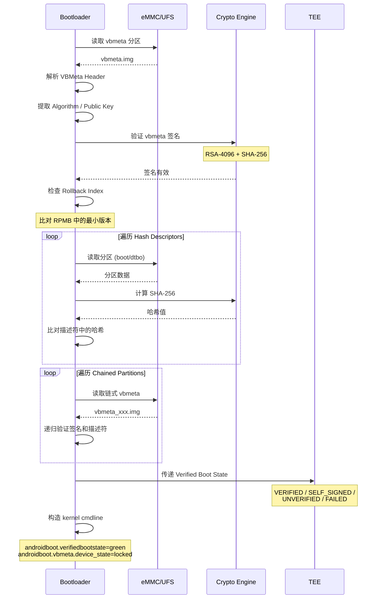

### 5.4 Verified Boot State（启动状态）

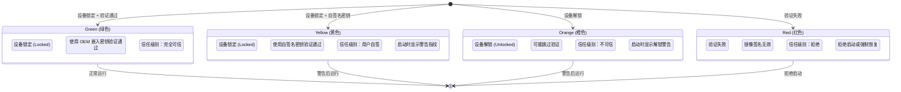

**车载场景下的启动状态策略：**

| 状态 | 颜色 | 车载策略 | TEE 行为 |
|------|------|---------|---------|
| **VERIFIED** | Green | 正常启动，全功能 | 正常提供密钥服务 |
| **SELF_SIGNED** | Yellow | 工厂/开发模式，受限功能 | 限制高安全等级密钥 |
| **UNLOCKED** | Orange | 开发模式，显示警告 | 禁止访问生产密钥 |
| **FAILED** | Red | **禁止启动**，车载场景不允许 | 拒绝所有服务 |

---

## 六、dm-verity 运行时完整性验证

### 6.1 dm-verity 工作原理

dm-verity 是 Linux Device-Mapper 的一个目标（target），用于对块设备进行透明的完整性验证。它使用 Merkle Hash Tree（默克尔哈希树）实现高效的按需验证。

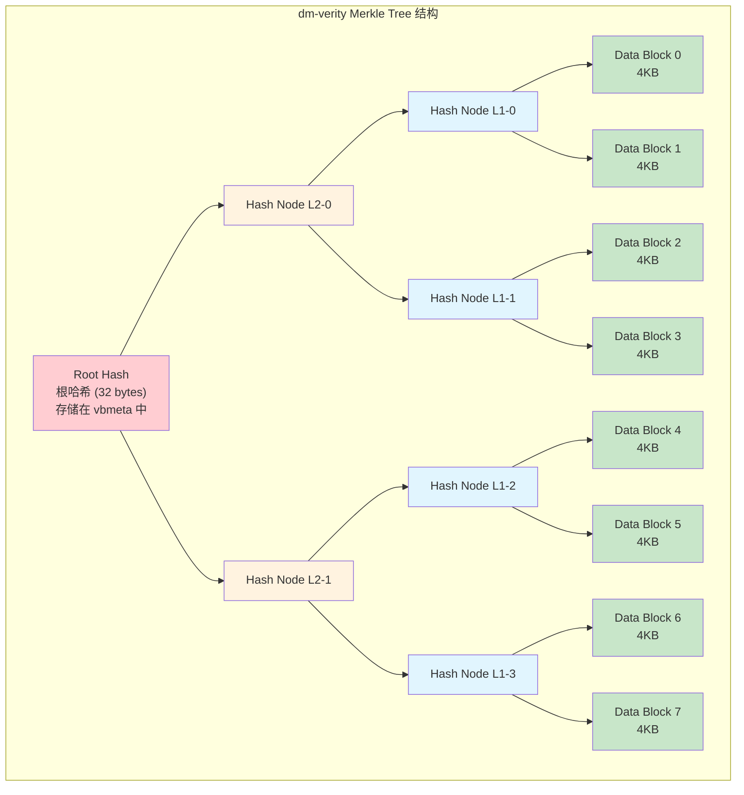

### 6.2 dm-verity 读取验证流程

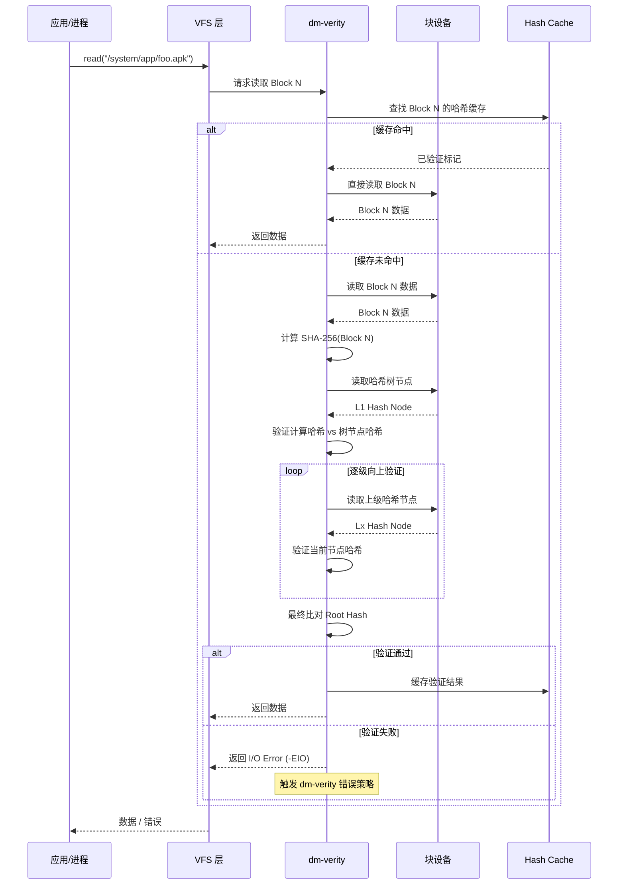

### 6.3 dm-verity 错误处理策略

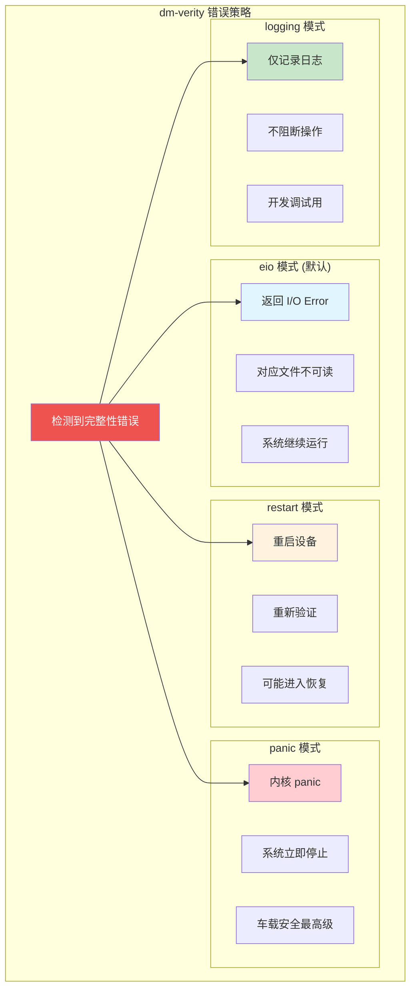

**车载场景策略选择：**

| 错误策略 | 适用场景 | 安全等级 | 车载建议 |
|---------|---------|---------|---------|
| `panic` | 仪表盘、ADAS 域 | 最高 | 功能安全关键系统 |
| `restart` | IVI 娱乐域 | 高 | 非实时安全系统 |
| `eio` | 普通应用分区 | 中 | 可容忍部分不可用 |
| `logging` | 开发/测试阶段 | 低 | 仅限开发环境 |

---

## 七、车载平台 Secure Boot 实现

### 7.1 MTK（联发科）平台

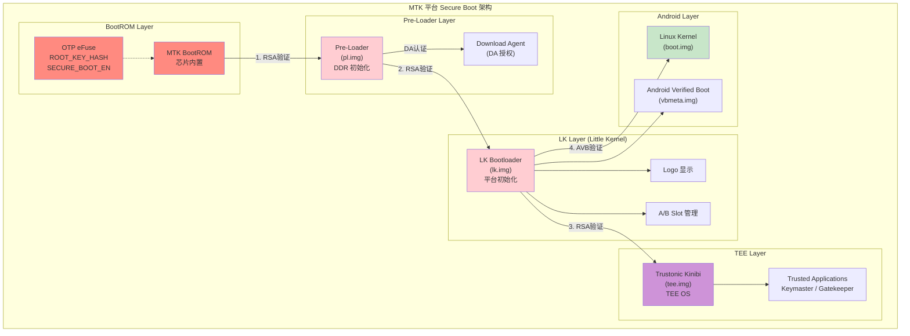

**MTK 平台 Secure Boot 配置要点：**

- **eFuse 烧写**：通过 SP Flash Tool 或产线工具烧写 `ROOT_KEY_HASH` 和 `SECURE_BOOT_EN`
- **签名工具链**：使用 MTK Sign Tool（`SignTool.exe`）对各级镜像进行签名
- **证书格式**：MTK 使用自定义证书格式（不同于标准 X.509）
- **DA 认证**：Download Agent 需要授权认证，防止非法刷机
- **Rollback 保护**：通过 eFuse 中的 Anti-Rollback Version 实现

### 7.2 高通（Qualcomm）平台

```mermaid
graph TB
    subgraph "Qualcomm 平台 Secure Boot 架构"
        subgraph "PBL Layer"
            QC_PBL["Qualcomm PBL<br/>Primary Boot Loader<br/>SoC 内置 ROM"]
            QC_FUSE["QFPROM eFuse<br/>OEM_PK_HASH<br/>SECURE_BOOT_EN"]
        end

        subgraph "XBL Layer (Extensible Boot Loader)"
            QC_XBL["XBL Core<br/>(xbl.elf)<br/>DDR/Clock/PMIC"]
            QC_XBL_CFG["XBL Config<br/>(xbl_config.elf)"]
            QC_XBL_SEC["XBL SEC<br/>Security Extensions"]
        end

        subgraph "ABL Layer (Android Boot Loader)"
            QC_ABL["ABL<br/>(abl.elf)<br/>基于 UEFI EDK2"]
            QC_AVB["AVB Library"]
            QC_DISPLAY["Display / Splash"]
        end

        subgraph "QTEE Layer"
            QC_TEE["QTEE / TZ<br/>(tz.mbn)<br/>Secure World OS"]
            QC_DEVCFG["Device Config<br/>(devcfg.mbn)"]
            QC_KEYMASTER["Keymaster TA<br/>(keymaster64.mbn)"]
        end

        subgraph "HLOS Layer"
            QC_KERNEL["Linux Kernel<br/>(boot.img)"]
            QC_VENDOR["Vendor Boot<br/>(vendor_boot.img)"]
        end
    end

    QC_PBL -->|"1. 验证 XBL"| QC_XBL
    QC_FUSE -.-> QC_PBL
    QC_XBL -->|"2. 验证 QTEE"| QC_TEE
    QC_XBL -->|"3. 验证 ABL"| QC_ABL
    QC_XBL --> QC_XBL_CFG
    QC_XBL --> QC_XBL_SEC
    QC_TEE --> QC_DEVCFG
    QC_TEE --> QC_KEYMASTER
    QC_ABL -->|"4. AVB 验证"| QC_KERNEL
    QC_ABL --> QC_AVB
    QC_ABL --> QC_DISPLAY
    QC_ABL --> QC_VENDOR

    style QC_PBL fill:#ff8a80
    style QC_FUSE fill:#ff8a80
    style QC_XBL fill:#ffcdd2
    style QC_ABL fill:#ffcdd2
    style QC_TEE fill:#ce93d8
    style QC_KERNEL fill:#c8e6c9
    style QC_VENDOR fill:#c8e6c9
```

**高通平台 Secure Boot 特性：**

- **QFPROM**：Qualcomm Fuse 编程区域，存储 OEM 公钥哈希和安全配置
- **XBL 架构**：基于 UEFI 的可扩展 Bootloader，模块化设计
- **PIK/OAK 签名体系**：PIK (Platform Integration Key) + OAK (OEM Application Key) 双密钥体系
- **Sectools 工具链**：`sectools` 套件提供签名、加密、证书管理等功能
- **RPMB 防回滚**：通过 eMMC/UFS 的 RPMB 分区存储回滚计数器

### 7.3 MTK vs 高通平台对比

```mermaid
graph TB
    subgraph "平台 Secure Boot 对比"
        subgraph "MTK 平台"
            M1["BootROM → Pre-Loader → LK → Kernel"]
            M2["签名: MTK Sign Tool"]
            M3["Fuse: MTK eFuse"]
            M4["TEE: Trustonic Kinibi"]
            M5["Bootloader: Little Kernel"]
        end

        subgraph "Qualcomm 平台"
            Q1["PBL → XBL → ABL → Kernel"]
            Q2["签名: Sectools"]
            Q3["Fuse: QFPROM"]
            Q4["TEE: QTEE (TrustZone)"]
            Q5["Bootloader: UEFI EDK2"]
        end
    end

    style M1 fill:#e1f5fe
    style Q1 fill:#fff3e0
```

| 对比项 | MTK 平台 | Qualcomm 平台 |
|-------|---------|--------------|
| **Boot Chain** | BootROM → PL → LK → Kernel | PBL → XBL → ABL → Kernel |
| **Bootloader 架构** | Little Kernel (LK) | UEFI EDK2 |
| **TEE OS** | Trustonic Kinibi | QTEE (TrustZone) |
| **Fuse 技术** | MTK eFuse | QFPROM |
| **签名工具** | MTK Sign Tool | Sectools |
| **签名算法** | RSA-2048/SHA-256 | RSA-2048/4096, ECDSA P-384 |
| **证书格式** | MTK 自定义格式 | X.509 证书链 |
| **回滚保护** | eFuse Counter | RPMB + QFPROM |
| **调试保护** | SLA (Serial Link Auth) | Secure Debug Policy |
| **OTA 支持** | A/B with LK | A/B with ABL |

---

## 八、Secure Boot 密钥体系

### 8.1 密钥层级结构

```mermaid
graph TB
    subgraph "Secure Boot 密钥层级"
        subgraph "Level 0: 根密钥 Root Key"
            ROOT_KEY["OEM Root Key<br/>(RSA-4096 / ECC P-384)<br/>最高安全等级<br/>HSM 离线保管"]
            ROOT_HASH["Root Key Hash<br/>(SHA-256)<br/>烧写到 OTP Fuse"]
        end

        subgraph "Level 1: 签名密钥 Signing Keys"
            PLAT_KEY["Platform Key<br/>平台签名密钥<br/>签署 Bootloader"]
            TEE_KEY["TEE Signing Key<br/>TEE 签名密钥<br/>签署 TEE OS"]
            AVB_KEY["AVB Key<br/>AVB 签名密钥<br/>签署 vbmeta"]
        end

        subgraph "Level 2: 分区密钥 Partition Keys"
            BOOT_KEY["Boot Key<br/>签署 boot.img"]
            VENDOR_KEY["Vendor Key<br/>签署 vendor.img"]
            SYSTEM_KEY["System Key<br/>签署 system.img"]
            OTA_KEY["OTA Key<br/>签署 OTA 包"]
        end

        subgraph "Level 3: 运行时密钥"
            APK_KEY["APK 签名密钥"]
            TLS_KEY["TLS 证书密钥"]
            DRM_KEY["DRM 密钥"]
        end
    end

    ROOT_KEY --> ROOT_HASH
    ROOT_KEY --> PLAT_KEY
    ROOT_KEY --> TEE_KEY
    ROOT_KEY --> AVB_KEY
    PLAT_KEY --> BOOT_KEY
    AVB_KEY --> VENDOR_KEY
    AVB_KEY --> SYSTEM_KEY
    AVB_KEY --> OTA_KEY
    SYSTEM_KEY -.-> APK_KEY
    TEE_KEY -.-> TLS_KEY
    TEE_KEY -.-> DRM_KEY

    style ROOT_KEY fill:#ff8a80
    style ROOT_HASH fill:#ff8a80
    style PLAT_KEY fill:#ffcdd2
    style TEE_KEY fill:#ffcdd2
    style AVB_KEY fill:#ffcdd2
    style BOOT_KEY fill:#fff3e0
    style VENDOR_KEY fill:#fff3e0
    style SYSTEM_KEY fill:#fff3e0
    style OTA_KEY fill:#fff3e0
```

### 8.2 密钥生命周期管理

```mermaid
stateDiagram-v2
    [*] --> Generated: 密钥生成
    Generated --> Stored: 安全存储
    Stored --> Distributed: 分发部署
    Distributed --> InUse: 生产签名
    InUse --> Rotated: 密钥轮换
    Rotated --> Stored: 新密钥存储
    InUse --> Revoked: 密钥撤销
    Revoked --> [*]: 生命周期终止

    state "密钥生成 Generated" as Generated {
        G1: HSM 内部生成
        G2: 真随机数源 (TRNG)
        G3: 密钥仪式 (Key Ceremony)
    }

    state "安全存储 Stored" as Stored {
        S1: 离线 HSM (根密钥)
        S2: 在线 HSM (签名密钥)
        S3: 安全备份 (M-of-N 分片)
    }

    state "生产签名 InUse" as InUse {
        U1: CI/CD 签名流水线
        U2: 审计日志记录
        U3: 访问控制 (RBAC)
    }

    state "密钥轮换 Rotated" as Rotated {
        R1: 定期轮换 (年度)
        R2: 事件触发轮换
        R3: 向后兼容过渡
    }

    state "密钥撤销 Revoked" as Revoked {
        V1: CRL 发布
        V2: 远程吊销通知
        V3: 设备端更新
    }
```

### 8.3 密钥安全存储方案

```mermaid
graph TB
    subgraph "密钥存储安全等级"
        subgraph "Level 1: 离线 HSM"
            HSM_OFFLINE["离线 HSM 保险柜<br/>存储根密钥<br/>M-of-N 分片"]
            HSM_OFFLINE_DESC["• 物理隔离, 无网络连接<br/>• 多人授权访问 (Quorum)<br/>• 防篡改审计日志"]
        end

        subgraph "Level 2: 在线签名服务"
            HSM_ONLINE["在线 HSM / KMS<br/>存储签名密钥<br/>自动化签名"]
            HSM_ONLINE_DESC["• CI/CD 集成<br/>• API 访问控制<br/>• 速率限制"]
        end

        subgraph "Level 3: 设备端"
            DEVICE_FUSE["OTP Fuse<br/>根公钥哈希<br/>不可修改"]
            DEVICE_RPMB["RPMB<br/>回滚计数器<br/>重放保护"]
        end
    end

    HSM_OFFLINE -->|"离线签名"| HSM_ONLINE
    HSM_ONLINE -->|"签名镜像"| DEVICE_FUSE
    HSM_ONLINE -.->|"更新计数器"| DEVICE_RPMB

    style HSM_OFFLINE fill:#ff8a80
    style HSM_ONLINE fill:#ffcdd2
    style DEVICE_FUSE fill:#fff3e0
    style DEVICE_RPMB fill:#fff3e0
```

---

## 九、回滚保护机制

### 9.1 回滚攻击与防御

回滚攻击（Rollback Attack）是指攻击者将设备固件降级到包含已知漏洞的旧版本，从而利用已修复的漏洞进行攻击。

```mermaid
graph TB
    subgraph "回滚攻击场景"
        ATTACKER["攻击者"]
        OLD_FW["旧版固件<br/>v1.0 (含漏洞)"]
        NEW_FW["新版固件<br/>v2.0 (已修复)"]
        DEVICE["目标设备"]
        EXPLOIT["利用已知漏洞<br/>获取系统权限"]

        ATTACKER -->|"1. 获取旧版合法固件"| OLD_FW
        ATTACKER -->|"2. 刷入旧版固件"| DEVICE
        DEVICE -->|"3. 运行有漏洞版本"| EXPLOIT
    end

    subgraph "防回滚机制"
        VER_COUNTER["版本计数器<br/>Anti-Rollback Counter"]
        FUSE_VER["eFuse 版本号<br/>单向递增<br/>不可回退"]
        RPMB_VER["RPMB 版本号<br/>安全存储<br/>重放保护"]

        CHECK["固件版本 ≥ 计数器版本？"]
        ALLOW["✓ 允许启动"]
        DENY["✗ 拒绝启动"]

        VER_COUNTER --> FUSE_VER
        VER_COUNTER --> RPMB_VER
        CHECK --> ALLOW
        CHECK --> DENY
    end

    DEVICE -.->|"防御"| VER_COUNTER

    style EXPLOIT fill:#ef5350,color:#fff
    style DENY fill:#ef5350,color:#fff
    style ALLOW fill:#c8e6c9
    style FUSE_VER fill:#ffcdd2
    style RPMB_VER fill:#ffcdd2
```

### 9.2 回滚保护实现方式

```mermaid
graph LR
    subgraph "eFuse 方式"
        EF1["优点: 不可篡改"]
        EF2["缺点: 次数有限<br/>(通常 32-64 次)"]
        EF3["适用: 关键组件<br/>Bootloader / TEE"]
    end

    subgraph "RPMB 方式"
        RP1["优点: 次数不受限"]
        RP2["缺点: 依赖 eMMC/UFS<br/>安全性略低于 eFuse"]
        RP3["适用: 系统分区<br/>OTA 版本管理"]
    end

    subgraph "混合方式 (推荐)"
        HY1["eFuse: Bootloader 版本"]
        HY2["RPMB: System/Vendor 版本"]
        HY3["TEE: 统一管理接口"]
    end

    style EF1 fill:#c8e6c9
    style RP1 fill:#c8e6c9
    style HY1 fill:#e1f5fe
    style HY2 fill:#e1f5fe
    style HY3 fill:#e1f5fe
```

### 9.3 AVB Rollback Index 机制

```mermaid
sequenceDiagram
    participant BL as Bootloader
    participant VBMETA as vbmeta
    participant RPMB as RPMB 存储
    participant TEE as TEE

    BL->>VBMETA: 读取 rollback_index
    Note over VBMETA: rollback_index = 5

    BL->>TEE: 请求读取 RPMB
    TEE->>RPMB: 安全读取存储的最小版本
    RPMB-->>TEE: stored_index = 4
    TEE-->>BL: min_rollback_index = 4

    BL->>BL: 比较: 5 ≥ 4
    Note over BL: ✓ 版本合法，允许启动

    alt 更新成功后
        BL->>TEE: 更新 RPMB: index = 5
        TEE->>RPMB: 安全写入新版本号
        Note over RPMB: stored_index = 5<br/>旧版本将无法启动
    end

    Note over BL,RPMB: 下次启动时，v4 及以下版本<br/>将被拒绝
```

---

## 十、Secure Boot 与 TEE 的协同

### 10.1 协同架构

Secure Boot 和 TEE 在车载系统中紧密协同：Secure Boot 确保启动时的完整性，TEE 确保运行时的安全性。两者共同构建了从启动到运行的全生命周期安全保障。

```mermaid
graph TB
    subgraph "启动时安全 (Secure Boot)"
        SB_CHAIN["信任链验证<br/>BootROM → Kernel"]
        SB_STATE["Verified Boot State<br/>Green/Yellow/Orange/Red"]
        SB_ROLLBACK["回滚保护<br/>版本计数器"]
    end

    subgraph "过渡阶段 (Handoff)"
        HANDOFF["Root of Trust 传递<br/>VB State → TEE"]
    end

    subgraph "运行时安全 (TEE)"
        TEE_KM["Keymaster / KeyMint<br/>密钥管理"]
        TEE_GK["Gatekeeper<br/>密码验证"]
        TEE_FP["Fingerprint TA<br/>指纹识别"]
        TEE_ATT["Key Attestation<br/>密钥证明"]
        TEE_DRM["DRM (Widevine)<br/>内容保护"]
    end

    subgraph "安全决策"
        DEC_1["VB State = Green?<br/>→ 允许密钥操作"]
        DEC_2["VB State = Orange?<br/>→ 禁止生产密钥"]
        DEC_3["Rollback Detected?<br/>→ 销毁密钥"]
    end

    SB_CHAIN --> SB_STATE
    SB_STATE --> HANDOFF
    SB_ROLLBACK --> HANDOFF
    HANDOFF --> TEE_KM
    HANDOFF --> TEE_ATT

    TEE_KM --> DEC_1
    TEE_KM --> DEC_2
    TEE_KM --> DEC_3

    TEE_ATT -.->|"报告 VB State"| SB_STATE

    style SB_CHAIN fill:#ffcdd2
    style HANDOFF fill:#fff3e0
    style TEE_KM fill:#ce93d8
    style TEE_ATT fill:#ce93d8
```

### 10.2 Key Attestation 中的 Secure Boot 信息

TEE 中的 Key Attestation 机制会将 Secure Boot 状态嵌入到证书中，使远程服务器能够验证设备的启动安全状态。

```mermaid
graph TB
    subgraph "Key Attestation 证书中的 Root of Trust"
        subgraph "RootOfTrust Extension (OID: 1.3.6.1.4.1.11129.2.1.17)"
            ROT_VK["verifiedBootKey<br/>Verified Boot 公钥<br/>(OCTET_STRING)"]
            ROT_LOCKED["deviceLocked<br/>设备锁定状态<br/>(BOOLEAN)"]
            ROT_STATE["verifiedBootState<br/>启动验证状态<br/>(ENUM: 0-3)"]
            ROT_HASH["verifiedBootHash<br/>启动状态哈希<br/>(OCTET_STRING)"]
        end

        subgraph "远程验证"
            SERVER["远程服务器"]
            CHECK_CHAIN["验证证书链<br/>→ Google Root CA"]
            CHECK_ROT["检查 RootOfTrust<br/>确认设备安全状态"]
            DECISION["安全决策<br/>是否信任设备"]
        end
    end

    ROT_VK --> CHECK_ROT
    ROT_LOCKED --> CHECK_ROT
    ROT_STATE --> CHECK_ROT
    ROT_HASH --> CHECK_ROT
    CHECK_CHAIN --> CHECK_ROT
    CHECK_ROT --> DECISION
    DECISION --> SERVER

    style ROT_VK fill:#e1f5fe
    style ROT_STATE fill:#ffcdd2
    style SERVER fill:#c8e6c9
```

### 10.3 Secure Boot 状态对 TEE 服务的影响

```mermaid
graph LR
    subgraph "VB State 影响矩阵"
        subgraph "Green (已验证)"
            G_KM["✓ Keymaster 完整功能"]
            G_ATT["✓ Key Attestation"]
            G_DRM["✓ Widevine L1"]
            G_PAY["✓ 支付功能"]
        end

        subgraph "Yellow (自签名)"
            Y_KM["✓ Keymaster 受限"]
            Y_ATT["△ Attestation 标记自签"]
            Y_DRM["✗ Widevine 降级 L3"]
            Y_PAY["✗ 支付功能禁用"]
        end

        subgraph "Orange (已解锁)"
            O_KM["△ Keymaster 基础功能"]
            O_ATT["△ Attestation 标记解锁"]
            O_DRM["✗ Widevine 禁用"]
            O_PAY["✗ 支付功能禁用"]
        end
    end

    style G_KM fill:#c8e6c9
    style G_ATT fill:#c8e6c9
    style G_DRM fill:#c8e6c9
    style G_PAY fill:#c8e6c9
    style Y_KM fill:#fff9c4
    style Y_ATT fill:#fff9c4
    style Y_DRM fill:#ffcdd2
    style Y_PAY fill:#ffcdd2
    style O_KM fill:#fff9c4
    style O_ATT fill:#fff9c4
    style O_DRM fill:#ffcdd2
    style O_PAY fill:#ffcdd2
```

---

## 十一、OTA 更新与 Secure Boot

### 11.1 OTA 安全更新流程

车载系统的 OTA（Over-The-Air）更新必须与 Secure Boot 机制紧密配合，确保更新包的合法性和更新后系统的可信性。

```mermaid
sequenceDiagram
    participant Cloud as OTA 云端
    participant Device as 车载设备
    participant BL as Bootloader
    participant AB as A/B 分区管理
    participant RPMB as RPMB

    Cloud->>Cloud: 构建更新包
    Cloud->>Cloud: 签名 (OTA Key)
    Cloud->>Cloud: 生成 payload + vbmeta

    Cloud->>Device: 推送 OTA 更新通知

    Device->>Cloud: 下载更新包
    Device->>Device: 验证 OTA 包签名
    Note over Device: 使用 OTA 公钥验证

    alt 签名有效
        Device->>AB: 确定目标 Slot (inactive)
        Note over AB: 当前: Slot A (active)<br/>目标: Slot B (inactive)

        Device->>AB: 写入新镜像到 Slot B
        Device->>AB: 写入新 vbmeta 到 Slot B
        Device->>AB: 标记 Slot B 为 bootable

        Device->>Device: 触发重启

        BL->>AB: 读取 Slot 状态
        BL->>BL: 选择 Slot B 启动
        BL->>BL: 执行 Secure Boot 验证
        Note over BL: 完整信任链验证

        alt 验证通过
            BL->>RPMB: 更新回滚计数器
            BL->>AB: 标记 Slot B 为 successful
            Note over Device: ✓ 更新成功，正常运行
        else 验证失败
            BL->>AB: 回退到 Slot A
            Note over Device: ✗ 更新回退，使用旧版本
        end
    else 签名无效
        Device->>Device: 丢弃更新包
        Note over Device: ✗ 更新包不合法
    end
```

### 11.2 A/B 分区与 Secure Boot

```mermaid
graph TB
    subgraph "A/B 分区布局"
        subgraph "Slot A (Active)"
            A_BOOT["boot_a"]
            A_SYSTEM["system_a"]
            A_VENDOR["vendor_a"]
            A_VBMETA["vbmeta_a"]
            A_DTBO["dtbo_a"]
        end

        subgraph "Slot B (Inactive)"
            B_BOOT["boot_b"]
            B_SYSTEM["system_b"]
            B_VENDOR["vendor_b"]
            B_VBMETA["vbmeta_b"]
            B_DTBO["dtbo_b"]
        end

        subgraph "共享分区 (Non-A/B)"
            USERDATA["userdata"]
            MISC["misc<br/>(Boot Control)"]
            PERSIST["persist"]
            METADATA["metadata"]
        end

        subgraph "安全存储"
            RPMB_S["RPMB<br/>Rollback Counters"]
            EFUSE_S["eFuse<br/>Root Key Hash"]
        end
    end

    A_VBMETA -->|"验证"| A_BOOT
    A_VBMETA -->|"验证"| A_SYSTEM
    A_VBMETA -->|"验证"| A_VENDOR

    B_VBMETA -->|"验证"| B_BOOT
    B_VBMETA -->|"验证"| B_SYSTEM
    B_VBMETA -->|"验证"| B_VENDOR

    MISC -->|"Slot 选择"| A_VBMETA
    MISC -->|"Slot 选择"| B_VBMETA

    RPMB_S -->|"版本检查"| A_VBMETA
    RPMB_S -->|"版本检查"| B_VBMETA

    style A_BOOT fill:#c8e6c9
    style A_SYSTEM fill:#c8e6c9
    style A_VENDOR fill:#c8e6c9
    style A_VBMETA fill:#c8e6c9
    style B_BOOT fill:#e1f5fe
    style B_SYSTEM fill:#e1f5fe
    style B_VENDOR fill:#e1f5fe
    style B_VBMETA fill:#e1f5fe
    style RPMB_S fill:#ffcdd2
    style EFUSE_S fill:#ffcdd2
```

---

## 十二、攻击面分析与防御

### 12.1 Secure Boot 攻击分类

```mermaid
graph TB
    subgraph "Secure Boot 攻击面"
        subgraph "物理攻击 Physical"
            PHY1["JTAG/SWD 调试接口<br/>直接读写内存"]
            PHY2["故障注入 Fault Injection<br/>电压毛刺/时钟毛刺"]
            PHY3["侧信道攻击 Side-Channel<br/>功耗/电磁分析"]
            PHY4["芯片拆封/微探针<br/>Decapping/Microprobing"]
        end

        subgraph "软件攻击 Software"
            SW1["Bootloader 漏洞利用<br/>缓冲区溢出/格式串"]
            SW2["签名绕过<br/>验证逻辑缺陷"]
            SW3["TOCTOU 攻击<br/>Time-of-Check-Time-of-Use"]
            SW4["回滚攻击<br/>降级到旧版本"]
        end

        subgraph "供应链攻击 Supply Chain"
            SC1["密钥泄露<br/>签名密钥被盗"]
            SC2["工厂植入<br/>产线篡改镜像"]
            SC3["第三方组件<br/>恶意固件"]
        end

        subgraph "逻辑攻击 Logical"
            LG1["旁路启动<br/>Bypass Boot"]
            LG2["降级刷机<br/>Downgrade Flash"]
            LG3["分区替换<br/>Partition Swap"]
        end
    end

    style PHY1 fill:#ef5350,color:#fff
    style PHY2 fill:#ef5350,color:#fff
    style SW1 fill:#ff8a80
    style SW2 fill:#ff8a80
    style SC1 fill:#ffcdd2
    style LG1 fill:#fff3e0
```

### 12.2 攻击向量与防御措施对应

```mermaid
graph LR
    subgraph "攻击向量"
        A1["JTAG 攻击"]
        A2["故障注入"]
        A3["签名绕过"]
        A4["回滚攻击"]
        A5["密钥泄露"]
        A6["TOCTOU"]
    end

    subgraph "防御措施"
        D1["eFuse 禁用 JTAG<br/>Secure Debug Policy"]
        D2["电压/时钟监测<br/>Glitch Detector"]
        D3["多重签名验证<br/>证书链校验"]
        D4["eFuse/RPMB 计数器<br/>版本单调递增"]
        D5["HSM 离线管理<br/>M-of-N 分片"]
        D6["原子操作<br/>验证后立即执行"]
    end

    A1 -->|防御| D1
    A2 -->|防御| D2
    A3 -->|防御| D3
    A4 -->|防御| D4
    A5 -->|防御| D5
    A6 -->|防御| D6

    style A1 fill:#ef5350,color:#fff
    style A2 fill:#ef5350,color:#fff
    style A3 fill:#ef5350,color:#fff
    style A4 fill:#ef5350,color:#fff
    style A5 fill:#ef5350,color:#fff
    style A6 fill:#ef5350,color:#fff
    style D1 fill:#c8e6c9
    style D2 fill:#c8e6c9
    style D3 fill:#c8e6c9
    style D4 fill:#c8e6c9
    style D5 fill:#c8e6c9
    style D6 fill:#c8e6c9
```

### 12.3 车载特有攻击场景

```mermaid
graph TB
    subgraph "车载 Secure Boot 特有威胁"
        subgraph "OBD-II 接口攻击"
            OBD1["通过 OBD 端口<br/>注入恶意 CAN 消息"]
            OBD2["触发 ECU 固件更新"]
            OBD3["绕过网关刷入恶意固件"]
        end

        subgraph "Infotainment 攻击"
            IVI1["USB/蓝牙/WiFi 入口"]
            IVI2["利用媒体解析漏洞"]
            IVI3["逃逸到系统分区"]
        end

        subgraph "远程攻击 (Connected Car)"
            RMT1["伪造 OTA 更新服务器"]
            RMT2["中间人攻击 OTA 通道"]
            RMT3["云端签名服务入侵"]
        end

        subgraph "车载防御体系"
            DEF1["安全网关隔离"]
            DEF2["Secure Boot 强制验证"]
            DEF3["TLS 双向认证"]
            DEF4["安全 OTA 签名验证"]
        end
    end

    OBD3 -.->|"防御"| DEF1
    IVI3 -.->|"防御"| DEF2
    RMT1 -.->|"防御"| DEF3
    RMT2 -.->|"防御"| DEF4

    style OBD1 fill:#ef5350,color:#fff
    style IVI1 fill:#ff8a80
    style RMT1 fill:#ffcdd2
    style DEF1 fill:#c8e6c9
    style DEF2 fill:#c8e6c9
    style DEF3 fill:#c8e6c9
    style DEF4 fill:#c8e6c9
```

---

## 十三、车载安全标准与合规

### 13.1 相关标准体系

```mermaid
mindmap
  root((车载安全<br/>标准体系))
    功能安全
      ISO 26262
        ASIL A-D
        系统设计
        软件开发
    信息安全
      ISO/SAE 21434
        TARA 威胁分析
        安全开发生命周期
        风险评估
    法规要求
      UNECE WP.29
        R155 网络安全
        R156 软件更新
        型式审批
    行业标准
      AUTOSAR
        SecOC 安全通信
        Crypto Stack
      CC (Common Criteria)
        EAL4+ 评估
        Protection Profile
    平台安全
      ARM PSA
        Secure Boot
        Trusted Firmware
      Google CDD
        Verified Boot 要求
        TEE 要求
```

### 13.2 标准对 Secure Boot 的要求

| 标准 | 对 Secure Boot 的要求 | 等级 |
|------|---------------------|------|
| **UNECE R155** | 车辆需具备安全启动机制，防止未经授权的软件运行 | 法规强制 |
| **UNECE R156** | 软件更新过程需验证更新包完整性和真实性 | 法规强制 |
| **ISO/SAE 21434** | 在威胁分析中识别启动安全风险，制定缓解措施 | 行业要求 |
| **ISO 26262** | 安全关键 ECU 的固件完整性保护（ASIL B-D） | 功能安全 |
| **Google CDD** | Android 设备必须支持 Verified Boot 2.0 | 平台要求 |
| **ARM PSA** | Trusted Firmware 需实现 Secure Boot 链 | 平台推荐 |
| **CC EAL4+** | HSM/TEE 需通过 Common Criteria 评估认证 | 安全评估 |

### 13.3 UNECE R155/R156 与 Secure Boot

```mermaid
graph TB
    subgraph "UNECE R155: 网络安全管理系统 (CSMS)"
        R155_1["威胁识别<br/>识别启动安全威胁"]
        R155_2["风险评估<br/>评估篡改风险等级"]
        R155_3["安全措施<br/>Secure Boot 实施"]
        R155_4["监测响应<br/>异常启动检测"]
        R155_5["型式审批<br/>安全合规证明"]

        R155_1 --> R155_2 --> R155_3 --> R155_4 --> R155_5
    end

    subgraph "UNECE R156: 软件更新管理系统 (SUMS)"
        R156_1["更新验证<br/>OTA 包签名验证"]
        R156_2["回滚保护<br/>防止降级"]
        R156_3["版本管理<br/>RXSWIN 追踪"]
        R156_4["更新安全<br/>端到端加密"]
        R156_5["审批记录<br/>更新历史审计"]

        R156_1 --> R156_2 --> R156_3 --> R156_4 --> R156_5
    end

    R155_3 -.->|"互相关联"| R156_1
    R155_4 -.->|"互相关联"| R156_2

    style R155_3 fill:#ffcdd2
    style R156_1 fill:#ffcdd2
```

---

## 十四、概念发散与关联技术

### 14.1 安全启动相关概念全景

```mermaid
mindmap
  root((Secure Boot<br/>概念全景))
    硬件安全基础
      ARM TrustZone
        Normal World
        Secure World
        SMC 调用
      TPM 可信平台模块
        PCR 平台配置寄存器
        Measured Boot
        Remote Attestation
      HSM 硬件安全模块
        密钥安全存储
        密码运算加速
        FIPS 140-2/3
      SE 安全元件
        JavaCard
        GlobalPlatform
        SIM/eSIM
    密码学基础
      非对称加密
        RSA-2048/4096
        ECDSA P-256/P-384
        EdDSA Ed25519
      哈希算法
        SHA-256
        SHA-384
        SHA3-256
      数字签名
        PKCS#1 v2.1
        ECDSA
        证书链
      PKI 公钥基础设施
        X.509 证书
        CA 证书颁发
        CRL 吊销列表
    启动安全技术
      UEFI Secure Boot
        Secure Variables
        PK/KEK/db/dbx
        Shim Loader
      Measured Boot
        TPM PCR
        Event Log
        IMA 完整性度量
      dm-verity
        Merkle Hash Tree
        按需验证
        只读保护
      AVB 2.0
        vbmeta
        Chained Partition
        Rollback Index
    车载安全扩展
      安全 OTA
        A/B 分区
        差分更新
        增量签名
      ECU 安全启动
        AUTOSAR SecureBoot
        HSM Boot
        CAN 认证
      V2X 安全
        PKI 证书
        SCMS
        假名证书
      安全诊断
        UDS 安全访问
        种子-密钥机制
        ECU 解锁认证
```

### 14.2 UEFI Secure Boot 对比

车载 Android 系统的 Secure Boot 与 PC 端 UEFI Secure Boot 有相似之处但也有显著差异。

```mermaid
graph TB
    subgraph "UEFI Secure Boot (PC)"
        subgraph "密钥层级"
            PK["PK (Platform Key)<br/>平台密钥 (OEM)"]
            KEK["KEK (Key Exchange Key)<br/>密钥交换密钥"]
            DB["db (Signature Database)<br/>允许签名数据库"]
            DBX["dbx (Forbidden Signatures)<br/>禁止签名数据库"]
        end

        subgraph "启动流程"
            UEFI_FW["UEFI Firmware"]
            SHIM["Shim Loader"]
            GRUB["GRUB Bootloader"]
            OS_KERNEL["OS Kernel"]
        end

        PK --> KEK --> DB
        PK --> DBX
        UEFI_FW -->|"验证"| SHIM
        SHIM -->|"验证"| GRUB
        GRUB -->|"验证"| OS_KERNEL
    end

    subgraph "车载 Secure Boot"
        subgraph "密钥层级"
            ROOT["OEM Root Key<br/>根密钥 (eFuse)"]
            PLAT["Platform Key<br/>平台签名密钥"]
            AVB_K["AVB Key<br/>AVB 签名密钥"]
        end

        subgraph "启动流程"
            BROM["BootROM"]
            PBL_B["PBL"]
            SBL_B["SBL/LK"]
            KERN_B["Kernel"]
        end

        ROOT --> PLAT --> AVB_K
        BROM -->|"验证"| PBL_B
        PBL_B -->|"验证"| SBL_B
        SBL_B -->|"验证"| KERN_B
    end

    style PK fill:#e1f5fe
    style ROOT fill:#ffcdd2
```

| 对比维度 | UEFI Secure Boot | 车载 Secure Boot |
|---------|-----------------|-----------------|
| **信任根** | UEFI 固件 + PK | BootROM + eFuse |
| **密钥管理** | 可更新 (db/dbx) | eFuse 不可修改 |
| **灵活性** | 用户可添加签名 | OEM 完全控制 |
| **吊销机制** | dbx 黑名单 | 回滚保护 + OTA |
| **启动模式** | Setup/User/Custom | Locked/Unlocked |
| **标准组织** | UEFI Forum | Google (AVB) + 芯片厂商 |
| **可信度量** | TPM Measured Boot | TEE Boot State |
| **复杂度** | 高 (多变量) | 相对简洁 |

### 14.3 TPM 与 ARM TrustZone 对比

```mermaid
graph TB
    subgraph "TPM (可信平台模块)"
        subgraph "特性"
            TPM1["独立芯片"]
            TPM2["PCR 度量寄存器"]
            TPM3["密封 (Sealing)"]
            TPM4["远程证明"]
        end

        subgraph "启动安全"
            TPM_MB["Measured Boot<br/>记录启动度量值"]
            TPM_SEAL["密钥密封<br/>绑定启动状态"]
        end
    end

    subgraph "ARM TrustZone"
        subgraph "特性"
            TZ1["CPU 内置安全扩展"]
            TZ2["双世界隔离"]
            TZ3["安全中断"]
            TZ4["安全外设"]
        end

        subgraph "启动安全"
            TZ_SB["Secure Boot<br/>验证并执行"]
            TZ_RT["Root of Trust<br/>传递启动状态"]
        end
    end

    style TPM1 fill:#e1f5fe
    style TZ1 fill:#ffcdd2
    style TPM_MB fill:#c8e6c9
    style TZ_SB fill:#c8e6c9
```

| 对比维度 | TPM | ARM TrustZone |
|---------|-----|--------------|
| **形态** | 独立芯片 (离散/集成) | CPU 内置安全扩展 |
| **启动安全方式** | Measured Boot (度量) | Secure Boot (验证) |
| **失败行为** | 记录但不阻断 | 阻断启动 |
| **远程证明** | PCR Quote | Key Attestation |
| **标准** | TCG TPM 2.0 | ARM PSA |
| **车载应用** | 较少 (高通部分使用 fTPM) | 广泛 (主流车载 SoC) |
| **算法支持** | RSA/ECC/SHA/HMAC | 依赖 TEE OS 实现 |
| **代价** | 额外芯片成本 | 零额外硬件成本 |

### 14.4 Measured Boot 与 IMA

```mermaid
graph TB
    subgraph "Measured Boot (度量启动)"
        MB_BIOS["BIOS/UEFI"]
        MB_BL["Bootloader"]
        MB_KERN["Kernel"]
        MB_MOD["Kernel Modules"]

        MB_BIOS -->|"PCR Extend"| PCR0["PCR[0]: Firmware"]
        MB_BL -->|"PCR Extend"| PCR4["PCR[4]: Bootloader"]
        MB_KERN -->|"PCR Extend"| PCR8["PCR[8]: Kernel"]
        MB_MOD -->|"PCR Extend"| PCR9["PCR[9]: Modules"]

        PCR0 --> QUOTE["TPM Quote<br/>签名度量摘要"]
        PCR4 --> QUOTE
        PCR8 --> QUOTE
        PCR9 --> QUOTE
        QUOTE --> VERIFY["远程验证服务器<br/>比对预期值"]
    end

    subgraph "IMA (完整性度量架构)"
        IMA_POLICY["IMA 策略<br/>度量规则"]
        IMA_FILE["文件访问"]
        IMA_HASH["计算文件哈希"]
        IMA_LOG["度量日志<br/>(/sys/kernel/security/ima)"]
        IMA_TPM["PCR Extend<br/>PCR[10]"]
        IMA_APPR["IMA Appraise<br/>签名验证 (可选)"]

        IMA_POLICY --> IMA_FILE --> IMA_HASH
        IMA_HASH --> IMA_LOG
        IMA_HASH --> IMA_TPM
        IMA_HASH --> IMA_APPR
    end

    style PCR0 fill:#e1f5fe
    style PCR4 fill:#e1f5fe
    style PCR8 fill:#e1f5fe
    style PCR9 fill:#e1f5fe
    style IMA_LOG fill:#fff3e0
    style IMA_APPR fill:#c8e6c9
```

### 14.5 AUTOSAR Secure Boot

在传统汽车 ECU 领域，AUTOSAR 定义了自己的 Secure Boot 规范，与 Android Verified Boot 形成互补。

```mermaid
graph TB
    subgraph "AUTOSAR Secure Boot 架构"
        subgraph "Crypto Service Manager (CSM)"
            CSM["CSM<br/>密码服务管理"]
            CSM_VER["验证服务<br/>SignatureVerify"]
            CSM_HASH["哈希服务<br/>HashCompute"]
        end

        subgraph "Crypto Driver (CryIf)"
            CRYIF["Crypto Interface"]
            HSM_DRV["HSM Driver"]
            SW_CRYPTO["Software Crypto"]
        end

        subgraph "Secure Boot 流程"
            STAGE1["Stage 1: HSM Boot<br/>HSM 自验证"]
            STAGE2["Stage 2: Core Boot<br/>验证 Application Core"]
            STAGE3["Stage 3: App Verify<br/>验证应用软件"]
        end

        subgraph "HSM (Hardware Security Module)"
            HSM_HW["汽车级 HSM<br/>(SHE / EVITA)"]
            HSM_KEY["安全密钥存储"]
            HSM_ACC["加密加速器"]
        end
    end

    CSM --> CSM_VER
    CSM --> CSM_HASH
    CSM_VER --> CRYIF
    CRYIF --> HSM_DRV
    CRYIF --> SW_CRYPTO
    HSM_DRV --> HSM_HW

    STAGE1 -->|"HSM 自检"| STAGE2
    STAGE2 -->|"验证 MCU 固件"| STAGE3
    HSM_HW --> STAGE1

    style HSM_HW fill:#ff8a80
    style STAGE1 fill:#ffcdd2
    style STAGE2 fill:#fff3e0
    style STAGE3 fill:#e1f5fe
```

### 14.6 安全启动技术演进时间线

```mermaid
timeline
    title 安全启动技术演进
    section 2000-2010 早期
        2003 : TCG TPM 1.1 规范发布
             : Measured Boot 概念提出
        2006 : ARM TrustZone 技术推出
             : 硬件安全世界隔离
        2007 : UEFI Secure Boot 草案
             : PC 安全启动标准化
    section 2011-2015 标准化
        2011 : UEFI Secure Boot 2.3.1
             : Windows 8 强制要求
        2013 : Android 4.4 Verified Boot v1
             : dm-verity 引入
        2014 : ARM PSA 提出
             : 平台安全架构
    section 2016-2020 成熟期
        2017 : Android 8.0 AVB 2.0 发布
             : vbmeta + 链式分区
        2018 : Android 9.0 强制 AVB
             : Rollback Protection 强化
        2019 : AUTOSAR Secure Boot
             : 车规级安全启动
        2020 : UNECE WP.29 R155/R156
             : 车辆网络安全法规
    section 2021-2025 深化期
        2021 : ISO/SAE 21434 发布
             : 汽车网络安全工程
        2022 : Android 13 KeyMint
             : 硬件级密钥管理强化
        2023 : UNECE R155/R156 强制执行
             : 欧洲新车型式审批要求
        2024 : Automotive Grade Linux
             : 开源车载安全启动方案
        2025 : 车载 SoC Secure Boot
             : 多域融合安全启动
```

### 14.7 数字签名原理深入

数字签名是 Secure Boot 的密码学基础，理解签名原理对于理解整个安全启动机制至关重要。

```mermaid
graph TB
    subgraph "签名流程 (OEM 端)"
        ORIG["原始镜像<br/>boot.img"]
        HASH_S["SHA-256 哈希"]
        PRIV_KEY["OEM 私钥<br/>(HSM 内)"]
        SIGN_OP["RSA/ECDSA<br/>签名运算"]
        SIGNED["签名后镜像<br/>boot.img + 签名"]

        ORIG --> HASH_S
        HASH_S --> SIGN_OP
        PRIV_KEY --> SIGN_OP
        SIGN_OP --> SIGNED
    end

    subgraph "验证流程 (设备端)"
        RECV["接收到的镜像"]
        SPLIT_D["镜像数据"]
        SPLIT_S["签名数据"]
        HASH_V["SHA-256 哈希"]
        PUB_KEY["OEM 公钥<br/>(eFuse/证书)"]
        VERIFY_OP["RSA/ECDSA<br/>验证运算"]
        COMPARE["比对哈希值"]
        RESULT{"匹配？"}
        OK["✓ 验证通过"]
        FAIL["✗ 验证失败"]

        RECV --> SPLIT_D
        RECV --> SPLIT_S
        SPLIT_D --> HASH_V
        SPLIT_S --> VERIFY_OP
        PUB_KEY --> VERIFY_OP
        VERIFY_OP --> COMPARE
        HASH_V --> COMPARE
        COMPARE --> RESULT
        RESULT -->|Yes| OK
        RESULT -->|No| FAIL
    end

    SIGNED -.->|"传输/存储"| RECV

    style PRIV_KEY fill:#ff8a80
    style PUB_KEY fill:#c8e6c9
    style OK fill:#c8e6c9
    style FAIL fill:#ef5350,color:#fff
```

### 14.8 证书链验证

```mermaid
graph TB
    subgraph "Secure Boot 证书链"
        subgraph "Root CA (离线)"
            ROOT_CA["Root CA Certificate<br/>自签名根证书<br/>有效期: 30 年"]
            ROOT_PK["Root Private Key<br/>离线 HSM 保管"]
        end

        subgraph "Intermediate CA"
            INT_CA["Intermediate CA Certificate<br/>中间 CA 证书<br/>有效期: 10 年"]
            INT_PK["Intermediate Private Key<br/>在线 HSM 保管"]
        end

        subgraph "Signing Certificate"
            SIGN_CERT["Signing Certificate<br/>签名证书<br/>有效期: 3 年"]
            SIGN_PK["Signing Private Key<br/>签名服务器"]
        end

        subgraph "设备端验证"
            DEV_ROOT["预置 Root CA 公钥<br/>(eFuse Hash)"]
            VERIFY_1["验证 Intermediate CA"]
            VERIFY_2["验证 Signing Cert"]
            VERIFY_3["验证镜像签名"]
        end
    end

    ROOT_PK -->|"签署"| INT_CA
    INT_PK -->|"签署"| SIGN_CERT
    SIGN_PK -->|"签署"| VERIFY_3

    DEV_ROOT -->|"信任锚"| VERIFY_1
    VERIFY_1 --> VERIFY_2
    VERIFY_2 --> VERIFY_3

    style ROOT_CA fill:#ff8a80
    style INT_CA fill:#ffcdd2
    style SIGN_CERT fill:#fff3e0
    style DEV_ROOT fill:#c8e6c9
```

---

## 十五、最佳实践与实施建议

### 15.1 车载 Secure Boot 实施检查清单

```mermaid
graph TB
    subgraph "实施检查清单"
        subgraph "Phase 1: 设计阶段"
            CK1["☐ 定义信任链架构"]
            CK2["☐ 选择密码学算法"]
            CK3["☐ 设计密钥层级"]
            CK4["☐ 制定回滚保护策略"]
            CK5["☐ 规划 eFuse 位分配"]
        end

        subgraph "Phase 2: 开发阶段"
            CK6["☐ 搭建签名基础设施"]
            CK7["☐ 实现签名验证逻辑"]
            CK8["☐ 集成 AVB 2.0"]
            CK9["☐ 实现 dm-verity"]
            CK10["☐ 对接 TEE Boot State"]
        end

        subgraph "Phase 3: 测试阶段"
            CK11["☐ 正常启动验证测试"]
            CK12["☐ 篡改镜像拒绝测试"]
            CK13["☐ 回滚攻击防御测试"]
            CK14["☐ 故障恢复测试"]
            CK15["☐ 性能影响评估"]
        end

        subgraph "Phase 4: 生产阶段"
            CK16["☐ 产线 eFuse 烧写流程"]
            CK17["☐ 密钥仪式执行"]
            CK18["☐ 签名流水线部署"]
            CK19["☐ OTA 更新流程验证"]
            CK20["☐ 安全审计与合规"]
        end
    end

    CK5 --> CK6
    CK10 --> CK11
    CK15 --> CK16

    style CK1 fill:#e1f5fe
    style CK6 fill:#fff3e0
    style CK11 fill:#c8e6c9
    style CK16 fill:#ffcdd2
```

### 15.2 关键安全建议

**密钥管理：**

- 根密钥必须在离线 HSM 中生成和存储，采用 M-of-N 分片方案（如 3-of-5）
- 签名密钥定期轮换（建议每年一次），支持多代密钥共存过渡期
- 严禁在开发/测试环境中使用生产密钥，必须使用独立的测试密钥体系
- 密钥仪式（Key Ceremony）需多人见证并全程录像存档

**eFuse 规划：**

- 预留充足的 Anti-Rollback Counter 位宽（建议 32 bit 以上）
- Secure Boot Enable 位一旦烧写不可回退，需在产线严格控制
- JTAG Disable 和 DAA Disable 应在产品量产前烧写
- 保留调试 Fuse 用于售后返修（通过安全认证机制控制）

**验证策略：**

- 车载安全关键域（仪表/ADAS）建议采用验证失败直接停止启动的强制策略
- IVI 娱乐域可采用验证失败重启或降级运行策略
- 所有验证失败事件必须记录审计日志
- dm-verity 错误策略根据分区安全等级差异化配置

**OTA 安全：**

- OTA 更新包必须使用独立的 OTA 签名密钥，与 Secure Boot 签名密钥分离
- 支持 A/B 分区无缝更新，确保更新失败可安全回退
- 更新后首次启动成功标记（Mark Successful）前不得更新回滚计数器
- OTA 通道必须使用 TLS 1.3 + 双向证书认证

### 15.3 Secure Boot 启动性能优化

```mermaid
graph LR
    subgraph "性能优化策略"
        subgraph "算法选择"
            OPT1["ECC P-256 替代 RSA-2048<br/>签名更小、验证更快"]
            OPT2["SHA-256 硬件加速<br/>利用 SoC Crypto Engine"]
        end

        subgraph "并行化"
            OPT3["并行加载 & 验证<br/>加载下一级同时验证当前"]
            OPT4["多核并行哈希<br/>大分区分块计算"]
        end

        subgraph "缓存策略"
            OPT5["dm-verity Hash Cache<br/>已验证块缓存"]
            OPT6["Lazy 验证<br/>按需验证而非全量"]
        end
    end

    style OPT1 fill:#c8e6c9
    style OPT3 fill:#c8e6c9
    style OPT5 fill:#c8e6c9
```

| 优化手段 | 效果 | 适用阶段 |
|---------|------|---------|
| **ECC 替代 RSA** | 签名验证速度提升 3-5x | Bootloader 验证 |
| **SHA 硬件加速** | 哈希计算速度提升 10x+ | 全阶段 |
| **并行加载验证** | 减少等待时间 | Bootloader → Kernel |
| **dm-verity 缓存** | 减少重复 I/O | 运行时 |
| **Lazy Verification** | 按需验证，减少启动耗时 | dm-verity 大分区 |
| **A/B 预验证** | 空闲时预验证备用 Slot | OTA 更新后 |

---

## 附录：术语表

| 术语 | 全称 | 说明 |
|------|------|------|
| **AVB** | Android Verified Boot | Android 验证启动框架 |
| **PBL** | Primary Boot Loader | 一级引导程序 |
| **SBL** | Secondary Boot Loader | 二级引导程序 |
| **LK** | Little Kernel | MTK 平台 Bootloader |
| **ABL** | Android Boot Loader | 高通平台 Bootloader |
| **XBL** | eXtensible Boot Loader | 高通可扩展引导加载器 |
| **OTP** | One-Time Programmable | 一次性可编程 |
| **eFuse** | Electronic Fuse | 电子熔丝 |
| **QFPROM** | Qualcomm Fuse Programming ROM | 高通熔丝编程 ROM |
| **RPMB** | Replay Protected Memory Block | 重放保护存储块 |
| **RoT** | Root of Trust | 信任根 |
| **VB State** | Verified Boot State | 验证启动状态 |
| **dm-verity** | Device-Mapper Verity | 设备映射器完整性验证 |
| **vbmeta** | Verified Boot Metadata | 验证启动元数据 |
| **TEE** | Trusted Execution Environment | 可信执行环境 |
| **QTEE** | Qualcomm TEE | 高通可信执行环境 |
| **HSM** | Hardware Security Module | 硬件安全模块 |
| **TOCTOU** | Time-of-Check-Time-of-Use | 检查时间与使用时间差异攻击 |
| **CSMS** | Cybersecurity Management System | 网络安全管理系统 |
| **SUMS** | Software Update Management System | 软件更新管理系统 |
| **ASIL** | Automotive Safety Integrity Level | 汽车安全完整性等级 |
| **TARA** | Threat Analysis and Risk Assessment | 威胁分析与风险评估 |
