# 后量子密码（PQC）在TEE TA中实施的设计方案

## 1. 执行摘要

随着量子计算技术的快速发展，基于整数分解（RSA）和离散对数（ECC/ECDH/ECDSA）的传统公钥密码体系面临被Shor算法破解的威胁。鉴于智能网联汽车长达10-15年的生命周期，"现在截获，以后解密"（Harvest Now, Decrypt Later）的攻击模式要求必须提前布局后量子密码（Post-Quantum Cryptography, PQC）。

本设计方案针对Qualcomm（QTEE）和MediaTek（TEE）平台，提出在可信执行环境（TEE）的可信应用（TA）中实施NIST标准化的后量子密码算法的完整技术方案。方案核心包括：

- **算法选择**：采用FIPS 203（ML-KEM/Kyber）用于密钥封装和FIPS 204（ML-DSA/Dilithium）用于数字签名
- **混合模式**：实施经典算法（ECC/RSA）与PQC算法的混合方案，确保向后兼容和前向安全
- **架构设计**：基于现有中间件架构，扩展TEE TA以支持PQC运算
- **性能优化**：利用ARM NEON指令集加速多项式运算，满足车规级实时性要求
- **合规性**：符合GB 44495-2024、GB/T 32960.2-2025、UN R155等法规要求

## 2. 背景与需求分析

### 2.1 量子威胁时间线

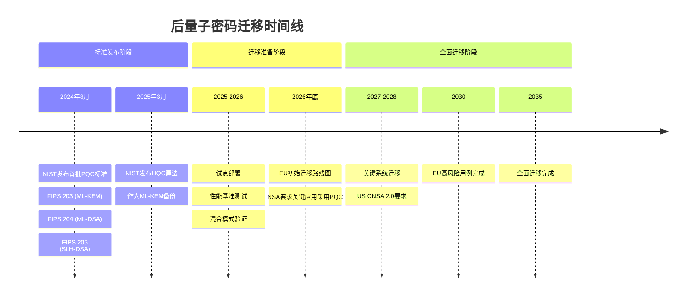
```mermaid
timeline
    title 后量子密码迁移时间线
    section 标准发布阶段
        2024年8月 : NIST发布首批PQC标准
                  : FIPS 203 (ML-KEM)
                  : FIPS 204 (ML-DSA)
                  : FIPS 205 (SLH-DSA)
        2025年3月 : NIST发布HQC算法
                  : 作为ML-KEM备份
    section 迁移准备阶段
        2025-2026 : 试点部署
                  : 性能基准测试
                  : 混合模式验证
        2026年底 : EU初始迁移路线图
                 : NSA要求关键应用采用PQC
    section 全面迁移阶段
        2027-2028 : 关键系统迁移
                  : US CNSA 2.0要求
        2030 : EU高风险用例完成
        2035 : 全面迁移完成
```

### 2.2 现有安全架构

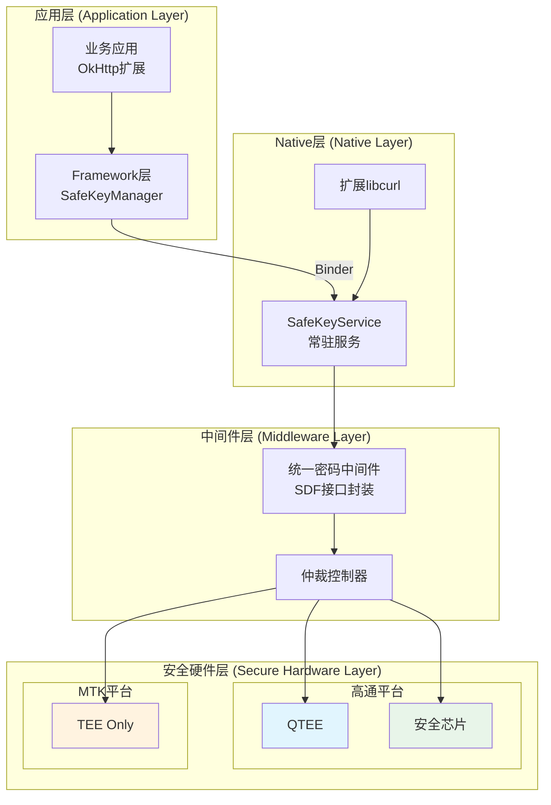
```mermaid
graph TB
    subgraph "应用层 (Application Layer)"
        APP[业务应用<br/>OkHttp扩展]
        FWK[Framework层<br/>SafeKeyManager]
    end

    subgraph "Native层 (Native Layer)"
        SKS[SafeKeyService<br/>常驻服务]
        CURL[扩展libcurl]
    end

    subgraph "中间件层 (Middleware Layer)"
        MW[统一密码中间件<br/>SDF接口封装]
        ARBITER[仲裁控制器]
    end

    subgraph "安全硬件层 (Secure Hardware Layer)"
        subgraph "高通平台"
            QTEE[QTEE]
            SE_QC[安全芯片]
        end
        subgraph "MTK平台"
            TEE_MTK[TEE Only]
        end
    end

    APP --> FWK
    FWK -->|Binder| SKS
    CURL --> SKS
    SKS --> MW
    MW --> ARBITER
    ARBITER --> QTEE
    ARBITER --> SE_QC
    ARBITER --> TEE_MTK

    style QTEE fill:#e1f5fe
    style SE_QC fill:#e8f5e9
    style TEE_MTK fill:#fff3e0
```

### 2.3 平台差异分析

| 特性维度 | 高通平台 | MTK平台 |
|---------|---------|---------|
| TEE实现 | QTEE (QSEE) | Kinibi/OP-TEE |
| 安全芯片 | SPU + 外置SE | 无（仅TEE） |
| RPMB支持 | 稳定 | 存在单点故障风险 |
| 虚拟化支持 | Gunyah Hypervisor | 支持 |
| PQC硬件加速 | 无原生支持 | 无原生支持 |

## 3. 总体架构设计

### 3.1 PQC集成架构总览

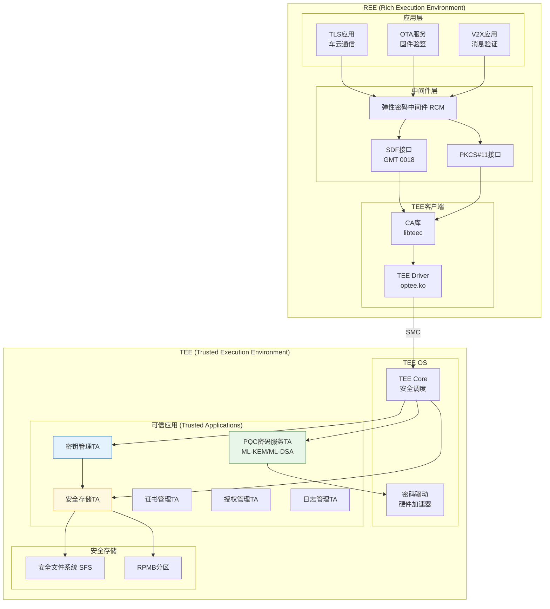
```mermaid
graph TB
    subgraph "REE (Rich Execution Environment)"
        subgraph "应用层"
            TLS_APP[TLS应用<br/>车云通信]
            OTA_APP[OTA服务<br/>固件验签]
            V2X_APP[V2X应用<br/>消息验证]
        end

        subgraph "中间件层"
            RCM[弹性密码中间件 RCM]
            SDF[SDF接口<br/>GMT 0018]
            PKCS11[PKCS#11接口]
        end

        subgraph "TEE客户端"
            CA[CA库<br/>libteec]
            DRIVER[TEE Driver<br/>optee.ko]
        end
    end

    subgraph "TEE (Trusted Execution Environment)"
        subgraph "TEE OS"
            TEE_CORE[TEE Core<br/>安全调度]
            CRYPTO_DRV[密码驱动<br/>硬件加速器]
        end

        subgraph "可信应用 (Trusted Applications)"
            PQC_TA[PQC密码服务TA<br/>ML-KEM/ML-DSA]
            KEY_TA[密钥管理TA]
            STORE_TA[安全存储TA]
            CERT_TA[证书管理TA]
            AUTH_TA[授权管理TA]
            LOG_TA[日志管理TA]
        end

        subgraph "安全存储"
            SFS[安全文件系统 SFS]
            RPMB[RPMB分区]
        end
    end

    TLS_APP --> RCM
    OTA_APP --> RCM
    V2X_APP --> RCM
    RCM --> SDF
    RCM --> PKCS11
    SDF --> CA
    PKCS11 --> CA
    CA --> DRIVER
    DRIVER -->|SMC| TEE_CORE
    TEE_CORE --> PQC_TA
    TEE_CORE --> KEY_TA
    TEE_CORE --> STORE_TA
    PQC_TA --> CRYPTO_DRV
    KEY_TA --> STORE_TA
    STORE_TA --> SFS
    STORE_TA --> RPMB

    style PQC_TA fill:#e8f5e9,stroke:#2e7d32
    style KEY_TA fill:#e3f2fd,stroke:#1565c0
    style STORE_TA fill:#fff8e1,stroke:#f9a825
```

### 3.2 TA模块架构

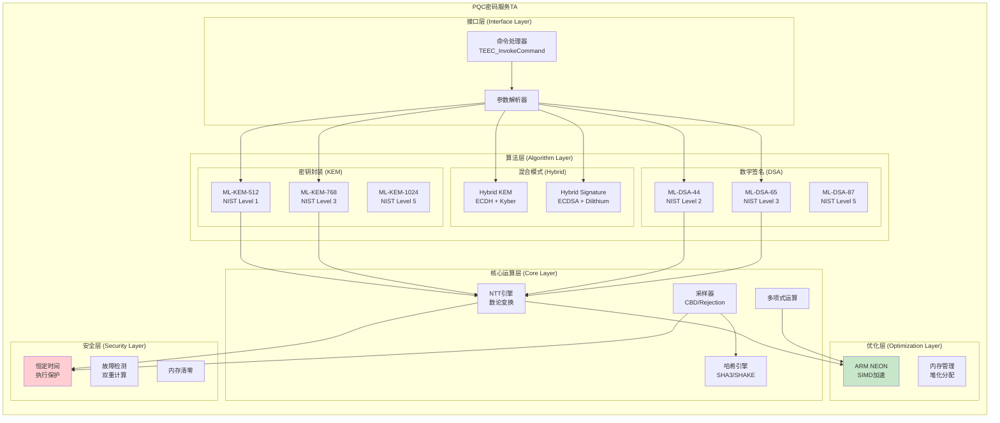
```mermaid
graph TB
    subgraph "PQC密码服务TA"
        direction TB

        subgraph "接口层 (Interface Layer)"
            CMD_HANDLER[命令处理器<br/>TEEC_InvokeCommand]
            PARAM_PARSER[参数解析器]
        end

        subgraph "算法层 (Algorithm Layer)"
            subgraph "密钥封装 (KEM)"
                KYBER512[ML-KEM-512<br/>NIST Level 1]
                KYBER768[ML-KEM-768<br/>NIST Level 3]
                KYBER1024[ML-KEM-1024<br/>NIST Level 5]
            end

            subgraph "数字签名 (DSA)"
                DILITHIUM2[ML-DSA-44<br/>NIST Level 2]
                DILITHIUM3[ML-DSA-65<br/>NIST Level 3]
                DILITHIUM5[ML-DSA-87<br/>NIST Level 5]
            end

            subgraph "混合模式 (Hybrid)"
                HYBRID_KEM[Hybrid KEM<br/>ECDH + Kyber]
                HYBRID_SIG[Hybrid Signature<br/>ECDSA + Dilithium]
            end
        end

        subgraph "核心运算层 (Core Layer)"
            NTT[NTT引擎<br/>数论变换]
            POLY[多项式运算]
            SAMPLE[采样器<br/>CBD/Rejection]
            HASH[哈希引擎<br/>SHA3/SHAKE]
        end

        subgraph "优化层 (Optimization Layer)"
            NEON[ARM NEON<br/>SIMD加速]
            MEM[内存管理<br/>堆化分配]
        end

        subgraph "安全层 (Security Layer)"
            CONST_TIME[恒定时间<br/>执行保护]
            FAULT_DET[故障检测<br/>双重计算]
            ZEROIZE[内存清零]
        end
    end

    CMD_HANDLER --> PARAM_PARSER
    PARAM_PARSER --> KYBER512
    PARAM_PARSER --> KYBER768
    PARAM_PARSER --> DILITHIUM2
    PARAM_PARSER --> DILITHIUM3
    PARAM_PARSER --> HYBRID_KEM
    PARAM_PARSER --> HYBRID_SIG

    KYBER512 --> NTT
    KYBER768 --> NTT
    DILITHIUM2 --> NTT
    DILITHIUM3 --> NTT

    NTT --> NEON
    POLY --> NEON
    SAMPLE --> HASH

    NTT --> CONST_TIME
    SAMPLE --> CONST_TIME

    style NEON fill:#c8e6c9
    style CONST_TIME fill:#ffcdd2
```

### 3.3 PQC实现层级选择：TA vs TEE OS

本方案选择在**TA（可信应用）层**实现PQC算法，而非在TEE OS层实现。这一设计决策基于以下技术和业务考量。

#### 3.3.1 实现层级对比

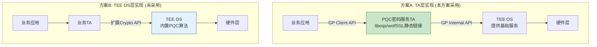
```mermaid
graph TB
    subgraph "方案A: TA层实现 (本方案采用)"
        TA_APP[业务应用]
        TA_PQC[PQC密码服务TA<br/>liboqs/wolfSSL静态链接]
        TA_TEE[TEE OS<br/>提供基础服务]
        TA_HW[硬件层]

        TA_APP -->|GP Client API| TA_PQC
        TA_PQC -->|GP Internal API| TA_TEE
        TA_TEE --> TA_HW
    end

    subgraph "方案B: TEE OS层实现 (未采用)"
        OS_APP[业务应用]
        OS_TA[业务TA]
        OS_TEE[TEE OS<br/>内置PQC算法]
        OS_HW[硬件层]

        OS_APP --> OS_TA
        OS_TA -->|扩展Crypto API| OS_TEE
        OS_TEE --> OS_HW
    end

    style TA_PQC fill:#c8e6c9,stroke:#2e7d32
    style OS_TEE fill:#e3f2fd,stroke:#1565c0
```

#### 3.3.2 选择TA层实现的理由

| 评估维度 | TA层实现 | TEE OS层实现 | 决策依据 |
|---------|---------|-------------|---------|
| **更新能力** | ✅ 可独立OTA更新 | ❌ 需整体刷写TEE OS | PQC标准仍在演进，需要灵活更新 |
| **平台兼容性** | ✅ 跨QTEE/OP-TEE/Kinibi | ❌ 需针对每个TEE OS适配 | 需同时支持高通和MTK平台 |
| **开发周期** | ✅ 短，遵循GP规范 | ❌ 长，需厂商配合 | 2027年SOP时间紧迫 |
| **供应商依赖** | ✅ 低，自主可控 | ❌ 高，依赖芯片厂商 | 降低供应链风险 |
| **代码体积** | ⚠️ TA需包含算法库 | ✅ TA体积小 | 可接受，通过裁剪优化 |
| **硬件加速** | ⚠️ 仅NEON软件加速 | ✅ 可深度集成硬件 | 当前无PQC硬件加速器 |

#### 3.3.3 TA层实现架构详解

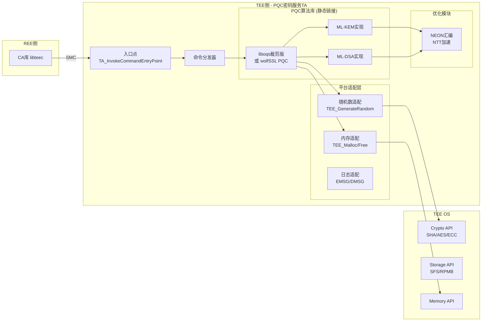
```mermaid
graph LR
    subgraph "REE侧"
        CA[CA库 libteec]
    end

    subgraph "TEE侧 - PQC密码服务TA"
        direction TB
        ENTRY[入口点<br/>TA_InvokeCommandEntryPoint]
        DISPATCH[命令分发器]

        subgraph "PQC算法库 (静态链接)"
            LIBOQS[liboqs裁剪版<br/>或 wolfSSL PQC]
            KYBER[ML-KEM实现]
            DILITHIUM[ML-DSA实现]
        end

        subgraph "平台适配层"
            RNG_SHIM[随机数适配<br/>TEE_GenerateRandom]
            MEM_SHIM[内存适配<br/>TEE_Malloc/Free]
            LOG_SHIM[日志适配<br/>EMSG/DMSG]
        end

        subgraph "优化模块"
            NEON_OPT[NEON汇编<br/>NTT加速]
        end
    end

    subgraph "TEE OS"
        TEE_CRYPTO[Crypto API<br/>SHA/AES/ECC]
        TEE_STORAGE[Storage API<br/>SFS/RPMB]
        TEE_MEM[Memory API]
    end

    CA -->|SMC| ENTRY
    ENTRY --> DISPATCH
    DISPATCH --> LIBOQS
    LIBOQS --> KYBER
    LIBOQS --> DILITHIUM
    KYBER --> NEON_OPT
    DILITHIUM --> NEON_OPT

    RNG_SHIM --> TEE_CRYPTO
    MEM_SHIM --> TEE_MEM
    LIBOQS --> RNG_SHIM
    LIBOQS --> MEM_SHIM
```

#### 3.3.4 关键实现要点

1. **静态链接**：将liboqs或wolfSSL的PQC模块静态编译到TA二进制中，避免动态库依赖

2. **算法库裁剪**：仅保留必要算法（ML-KEM-768、ML-DSA-3），减小二进制体积
   - 禁用：BIKE、HQC、SPHINCS+等非必要算法
   - 保留：Kyber、Dilithium核心实现

3. **OS适配层（Shim Layer）**：将算法库的系统调用映射到GP TEE Internal API
   - `OQS_randombytes()` → `TEE_GenerateRandom()`
   - `malloc()/free()` → `TEE_Malloc()/TEE_Free()`
   - `printf()` → `EMSG()/DMSG()`

4. **NEON优化集成**：编译时启用ARM NEON汇编优化
   - 配置：`CFG_TA_FLOAT_SUPPORT=y`
   - 引入：neon-ntt项目的优化实现

5. **TA配置调整**：
   ```
   TA_STACK_SIZE = 32KB   # 扩展栈空间
   TA_DATA_SIZE = 256KB   # 扩展数据段
   ```

## 4. PQC算法选型与参数配置

### 4.1 算法对比分析

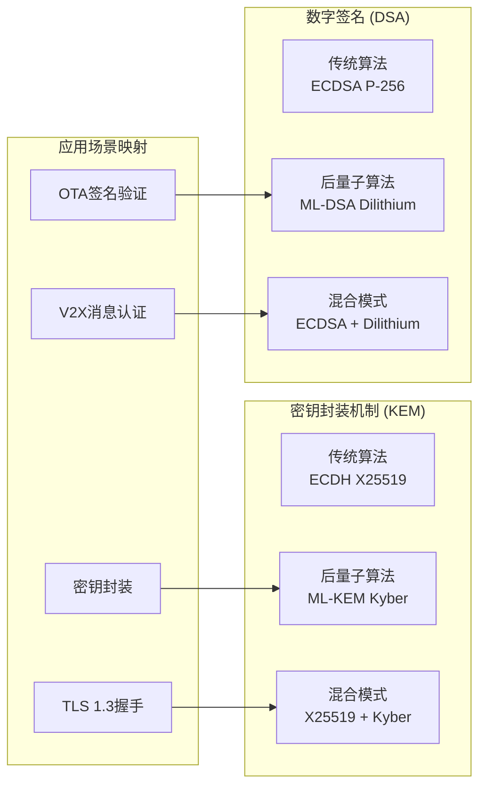
```mermaid
graph LR
    subgraph "密钥封装机制 (KEM)"
        direction TB
        KEM_CLASSIC[传统算法<br/>ECDH X25519]
        KEM_PQC[后量子算法<br/>ML-KEM Kyber]
        KEM_HYBRID[混合模式<br/>X25519 + Kyber]
    end

    subgraph "数字签名 (DSA)"
        direction TB
        DSA_CLASSIC[传统算法<br/>ECDSA P-256]
        DSA_PQC[后量子算法<br/>ML-DSA Dilithium]
        DSA_HYBRID[混合模式<br/>ECDSA + Dilithium]
    end

    subgraph "应用场景映射"
        TLS[TLS 1.3握手] --> KEM_HYBRID
        OTA_SIGN[OTA签名验证] --> DSA_PQC
        V2X_MSG[V2X消息认证] --> DSA_HYBRID
        KEY_WRAP[密钥封装] --> KEM_PQC
    end
```

### 4.2 推荐参数集

| 算法用途 | 推荐算法 | 参数集 | 安全等级 | 公钥大小 | 密文/签名大小 | 适用场景 |
|---------|---------|-------|---------|---------|--------------|---------|
| 密钥封装 | ML-KEM | Kyber-768 | NIST L3 (≈AES-192) | 1,184 B | 1,088 B | TLS握手、密钥交换 |
| 数字签名 | ML-DSA | Dilithium-3 | NIST L3 | 1,952 B | 3,293 B | OTA验签、证书签名 |
| 轻量签名 | ML-DSA | Dilithium-2 | NIST L2 | 1,312 B | 2,420 B | V2X实时验证 |
| 备份KEM | HQC | HQC-192 | NIST L3 | 5,499 B | 5,499 B | Kyber故障备份 |

### 4.3 性能基准对比

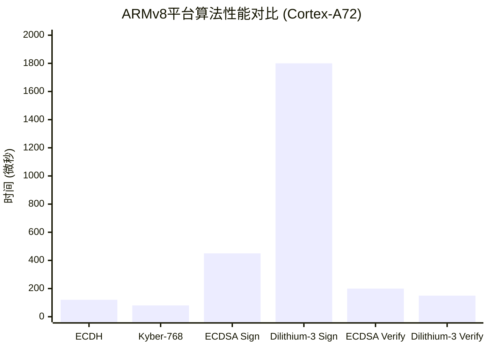
```mermaid
xychart-beta
    title "ARMv8平台算法性能对比 (Cortex-A72)"
    x-axis ["ECDH", "Kyber-768", "ECDSA Sign", "Dilithium-3 Sign", "ECDSA Verify", "Dilithium-3 Verify"]
    y-axis "时间 (微秒)" 0 --> 2000
    bar [120, 80, 450, 1800, 200, 150]
```

## 5. 密钥生命周期管理

### 5.1 密钥层级结构

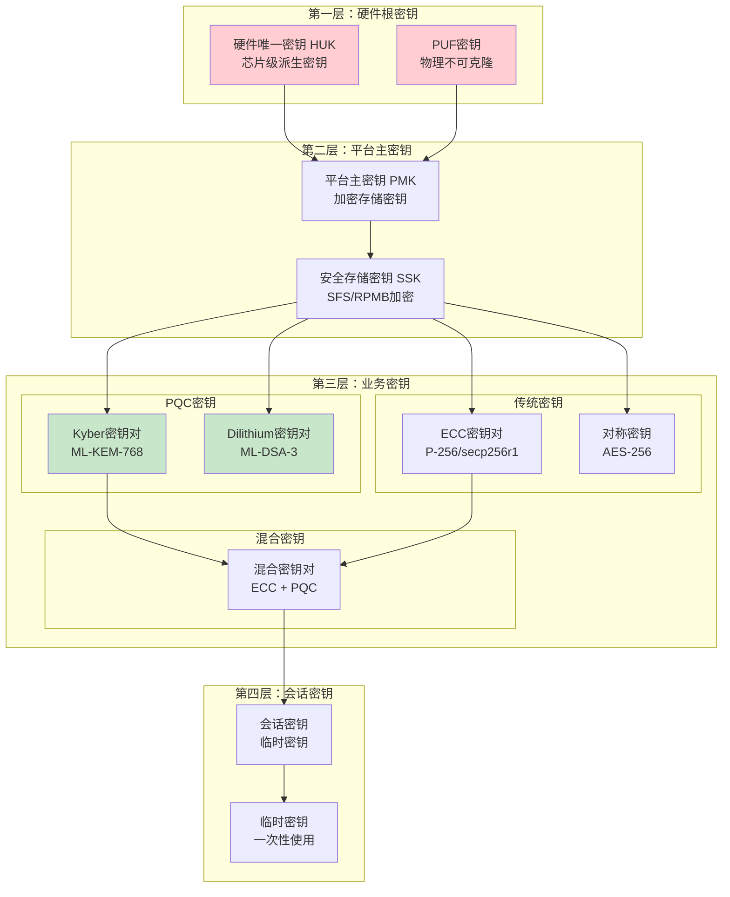
```mermaid
graph TB
    subgraph "第一层：硬件根密钥"
        HUK[硬件唯一密钥 HUK<br/>芯片级派生密钥]
        PUF[PUF密钥<br/>物理不可克隆]
    end

    subgraph "第二层：平台主密钥"
        PMK[平台主密钥 PMK<br/>加密存储密钥]
        SSK[安全存储密钥 SSK<br/>SFS/RPMB加密]
    end

    subgraph "第三层：业务密钥"
        subgraph "传统密钥"
            ECC_KEY[ECC密钥对<br/>P-256/secp256r1]
            AES_KEY[对称密钥<br/>AES-256]
        end

        subgraph "PQC密钥"
            KYBER_KEY[Kyber密钥对<br/>ML-KEM-768]
            DILITHIUM_KEY[Dilithium密钥对<br/>ML-DSA-3]
        end

        subgraph "混合密钥"
            HYBRID_KEY[混合密钥对<br/>ECC + PQC]
        end
    end

    subgraph "第四层：会话密钥"
        SESSION[会话密钥<br/>临时密钥]
        EPHEMERAL[临时密钥<br/>一次性使用]
    end

    HUK --> PMK
    PUF --> PMK
    PMK --> SSK
    SSK --> ECC_KEY
    SSK --> AES_KEY
    SSK --> KYBER_KEY
    SSK --> DILITHIUM_KEY
    KYBER_KEY --> HYBRID_KEY
    ECC_KEY --> HYBRID_KEY
    HYBRID_KEY --> SESSION
    SESSION --> EPHEMERAL

    style HUK fill:#ffcdd2
    style PUF fill:#ffcdd2
    style KYBER_KEY fill:#c8e6c9
    style DILITHIUM_KEY fill:#c8e6c9
```

### 5.2 密钥生命周期状态机

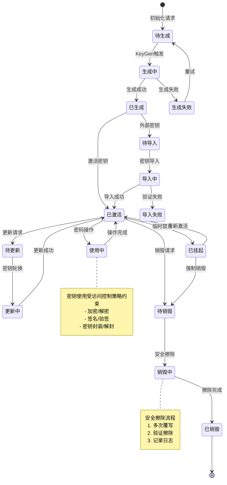
```mermaid
stateDiagram-v2
    [*] --> 待生成: 初始化请求

    待生成 --> 生成中: KeyGen触发
    生成中 --> 已生成: 生成成功
    生成中 --> 生成失败: 生成失败
    生成失败 --> 待生成: 重试

    已生成 --> 已激活: 激活密钥
    已生成 --> 待导入: 外部密钥

    待导入 --> 导入中: 密钥导入
    导入中 --> 已激活: 导入成功
    导入中 --> 导入失败: 验证失败

    已激活 --> 使用中: 密码操作
    使用中 --> 已激活: 操作完成

    已激活 --> 已挂起: 临时禁用
    已挂起 --> 已激活: 重新激活

    已激活 --> 待更新: 更新请求
    待更新 --> 更新中: 密钥轮换
    更新中 --> 已激活: 更新成功

    已激活 --> 待销毁: 销毁请求
    已挂起 --> 待销毁: 强制销毁

    待销毁 --> 销毁中: 安全擦除
    销毁中 --> 已销毁: 擦除完成
    已销毁 --> [*]

    note right of 使用中
        密钥使用受访问控制策略约束
        - 加密/解密
        - 签名/验签
        - 密钥封装/解封
    end note

    note right of 销毁中
        安全擦除流程
        1. 多次覆写
        2. 验证擦除
        3. 记录日志
    end note
```

### 5.3 PQC密钥生成流程

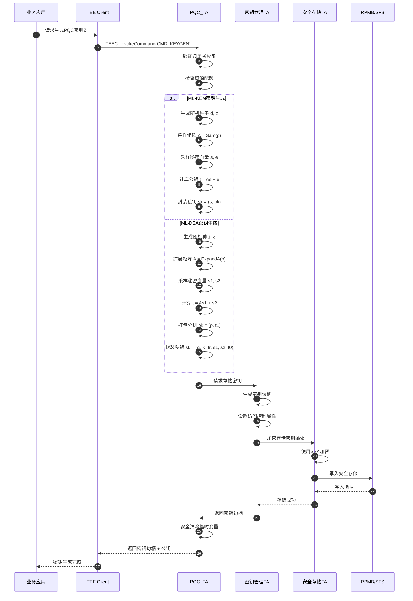
```mermaid
sequenceDiagram
    autonumber
    participant APP as 业务应用
    participant CA as TEE Client
    participant TA as PQC_TA
    participant KEY_TA as 密钥管理TA
    participant STORE as 安全存储TA
    participant RPMB as RPMB/SFS

    APP->>CA: 请求生成PQC密钥对
    CA->>TA: TEEC_InvokeCommand(CMD_KEYGEN)

    TA->>TA: 验证调用者权限
    TA->>TA: 检查资源配额

    alt ML-KEM密钥生成
        TA->>TA: 生成随机种子 d, z
        TA->>TA: 采样矩阵 A = Sam(ρ)
        TA->>TA: 采样秘密向量 s, e
        TA->>TA: 计算公钥 t = As + e
        TA->>TA: 封装私钥 sk = (s, pk)
    else ML-DSA密钥生成
        TA->>TA: 生成随机种子 ξ
        TA->>TA: 扩展矩阵 A = ExpandA(ρ)
        TA->>TA: 采样秘密向量 s1, s2
        TA->>TA: 计算 t = As1 + s2
        TA->>TA: 打包公钥 pk = (ρ, t1)
        TA->>TA: 封装私钥 sk = (ρ, K, tr, s1, s2, t0)
    end

    TA->>KEY_TA: 请求存储密钥
    KEY_TA->>KEY_TA: 生成密钥句柄
    KEY_TA->>KEY_TA: 设置访问控制属性
    KEY_TA->>STORE: 加密存储密钥Blob
    STORE->>STORE: 使用SSK加密
    STORE->>RPMB: 写入安全存储
    RPMB-->>STORE: 写入确认
    STORE-->>KEY_TA: 存储成功
    KEY_TA-->>TA: 返回密钥句柄

    TA->>TA: 安全清除临时变量
    TA-->>CA: 返回密钥句柄 + 公钥
    CA-->>APP: 密钥生成完成
```

## 6. 密码服务接口设计

### 6.1 命令接口定义

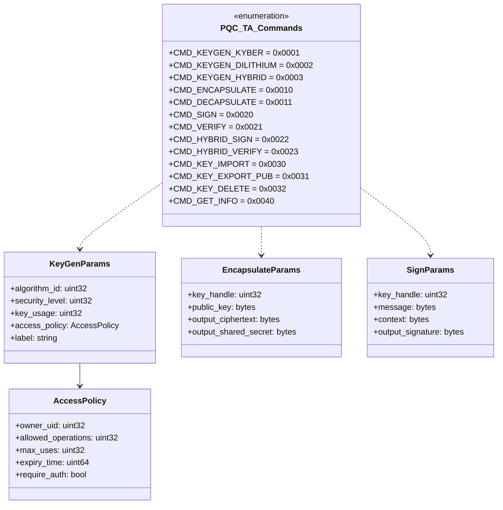
```mermaid
classDiagram
    class PQC_TA_Commands {
        <<enumeration>>
        +CMD_KEYGEN_KYBER = 0x0001
        +CMD_KEYGEN_DILITHIUM = 0x0002
        +CMD_KEYGEN_HYBRID = 0x0003
        +CMD_ENCAPSULATE = 0x0010
        +CMD_DECAPSULATE = 0x0011
        +CMD_SIGN = 0x0020
        +CMD_VERIFY = 0x0021
        +CMD_HYBRID_SIGN = 0x0022
        +CMD_HYBRID_VERIFY = 0x0023
        +CMD_KEY_IMPORT = 0x0030
        +CMD_KEY_EXPORT_PUB = 0x0031
        +CMD_KEY_DELETE = 0x0032
        +CMD_GET_INFO = 0x0040
    }

    class KeyGenParams {
        +algorithm_id: uint32
        +security_level: uint32
        +key_usage: uint32
        +access_policy: AccessPolicy
        +label: string
    }

    class EncapsulateParams {
        +key_handle: uint32
        +public_key: bytes
        +output_ciphertext: bytes
        +output_shared_secret: bytes
    }

    class SignParams {
        +key_handle: uint32
        +message: bytes
        +context: bytes
        +output_signature: bytes
    }

    class AccessPolicy {
        +owner_uid: uint32
        +allowed_operations: uint32
        +max_uses: uint32
        +expiry_time: uint64
        +require_auth: bool
    }

    PQC_TA_Commands ..> KeyGenParams
    PQC_TA_Commands ..> EncapsulateParams
    PQC_TA_Commands ..> SignParams
    KeyGenParams --> AccessPolicy
```

### 6.2 SDF接口扩展

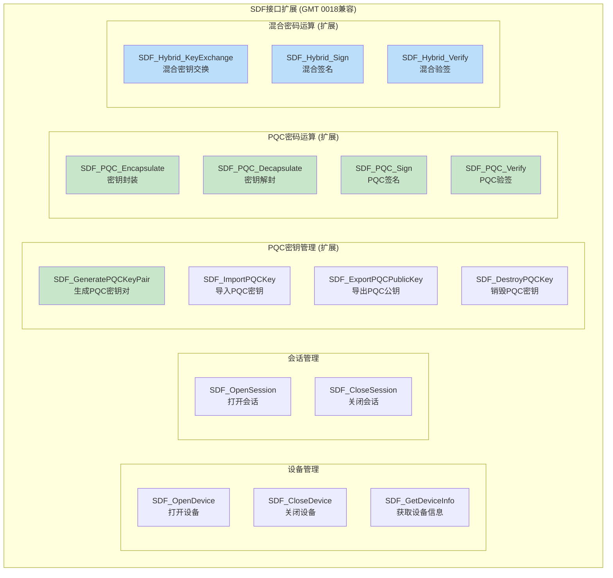
```mermaid
graph TB
    subgraph "SDF接口扩展 (GMT 0018兼容)"
        subgraph "设备管理"
            OPEN[SDF_OpenDevice<br/>打开设备]
            CLOSE[SDF_CloseDevice<br/>关闭设备]
            INFO[SDF_GetDeviceInfo<br/>获取设备信息]
        end

        subgraph "会话管理"
            OPEN_S[SDF_OpenSession<br/>打开会话]
            CLOSE_S[SDF_CloseSession<br/>关闭会话]
        end

        subgraph "PQC密钥管理 (扩展)"
            GEN_PQC[SDF_GeneratePQCKeyPair<br/>生成PQC密钥对]
            IMP_PQC[SDF_ImportPQCKey<br/>导入PQC密钥]
            EXP_PQC[SDF_ExportPQCPublicKey<br/>导出PQC公钥]
            DEL_PQC[SDF_DestroyPQCKey<br/>销毁PQC密钥]
        end

        subgraph "PQC密码运算 (扩展)"
            ENCAP[SDF_PQC_Encapsulate<br/>密钥封装]
            DECAP[SDF_PQC_Decapsulate<br/>密钥解封]
            SIGN_PQC[SDF_PQC_Sign<br/>PQC签名]
            VERIFY_PQC[SDF_PQC_Verify<br/>PQC验签]
        end

        subgraph "混合密码运算 (扩展)"
            HYBRID_KE[SDF_Hybrid_KeyExchange<br/>混合密钥交换]
            HYBRID_S[SDF_Hybrid_Sign<br/>混合签名]
            HYBRID_V[SDF_Hybrid_Verify<br/>混合验签]
        end
    end

    style GEN_PQC fill:#c8e6c9
    style ENCAP fill:#c8e6c9
    style DECAP fill:#c8e6c9
    style SIGN_PQC fill:#c8e6c9
    style VERIFY_PQC fill:#c8e6c9
    style HYBRID_KE fill:#bbdefb
    style HYBRID_S fill:#bbdefb
    style HYBRID_V fill:#bbdefb
```

## 7. 安全存储设计

### 7.1 存储架构

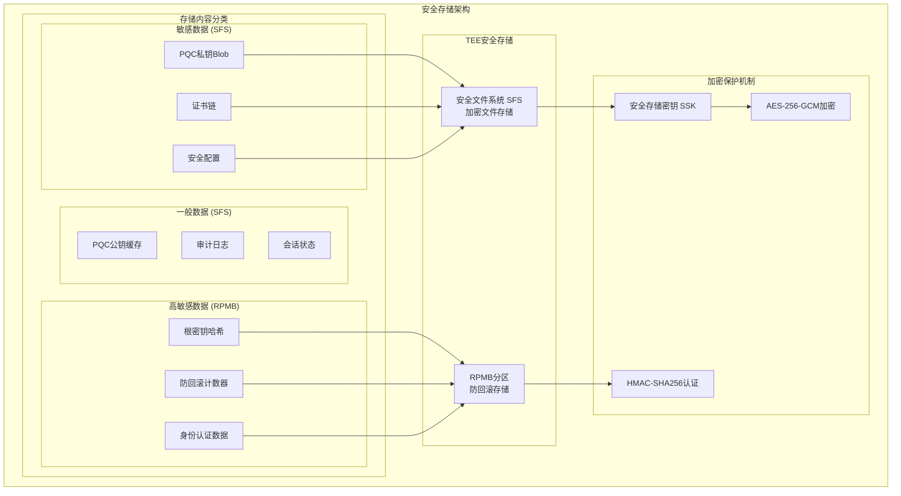
```mermaid
graph TB
    subgraph "安全存储架构"
        subgraph "TEE安全存储"
            SFS_AREA[安全文件系统 SFS<br/>加密文件存储]
            RPMB_AREA[RPMB分区<br/>防回滚存储]
        end

        subgraph "存储内容分类"
            subgraph "高敏感数据 (RPMB)"
                COUNTER[防回滚计数器]
                ROOT_KEY[根密钥哈希]
                AUTH_DATA[身份认证数据]
            end

            subgraph "敏感数据 (SFS)"
                PQC_PRIV[PQC私钥Blob]
                CERT_CHAIN[证书链]
                CONFIG[安全配置]
            end

            subgraph "一般数据 (SFS)"
                PQC_PUB[PQC公钥缓存]
                LOG_DATA[审计日志]
                SESSION[会话状态]
            end
        end

        subgraph "加密保护机制"
            SSK[安全存储密钥 SSK]
            AES_GCM[AES-256-GCM加密]
            HMAC[HMAC-SHA256认证]
        end
    end

    ROOT_KEY --> RPMB_AREA
    COUNTER --> RPMB_AREA
    AUTH_DATA --> RPMB_AREA

    PQC_PRIV --> SFS_AREA
    CERT_CHAIN --> SFS_AREA
    CONFIG --> SFS_AREA

    SFS_AREA --> SSK
    SSK --> AES_GCM
    RPMB_AREA --> HMAC
```

### 7.2 PQC密钥存储格式

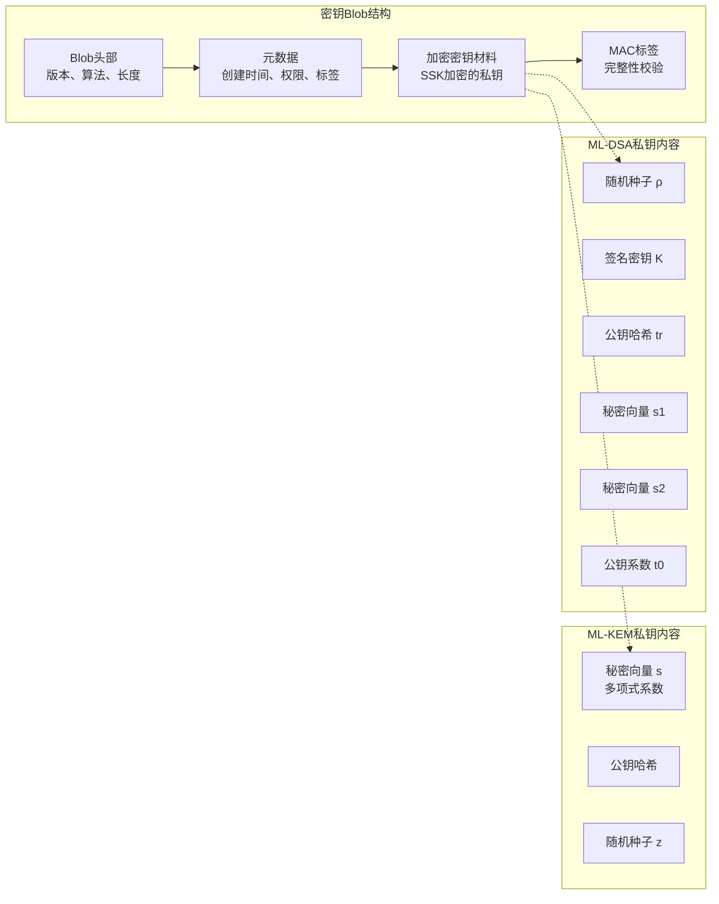
```mermaid
graph LR
    subgraph "密钥Blob结构"
        direction TB
        HEADER[Blob头部<br/>版本、算法、长度]
        METADATA[元数据<br/>创建时间、权限、标签]
        KEY_MATERIAL[加密密钥材料<br/>SSK加密的私钥]
        MAC[MAC标签<br/>完整性校验]
    end

    subgraph "ML-KEM私钥内容"
        direction TB
        KYBER_S[秘密向量 s<br/>多项式系数]
        KYBER_PK_HASH[公钥哈希]
        KYBER_Z[随机种子 z]
    end

    subgraph "ML-DSA私钥内容"
        direction TB
        DIL_RHO[随机种子 ρ]
        DIL_K[签名密钥 K]
        DIL_TR[公钥哈希 tr]
        DIL_S1[秘密向量 s1]
        DIL_S2[秘密向量 s2]
        DIL_T0[公钥系数 t0]
    end

    HEADER --> METADATA
    METADATA --> KEY_MATERIAL
    KEY_MATERIAL --> MAC

    KEY_MATERIAL -.-> KYBER_S
    KEY_MATERIAL -.-> DIL_RHO
```

### 7.3 RPMB故障缓解（MTK平台）

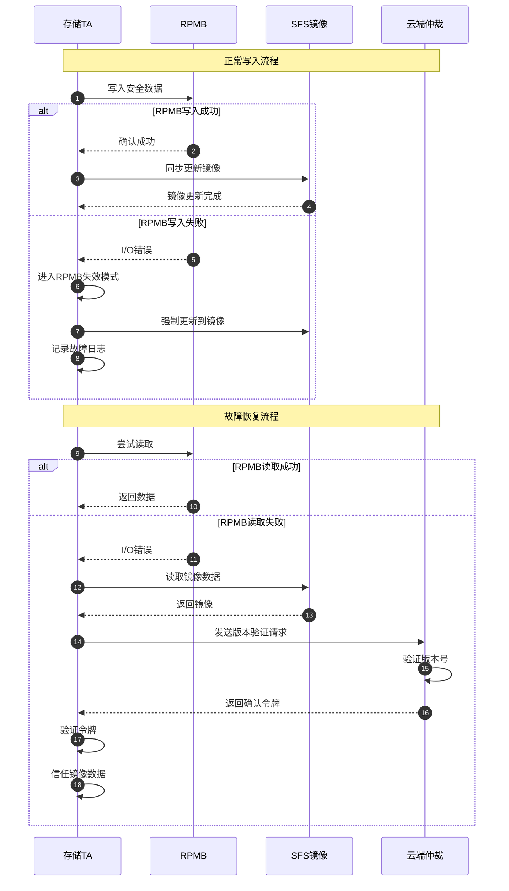
```mermaid
sequenceDiagram
    autonumber
    participant TA as 存储TA
    participant RPMB as RPMB
    participant SFS as SFS镜像
    participant CLOUD as 云端仲裁

    Note over TA,CLOUD: 正常写入流程
    TA->>RPMB: 写入安全数据
    alt RPMB写入成功
        RPMB-->>TA: 确认成功
        TA->>SFS: 同步更新镜像
        SFS-->>TA: 镜像更新完成
    else RPMB写入失败
        RPMB-->>TA: I/O错误
        TA->>TA: 进入RPMB失效模式
        TA->>SFS: 强制更新到镜像
        TA->>TA: 记录故障日志
    end

    Note over TA,CLOUD: 故障恢复流程
    TA->>RPMB: 尝试读取
    alt RPMB读取成功
        RPMB-->>TA: 返回数据
    else RPMB读取失败
        RPMB-->>TA: I/O错误
        TA->>SFS: 读取镜像数据
        SFS-->>TA: 返回镜像
        TA->>CLOUD: 发送版本验证请求
        CLOUD->>CLOUD: 验证版本号
        CLOUD-->>TA: 返回确认令牌
        TA->>TA: 验证令牌
        TA->>TA: 信任镜像数据
    end
```

## 8. CA/TA通信协议设计

### 8.1 APDU传输协议架构

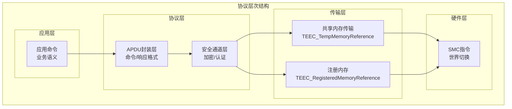
```mermaid
graph TB
    subgraph "协议层次结构"
        subgraph "应用层"
            APP_CMD[应用命令<br/>业务语义]
        end

        subgraph "协议层"
            APDU[APDU封装层<br/>命令/响应格式]
            SECURE[安全通道层<br/>加密/认证]
        end

        subgraph "传输层"
            SHARED_MEM[共享内存传输<br/>TEEC_TempMemoryReference]
            REG_MEM[注册内存<br/>TEEC_RegisteredMemoryReference]
        end

        subgraph "硬件层"
            SMC[SMC指令<br/>世界切换]
        end
    end

    APP_CMD --> APDU
    APDU --> SECURE
    SECURE --> SHARED_MEM
    SECURE --> REG_MEM
    SHARED_MEM --> SMC
    REG_MEM --> SMC
```

### 8.2 安全通道建立流程

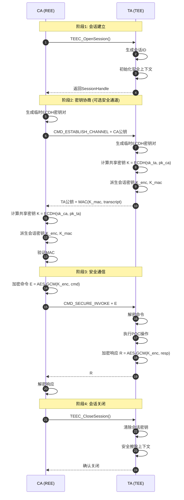
```mermaid
sequenceDiagram
    autonumber
    participant CA as CA (REE)
    participant TA as TA (TEE)

    Note over CA,TA: 阶段1: 会话建立
    CA->>TA: TEEC_OpenSession()
    TA->>TA: 生成会话ID
    TA->>TA: 初始化安全上下文
    TA-->>CA: 返回SessionHandle

    Note over CA,TA: 阶段2: 密钥协商 (可选安全通道)
    CA->>CA: 生成临时ECDH密钥对
    CA->>TA: CMD_ESTABLISH_CHANNEL + CA公钥
    TA->>TA: 生成临时ECDH密钥对
    TA->>TA: 计算共享密钥 K = ECDH(sk_ta, pk_ca)
    TA->>TA: 派生会话密钥 K_enc, K_mac
    TA-->>CA: TA公钥 + MAC(K_mac, transcript)
    CA->>CA: 计算共享密钥 K = ECDH(sk_ca, pk_ta)
    CA->>CA: 派生会话密钥 K_enc, K_mac
    CA->>CA: 验证MAC

    Note over CA,TA: 阶段3: 安全通信
    CA->>CA: 加密命令 E = AES-GCM(K_enc, cmd)
    CA->>TA: CMD_SECURE_INVOKE + E
    TA->>TA: 解密命令
    TA->>TA: 执行PQC操作
    TA->>TA: 加密响应 R = AES-GCM(K_enc, resp)
    TA-->>CA: R
    CA->>CA: 解密响应

    Note over CA,TA: 阶段4: 会话关闭
    CA->>TA: TEEC_CloseSession()
    TA->>TA: 清除会话密钥
    TA->>TA: 安全擦除上下文
    TA-->>CA: 确认关闭
```

### 8.3 PQC操作消息格式

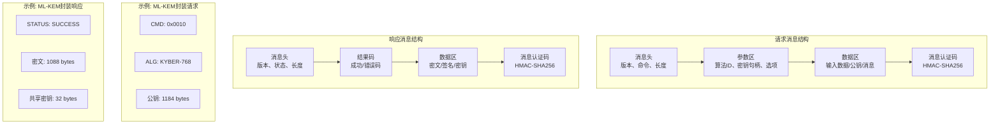
```mermaid
graph TB
    subgraph "请求消息结构"
        REQ_HEADER[消息头<br/>版本、命令、长度]
        REQ_PARAMS[参数区<br/>算法ID、密钥句柄、选项]
        REQ_DATA[数据区<br/>输入数据/公钥/消息]
        REQ_MAC[消息认证码<br/>HMAC-SHA256]
    end

    subgraph "响应消息结构"
        RESP_HEADER[消息头<br/>版本、状态、长度]
        RESP_RESULT[结果码<br/>成功/错误码]
        RESP_DATA[数据区<br/>密文/签名/密钥]
        RESP_MAC[消息认证码<br/>HMAC-SHA256]
    end

    subgraph "示例: ML-KEM封装请求"
        ENCAP_CMD[CMD: 0x0010]
        ENCAP_ALG[ALG: KYBER-768]
        ENCAP_PK[公钥: 1184 bytes]
    end

    subgraph "示例: ML-KEM封装响应"
        ENCAP_OK[STATUS: SUCCESS]
        ENCAP_CT[密文: 1088 bytes]
        ENCAP_SS[共享密钥: 32 bytes]
    end

    REQ_HEADER --> REQ_PARAMS --> REQ_DATA --> REQ_MAC
    RESP_HEADER --> RESP_RESULT --> RESP_DATA --> RESP_MAC
```

## 9. 性能优化策略

### 9.1 ARM NEON优化架构

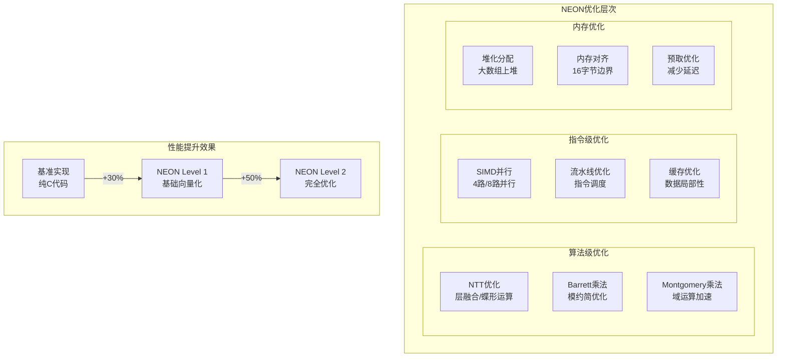
```mermaid
graph TB
    subgraph "NEON优化层次"
        subgraph "算法级优化"
            NTT_OPT[NTT优化<br/>层融合/蝶形运算]
            BARRETT[Barrett乘法<br/>模约简优化]
            MONT[Montgomery乘法<br/>域运算加速]
        end

        subgraph "指令级优化"
            SIMD[SIMD并行<br/>4路/8路并行]
            PIPELINE[流水线优化<br/>指令调度]
            CACHE[缓存优化<br/>数据局部性]
        end

        subgraph "内存优化"
            HEAP[堆化分配<br/>大数组上堆]
            ALIGN[内存对齐<br/>16字节边界]
            PREFETCH[预取优化<br/>减少延迟]
        end
    end

    subgraph "性能提升效果"
        BASELINE[基准实现<br/>纯C代码]
        NEON_V1[NEON Level 1<br/>基础向量化]
        NEON_V2[NEON Level 2<br/>完全优化]
    end

    BASELINE -->|+30%| NEON_V1
    NEON_V1 -->|+50%| NEON_V2
```

### 9.2 内存管理优化

```mermaid
graph TB
    subgraph "TEE内存区域"
        STACK[线程栈<br/>32KB配置]
        HEAP[安全堆<br/>动态分配]
        SRAM[片上SRAM<br/>关键数据]
    end

    subgraph "PQC内存需求"
        subgraph "Kyber-768"
            K_POLY[多项式向量<br/>polyvec ~3KB]
            K_MAT[矩阵A<br/>~9KB]
            K_TEMP[临时变量<br/>~2KB]
        end

        subgraph "Dilithium-3"
            D_POLY[多项式向量<br/>~8KB]
            D_MAT[矩阵A<br/>~12KB]
            D_TEMP[临时变量<br/>~6KB]
        end
    end

    subgraph "优化策略"
        HEAPIFY[堆化策略<br/>大数组移至堆]
        REUSE[内存复用<br/>临时缓冲区共享]
        LAZY[延迟分配<br/>按需申请]
    end

    K_MAT --> HEAPIFY
    D_MAT --> HEAPIFY
    K_TEMP --> REUSE
    D_TEMP --> REUSE
```

### 9.3 性能基准配置

| 配置项 | 默认值 | PQC推荐值 | 说明 |
|-------|-------|---------|------|
| CFG_STACK_THREAD_SIZE | 8KB | 32KB | 线程栈大小 |
| CFG_TA_FLOAT_SUPPORT | n | y | 启用NEON支持 |
| CFG_CORE_HEAP_SIZE | 1MB | 4MB | TEE堆大小 |
| CFG_NUM_THREADS | 2 | 4 | 并发线程数 |
| TA_DATA_SIZE | 32KB | 256KB | TA数据段大小 |

## 10. 安全防护机制

### 10.1 侧信道防护

```mermaid
graph TB
    subgraph "侧信道攻击类型"
        TIMING[时序攻击<br/>执行时间分析]
        POWER[功耗分析<br/>DPA/SPA]
        CACHE[缓存攻击<br/>Flush+Reload]
        EM[电磁分析<br/>EM Probe]
    end

    subgraph "防护措施"
        subgraph "软件防护"
            CONST_TIME[恒定时间执行<br/>避免分支差异]
            MASK[掩码技术<br/>随机化中间值]
            SHUFFLE[洗牌技术<br/>操作顺序随机化]
        end

        subgraph "验证工具"
            CTGRIND[CT-Grind<br/>时序泄露检测]
            DUDECT[DUDECT<br/>统计分析]
        end

        subgraph "硬件防护"
            TZASC[TZASC隔离<br/>内存访问控制]
            CACHE_PART[缓存分区<br/>安全/非安全隔离]
        end
    end

    TIMING --> CONST_TIME
    POWER --> MASK
    CACHE --> CACHE_PART
```

### 10.2 故障注入防护

```mermaid
sequenceDiagram
    autonumber
    participant ATTACKER as 攻击者
    participant HW as 硬件层
    participant TA as PQC_TA

    Note over ATTACKER,TA: 故障注入攻击场景
    ATTACKER->>HW: 电压毛刺/时钟干扰
    HW->>TA: 影响运算结果

    Note over TA: 防护机制1: 双重计算
    TA->>TA: 签名计算 sig1 = Sign(sk, msg)
    TA->>TA: 验证签名 result = Verify(pk, msg, sig1)
    alt 验证失败
        TA->>TA: 检测到故障注入
        TA->>TA: 清除敏感数据
        TA->>TA: 返回错误 + 记录日志
    else 验证成功
        TA->>TA: 返回签名
    end

    Note over TA: 防护机制2: 冗余检查
    TA->>TA: 计算1: result1 = operation()
    TA->>TA: 计算2: result2 = operation()
    alt result1 不等于 result2
        TA->>TA: 检测到计算异常
        TA->>TA: 触发安全响应
    end
```

### 10.3 访问控制机制

```mermaid
graph TB
    subgraph "访问控制层次"
        subgraph "身份认证层"
            UID[调用者UID验证]
            TA_ID[TA UUID验证]
            HASH[代码哈希校验]
        end

        subgraph "权限控制层"
            ACL[访问控制列表<br/>密钥级权限]
            USAGE[使用策略<br/>操作类型限制]
            RATE[速率限制<br/>防DoS]
        end

        subgraph "审计层"
            LOG[操作日志<br/>全记录]
            ALERT[异常告警<br/>实时检测]
        end
    end

    subgraph "密钥访问控制示例"
        KEY1[密钥A<br/>签名专用]
        KEY2[密钥B<br/>解密专用]
        KEY3[密钥C<br/>多用途]
    end

    subgraph "操作权限矩阵"
        OP_SIGN[签名操作]
        OP_DECRYPT[解密操作]
        OP_EXPORT[公钥导出]
    end

    KEY1 --> OP_SIGN
    KEY2 --> OP_DECRYPT
    KEY3 --> OP_SIGN
    KEY3 --> OP_DECRYPT
    KEY3 --> OP_EXPORT
```

## 11. 日志审计设计

### 11.1 日志架构

```mermaid
graph TB
    subgraph "TEE日志系统"
        subgraph "日志生成"
            PQC_LOG[PQC操作日志]
            KEY_LOG[密钥管理日志]
            AUTH_LOG[认证审计日志]
            ERR_LOG[错误/异常日志]
        end

        subgraph "日志安全"
            RING_BUF[安全环形缓冲区<br/>TEE内存]
            HASH_CHAIN[哈希链保护<br/>防篡改]
            SIGN[周期性签名<br/>锚点]
        end

        subgraph "日志传输"
            SECURE_CH[安全通道<br/>加密传输]
            RPMB_LOG[RPMB存储<br/>关键日志]
            REE_DAEMON[REE守护进程<br/>日志收集]
        end

        subgraph "日志分析"
            IDS[入侵检测<br/>异常关联]
            CLOUD[云端SOC<br/>集中分析]
        end
    end

    PQC_LOG --> RING_BUF
    KEY_LOG --> RING_BUF
    AUTH_LOG --> RING_BUF
    ERR_LOG --> RING_BUF

    RING_BUF --> HASH_CHAIN
    HASH_CHAIN --> SIGN

    SIGN --> RPMB_LOG
    SIGN --> SECURE_CH
    SECURE_CH --> REE_DAEMON

    REE_DAEMON --> IDS
    IDS --> CLOUD
```

### 11.2 日志记录格式

```mermaid
graph LR
    subgraph "日志条目结构"
        SEQ[序号<br/>4 bytes]
        TS[时间戳<br/>8 bytes]
        LEVEL[级别<br/>1 byte]
        TYPE[类型<br/>2 bytes]
        UID[调用者<br/>4 bytes]
        DATA[数据<br/>变长]
        PREV_HASH[前哈希<br/>32 bytes]
    end

    subgraph "日志级别"
        DEBUG[DEBUG<br/>调试信息]
        INFO[INFO<br/>正常操作]
        WARN[WARN<br/>警告事件]
        ERROR[ERROR<br/>错误信息]
        CRITICAL[CRITICAL<br/>严重异常]
    end

    subgraph "日志类型"
        TYPE_KEYGEN[密钥生成]
        TYPE_SIGN[签名操作]
        TYPE_VERIFY[验签操作]
        TYPE_AUTH[认证事件]
        TYPE_FAULT[故障检测]
    end
```

## 12. 混合密码模式设计

### 12.1 混合密钥交换

```mermaid
sequenceDiagram
    autonumber
    participant CLIENT as 客户端 (车端)
    participant SERVER as 服务端 (云端)

    Note over CLIENT,SERVER: TLS 1.3 混合密钥交换

    CLIENT->>CLIENT: 生成ECDH临时密钥对 (ecdh_sk, ecdh_pk)
    CLIENT->>CLIENT: 生成Kyber临时密钥对 (kyber_sk, kyber_pk)

    CLIENT->>SERVER: ClientHello + KeyShare X25519 和 Kyber-768

    SERVER->>SERVER: 生成ECDH临时密钥对 (ecdh_sk', ecdh_pk')
    SERVER->>SERVER: 执行ECDH: ss_ecdh = ECDH(ecdh_sk', ecdh_pk)
    SERVER->>SERVER: 执行Kyber封装: (ct, ss_kyber) = Encapsulate(kyber_pk)
    SERVER->>SERVER: 组合密钥 ss = KDF 拼接 ss_ecdh 和 ss_kyber

    SERVER-->>CLIENT: ServerHello + KeyShare ecdh_pk 和 ct

    CLIENT->>CLIENT: 执行ECDH: ss_ecdh = ECDH(ecdh_sk, ecdh_pk')
    CLIENT->>CLIENT: 执行Kyber解封: ss_kyber = Decapsulate(kyber_sk, ct)
    CLIENT->>CLIENT: 组合密钥 ss = KDF 拼接 ss_ecdh 和 ss_kyber

    Note over CLIENT,SERVER: 双方获得相同的混合共享密钥

    CLIENT->>SERVER: [加密数据 using ss]
    SERVER->>CLIENT: [加密数据 using ss]
```

### 12.2 混合签名方案

```mermaid
graph TB
    subgraph "混合签名生成"
        MSG[原始消息 M]

        subgraph "经典签名"
            ECDSA_SK[ECDSA私钥]
            ECDSA_SIGN[ECDSA签名<br/>σ_ecdsa]
        end

        subgraph "PQC签名"
            DIL_SK[Dilithium私钥]
            DIL_SIGN[Dilithium签名<br/>σ_dilithium]
        end

        COMBINE[组合签名<br/>σ = σ_ecdsa 拼接 σ_dilithium]
    end

    subgraph "混合签名验证"
        RECV_MSG[接收消息 M']
        RECV_SIG[接收签名 σ']

        subgraph "验证流程"
            SPLIT[分离签名]
            V_ECDSA[验证ECDSA]
            V_DIL[验证Dilithium]
            AND_GATE[AND逻辑<br/>两者都通过]
        end

        RESULT[验证结果]
    end

    MSG --> ECDSA_SK
    MSG --> DIL_SK
    ECDSA_SK --> ECDSA_SIGN
    DIL_SK --> DIL_SIGN
    ECDSA_SIGN --> COMBINE
    DIL_SIGN --> COMBINE

    RECV_MSG --> SPLIT
    RECV_SIG --> SPLIT
    SPLIT --> V_ECDSA
    SPLIT --> V_DIL
    V_ECDSA --> AND_GATE
    V_DIL --> AND_GATE
    AND_GATE --> RESULT
```

## 13. 合规性映射

### 13.1 法规要求映射

```mermaid
graph TB
    subgraph "法规要求"
        subgraph "GB 44495-2024"
            GB_KEY[密钥存储于HSM]
            GB_AUDIT[安全事件记录]
            GB_CRYPTO[密码算法合规]
        end

        subgraph "GB/T 32960.2-2025"
            GBT_HW[硬件安全芯片存储私钥]
            GBT_TIME[时间戳可信度]
            GBT_UNDENY[不可否认性]
        end

        subgraph "UN R155"
            UN_SOTA[现有技术水平]
            UN_CRYPTO[加密敏捷性]
            UN_LIFECYCLE[全生命周期安全]
        end
    end

    subgraph "技术实现"
        TEE_IMPL[TEE TA实现<br/>硬件隔离级]
        HYBRID[混合密码方案<br/>经典+PQC]
        LOG_SYS[统一审计系统<br/>哈希链保护]
        KEY_MGMT[密钥管理<br/>分层架构]
    end

    GB_KEY --> TEE_IMPL
    GB_CRYPTO --> HYBRID
    GB_AUDIT --> LOG_SYS
    GBT_HW --> TEE_IMPL
    GBT_UNDENY --> HYBRID
    UN_CRYPTO --> HYBRID
    UN_LIFECYCLE --> KEY_MGMT

    style TEE_IMPL fill:#c8e6c9
    style HYBRID fill:#c8e6c9
```

### 13.2 密码敏捷性架构

```mermaid
graph TB
    subgraph "密码敏捷性设计"
        subgraph "算法注册表"
            ALG_REG[算法注册中心]
            CLASSIC[经典算法<br/>RSA/ECC/AES]
            PQC[后量子算法<br/>Kyber/Dilithium]
            GM[国密算法<br/>SM2/SM3/SM4]
        end

        subgraph "算法选择策略"
            POLICY[策略引擎]
            NEGOTIATE[能力协商]
            FALLBACK[降级策略]
        end

        subgraph "OTA更新能力"
            ALG_UPDATE[算法库更新]
            POLICY_UPDATE[策略更新]
            KEY_ROTATE[密钥轮换]
        end
    end

    ALG_REG --> CLASSIC
    ALG_REG --> PQC
    ALG_REG --> GM

    POLICY --> NEGOTIATE
    NEGOTIATE --> FALLBACK

    ALG_UPDATE --> ALG_REG
    POLICY_UPDATE --> POLICY
```

## 14. 实施路线图

### 14.1 分阶段实施计划

```mermaid
gantt
    title PQC TEE TA实施路线图
    dateFormat  YYYY-MM

    section 阶段一：基础建设
    需求分析与架构设计     :a1, 2026-01, 2M
    开发环境搭建 (OP-TEE QEMU) :a2, after a1, 1M
    liboqs/wolfSSL移植评估    :a3, after a1, 2M

    section 阶段二：核心开发
    PQC算法库移植与裁剪     :b1, 2026-04, 3M
    TA框架开发              :b2, 2026-04, 2M
    NEON优化实现            :b3, after b1, 2M
    密钥管理模块开发        :b4, after b2, 2M

    section 阶段三：集成测试
    单元测试与功能验证      :c1, 2026-09, 2M
    安全性测试 (侧信道)     :c2, 2026-10, 2M
    性能基准测试            :c3, 2026-10, 1M
    中间件集成              :c4, 2026-11, 2M

    section 阶段四：验证部署
    开发板验证 (QC/MTK)     :d1, 2027-01, 2M
    实车测试                :d2, after d1, 2M
    合规性评估              :d3, after d1, 2M

    section 阶段五：量产准备
    产线工具开发            :e1, 2027-04, 2M
    文档与培训              :e2, 2027-05, 1M
    SOP准备                 :e3, 2027-06, 1M
```

### 14.2 关键里程碑

```mermaid
timeline
    title PQC TEE TA关键里程碑
    section 2026 Q1-Q2
        M1 完成架构设计 : 架构文档定稿
                        : 开发环境就绪
                        : 算法选型确定
    section 2026 Q3
        M2 核心模块完成 : PQC算法库移植
                        : TA基础框架
                        : NEON优化版本
    section 2026 Q4
        M3 集成验证通过 : 功能测试100%
                        : 安全测试通过
                        : 性能达标
    section 2027 Q1
        M4 平台适配完成 : QC平台验证
                        : MTK平台验证
                        : 中间件集成
    section 2027 Q2
        M5 量产就绪 : 合规评估通过
                    : 产线工具就绪
                    : SOP发布
```

## 15. 风险与缓解措施

### 15.1 技术风险矩阵

```mermaid
graph TB
    subgraph "高概率"
        subgraph "高概率-高影响 [高优先级处理]"
            R1[NEON优化不足]
            R2[内存资源超限]
        end
    end

    subgraph "中概率"
        subgraph "中概率-高影响 [计划应对]"
            R3[RPMB故障]
            R4[侧信道泄露]
        end
        subgraph "中概率-中影响 [持续监控]"
            R5[供应链风险]
        end
    end

    subgraph "低概率"
        subgraph "低概率-中影响 [接受风险]"
            R6[PQC算法安全性变化]
            R7[法规变更]
        end
    end

    style R1 fill:#ff6b6b
    style R2 fill:#ff6b6b
    style R3 fill:#ffa94d
    style R4 fill:#ffa94d
    style R5 fill:#ffe066
    style R6 fill:#c3e6cb
    style R7 fill:#c3e6cb
```

**风险等级说明**：
- 🔴 高优先级：概率高且影响大，需立即处理
- 🟠 计划应对：影响大但概率可控，需制定应对计划
- 🟡 持续监控：需要持续关注的风险
- 🟢 接受风险：概率和影响都较低，可接受

### 15.2 风险缓解策略

| 风险项 | 风险等级 | 缓解措施 |
|-------|---------|---------|
| PQC算法安全性变化 | 中 | 采用混合模式，保持算法可替换性 |
| NEON优化不足 | 高 | 引入汇编级优化，参考neon-ntt开源项目 |
| 内存资源超限 | 高 | 堆化分配、内存复用、扩展栈配置 |
| RPMB单点故障 | 高 | 混合存储镜像+云端仲裁机制 |
| 侧信道泄露 | 中 | 恒定时间实现、CT-Grind验证 |
| 法规变更 | 低 | 密码敏捷性架构、持续合规跟踪 |

## 16. 参考资料

### 16.1 标准与规范

- **NIST FIPS 203**: ML-KEM (Module-Lattice-Based Key-Encapsulation Mechanism)
- **NIST FIPS 204**: ML-DSA (Module-Lattice-Based Digital Signature Algorithm)
- **NIST FIPS 205**: SLH-DSA (Stateless Hash-Based Digital Signature Algorithm)
- **GB 44495-2024**: 汽车整车信息安全技术要求
- **GB/T 32960.2-2025**: 电动汽车远程服务与管理系统技术规范
- **UN R155**: 网络安全和网络安全管理系统法规
- **GM/T 0018**: 密码设备应用接口规范
- **GlobalPlatform TEE**: Internal Core API Specification / Client API Specification

### 16.2 技术资源

- [Open Quantum Safe (OQS) liboqs](https://github.com/open-quantum-safe/liboqs)
- [wolfSSL Post-Quantum Support](https://www.wolfssl.com/)
- [Neon NTT: Faster Kyber and Dilithium](https://github.com/neon-ntt/neon-ntt)
- [OP-TEE Documentation](https://optee.readthedocs.io/)
- [IETF Hybrid Key Exchange in TLS 1.3](https://datatracker.ietf.org/doc/draft-ietf-tls-hybrid-design/)

### 16.3 研究论文

- "Neon NTT: Faster Dilithium, Kyber, and Saber on Cortex-A72 and Apple M1" - TCHES 2022
- "Memory-Efficient High-Speed Implementation of Kyber on Cortex-M4" - Applied Cryptography Research
- "Post-Quantum Cryptography for Automotive Security" - ETAS Research
- "Vectorized Implementation of Kyber and Dilithium on 32-bit Cortex-A Series" - IEEE 2024

---

**文档版本**: 1.0
**创建日期**: 2026-01-28
**作者**: 安全架构团队
**状态**: 初稿
